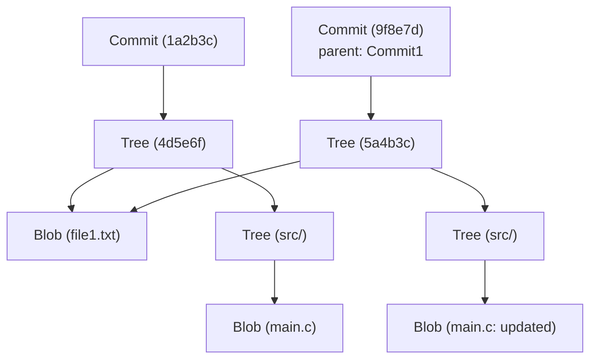

# Die interne Architektur von Git: Verteilte Versionskontrolle durch commit, tree und blob verstehen

Für viele Softwareentwickler ist Git ein unverzichtbares Werkzeug, das täglich genutzt wird. Während Befehle wie `git add`, `git commit` und `git push` in Fleisch und Blut übergegangen sind, verstehen überraschend wenige Menschen wirklich, "welche Datenstrukturen im Inneren von Git arbeiten". In diesem Artikel werden wir die interne Architektur von Git entschlüsseln, indem wir uns auf seine grundlegende Philosophie und die drei zentralen Datenstrukturen konzentrieren: die Objekte `blob`, `tree` und `commit`.

## Gits grundlegende Philosophie: Historie als Snapshots

Viele Versionskontrollsysteme (wie Subversion) verfolgten den Ansatz, "Deltas" (Unterschiede) für Dateien aufzuzeichnen. Das heißt, sie speichern eine Historie darüber, wann eine Datei erstellt wurde und welche Änderungen anschließend an ihr vorgenommen wurden.

Im Gegensatz dazu ist der Ansatz von Git grundlegend anders. Git behandelt Daten als "eine Serie von Dateisystem-Snapshots". Bei jedem Commit zeichnet Git den Zustand aller Dateien genau in diesem Moment auf, fast so, als würde man ein Foto machen. Wenn sich eine Datei nicht geändert hat, speichert Git sie nicht erneut, sondern speichert lediglich einen Link (Zeiger) auf die identische Datei, die bereits gesichert wurde. Dies ermöglicht extrem schnelle Branch-Erstellungs- und Merge-Prozesse.

Unterstützt wird dieses "Snapshot"-Konzept durch das Git-Objektmodell, das wir als Nächstes erläutern werden.

## Ein Überblick über das Git-Objektmodell

Im Kern ist Git lediglich ein Key-Value-Store. Alle Daten werden unter dem Verzeichnis `.git/objects` gespeichert, mit einem SHA-1-Hash (einem 40-stelligen hexadezimalen String) als Schlüssel.

Es gibt drei Haupttypen von Datenobjekten, die Git hauptsächlich verarbeitet:

1. **Blob**: Der Dateiinhalt (die Daten) selbst.
2. **Tree**: Die Verzeichnisstruktur. Er enthält Zeiger auf Dateien (Blobs) und andere Verzeichnisse (Trees) zusammen mit Dateinamen und Berechtigungen.
3. **Commit**: Enthält Metadaten (Autor, Datum, Nachricht), einen Zeiger auf ein einzelnes Tree-Objekt, das das Stammverzeichnis des Projekts darstellt, sowie Zeiger auf Eltern-Commits.

Lassen Sie uns mithilfe eines Mermaid-Diagramms visualisieren, wie diese zusammenarbeiten.



Das obige Diagramm zeigt die Beziehung zwischen zwei Commits. `Commit2` hat `Commit1` als Elternteil, und da `file1.txt` nicht geändert wurde, verweisen beide Trees auf denselben `Blob`. Dies ist der Mechanismus, durch den Git Daten effizient speichert.

## Blob-Objekt: Speichern von Dateiinhalten

Blob steht für "Binary Large Object" und ist in Git die Einheit zur Speicherung des eigentlichen Dateiinhalts. Der entscheidende Punkt hierbei ist, dass **Blobs keine Dateinamen haben**. Dateinamen und Verzeichnisstrukturen werden durch Tree-Objekte verwaltet, die wir später besprechen werden.

Der Schlüssel eines Blob-Objekts (SHA-1-Hash) wird aus dem Dateiinhalt selbst und Header-Informationen wie der Größe berechnet. Das bedeutet, dass selbst wenn sich zwei Dateien in völlig unterschiedlichen Verzeichnissen befinden, sie in Git intern als ein einziges Blob-Objekt gespeichert werden, solange ihr Inhalt exakt gleich ist, was Speicherplatz spart.

Tatsächlich können Sie mit den Low-Level-Befehlen von Git (Plumbing-Befehle) den Blob-Hash aus einer Datei berechnen.

```bash
$ echo 'Hello Git' > hello.txt
$ git hash-object -w hello.txt
980a0d5f19a64b4b30a87d4206aade58726b60e3
```

Der von diesem Befehl ausgegebene Hash-Wert ist die ID dieses Dateiinhalts. Der Dateiinhalt wird komprimiert unter dem Pfad `.git/objects/98/0a0d5...` gespeichert.

## Tree-Objekt: Repräsentation der Verzeichnisstruktur

Selbst wenn Dateiinhalte gespeichert werden können, ist es sinnlos, wenn man nicht weiß, welchen Dateinamen sie haben und in welchem Verzeichnis sie sich befinden. Das **Tree-Objekt** löst dieses Problem.

Ein Tree-Objekt spielt eine ähnliche Rolle wie ein UNIX-Verzeichnis. Ein einzelner Tree enthält mehrere Einträge. Jeder Eintrag umfasst folgende Informationen:

- Dateimodus (ob es sich um eine ausführbare Datei, eine reguläre Datei, einen symbolischen Link usw. handelt)
- Objekttyp (blob oder tree)
- Objekt-Hash-Wert (SHA-1)
- Dateiname oder Verzeichnisname

Zum Beispiel könnte der Inhalt des Stamm-Trees eines Projekts so aussehen:

```bash
$ git ls-tree HEAD
100644 blob 980a0d5f19a64b4b30a87d4206aade58726b60e3    hello.txt
040000 tree 8b137891791fe96927ad78e64b0aad7bded08bdc    src
```

Auf diese Weise repräsentieren Tree-Objekte den gesamten komplexen Verzeichnisbaum, indem sie Blobs und andere Trees bündeln.

## Commit-Objekt: Snapshots Bedeutung verleihen

Mit Tree-Objekten ist es nun möglich, die Dateistruktur des gesamten Projekts zu einem bestimmten Zeitpunkt darzustellen. Dies allein erzählt jedoch nicht die Geschichte: "wer", "wann" und "warum" diesen Zustand geschaffen hat oder "wie der vorherige Zustand war". Genau das zeichnet das **Commit-Objekt** auf.

Ein Commit-Objekt enthält folgende Informationen:

1. **Tree-Hash**: Der Hash des Stamm-Trees des Projekts, auf den dieser Commit zeigt.
2. **Eltern-Commit-Hash(es)**: Der Hash des Commits (Elternteil), der diesem unmittelbar vorausgeht. Der allererste Commit hat keinen Elternteil. Merge-Commits haben mehrere Elternteile.
3. **Autor (Author) und Committer**: Namen, E-Mail-Adressen und Zeitstempel.
4. **Commit-Nachricht**: Der Grund für die Änderungen und detaillierte Erklärungen.

Schauen wir uns den Inhalt eines Commits tatsächlich mit dem Befehl `git cat-file -p` an.

```bash
$ git cat-file -p HEAD
tree 4b825dc642cb6eb9a060e54bf8d69288fbee4904
parent a3c2f1e809b4d5a92c30b2c14078970e28f307f9
author John Doe <john@example.com> 1695628790 +0900
committer John Doe <john@example.com> 1695628790 +0900

Add hello.txt to the project
```

Wie Sie sehen können, ist ein Commit-Objekt nur Textdaten. Der SHA-1-Hash dieser Textdaten selbst wird berechnet und dieser wird zum bekannten "Commit-Hash".

Da der Commit-Hash aus allen Informationen berechnet wird – nicht nur aus den Änderungen, sondern auch aus dem Hash des Elternteils, der Erstellungszeit, der Nachricht usw. –, ändert sich der Hash-Wert, wenn Sie später versuchen, den Inhalt des Commits zu ändern. Dies ist der Mechanismus, der die starke Datenintegrität von Git garantiert.

## Branches und HEAD: Nur Zeiger

Wenn man die interne Architektur von Git verstanden hat, wird sofort klar, warum "Branches", Gits mächtigstes Feature, so leichtgewichtig sind.

Ein Branch in Git ist nichts anderes als ein **Zeiger (eine Textdatei), der auf ein bestimmtes Commit-Objekt zeigt**. Wenn Sie in die Datei `.git/refs/heads/main` schauen, sehen Sie, dass sie lediglich den neuesten Commit-Hash (einen 40-stelligen String) enthält.

```bash
$ cat .git/refs/heads/main
a3c2f1e809b4d5a92c30b2c14078970e28f307f9
```

Der Vorgang des Erstellens eines neuen Branches (`git branch feature`) besteht einfach darin, eine neue Datei unter `.git/refs/heads/feature` zu erstellen, die diesen 40-stelligen String enthält. Da es absolut nicht nötig ist, das gesamte Dateisystem zu kopieren, ist dies sofort abgeschlossen.

Und der `HEAD` zeichnet auf, an welchem Branch Sie gerade arbeiten. Die Datei `.git/HEAD` enthält eine Referenz auf den aktuell ausgecheckten Branch.

```bash
$ cat .git/HEAD
ref: refs/heads/main
```

Wenn Sie einen Commit erstellen, verhält sich Git wie folgt:
1. Erstellt einen neuen Blob (für geänderte Dateien)
2. Erstellt einen neuen Tree (für geänderte Verzeichnisstrukturen)
3. Erstellt einen neuen Commit (der auf den neuen Tree zeigt und den Commit als Elternteil hat, auf den der aktuelle HEAD zeigt)
4. Schreibt den Zeiger des Branches um, auf den HEAD zeigt (hier `main`), auf den neu erstellten Commit.

Dieser unglaublich einfache und effiziente Aktualisierungsprozess ist die Quelle von Gits Geschwindigkeit.

## Git Garbage Collection und Packfiles

Wenn Sie Git weiterhin nutzen, werden bei jeder Änderung Blob-Objekte generiert und das Verzeichnis `.git/objects` schwillt an. Da jeder Blob ein Snapshot der gesamten Datei ist, führt selbst eine einzeilige Änderung dazu, dass eine Kopie der gesamten Datei (wenn auch komprimiert) als neuer Blob gespeichert wird.

Da dies ineffizient ist, bietet Git einen Mechanismus namens **Packfiles**. Regelmäßig (oder wenn der Befehl `git gc` manuell ausgeführt wird) führt Git eine Garbage Collection durch und bündelt mehrere lose Objekte (Loose Objects) in einem einzigen Packfile (einer `.pack`-Datei).

Dabei wendet Git eine sehr clevere Optimierung an. Es findet Blobs mit ähnlichem Inhalt und speichert den einen als vollständige Daten, während es den anderen als "Delta" (Unterschied) speichert. Dies reduziert die Dateigröße drastisch. Obwohl das Historien-Speichermodell also "Snapshots" ist, wird im Hintergrund die "Delta"-Technologie als Optimierung zur Einsparung von Speicherplatz verwendet.

## Fazit

Die Kommandozeilenschnittstelle (CLI) von Git ist komplex und kann sich manchmal unintuitiv anfühlen, aber die dahinter arbeitenden Datenstrukturen sind überraschend einfach und elegant.

- **Blob**: Dateiinhalte
- **Tree**: Verzeichnis- und Dateinamenstrukturen
- **Commit**: Snapshot-Metadaten und Historien-Links
- **Branch/Tag**: Leichtgewichtige Zeiger auf Commits

Durch die Kombination dieser Elemente wird ein robustes und schnelles verteiltes Versionskontrollsystem realisiert. Wenn Sie die interne Architektur von Git verstehen, werden Sie sich klar vorstellen können, was Git intern tut, wenn Sie fortgeschrittene Operationen wie das Auflösen von Konflikten, das Umschreiben der Historie (z.B. Rebase) oder das Wiederherstellen verlorener Commits durchführen.

Git ist mehr als nur ein Werkzeug; man kann es als Kunstwerk wunderschöner Datenstrukturen bezeichnen. Wenn Sie Git in Ihrer täglichen Entwicklung nutzen, versuchen Sie, ein wenig über das Zusammenspiel dieser unsichtbaren "Trees" und "Blobs" nachzudenken.
