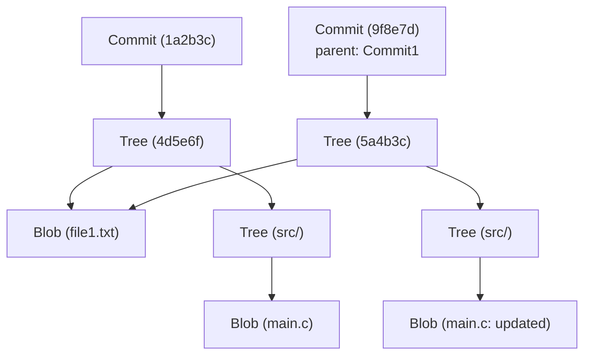

# Git Internal Architecture: Understanding Distributed Version Control through commit, tree, and blob

For many software engineers, Git is an indispensable tool used on a daily basis. While commands like `git add`, `git commit`, and `git push` might be second nature, surprisingly few people deeply understand "what kind of data structures are operating inside Git." In this article, we will unravel Git's internal architecture by focusing on its fundamental philosophy and its three core data structures: `blob`, `tree`, and `commit` objects.

## Git's Core Philosophy: History as Snapshots

Many version control systems (like Subversion) took an approach of recording "deltas" (differences) for files. That is, they keep a history of when a file was created and what changes were subsequently made to it.

In contrast, Git's approach is fundamentally different. Git treats data as a "series of file system snapshots." Every time you commit, Git records the state of all files at that exact moment, almost like taking a photograph. If a file hasn't changed, Git doesn't store the file again; it merely stores a link (pointer) to the identical file that was already saved. This is what enables extremely fast branch creation and merge processes.

Supporting this "snapshot" concept is Git's object model, which we will explain next.

## An Overview of the Git Object Model

At its core, Git is simply a Key-Value Store. All data is stored under the `.git/objects` directory, keyed by a SHA-1 hash (a 40-character hexadecimal string).

There are three main types of data objects that Git primarily handles:

1. **Blob**: The file content (data) itself.
2. **Tree**: The directory structure. It holds pointers to files (Blobs) and other directories (Trees), along with filenames and permissions.
3. **Commit**: Holds metadata (author, date, message), a pointer to a single Tree object representing the project's root directory, and pointers to parent commits.

Let's visualize how these work together using a Mermaid diagram.



The diagram above shows the relationship between two commits. `Commit2` has `Commit1` as its parent, and since `file1.txt` has not been changed, both trees reference the same `Blob`. This is the mechanism by which Git efficiently stores data.

## Blob Object: Storing File Content

Blob stands for "Binary Large Object," and in Git, it is the unit for storing the file content itself. The crucial point here is that **Blobs do not have filenames**. Filenames and directory structures are managed by Tree objects, which we will discuss later.

A Blob object's key (SHA-1 hash) is calculated from the file content itself and header information such as its size. This means that even if two files are in completely different directories, as long as their contents are exactly the same, they will be stored internally in Git as a single Blob object, saving disk space.

In fact, using Git's low-level commands (Plumbing commands), you can calculate the Blob hash from a file.

```bash
$ echo 'Hello Git' > hello.txt
$ git hash-object -w hello.txt
980a0d5f19a64b4b30a87d4206aade58726b60e3
```

The hash value output by this command is the ID of this file's content. The file content is stored in a compressed state at the path `.git/objects/98/0a0d5...`.

## Tree Object: Representing Directory Structure

Even if file contents can be stored, it is meaningless if you don't know what filename it has and in which directory it is located. The **Tree object** solves this problem.

A Tree object plays a role similar to a UNIX directory. A single Tree contains multiple entries. Each entry includes the following information:

- File mode (whether it's an executable, a regular file, a symbolic link, etc.)
- Object type (blob or tree)
- Object hash value (SHA-1)
- Filename or directory name

For example, the contents of a project's root tree might look like this:

```bash
$ git ls-tree HEAD
100644 blob 980a0d5f19a64b4b30a87d4206aade58726b60e3    hello.txt
040000 tree 8b137891791fe96927ad78e64b0aad7bded08bdc    src
```

In this way, by bundling Blobs and other Trees together, Tree objects represent the entire complex directory tree.

## Commit Object: Giving Meaning to Snapshots

With Tree objects, it is now possible to represent the file structure of the entire project at a given point in time. However, this alone doesn't tell the story of the history: "who," "when," and "why" created that state, or "what was the previous state." This is what the **Commit object** records.

A Commit object contains the following information:

1. **Tree Hash**: The hash of the project's root tree that this commit points to.
2. **Parent Commit Hash(es)**: The hash of the commit (parent) immediately preceding this one. The very first commit has no parent. Merge commits have multiple parents.
3. **Author and Committer**: Names, email addresses, and timestamps.
4. **Commit Message**: The reason for the changes and detailed explanations.

Let's actually look at the contents of a commit using the `git cat-file -p` command.

```bash
$ git cat-file -p HEAD
tree 4b825dc642cb6eb9a060e54bf8d69288fbee4904
parent a3c2f1e809b4d5a92c30b2c14078970e28f307f9
author John Doe <john@example.com> 1695628790 +0900
committer John Doe <john@example.com> 1695628790 +0900

Add hello.txt to the project
```

As you can see, a Commit object is just text data. The SHA-1 hash of this text data itself is calculated, and that becomes the familiar "commit hash."

Because the commit hash is calculated from all information—not just the changes but also the parent's hash, creation time, message, etc.—if you try to alter the commit's content later, the hash value will change. This is the mechanism that guarantees Git's powerful data integrity.

## Branches and HEAD: Just Pointers

Once you understand Git's internal architecture, it becomes immediately clear why "branches," which are Git's most powerful feature, are so lightweight.

A branch in Git is nothing more than a **pointer (a text file) pointing to a specific Commit object**. If you look inside the `.git/refs/heads/main` file, you'll see it merely contains the latest commit hash (a 40-character string).

```bash
$ cat .git/refs/heads/main
a3c2f1e809b4d5a92c30b2c14078970e28f307f9
```

The operation of creating a new branch (`git branch feature`) simply involves creating a new file at `.git/refs/heads/feature` containing this 40-character string. Because there is absolutely no need to copy the entire file system, it completes instantly.

And it is `HEAD` that records the branch you are currently working on. The `.git/HEAD` file contains a reference to the currently checked-out branch.

```bash
$ cat .git/HEAD
ref: refs/heads/main
```

When you create a commit, Git behaves as follows:
1. Creates a new Blob (for changed files)
2. Creates a new Tree (for changed directory structures)
3. Creates a new Commit (pointing to the new Tree, and with the commit that the current HEAD points to as its parent)
4. Rewrites the pointer of the branch that HEAD is pointing to (here, `main`) to the newly created Commit

This incredibly simple and streamlined update process is the source of Git's speed.

## Git's Garbage Collection and Packfiles

As you continue to use Git, Blob objects are generated with every change, and the `.git/objects` directory swells. Because each Blob is a snapshot of the entire file, even a one-line change results in a copy of the whole file (though compressed) being stored as a new Blob.

Since this is inefficient, Git provides a mechanism called **Packfiles**. Periodically (or when the `git gc` command is run manually), Git performs garbage collection and bundles multiple loose objects into a single Packfile (a `.pack` file).

At this time, Git applies a very clever optimization. It finds Blobs with similar content and stores one as complete data, while storing the other as a "delta" (difference). This drastically reduces the file size. So, while the history storage model is "snapshots," "delta" technology is used behind the scenes as an optimization to save disk space.

## Conclusion

Git's command-line interface (CLI) is complex and can sometimes feel unintuitive, but the data structures running behind it are surprisingly simple and elegant.

- **Blob**: File contents
- **Tree**: Directory and filename structures
- **Commit**: Snapshot metadata and history links
- **Branch/Tag**: Lightweight pointers to commits

By combining these elements, a robust and fast distributed version control system is realized. By understanding Git's internal architecture, you will be able to clearly picture what Git is doing internally when performing advanced operations like resolving conflicts, rewriting history (e.g., rebase), or recovering lost commits.

Git is more than just a tool; it can be called a work of art of beautiful data structures. When you use Git in your daily development, try to give a little thought to the collaboration of these unseen "Trees" and "Blobs."
