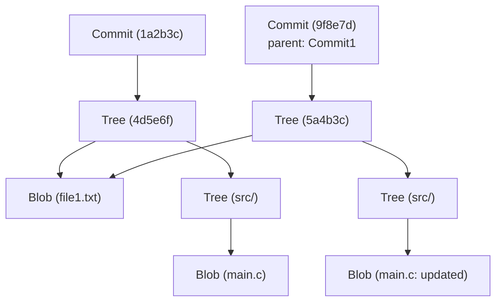

# Arquitectura interna de Git: Comprendiendo el control de versiones distribuido a través de commits, trees y blobs

Para muchos ingenieros de software, Git es una herramienta esencial de uso diario. Es posible que uses comandos como `git add`, `git commit` y `git push` de forma tan natural como respirar, pero sorprendentemente pocos entienden profundamente "qué tipo de estructuras de datos operan dentro de Git". En este artículo, desentrañaremos la arquitectura interna de Git centrándonos en su filosofía fundamental y sus tres objetos de datos principales: `blob`, `tree` y `commit`.

## La filosofía básica de Git: El historial como instantáneas (Snapshots)

Muchos sistemas de control de versiones (como Subversion) adoptan el enfoque de registrar las "diferencias (deltas)" de los archivos. Es decir, mantienen un historial de cuándo se creó un archivo y qué cambios se le aplicaron posteriormente.

En contraste, el enfoque de Git es fundamentalmente diferente. Git trata los datos como un "flujo de instantáneas del sistema de archivos". Con cada confirmación (commit), Git toma una foto de todos los archivos en ese momento exacto y la registra. Si un archivo no ha cambiado, Git no lo almacena de nuevo, sino que simplemente guarda un enlace (puntero) al archivo idéntico almacenado previamente. Esto permite una creación de ramas (branches) y procesos de fusión (merges) extremadamente rápidos.

El modelo de objetos de Git, que explicaremos a continuación, es el pilar que sostiene este concepto de "instantánea".

## Visión general del modelo de objetos de Git

El núcleo de Git es simplemente un almacén clave-valor (Key-Value Store). Todos los datos se almacenan bajo el directorio `.git/objects` utilizando un hash SHA-1 (una cadena hexadecimal de 40 caracteres) como clave.

Existen tres tipos principales de objetos de datos que Git maneja principalmente:

1. **Blob**: El contenido (datos) del archivo en sí.
2. **Tree**: Estructura del directorio. Mantiene punteros a archivos (Blobs) u otros directorios (Trees), junto con los nombres de archivo y permisos.
3. **Commit**: Mantiene metadatos (autor, fecha, mensaje), un puntero a un único objeto Tree que representa el directorio raíz del proyecto y punteros a los commits padres.

Visualicemos cómo interactúan estos elementos utilizando un diagrama Mermaid.



El diagrama anterior muestra la relación entre dos commits. `Commit2` tiene a `Commit1` como su padre, y como `file1.txt` no ha sido modificado, ambos trees hacen referencia al mismo `Blob`. Así es como Git almacena los datos de manera eficiente.

## Objeto Blob: Almacenamiento del contenido del archivo

Blob significa "Binary Large Object" y es la unidad en Git que almacena el contenido real de un archivo. Un punto crucial aquí es que **los Blobs no tienen nombres de archivo**. Los nombres de archivo y las estructuras de directorios son gestionados por el objeto Tree, que se explicará más adelante.

La clave del objeto Blob (el hash SHA-1) se calcula a partir del contenido del archivo y la información del encabezado, como el tamaño. Esto significa que incluso si dos archivos están en directorios completamente diferentes, si su contenido es exactamente el mismo, se almacenarán internamente como un solo objeto Blob en Git, ahorrando espacio en disco.

De hecho, puedes calcular el hash de un Blob a partir de un archivo utilizando los comandos de bajo nivel de Git (comandos de Fontanería/Plumbing).

```bash
$ echo 'Hello Git' > hello.txt
$ git hash-object -w hello.txt
980a0d5f19a64b4b30a87d4206aade58726b60e3
```

El valor hash producido por este comando es el ID para el contenido de este archivo. El contenido del archivo se guardará en un estado comprimido en la ruta `.git/objects/98/0a0d5...`.

## Objeto Tree: Representando la estructura del directorio

Incluso si se puede guardar el contenido del archivo, de nada sirve si no sabemos bajo qué nombre de archivo y en qué directorio se encuentra. Esto lo resuelve el **objeto Tree**.

El objeto Tree actúa de manera similar a un directorio de UNIX. Un solo Tree puede tener múltiples entradas. Cada entrada incluye la siguiente información:

- Modo de archivo (ej. archivo ejecutable, archivo normal, enlace simbólico)
- Tipo de objeto (`blob` o `tree`)
- Valor hash del objeto (SHA-1)
- Nombre de archivo o nombre de directorio

Por ejemplo, el contenido del árbol raíz de un proyecto podría verse así:

```bash
$ git ls-tree HEAD
100644 blob 980a0d5f19a64b4b30a87d4206aade58726b60e3    hello.txt
040000 tree 8b137891791fe96927ad78e64b0aad7bded08bdc    src
```

De esta forma, agrupando Blobs y otros Trees, el objeto Tree representa toda la estructura compleja del árbol de directorios.

## Objeto Commit: Dando significado a las instantáneas

A través del objeto Tree, podemos representar la estructura de archivos de todo el proyecto en un punto específico en el tiempo. Sin embargo, eso por sí solo no nos da el contexto histórico de "quién", "cuándo" y "por qué" se creó ese estado, o "cuál era el estado anterior". El **objeto Commit** registra esto.

El objeto Commit contiene la siguiente información:

1. **Hash del Tree**: El hash del árbol raíz del proyecto al que apunta este commit.
2. **Hashes de Commits Padres**: El hash de la confirmación inmediatamente anterior (padre). El primer commit no tiene padres. Un merge commit tiene múltiples padres.
3. **Autor (Author) y Confirmador (Committer)**: Nombre, dirección de correo electrónico y marca de tiempo.
4. **Mensaje del Commit**: El motivo del cambio y una descripción detallada.

Echemos un vistazo al contenido de un commit usando el comando `git cat-file -p`.

```bash
$ git cat-file -p HEAD
tree 4b825dc642cb6eb9a060e54bf8d69288fbee4904
parent a3c2f1e809b4d5a92c30b2c14078970e28f307f9
author John Doe <john@example.com> 1695628790 +0900
committer John Doe <john@example.com> 1695628790 +0900

Add hello.txt to the project
```

Como podemos ver, el objeto Commit es solo un dato de texto. Se calcula el hash SHA-1 de estos datos de texto y ese se convierte en el "hash del commit" con el que estamos familiarizados.

Debido a que el hash del commit se calcula a partir de toda la información (no solo los cambios, sino también el hash del padre, la fecha de creación y el mensaje), si intentas alterar el contenido del commit más tarde, el valor del hash cambiará. Este es el mecanismo que garantiza la sólida integridad de los datos en Git.

## Ramas (Branches) y HEAD: Simples punteros

Una vez que comprendes la estructura interna de Git, inmediatamente tiene sentido por qué las ramas, la característica más poderosa de Git, son extremadamente ligeras.

Una rama en Git no es más que **un puntero (un archivo de texto) que apunta a un objeto Commit específico**. Si miras dentro del archivo `.git/refs/heads/main`, verás simplemente el hash del último commit (una cadena de 40 caracteres).

```bash
$ cat .git/refs/heads/main
a3c2f1e809b4d5a92c30b2c14078970e28f307f9
```

La operación de crear una nueva rama (`git branch feature`) consiste únicamente en crear un nuevo archivo en `.git/refs/heads/feature` que contenga esta cadena de 40 caracteres. No hay necesidad de copiar todo el sistema de archivos en absoluto, por lo que se completa en un instante.

Y el que registra la rama en la que estás trabajando actualmente es `HEAD`. El archivo `.git/HEAD` contiene una referencia a la rama que está actualmente revisada (checked out).

```bash
$ cat .git/HEAD
ref: refs/heads/main
```

Cuando creas un commit, Git se comporta de la siguiente manera:
1. Crea un nuevo Blob (archivo modificado)
2. Crea un nuevo Tree (estructura de directorio modificada)
3. Crea un nuevo Commit (apuntando al nuevo Tree y teniendo el commit al que apunta actualmente HEAD como padre)
4. Reescribe el puntero de la rama a la que apunta HEAD (`main` en este caso) al nuevo Commit recién creado

Este proceso de actualización, extremadamente simple y sin desperdicios, es la fuente de la velocidad operativa de Git.

## Recolección de basura (Garbage Collection) y Packfiles de Git

Si sigues utilizando Git, se generarán objetos Blob con cada cambio y el directorio `.git/objects` crecerá enormemente. Como cada Blob es una instantánea del archivo completo, incluso el cambio de una sola línea guardará una copia de todo el archivo (aunque comprimido) como un nuevo Blob.

Dado que esto es ineficiente, Git incluye un mecanismo llamado **Packfile**. Periódicamente (o cuando se ejecuta manualmente el comando `git gc`), Git realiza una recolección de basura y consolida múltiples objetos sueltos (Loose Objects) en un solo Packfile (archivo `.pack`).

En este momento, Git realiza una optimización muy inteligente. Busca Blobs con contenido similar, almacena uno como un dato completo y el otro como una "diferencia (delta)". Esto reduce drásticamente el tamaño de los archivos. Aunque el modelo de almacenamiento del historial es de "instantáneas", la tecnología "delta" se usa como una optimización en segundo plano para ahorrar espacio en disco.

## Conclusión

La interfaz de línea de comandos (CLI) de Git es compleja y a veces puede parecer poco intuitiva, pero las estructuras de datos que operan detrás de escena son sorprendentemente simples y elegantes.

- **Blob**: El contenido del archivo
- **Tree**: La estructura de directorios y nombres de archivos
- **Commit**: Metadatos de la instantánea y el enlace del historial
- **Branch/Tag**: Un puntero ligero que apunta a un commit

La combinación de estos elementos proporciona un sistema de control de versiones distribuido robusto y rápido. Entender la arquitectura interna de Git te dará una imagen clara de lo que Git está haciendo internamente cuando realizas operaciones avanzadas como resolver conflictos, alterar el historial (como `rebase`) o restaurar commits perdidos.

Git es más que una simple herramienta; puede considerarse una obra de arte de hermosas estructuras de datos. La próxima vez que uses Git en el desarrollo diario, tómate un momento para pensar en la coordinación invisible entre estos "Trees" y "Blobs".
