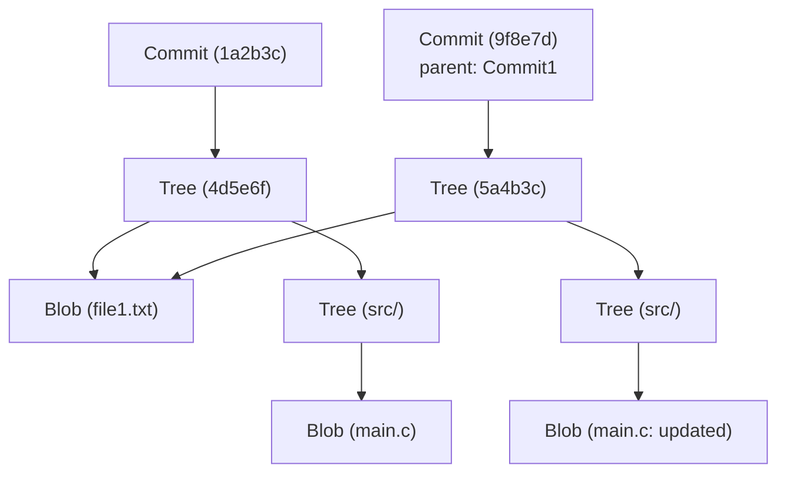

# L'architecture interne de Git : Comprendre le contrôle de version distribué à travers les commits, trees et blobs

Pour de nombreux ingénieurs logiciels, Git est un outil indispensable utilisé au quotidien. Vous utilisez peut-être des commandes comme `git add`, `git commit` et `git push` aussi naturellement que de respirer, mais le nombre de personnes comprenant profondément "quel type de structures de données fonctionnent à l'intérieur de Git" est étonnamment faible. Dans cet article, nous allons détailler l'architecture interne de Git en nous concentrant sur sa philosophie fondamentale et ses trois objets de données centraux : `blob`, `tree` et `commit`.

## La philosophie de base de Git : L'historique comme des instantanés (Snapshots)

De nombreux systèmes de contrôle de version (comme Subversion) adoptent l'approche d'enregistrer les "différences (deltas)" appliquées aux fichiers. C'est-à-dire qu'ils conservent un historique de la création d'un fichier et des modifications ultérieures qui y ont été apportées.

En revanche, l'approche de Git est fondamentalement différente. Git traite les données comme un "flux d'instantanés du système de fichiers". À chaque commit, Git prend une photo de l'état de tous les fichiers à cet instant précis et l'enregistre. Si un fichier n'a pas changé, Git ne le stocke pas à nouveau, mais sauvegarde simplement un lien (pointeur) vers le fichier identique précédemment stocké. Cela permet des processus de création de branches (branching) et de fusion (merging) extrêmement rapides.

Le modèle d'objets de Git, que nous allons expliquer ci-dessous, est le pilier qui soutient ce concept d'"instantané".

## Vue d'ensemble du modèle d'objets de Git

Le noyau de Git est simplement un magasin clé-valeur (Key-Value Store). Toutes les données sont stockées sous le répertoire `.git/objects` en utilisant un hash SHA-1 (une chaîne hexadécimale de 40 caractères) comme clé.

Il existe trois types principaux d'objets de données que Git manipule principalement :

1. **Blob** : Le contenu (les données) du fichier lui-même.
2. **Tree** : La structure des répertoires. Maintient des pointeurs vers des fichiers (Blobs) ou d'autres répertoires (Trees), ainsi que les noms de fichiers et les permissions.
3. **Commit** : Maintient les métadonnées (auteur, date, message), un pointeur vers un unique objet Tree qui représente le répertoire racine du projet, et des pointeurs vers les commits parents.

Visualisons comment ces éléments interagissent à l'aide d'un diagramme Mermaid.



Le schéma ci-dessus montre la relation entre deux commits. `Commit2` a pour parent `Commit1`, et comme `file1.txt` n'a pas été modifié, le même `Blob` est référencé par les deux trees. C'est ainsi que Git stocke efficacement les données.

## L'objet Blob : Stockage du contenu des fichiers

Blob signifie "Binary Large Object" et c'est l'unité dans Git qui stocke le contenu réel d'un fichier. Un point crucial ici est que **les Blobs n'ont pas de nom de fichier**. Les noms de fichiers et les structures de répertoires sont gérés par l'objet Tree, qui sera expliqué plus tard.

La clé de l'objet Blob (le hash SHA-1) est calculée à partir du contenu du fichier lui-même et des informations d'en-tête comme la taille. Cela signifie que même si deux fichiers se trouvent dans des répertoires complètement différents, si leur contenu est exactement le même, ils seront stockés en interne comme un seul objet Blob dans Git, économisant ainsi de l'espace disque.

En fait, vous pouvez calculer le hash d'un Blob à partir d'un fichier en utilisant les commandes bas niveau de Git (commandes de plomberie).

```bash
$ echo 'Hello Git' > hello.txt
$ git hash-object -w hello.txt
980a0d5f19a64b4b30a87d4206aade58726b60e3
```

La valeur de hash produite par cette commande est l'ID du contenu de ce fichier. Le contenu du fichier sera sauvegardé dans un état compressé au chemin `.git/objects/98/0a0d5...`.

## L'objet Tree : Représentation de la structure des répertoires

Même si le contenu du fichier peut être enregistré, cela n'a aucun sens si l'on ne sait pas sous quel nom de fichier et dans quel répertoire il se trouve. C'est là que l'**objet Tree** intervient.

L'objet Tree agit de la même manière qu'un répertoire UNIX. Un seul Tree peut avoir plusieurs entrées. Chaque entrée inclut les informations suivantes :

- Le mode du fichier (ex. fichier exécutable, fichier normal, lien symbolique)
- Le type de l'objet (`blob` ou `tree`)
- La valeur de hash de l'objet (SHA-1)
- Le nom du fichier ou du répertoire

Par exemple, le contenu de l'arbre racine d'un projet pourrait ressembler à ceci :

```bash
$ git ls-tree HEAD
100644 blob 980a0d5f19a64b4b30a87d4206aade58726b60e3    hello.txt
040000 tree 8b137891791fe96927ad78e64b0aad7bded08bdc    src
```

De cette façon, en regroupant des Blobs et d'autres Trees, l'objet Tree représente l'ensemble de la structure complexe de l'arborescence des répertoires.

## L'objet Commit : Donner un sens aux instantanés

Avec l'objet Tree, nous pouvons représenter la structure des fichiers de l'ensemble du projet à un moment donné. Cependant, cela seul ne nous donne pas le contexte historique de "qui", "quand" et "pourquoi" cet état a été créé, ni de "quel était l'état précédent". C'est ce qu'enregistre l'**objet Commit**.

L'objet Commit contient les informations suivantes :

1. **Hash du Tree** : Le hash de l'arbre racine du projet vers lequel pointe ce commit.
2. **Hashes des Commits Parents** : Le hash du commit immédiatement précédent (le parent). Le premier commit n'a pas de parent. Un commit de fusion (merge commit) a plusieurs parents.
3. **Auteur (Author) et Validateur (Committer)** : Nom, adresse e-mail et horodatage.
4. **Message du commit** : La raison du changement et une description détaillée.

Jetons un coup d'œil au contenu d'un commit en utilisant la commande `git cat-file -p`.

```bash
$ git cat-file -p HEAD
tree 4b825dc642cb6eb9a060e54bf8d69288fbee4904
parent a3c2f1e809b4d5a92c30b2c14078970e28f307f9
author John Doe <john@example.com> 1695628790 +0900
committer John Doe <john@example.com> 1695628790 +0900

Add hello.txt to the project
```

Comme nous pouvons le voir, l'objet Commit est juste une donnée texte. Le hash SHA-1 est calculé à partir de ces données texte, et il devient le "hash de commit" familier.

Puisque le hash de commit est calculé à partir de toutes les informations (non seulement les modifications, mais aussi le hash parent, l'heure de création et le message), si l'on essaie de falsifier le contenu du commit plus tard, la valeur de hachage changera. C'est le mécanisme qui garantit la solide intégrité des données (Integrity) de Git.

## Branches et HEAD : De simples pointeurs

Une fois que vous comprenez la structure interne de Git, vous comprenez immédiatement pourquoi les branches, la fonctionnalité la plus puissante de Git, sont extrêmement légères.

Dans Git, une branche n'est rien de plus qu'**un pointeur (un fichier texte) qui pointe vers un objet Commit spécifique**. Si vous regardez à l'intérieur du fichier `.git/refs/heads/main`, vous y verrez simplement le hash du dernier commit (une chaîne de 40 caractères).

```bash
$ cat .git/refs/heads/main
a3c2f1e809b4d5a92c30b2c14078970e28f307f9
```

L'opération consistant à créer une nouvelle branche (`git branch feature`) consiste simplement à créer un nouveau fichier dans `.git/refs/heads/feature` contenant cette chaîne de 40 caractères. Il n'est pas nécessaire de copier l'intégralité du système de fichiers, l'opération est donc instantanée.

Et ce qui enregistre la branche sur laquelle vous travaillez actuellement est le `HEAD`. Le fichier `.git/HEAD` contient une référence vers la branche actuellement extraite (checked out).

```bash
$ cat .git/HEAD
ref: refs/heads/main
```

Lors de la création d'un commit, Git se comporte comme suit :
1. Crée un nouveau Blob (le fichier modifié)
2. Crée un nouveau Tree (la structure de répertoires modifiée)
3. Crée un nouveau Commit (pointant vers le nouveau Tree et ayant le commit pointé par le HEAD actuel comme parent)
4. Réécrit le pointeur de la branche vers laquelle pointe le HEAD (`main` dans ce cas) pour pointer vers le nouveau Commit qui vient d'être créé

Ce processus de mise à jour extrêmement simple et sans gaspillage est la source de la vitesse d'exécution de Git.

## Garbage Collection et Packfiles dans Git

À mesure que vous continuez à utiliser Git, des objets Blob seront générés à chaque modification, et le répertoire `.git/objects` va s'agrandir de manière significative. Puisque chaque Blob est un instantané du fichier entier, même la modification d'une seule ligne entraînera l'enregistrement d'une copie du fichier complet (bien que compressé) en tant que nouveau Blob.

Comme cela est inefficace, Git fournit un mécanisme appelé **Packfile**. Périodiquement (ou lorsque la commande `git gc` est exécutée manuellement), Git effectue un ramassage de miettes (garbage collection) et consolide plusieurs objets isolés (Loose Objects) en un seul Packfile (fichier `.pack`).

À ce moment-là, Git effectue une optimisation très intelligente. Il recherche des Blobs au contenu similaire, sauvegarde l'un comme donnée complète, et l'autre comme une "différence (delta)". Cela permet de réduire considérablement la taille des fichiers. Ainsi, bien que le modèle de stockage de l'historique soit basé sur des "instantanés", la technologie des "deltas" est utilisée en arrière-plan comme une optimisation pour économiser de l'espace disque.

## Conclusion

L'interface en ligne de commande (CLI) de Git est complexe et peut parfois sembler peu intuitive, mais les structures de données qui fonctionnent en arrière-plan sont étonnamment simples et élégantes.

- **Blob** : Le contenu du fichier
- **Tree** : La structure des répertoires et des noms de fichiers
- **Commit** : Les métadonnées de l'instantané et le lien de l'historique
- **Branch/Tag** : Un pointeur léger vers un commit

La combinaison de ces éléments forme un système de contrôle de version distribué robuste et rapide. Comprendre l'architecture interne de Git vous donnera une image claire de ce que fait Git en interne lorsque vous effectuez des opérations avancées telles que la résolution de conflits, l'altération de l'historique (comme `rebase`) ou la restauration de commits perdus.

Git est bien plus qu'un simple outil ; il peut être considéré comme une œuvre d'art faite de superbes structures de données. La prochaine fois que vous utiliserez Git dans votre développement quotidien, prenez un moment pour penser à la coordination invisible de ces "Trees" et "Blobs".
