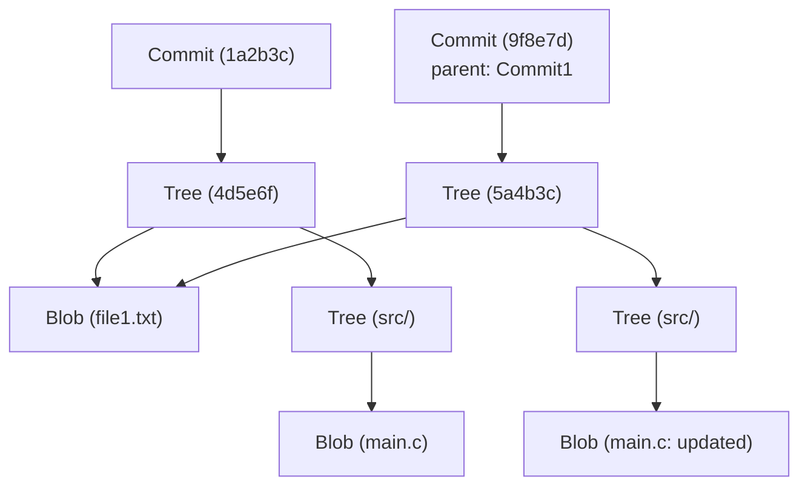

# गिट की आंतरिक वास्तुकला: कमिट, ट्री और ब्लब के माध्यम से वितरित संस्करण नियंत्रण को समझना

कई सॉफ्टवेयर इंजीनियरों के लिए, गिट हर दिन इस्तेमाल किया जाने वाला एक अनिवार्य उपकरण है। आप `git add`, `git commit`, और `git push` जैसे कमांड का उपयोग सांस लेने की तरह स्वाभाविक रूप से कर सकते हैं, लेकिन आश्चर्यजनक रूप से कम लोग गहराई से समझते हैं कि "गिट के अंदर किस प्रकार की डेटा संरचनाएं काम कर रही हैं।" इस लेख में, हम गिट के मूलभूत दर्शन और इसके तीन मुख्य डेटा ऑब्जेक्ट्स: `blob`, `tree` और `commit` पर ध्यान केंद्रित करके गिट की आंतरिक वास्तुकला को खोलेंगे।

## गिट का मूल दर्शन: स्नैपशॉट के रूप में इतिहास

कई संस्करण नियंत्रण प्रणालियां (जैसे सबवर्जन) फाइलों में "अंतर (डेल्टा)" को रिकॉर्ड करने का दृष्टिकोण अपनाती हैं। अर्थात्, वे इस बात का इतिहास रखते हैं कि एक फ़ाइल कब बनाई गई थी और बाद में उसमें क्या बदलाव किए गए थे।

इसके विपरीत, गिट का दृष्टिकोण मूल रूप से भिन्न है। गिट डेटा को "फ़ाइल सिस्टम स्नैपशॉट की एक धारा" के रूप में मानता है। हर बार जब आप कमिट करते हैं, गिट उस सटीक क्षण में सभी फाइलों की एक तस्वीर लेता है और उसे रिकॉर्ड करता है। यदि किसी फ़ाइल में परिवर्तन नहीं हुआ है, तो गिट फ़ाइल को फिर से संग्रहीत नहीं करता है, बल्कि पहले संग्रहीत समान फ़ाइल के लिंक (पॉइंटर) को सहेजता है। यह अत्यंत तेज़ ब्रांचिंग और मर्जिंग प्रक्रियाओं की अनुमति देता है।

गिट का ऑब्जेक्ट मॉडल, जिसे हम नीचे समझाएंगे, वह स्तंभ है जो इस "स्नैपशॉट" अवधारणा का समर्थन करता है।

## गिट ऑब्जेक्ट मॉडल का अवलोकन

गिट का मूल केवल एक की-वैल्यू स्टोर (Key-Value Store) है। सभी डेटा `.git/objects` डायरेक्टरी के तहत SHA-1 हैश (40-वर्ण हेक्साडेसिमल स्ट्रिंग) को कुंजी के रूप में उपयोग करके संग्रहीत किए जाते हैं।

मुख्य रूप से तीन प्रकार के डेटा ऑब्जेक्ट हैं जिन्हें गिट संभालता है:

1. **ब्लब (Blob)**: फ़ाइल की सामग्री (डेटा) स्वयं।
2. **ट्री (Tree)**: डायरेक्टरी संरचना। यह फ़ाइलों (Blobs) या अन्य डायरेक्टरीज़ (Trees) के पॉइंटर्स, फ़ाइल नाम और अनुमतियाँ (permissions) रखता है।
3. **कमिट (Commit)**: मेटाडेटा (लेखक, दिनांक, संदेश), एक ट्री ऑब्जेक्ट का पॉइंटर जो प्रोजेक्ट की रूट डायरेक्टरी को दर्शाता है, और मूल कमिट्स के पॉइंटर्स रखता है।

आइए मर्मेड (Mermaid) आरेख का उपयोग करके कल्पना करें कि ये तत्व कैसे परस्पर क्रिया करते हैं।



उपरोक्त आरेख दो कमिट्स के बीच संबंध दिखाता है। `Commit2` का मूल (parent) `Commit1` है, और चूँकि `file1.txt` में परिवर्तन नहीं हुआ है, इसलिए दोनों ट्रीज़ से एक ही `Blob` संदर्भित है। इस तरह गिट कुशलता से डेटा स्टोर करता है।

## ब्लब ऑब्जेक्ट: फ़ाइल सामग्री संग्रहीत करना

Blob का अर्थ "बाइनरी लार्ज ऑब्जेक्ट" है, और यह गिट में वह इकाई है जो फ़ाइल की वास्तविक सामग्री को संग्रहीत करती है। यहाँ एक महत्वपूर्ण बिंदु यह है कि **Blobs के पास फ़ाइल नाम नहीं होते हैं**। फ़ाइल नाम और डायरेक्टरी संरचनाएं ट्री ऑब्जेक्ट द्वारा प्रबंधित की जाती हैं, जिसे बाद में समझाया जाएगा।

ब्लब ऑब्जेक्ट की कुंजी (SHA-1 हैश) की गणना फ़ाइल की सामग्री और हेडर जानकारी, जैसे आकार, से की जाती है। इसका मतलब है कि भले ही दो फाइलें पूरी तरह से अलग-अलग डायरेक्टरी में हों, अगर उनकी सामग्री बिल्कुल समान है, तो उन्हें डिस्क स्थान बचाने के लिए गिट में एक ही ब्लब ऑब्जेक्ट के रूप में संग्रहीत किया जाएगा।

वास्तव में, आप गिट के लो-लेवल कमांड (प्लंबिंग कमांड) का उपयोग करके किसी फ़ाइल से ब्लब हैश की गणना कर सकते हैं।

```bash
$ echo 'Hello Git' > hello.txt
$ git hash-object -w hello.txt
980a0d5f19a64b4b30a87d4206aade58726b60e3
```

इस कमांड द्वारा उत्पादित हैश मान इस फ़ाइल सामग्री की आईडी है। फ़ाइल सामग्री को `.git/objects/98/0a0d5...` पथ पर संपीड़ित अवस्था में सहेजा जाएगा।

## ट्री ऑब्जेक्ट: डायरेक्टरी संरचना का प्रतिनिधित्व

भले ही फ़ाइल की सामग्री को सहेजा जा सके, लेकिन यह अर्थहीन है यदि हम नहीं जानते कि यह किस फ़ाइल नाम से और किस डायरेक्टरी में स्थित है। यह **ट्री ऑब्जेक्ट** द्वारा हल किया गया है।

ट्री ऑब्जेक्ट यूनिक्स डायरेक्टरी के समान कार्य करता है। एक ट्री में कई प्रविष्टियाँ हो सकती हैं। प्रत्येक प्रविष्टि में निम्नलिखित जानकारी शामिल है:

- फ़ाइल मोड (जैसे निष्पादन योग्य फ़ाइल, सामान्य फ़ाइल, सिम्बोलिक लिंक)
- ऑब्जेक्ट प्रकार (`blob` या `tree`)
- ऑब्जेक्ट का हैश मान (SHA-1)
- फ़ाइल नाम या डायरेक्टरी नाम

उदाहरण के लिए, किसी प्रोजेक्ट के रूट ट्री की सामग्री इस तरह दिख सकती है:

```bash
$ git ls-tree HEAD
100644 blob 980a0d5f19a64b4b30a87d4206aade58726b60e3    hello.txt
040000 tree 8b137891791fe96927ad78e64b0aad7bded08bdc    src
```

इस तरह, Blobs और अन्य Trees को एक साथ समूहीकृत करके, ट्री ऑब्जेक्ट संपूर्ण जटिल डायरेक्टरी ट्री संरचना का प्रतिनिधित्व करता है।

## कमिट ऑब्जेक्ट: स्नैपशॉट को अर्थ देना

ट्री ऑब्जेक्ट के माध्यम से, हम किसी विशेष समय पर पूरे प्रोजेक्ट की फ़ाइल संरचना का प्रतिनिधित्व कर सकते हैं। हालाँकि, अकेले यह हमें "किसने", "कब" और "क्यों" उस स्थिति को बनाया, या "पिछली स्थिति क्या थी" का ऐतिहासिक संदर्भ नहीं देता है। यह **कमिट ऑब्जेक्ट** रिकॉर्ड करता है।

कमिट ऑब्जेक्ट में निम्नलिखित जानकारी होती है:

1. **ट्री हैश**: प्रोजेक्ट के रूट ट्री का हैश जो यह कमिट इंगित करता है।
2. **पैरेंट कमिट हैश**: तत्काल पिछले कमिट (पैरेंट) का हैश। पहले कमिट में पैरेंट नहीं होते हैं। मर्ज कमिट में कई पैरेंट होते हैं।
3. **लेखक (Author) और कमिटर (Committer)**: नाम, ईमेल पता और टाइमस्टैम्प।
4. **कमिट संदेश**: परिवर्तन का कारण और विस्तृत विवरण।

आइए `git cat-file -p` कमांड का उपयोग करके एक कमिट की सामग्री देखें।

```bash
$ git cat-file -p HEAD
tree 4b825dc642cb6eb9a060e54bf8d69288fbee4904
parent a3c2f1e809b4d5a92c30b2c14078970e28f307f9
author John Doe <john@example.com> 1695628790 +0900
committer John Doe <john@example.com> 1695628790 +0900

Add hello.txt to the project
```

जैसा कि हम देख सकते हैं, कमिट ऑब्जेक्ट सिर्फ टेक्स्ट डेटा है। इस टेक्स्ट डेटा के SHA-1 हैश की गणना की जाती है, और यह हमारा परिचित "कमिट हैश" बन जाता है।

चूँकि कमिट हैश की गणना सभी जानकारी (न केवल परिवर्तन, बल्कि पैरेंट हैश, निर्माण समय और संदेश) से की जाती है, यदि आप बाद में कमिट सामग्री के साथ छेड़छाड़ करने का प्रयास करते हैं, तो हैश मान बदल जाएगा। यह वह तंत्र है जो गिट की मजबूत डेटा अखंडता (Integrity) की गारंटी देता है।

## शाखाएँ (Branches) और HEAD: मात्र पॉइंटर्स

एक बार जब आप गिट की आंतरिक संरचना को समझ लेते हैं, तो आपको तुरंत समझ आ जाएगा कि गिट की सबसे शक्तिशाली विशेषता, शाखाएँ, अत्यधिक हल्की क्यों हैं।

गिट में एक शाखा केवल **एक विशिष्ट कमिट ऑब्जेक्ट को इंगित करने वाला पॉइंटर (एक टेक्स्ट फ़ाइल)** है। यदि आप `.git/refs/heads/main` फ़ाइल के अंदर देखते हैं, तो आपको बस नवीनतम कमिट हैश (40-वर्ण की स्ट्रिंग) दिखाई देगा।

```bash
$ cat .git/refs/heads/main
a3c2f1e809b4d5a92c30b2c14078970e28f307f9
```

नई शाखा बनाने (`git branch feature`) का ऑपरेशन केवल `.git/refs/heads/feature` में इस 40-वर्ण स्ट्रिंग वाली एक नई फ़ाइल बनाने के बारे में है। संपूर्ण फ़ाइल सिस्टम को कॉपी करने की कोई आवश्यकता नहीं है, इसलिए यह एक पल में पूरा हो जाता है।

और जो आपके द्वारा वर्तमान में काम की जा रही शाखा को रिकॉर्ड करता है वह `HEAD` है। `.git/HEAD` फ़ाइल में वर्तमान में चेक आउट की गई शाखा का संदर्भ होता है।

```bash
$ cat .git/HEAD
ref: refs/heads/main
```

जब आप कमिट बनाते हैं, तो गिट निम्नानुसार व्यवहार करता है:
1. नया ब्लब बनाता है (संशोधित फ़ाइल)
2. नया ट्री बनाता है (संशोधित डायरेक्टरी संरचना)
3. नया कमिट बनाता है (नए ट्री की ओर इशारा करते हुए और वर्तमान HEAD द्वारा इंगित कमिट को पैरेंट मानते हुए)
4. HEAD जिस शाखा की ओर इशारा कर रहा है (`main` इस मामले में) उसके पॉइंटर को नए बनाए गए कमिट पर फिर से लिखता है

यह अत्यंत सरल और कुशल अद्यतन प्रक्रिया गिट की ऑपरेटिंग गति का स्रोत है।

## गिट गार्बेज कलेक्शन और पैक्फाइल (Packfile)

यदि आप गिट का उपयोग करना जारी रखते हैं, तो प्रत्येक परिवर्तन के साथ ब्लब ऑब्जेक्ट्स उत्पन्न होंगे, और `.git/objects` डायरेक्टरी बहुत बड़ी हो जाएगी। चूँकि प्रत्येक ब्लब संपूर्ण फ़ाइल का स्नैपशॉट है, यहाँ तक कि केवल एक पंक्ति बदलने पर भी संपूर्ण फ़ाइल की एक प्रति (हालांकि संपीड़ित) नए ब्लब के रूप में सहेजी जाएगी।

चूँकि यह अक्षम है, गिट में **Packfile** नामक एक तंत्र शामिल है। समय-समय पर (या जब `git gc` कमांड मैन्युअल रूप से चलाया जाता है), गिट गार्बेज कलेक्शन करता है और कई ढीले ऑब्जेक्ट्स (Loose Objects) को एक ही पैक्फाइल (`.pack` फ़ाइल) में समेकित करता है।

इस समय, गिट एक बहुत ही चतुर अनुकूलन करता है। यह समान सामग्री वाले ब्लब की खोज करता है, एक को संपूर्ण डेटा के रूप में सहेजता है, और दूसरे को "अंतर (डेल्टा)" के रूप में सहेजता है। यह नाटकीय रूप से फ़ाइल आकार को कम करता है। इसलिए, हालांकि इतिहास का भंडारण मॉडल "स्नैपशॉट" पर आधारित है, "डेल्टा" तकनीक का उपयोग डिस्क स्थान बचाने के लिए पृष्ठभूमि अनुकूलन के रूप में किया जाता है।

## निष्कर्ष

गिट का कमांड लाइन इंटरफ़ेस (CLI) जटिल है और कभी-कभी गैर-सहज लग सकता है, लेकिन पृष्ठभूमि में काम करने वाली डेटा संरचनाएं आश्चर्यजनक रूप से सरल और सुरुचिपूर्ण हैं।

- **ब्लब (Blob)**: फ़ाइल सामग्री
- **ट्री (Tree)**: डायरेक्टरी और फ़ाइल नाम संरचना
- **कमिट (Commit)**: स्नैपशॉट मेटाडेटा और इतिहास लिंक
- **ब्रांच/टैग**: कमिट को इंगित करने वाला एक हल्का पॉइंटर

इन तत्वों का संयोजन एक मजबूत और तेज़ वितरित संस्करण नियंत्रण प्रणाली प्रदान करता है। गिट की आंतरिक वास्तुकला को समझने से आपको यह स्पष्ट रूप से कल्पना करने में मदद मिलेगी कि गिट आंतरिक रूप से क्या कर रहा है जब आप संघर्षों को सुलझाने (conflicts resolution), इतिहास में बदलाव (जैसे `rebase`), या खोए हुए कमिट्स को पुनर्स्थापित करने जैसे उन्नत संचालन करते हैं।

गिट केवल एक उपकरण से कहीं अधिक है; इसे सुंदर डेटा संरचनाओं की कला का एक काम माना जा सकता है। अगली बार जब आप अपने दैनिक विकास में गिट का उपयोग करें, तो इन अदृश्य "Trees" और "Blobs" के समन्वय के बारे में सोचने के लिए एक क्षण निकालें।
