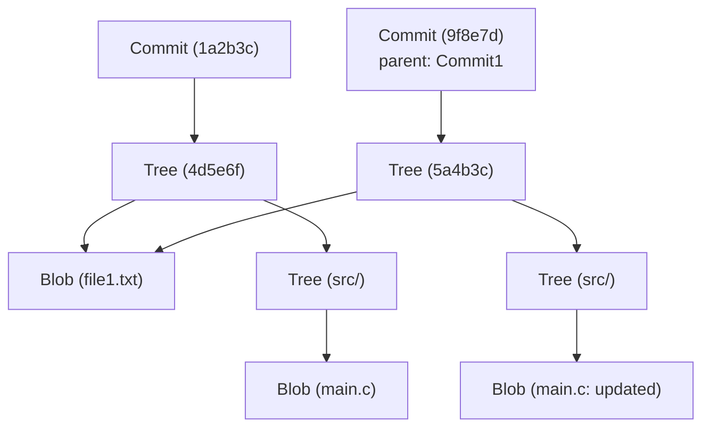

# Arsitektur Internal Git: Memahami Kontrol Versi Terdistribusi melalui Commit, Tree, dan Blob

Bagi banyak software engineer, Git adalah alat penting yang digunakan setiap hari. Perintah seperti `git add`, `git commit`, dan `git push` mungkin digunakan semudah bernapas, tetapi mungkin hanya sedikit yang benar-benar memahami "struktur data seperti apa yang beroperasi di dalam Git". Artikel ini akan menguraikan arsitektur internal Git dengan berfokus pada filosofi dasarnya dan tiga objek data yang membentuk intinya: `blob`, `tree`, dan `commit`.

## Filosofi Dasar Git: Riwayat sebagai Snapshot

Banyak sistem kontrol versi (seperti Subversion) mengambil pendekatan dengan merekam "perbedaan (delta)" pada file. Artinya, mereka menyimpan riwayat tentang bagaimana sebuah file dibuat dan perubahan apa saja yang diterapkan padanya setelah itu.

Sebaliknya, pendekatan Git pada dasarnya berbeda. Git memperlakukan data sebagai "serangkaian snapshot dari sistem file". Setiap kali Anda melakukan commit, Git seolah-olah mengambil gambar dari semua status file pada saat itu dan menyimpannya. Jika sebuah file tidak berubah, Git tidak menyimpan file itu lagi, melainkan hanya menyimpan tautan (pointer) ke file identik yang sebelumnya telah disimpan. Hal ini memungkinkan pembuatan branch dan proses merge berjalan dengan sangat cepat.

Konsep "snapshot" inilah yang didukung oleh model objek Git, yang akan dijelaskan di bawah ini.

## Gambaran Umum Model Objek Git

Inti (core) dari Git hanyalah sebuah Key-Value Store. Semua data disimpan di bawah direktori `.git/objects` dengan hash SHA-1 (string heksadesimal 40 karakter) sebagai kuncinya.

Ada tiga tipe utama dari objek data yang sering ditangani oleh Git:

1. **Blob**: Konten (data) dari file itu sendiri.
2. **Tree**: Struktur direktori. Menyimpan pointer ke file (Blob) atau direktori lain (Tree) beserta nama file dan perizinannya (permissions).
3. **Commit**: Menyimpan metadata (pembuat, tanggal, pesan), satu pointer ke objek Tree yang menunjukkan direktori root dari proyek, dan pointer ke commit induk (parent).

Mari kita visualisasikan bagaimana ketiganya bekerja sama menggunakan diagram Mermaid.



Diagram di atas menunjukkan hubungan antara dua commit. `Commit2` menjadikan `Commit1` sebagai parent-nya, dan karena `file1.txt` tidak berubah, `Blob` yang sama direferensikan dari kedua tree tersebut. Inilah mekanisme di mana Git menyimpan data secara efisien.

## Objek Blob: Menyimpan Konten File

Blob adalah singkatan dari "Binary Large Object", yang merupakan unit penyimpanan untuk isi file itu sendiri dalam Git. Poin penting di sini adalah bahwa **Blob tidak memiliki nama file**. Nama file dan struktur direktori dikelola oleh objek Tree, yang akan dijelaskan nanti.

Kunci (hash SHA-1) dari objek Blob dihitung berdasarkan konten file itu sendiri dan informasi header seperti ukurannya. Ini berarti, bahkan jika dua file berada di direktori yang sama sekali berbeda, selama kontennya benar-benar identik, Git akan menyimpannya sebagai satu objek Blob secara internal, sehingga menghemat ruang penyimpanan.

Faktanya, Anda bisa menghitung hash Blob dari sebuah file menggunakan perintah tingkat rendah (Plumbing command) dari Git.

```bash
$ echo 'Hello Git' > hello.txt
$ git hash-object -w hello.txt
980a0d5f19a64b4b30a87d4206aade58726b60e3
```

Nilai hash yang dihasilkan oleh perintah ini menjadi ID untuk konten file ini. Konten file akan dikompresi dan disimpan pada path `.git/objects/98/0a0d5...`.

## Objek Tree: Representasi Struktur Direktori

Meskipun konten file dapat disimpan, tidak ada artinya jika kita tidak tahu nama file apa dan di direktori mana file itu ditempatkan. Masalah ini diselesaikan oleh **objek Tree**.

Objek Tree memiliki peran yang mirip dengan direktori UNIX. Satu Tree memiliki beberapa entri. Setiap entri mengandung informasi berikut:

- Mode file (apakah itu file yang dapat dieksekusi, file biasa, atau symbolic link, dll.)
- Tipe objek (blob atau tree)
- Nilai hash dari objek (SHA-1)
- Nama file atau nama direktori

Sebagai contoh, isi dari tree root suatu proyek terlihat seperti ini:

```bash
$ git ls-tree HEAD
100644 blob 980a0d5f19a64b4b30a87d4206aade58726b60e3    hello.txt
040000 tree 8b137891791fe96927ad78e64b0aad7bded08bdc    src
```

Dengan demikian, objek Tree merepresentasikan keseluruhan struktur direktori yang kompleks dengan mengelompokkan Blob dan Tree lainnya.

## Objek Commit: Memberikan Makna pada Snapshot

Dengan objek Tree, struktur file dari seluruh proyek pada suatu titik waktu tertentu dapat direpresentasikan. Namun, itu saja belum cukup untuk mengetahui koneksi historis dari "siapa", "kapan", "mengapa" status tersebut dibuat, dan "bagaimana status sebelumnya". Hal inilah yang direkam oleh **objek Commit**.

Sebuah objek Commit berisi informasi berikut:

1. **Hash Tree**: Hash dari root tree proyek yang ditunjuk oleh commit ini.
2. **Hash Commit Induk (Parent)**: Hash dari commit yang persis berada sebelum commit ini (induk/parent). Pada commit pertama, parent tidak ada. Pada commit merge, commit memiliki lebih dari satu parent.
3. **Pembuat (Author) dan Committer**: Nama, alamat email, dan stempel waktu (timestamp).
4. **Pesan Commit**: Alasan dari perubahan dan penjelasan secara detail.

Mari kita lihat isi dari sebuah commit secara langsung menggunakan perintah `git cat-file -p`.

```bash
$ git cat-file -p HEAD
tree 4b825dc642cb6eb9a060e54bf8d69288fbee4904
parent a3c2f1e809b4d5a92c30b2c14078970e28f307f9
author John Doe <john@example.com> 1695628790 +0900
committer John Doe <john@example.com> 1695628790 +0900

Add hello.txt to the project
```

Seperti yang bisa dilihat, objek Commit hanyalah sebuah data teks biasa. Hash SHA-1 dari data teks itu sendiri kemudian dihitung, dan itulah yang kita kenal sebagai "hash commit".

Karena hash commit dihitung dari semua informasi seperti isi perubahan, hash dari parent, waktu pembuatan, pesan, dll., maka jika ada yang mencoba memalsukan isi commit setelahnya, nilai hash-nya pasti akan berubah. Ini adalah mekanisme yang menjamin integritas data (Integrity) Git yang kuat.

## Branch dan HEAD: Sekadar Pointer

Setelah Anda memahami arsitektur internal Git, akan sangat mudah untuk melihat mengapa "branch", yang merupakan fitur Git paling kuat, menjadi sangat ringan (lightweight).

Branch di Git hanyalah **sebuah pointer (file teks) yang merujuk pada objek Commit tertentu**. Jika Anda melihat isi dari file `.git/refs/heads/main`, yang tertulis di sana hanyalah sebuah hash commit terbaru (string berukuran 40 karakter).

```bash
$ cat .git/refs/heads/main
a3c2f1e809b4d5a92c30b2c14078970e28f307f9
```

Tindakan membuat branch baru (`git branch feature`) hanyalah proses pembuatan file baru di `.git/refs/heads/feature` yang berisi string 40 karakter ini. Proses ini tidak memerlukan penyalinan seluruh file sistem sama sekali, sehingga selesai dalam sekejap.

Kemudian, yang merekam branch tempat Anda sedang bekerja adalah `HEAD`. File `.git/HEAD` berisi sebuah rujukan (reference) ke branch yang saat ini sedang di-checkout.

```bash
$ cat .git/HEAD
ref: refs/heads/main
```

Saat Anda membuat sebuah commit, Git bekerja dengan cara berikut:
1. Membuat Blob baru (untuk file yang berubah)
2. Membuat Tree baru (untuk struktur direktori yang berubah)
3. Membuat Commit baru (yang menunjuk ke Tree baru, dengan commit yang ditunjuk oleh HEAD saat ini sebagai parent)
4. Memperbarui pointer dari branch yang ditunjuk oleh HEAD (dalam hal ini `main`) ke Commit yang baru saja dibuat

Proses pembaruan yang sangat sederhana dan tanpa limbah (overhead) inilah yang menjadi sumber kecepatan kinerja Git.

## Garbage Collection di Git dan Packfile

Seiring berjalannya penggunaan Git, setiap kali ada perubahan, objek Blob akan dihasilkan dan direktori `.git/objects` akan terus membengkak. Karena setiap Blob adalah snapshot dari keseluruhan file, maka perubahan satu baris saja tetap akan disimpan sebagai salinan seluruh file (meskipun dikompresi) dalam bentuk Blob baru.

Karena hal ini sangat tidak efisien, Git telah menyediakan mekanisme yang disebut **Packfile**. Git akan secara berkala (atau ketika perintah `git gc` dijalankan secara manual) melakukan proses garbage collection, dan menggabungkan beberapa objek yang terpisah (Loose Objects) ke dalam satu Packfile (berformat `.pack`).

Pada saat ini, Git melakukan proses optimasi yang sangat cerdas. Git mencari Blob yang isinya memiliki kemiripan, lalu menyimpan salah satunya secara utuh sebagai data penuh, dan menyimpan yang lainnya sebagai "perbedaan (delta)". Hal ini secara drastis mengurangi ukuran file. Meskipun model penyimpanan riwayatnya adalah "snapshot", sebagai bentuk optimasi tersembunyi untuk menghemat kapasitas disk, Git menggunakan teknologi penyimpanan berbasis "perbedaan" (delta).

## Kesimpulan

Command Line Interface (CLI) Git mungkin terlihat rumit, dan terkadang terasa kurang intuitif, tetapi struktur data yang beroperasi di balik layar sangatlah sederhana dan elegan.

- **Blob**: Konten file
- **Tree**: Struktur direktori dan nama file
- **Commit**: Metadata dari snapshot dan tautan riwayat (history link)
- **Branch/Tag**: Pointer ringan yang menunjuk ke sebuah commit

Kombinasi dari elemen-elemen ini merealisasikan sebuah sistem kontrol versi terdistribusi yang sangat tangguh dan cepat. Dengan memahami arsitektur internal Git, Anda akan mampu membayangkan secara jelas apa yang sedang dilakukan oleh Git di balik layar saat Anda melakukan operasi lanjutan, seperti menyelesaikan konflik (conflict resolution), memanipulasi riwayat (seperti rebase), atau memulihkan commit yang hilang.

Git bisa dikatakan sebagai karya seni dari struktur data yang indah, lebih dari sekadar alat biasa. Ketika Anda menggunakan Git dalam proses development sehari-hari, cobalah untuk sesekali merenungkan kolaborasi antara "Tree" dan "Blob" yang tak terlihat ini.
