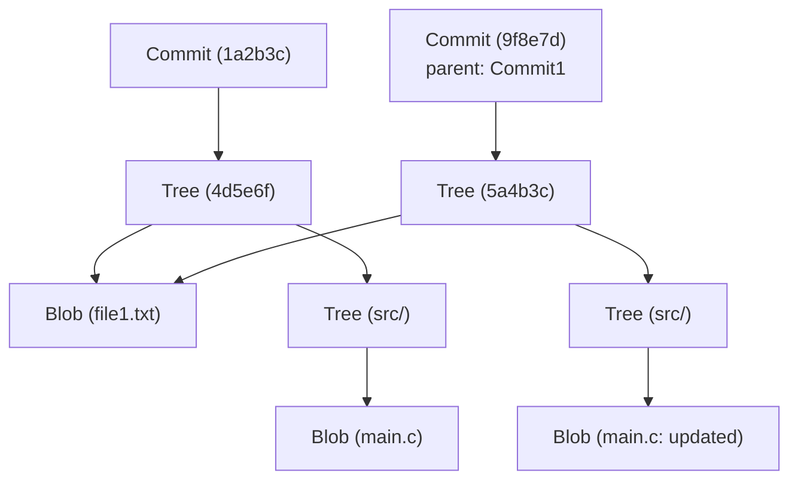

# Git의 내부 구조: commit, tree, blob으로 이해하는 분산 버전 관리

많은 소프트웨어 엔지니어에게 Git은 일상적으로 사용하는 필수 불가결한 도구입니다. `git add`나 `git commit`, `git push`와 같은 명령어는 숨 쉬듯이 사용하고 있을지 모르지만, "Git의 내부에서 어떤 데이터 구조가 동작하고 있는지"를 깊이 이해하고 있는 사람은 의외로 적을지도 모릅니다. 본 기사에서는 Git의 근본적인 철학과 그 핵심을 이루는 데이터 구조인 `blob`, `tree`, `commit` 3가지 객체에 초점을 맞춰 Git의 내부 구조를 풀어보겠습니다.

## Git의 기본 철학: 스냅샷으로서의 이력

많은 버전 관리 시스템(Subversion 등)은 파일에 대한 "차이(델타)"를 기록해 나가는 접근 방식을 취하고 있었습니다. 즉, 어떤 파일이 생성되고 이후 어떤 변경이 가해졌는지를 이력으로 유지합니다.

대조적으로 Git의 접근 방식은 근본부터 다릅니다. Git은 데이터를 "파일 시스템 스냅샷의 연속"으로 다룹니다. 커밋할 때마다 Git은 그 순간의 모든 파일 상태를 사진 찍듯이 기록합니다. 만약 파일에 변경이 없다면, Git은 파일을 다시 저장하는 것이 아니라 이전에 저장된 동일한 파일에 대한 링크(포인터)만을 저장합니다. 이를 통해 매우 빠른 브랜치 생성이나 병합 처리가 가능해집니다.

이 "스냅샷"이라는 개념을 뒷받침하는 것이 앞으로 설명할 Git의 객체 모델입니다.

## Git 객체 모델의 전체적인 모습

Git의 핵심(코어)은 단순한 키-값 저장소(Key-Value Store)입니다. 모든 데이터는 SHA-1 해시(40자의 16진수 문자열)를 키로 하여 `.git/objects` 디렉터리 아래에 저장됩니다.

Git이 주로 다루는 데이터 객체에는 다음 3가지 주요 유형이 존재합니다.

1. **Blob (블롭)**: 파일의 내용(데이터) 그 자체.
2. **Tree (트리)**: 디렉터리 구조. 파일(Blob)이나 다른 디렉터리(Tree)에 대한 포인터와 파일명, 권한을 유지한다.
3. **Commit (커밋)**: 메타데이터(작성자, 날짜, 메시지)와 프로젝트의 루트 디렉터리를 가리키는 1개의 Tree 객체에 대한 포인터, 그리고 부모 커밋에 대한 포인터를 유지한다.

이들이 어떻게 연계되어 있는지 Mermaid 다이어그램을 사용해 시각화해 보겠습니다.



위의 다이어그램은 2개의 커밋 간의 관계를 보여줍니다. `Commit2`는 `Commit1`을 부모로 하고 있으며, `file1.txt`는 변경되지 않았기 때문에 두 트리에서 같은 `Blob`을 참조하고 있습니다. 이것이 Git이 데이터를 효율적으로 저장하는 방식입니다.

## Blob 객체: 파일 콘텐츠의 저장

Blob은 "Binary Large Object"의 약자로, Git에서 파일 내용 자체를 저장하는 단위입니다. 여기서 중요한 포인트는 **Blob은 파일명을 가지지 않는다**는 것입니다. 파일명이나 디렉터리의 구조는 뒤에서 설명할 Tree 객체에서 관리됩니다.

Blob 객체의 키(SHA-1 해시)는 파일의 내용 자체와 크기 등의 헤더 정보로부터 계산됩니다. 즉, 완전히 다른 디렉터리에 있는 두 파일이라도 내용이 완전히 같다면 Git 내부에서는 1개의 Blob 객체로 저장되어 디스크 공간을 절약합니다.

실제로 Git의 저수준 명령어(Plumbing 명령어)를 사용하여 파일에서 Blob 해시를 계산해 볼 수 있습니다.

```bash
$ echo 'Hello Git' > hello.txt
$ git hash-object -w hello.txt
980a0d5f19a64b4b30a87d4206aade58726b60e3
```

이 명령어로 출력되는 해시값이 이 파일 내용의 ID가 됩니다. `.git/objects/98/0a0d5...` 라는 경로에 압축된 상태로 파일 내용이 저장됩니다.

## Tree 객체: 디렉터리 구조의 표현

파일 내용을 저장할 수 있더라도, 그것이 어떤 파일명으로 어느 디렉터리에 배치되어 있는지 알지 못하면 의미가 없습니다. 이를 해결하는 것이 **Tree 객체**입니다.

Tree 객체는 UNIX의 디렉터리와 같은 역할을 합니다. 1개의 Tree는 여러 엔트리를 가집니다. 각각의 엔트리에는 다음 정보가 포함됩니다.

- 파일 모드 (실행 가능한 파일인지, 일반 파일인지, 심볼릭 링크인지 등)
- 객체의 타입 (blob 또는 tree)
- 객체의 해시값 (SHA-1)
- 파일명 또는 디렉터리명

예를 들어, 어떤 프로젝트의 루트 트리 내용은 다음과 같습니다.

```bash
$ git ls-tree HEAD
100644 blob 980a0d5f19a64b4b30a87d4206aade58726b60e3    hello.txt
040000 tree 8b137891791fe96927ad78e64b0aad7bded08bdc    src
```

이처럼 Tree 객체는 Blob이나 다른 Tree를 묶음으로써 복잡한 디렉터리 트리 전체를 표현합니다.

## Commit 객체: 스냅샷에 의미 부여하기

Tree 객체를 통해 특정 시점의 프로젝트 전체 파일 구조를 표현할 수 있게 되었습니다. 하지만 그것만으로는 "누가", "언제", "왜" 그 상태를 만들었는지, 그리고 "그 이전 상태는 어떠했는지"라는 이력의 연결 고리를 알 수 없습니다. 이를 기록하는 것이 **Commit 객체**입니다.

Commit 객체에는 다음 정보가 포함되어 있습니다.

1. **Tree 해시**: 이 커밋이 가리키는 프로젝트 루트 트리의 해시.
2. **부모 Commit 해시**: 이 커밋의 직전 커밋(부모) 해시. 첫 번째 커밋의 경우 부모가 존재하지 않습니다. 병합 커밋의 경우 여러 부모를 가집니다.
3. **작성자(Author)와 커미터(Committer)**: 이름, 이메일 주소, 타임스탬프.
4. **커밋 메시지**: 변경 이유나 상세한 설명.

실제로 어떤 커밋의 내용을 `git cat-file -p` 명령어로 확인해 보겠습니다.

```bash
$ git cat-file -p HEAD
tree 4b825dc642cb6eb9a060e54bf8d69288fbee4904
parent a3c2f1e809b4d5a92c30b2c14078970e28f307f9
author John Doe <john@example.com> 1695628790 +0900
committer John Doe <john@example.com> 1695628790 +0900

Add hello.txt to the project
```

이와 같이 Commit 객체는 단순한 텍스트 데이터입니다. 이 텍스트 데이터 자체의 SHA-1 해시가 계산되며, 그것이 우리에게 친숙한 "커밋 해시"가 됩니다.

커밋 해시가 변경 내용뿐만 아니라 부모의 해시, 작성 시간, 메시지 등 모든 정보로부터 계산되기 때문에, 커밋 내용을 나중에 조작하려고 하면 해시값이 바뀌어 버립니다. 이것이 Git의 강력한 데이터 무결성(Integrity)을 보장하는 구조입니다.

## 브랜치와 HEAD: 단순한 포인터

Git의 내부 구조를 이해하면, Git의 가장 강력한 기능인 "브랜치"가 매우 가벼운 이유를 바로 알 수 있습니다.

Git에서 브랜치는 단지 **특정 Commit 객체를 가리키는 포인터(텍스트 파일)**에 불과합니다. `.git/refs/heads/main` 이라는 파일의 내용을 보면, 단순히 최신 커밋 해시(40자의 문자열)가 적혀 있을 뿐입니다.

```bash
$ cat .git/refs/heads/main
a3c2f1e809b4d5a92c30b2c14078970e28f307f9
```

새로운 브랜치를 생성하는(`git branch feature`) 작업은 이 40자의 문자열을 포함하는 새로운 파일을 `.git/refs/heads/feature`에 생성하는 것뿐입니다. 파일 시스템 전체를 복사할 필요가 전혀 없기 때문에 순식간에 완료됩니다.

그리고 현재 작업 중인 브랜치를 기록하고 있는 것이 `HEAD`입니다. `.git/HEAD` 파일에는 현재 체크아웃된 브랜치에 대한 참조가 적혀 있습니다.

```bash
$ cat .git/HEAD
ref: refs/heads/main
```

커밋을 생성하면 Git은 다음과 같이 동작합니다.
1. 새로운 Blob 생성 (변경 파일)
2. 새로운 Tree 생성 (변경된 디렉터리 구조)
3. 새로운 Commit 생성 (새로운 Tree를 가리키고, 현재 HEAD가 가리키는 커밋을 부모로 함)
4. HEAD가 가리키고 있는 브랜치(여기서는 `main`)의 포인터를 새로 생성한 Commit으로 덮어씀

이 매우 간단하고 낭비 없는 업데이트 프로세스가 Git의 동작 속도의 원천입니다.

## Git의 가비지 컬렉션과 Packfile

Git을 계속 사용하면 변경할 때마다 Blob 객체가 생성되어 `.git/objects` 디렉터리가 비대해집니다. 각 Blob은 파일 전체의 스냅샷이므로 단 한 줄의 변경이라도 파일 전체의 복사본(압축은 되어 있지만)이 새로운 Blob으로 저장됩니다.

이대로라면 효율이 떨어지기 때문에 Git에는 **Packfile**이라는 구조가 마련되어 있습니다. Git은 주기적으로(또는 `git gc` 명령어가 수동으로 실행되었을 때) 가비지 컬렉션을 수행하여 여러 느슨한 객체(Loose Objects)를 하나의 Packfile(`.pack` 파일)로 묶습니다.

이때 Git은 매우 똑똑한 최적화를 수행합니다. 비슷한 내용의 Blob을 찾아내어, 한쪽은 완전한 데이터로 저장하고 다른 한쪽은 "차이(델타)"로 저장하는 것입니다. 이를 통해 파일 크기가 극적으로 줄어듭니다. 이력의 저장 모델은 "스냅샷"이지만, 디스크 공간을 절약하기 위한 이면의 최적화로 "차이" 기술이 활용되고 있다는 것입니다.

## 요약

Git의 명령줄 인터페이스(CLI)는 복잡하고 때로는 직관적이지 않다고 느낄 수도 있지만, 그 이면에서 동작하고 있는 데이터 구조는 놀라울 정도로 단순하고 우아합니다.

- **Blob**: 파일의 내용
- **Tree**: 디렉터리와 파일명 구조
- **Commit**: 스냅샷의 메타데이터와 이력 연결
- **Branch/Tag**: 커밋을 가리키는 가벼운 포인터

이러한 요소들이 결합하여 견고하고 빠른 분산 버전 관리 시스템이 실현되고 있습니다. Git의 내부 아키텍처를 이해함으로써 충돌 해결, 이력 변경(rebase 등), 손실된 커밋 복구와 같은 고급 작업을 수행할 때도 Git이 내부적으로 무엇을 하고 있는지 명확하게 이미지를 떠올릴 수 있게 될 것입니다.

Git은 단순한 도구 이상의, 아름다운 데이터 구조를 지닌 예술 작품이라고 할 수 있습니다. 일상적인 개발에서 Git을 사용할 때 이 보이지 않는 "Tree"나 "Blob"들의 연계에 조금이나마 생각을 기울여 보시길 바랍니다.
