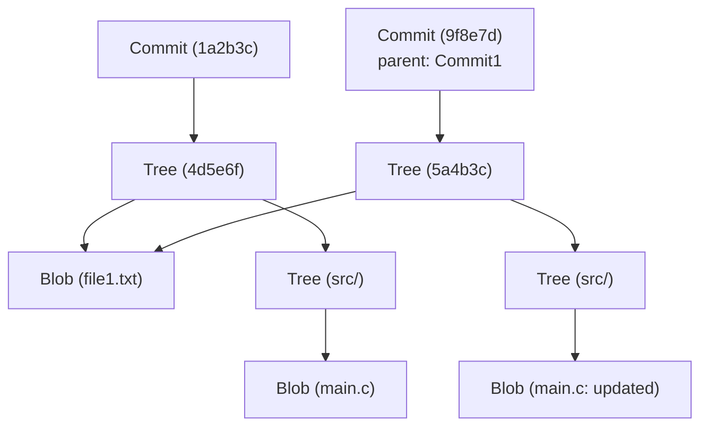

# Gitの内部構造：commit、tree、blobから理解する分散バージョン管理

多くのソフトウェアエンジニアにとって、Gitは日常的に使用する不可欠なツールです。`git add` や `git commit`、`git push` といったコマンドは息を吸うように使っているかもしれませんが、「Gitの内部でどのようなデータ構造が動いているのか」を深く理解している人は意外と少ないかもしれません。本記事では、Gitの根本的な哲学と、その中核を成すデータ構造である `blob`、`tree`、`commit` の3つのオブジェクトに焦点を当てて、Gitの内部構造を紐解いていきます。

## Gitの基本哲学：スナップショットとしての履歴

多くのバージョン管理システム（Subversionなど）は、ファイルに対する「差分（デルタ）」を記録していくアプローチをとっていました。つまり、あるファイルが作成され、その後どのような変更が加えられたのかを履歴として保持します。

対照的に、Gitのアプローチは根本から異なります。Gitはデータを「ファイルシステムのスナップショットの連続」として扱います。コミットするたびに、Gitはその瞬間のすべてのファイルの状態を写真に撮るように記録します。もしファイルに変更がなければ、Gitは再度ファイルを保存するのではなく、以前に保存された同一のファイルへのリンク（ポインタ）のみを保存します。これにより、極めて高速なブランチ作成やマージ処理が可能になっています。

この「スナップショット」という概念を支えているのが、これから解説するGitのオブジェクトモデルです。

## Gitオブジェクトモデルの全体像

Gitの中核（コア）は、単なるキーバリューストア（Key-Value Store）です。あらゆるデータはSHA-1ハッシュ（40文字の16進数文字列）をキーとして `.git/objects` ディレクトリ以下に保存されます。

Gitが主に扱うデータオブジェクトには、以下の3つの主要なタイプが存在します。

1. **Blob（ブロッブ）**: ファイルの内容（データ）そのもの。
2. **Tree（ツリー）**: ディレクトリ構造。ファイル（Blob）や他のディレクトリ（Tree）へのポインタとファイル名、パーミッションを保持する。
3. **Commit（コミット）**: メタデータ（作成者、日付、メッセージ）と、プロジェクトのルートディレクトリを示す1つのTreeオブジェクトへのポインタ、および親コミットへのポインタを保持する。

これらがどのように連携しているか、Mermaid図を使って視覚化してみましょう。



上の図は、2つのコミット間の関係を示しています。`Commit2`は`Commit1`を親としており、`file1.txt`は変更されていないため、両方のツリーから同じ`Blob`が参照されています。これが、Gitが効率的にデータを保存する仕組みです。

## Blobオブジェクト：ファイルコンテンツの保存

Blobは「Binary Large Object」の略で、Gitにおいてファイルの中身そのものを保存する単位です。ここでの重要なポイントは、**Blobはファイル名を持たない**ということです。ファイル名やディレクトリの構造は、後述するTreeオブジェクトで管理されます。

Blobオブジェクトのキー（SHA-1ハッシュ）は、ファイルの内容そのものと、サイズなどのヘッダ情報から計算されます。つまり、全く異なるディレクトリにある2つのファイルであっても、中身が完全に同じであれば、Gitの内部では1つのBlobオブジェクトとして保存され、ディスクスペースを節約します。

実際に、Gitの低レベルコマンド（Plumbingコマンド）を使って、ファイルからBlobハッシュを計算することができます。

```bash
$ echo 'Hello Git' > hello.txt
$ git hash-object -w hello.txt
980a0d5f19a64b4b30a87d4206aade58726b60e3
```

このコマンドで出力されるハッシュ値が、このファイル内容のIDとなります。`.git/objects/98/0a0d5...` というパスに圧縮された状態でファイル内容が保存されます。

## Treeオブジェクト：ディレクトリ構造の表現

ファイルの中身が保存できても、それがどのファイル名で、どのディレクトリに配置されているかが分からなければ意味がありません。これを解決するのが **Treeオブジェクト** です。

Treeオブジェクトは、UNIXのディレクトリのような役割を果たします。1つのTreeは、複数のエントリを持ちます。それぞれのエントリには以下の情報が含まれます。

- ファイルモード（実行可能ファイルか、通常のファイルか、シンボリックリンクかなど）
- オブジェクトのタイプ（blob か tree）
- オブジェクトのハッシュ値（SHA-1）
- ファイル名またはディレクトリ名

たとえば、あるプロジェクトのルートツリーの中身は以下のようになっています。

```bash
$ git ls-tree HEAD
100644 blob 980a0d5f19a64b4b30a87d4206aade58726b60e3    hello.txt
040000 tree 8b137891791fe96927ad78e64b0aad7bded08bdc    src
```

このように、TreeオブジェクトはBlobや他のTreeを束ねることで、複雑なディレクトリツリー全体を表現します。

## Commitオブジェクト：スナップショットに意味を持たせる

Treeオブジェクトによって、ある時点でのプロジェクト全体のファイル構造が表現できるようになりました。しかし、それだけでは「誰が」「いつ」「なぜ」その状態を作ったのか、また「その前の状態はどうだったのか」という履歴のつながりが分かりません。これを記録するのが **Commitオブジェクト** です。

Commitオブジェクトには以下の情報が含まれています。

1. **Treeハッシュ**: このコミットが指し示すプロジェクトのルートツリーのハッシュ。
2. **親Commitハッシュ**: このコミットの直前のコミット（親）のハッシュ。最初のコミットの場合は親が存在しません。マージコミットの場合は複数の親を持ちます。
3. **作成者（Author）とコミッター（Committer）**: 名前、メールアドレス、タイムスタンプ。
4. **コミットメッセージ**: 変更の理由や詳細な説明。

実際に、あるコミットの中身を `git cat-file -p` コマンドで見てみましょう。

```bash
$ git cat-file -p HEAD
tree 4b825dc642cb6eb9a060e54bf8d69288fbee4904
parent a3c2f1e809b4d5a92c30b2c14078970e28f307f9
author John Doe <john@example.com> 1695628790 +0900
committer John Doe <john@example.com> 1695628790 +0900

Add hello.txt to the project
```

このように、Commitオブジェクトは単なるテキストデータです。このテキストデータ自体のSHA-1ハッシュが計算され、それが私たちに馴染みのある「コミットハッシュ」となります。

コミットハッシュが変更内容だけでなく、親のハッシュ、作成時間、メッセージなどすべての情報から計算されているため、コミット内容を後から改ざんしようとするとハッシュ値が変わってしまいます。これがGitの強力なデータ完全性（Integrity）を保証する仕組みです。

## ブランチとHEAD：単なるポインタ

Gitの内部構造を理解すると、Gitの最も強力な機能である「ブランチ」が非常に軽量である理由がすぐに分かります。

Gitにおけるブランチは、単なる**特定のCommitオブジェクトを指し示すポインタ（テキストファイル）**に過ぎません。`.git/refs/heads/main` というファイルの中身を見ると、単に最新のコミットハッシュ（40文字の文字列）が書かれているだけです。

```bash
$ cat .git/refs/heads/main
a3c2f1e809b4d5a92c30b2c14078970e28f307f9
```

新しいブランチを作成する（`git branch feature`）という操作は、この40文字の文字列を含む新しいファイルを `.git/refs/heads/feature` に作成するだけです。ファイルシステム全体をコピーする必要は一切ないため、一瞬で完了します。

そして、現在作業しているブランチを記録しているのが `HEAD` です。`.git/HEAD` ファイルには、現在チェックアウトされているブランチへの参照が書かれています。

```bash
$ cat .git/HEAD
ref: refs/heads/main
```

コミットを作成すると、Gitは以下のように動作します。
1. 新しいBlobを作成（変更されたファイル）
2. 新しいTreeを作成（変更されたディレクトリ構造）
3. 新しいCommitを作成（新しいTreeを指し、現在のHEADが指すコミットを親とする）
4. HEADが指しているブランチ（ここでは`main`）のポインタを、新しく作成したCommitに書き換える

この非常にシンプルで無駄のない更新プロセスが、Gitの動作速度の源泉です。

## GitのガベージコレクションとPackfile

Gitを使い続けると、変更のたびにBlobオブジェクトが生成され、`.git/objects` ディレクトリが肥大化していきます。各Blobはファイル全体のスナップショットであるため、わずか1行の変更でもファイル全体のコピー（圧縮はされていますが）が新しいBlobとして保存されます。

これでは効率が悪いため、Gitには **Packfile** という仕組みが用意されています。Gitは定期的に（または `git gc` コマンドが手動で実行されたときに）ガベージコレクションを行い、複数の緩いオブジェクト（Loose Objects）を1つのPackfile（`.pack`ファイル）にまとめます。

このとき、Gitは非常に賢い最適化を行います。似たような内容のBlobを探し出し、一方は完全なデータとして保存し、もう一方は「差分（デルタ）」として保存するのです。これにより、ファイルサイズが劇的に縮小されます。履歴の保存モデルは「スナップショット」ですが、ディスクスペースを節約するための裏側の最適化として「差分」技術が利用されているということです。

## まとめ

Gitのコマンドラインインターフェース（CLI）は複雑で、時には直感的でないと感じることもありますが、その裏で動いているデータ構造は驚くほどシンプルでエレガントです。

- **Blob**: ファイルの内容
- **Tree**: ディレクトリとファイル名の構造
- **Commit**: スナップショットのメタデータと履歴のリンク
- **Branch/Tag**: コミットを指す軽量なポインタ

これらの要素が組み合わさることで、堅牢で高速な分散バージョン管理システムが実現されています。Gitの内部アーキテクチャを理解することで、コンフリクトの解消、歴史の改変（rebaseなど）、失われたコミットの復元といった高度な操作を行う際にも、Gitが内部で何をしているのかを明確にイメージできるようになるでしょう。

Gitは単なるツール以上の、美しいデータ構造の芸術作品と言えます。日々の開発でGitを使う際、この見えない「Tree」や「Blob」たちの連携に少しだけ思いを馳せてみてください。
