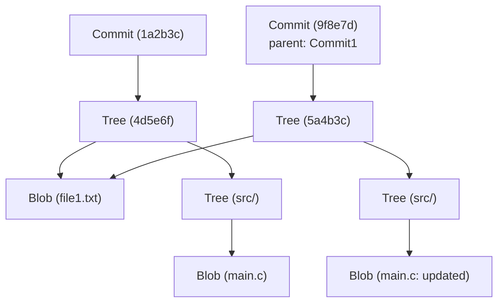

# A Arquitetura Interna do Git: Entendendo o Controle de Versão Distribuído a partir de commits, trees e blobs

Para muitos engenheiros de software, o Git é uma ferramenta indispensável e de uso diário. Comandos como `git add`, `git commit` e `git push` podem ser usados tão naturalmente quanto respirar, mas surpreendentemente poucos compreendem a fundo "quais estruturas de dados operam nos bastidores do Git". Este artigo desvendará a arquitetura interna do Git, focando em sua filosofia fundamental e em suas estruturas de dados centrais: os três objetos `blob`, `tree` e `commit`.

## A Filosofia Básica do Git: O Histórico como Snapshots

Muitos sistemas de controle de versão (como o Subversion) adotavam uma abordagem de registrar as "diferenças" (deltas) dos arquivos. Ou seja, mantinham um histórico de quando um arquivo era criado e de quais alterações eram aplicadas a ele subsequentemente.

Em contraste, a abordagem do Git é fundamentalmente diferente. O Git trata os dados como um "fluxo de snapshots (instantâneos) de um sistema de arquivos miniaturizado". A cada commit, o Git registra o estado de todos os arquivos naquele exato momento, como se tirasse uma fotografia. Se um arquivo não sofreu alterações, o Git não o armazena novamente; em vez disso, armazena apenas um link (ponteiro) para o arquivo idêntico que já havia sido salvo anteriormente. Isso possibilita a criação de branches e a execução de merges de forma extremamente rápida.

Esse conceito de "snapshot" é sustentado pelo modelo de objetos do Git, que explicaremos a seguir.

## Visão Geral do Modelo de Objetos do Git

O núcleo (core) do Git é, na verdade, um simples armazenamento de chave-valor (Key-Value Store). Todos os dados são armazenados no diretório `.git/objects`, utilizando um hash SHA-1 (uma string hexadecimal de 40 caracteres) como chave.

O Git manipula principalmente três tipos principais de objetos de dados:

1. **Blob**: O conteúdo (dados) do arquivo em si.
2. **Tree**: A estrutura de diretórios. Armazena ponteiros para arquivos (Blobs) ou outros diretórios (Trees), juntamente com nomes de arquivos e permissões.
3. **Commit**: Mantém os metadados (autor, data e mensagem), além de um ponteiro para um único objeto Tree que representa o diretório raiz do projeto, e ponteiros para os commits "pais" (parent commits).

Vamos visualizar como eles se relacionam utilizando um diagrama Mermaid.



O diagrama acima ilustra a relação entre dois commits. O `Commit2` tem o `Commit1` como seu pai. Como o `file1.txt` não foi alterado, o mesmo `Blob` é referenciado por ambas as trees. É assim que o Git armazena dados de forma tão eficiente.

## O Objeto Blob: Armazenamento de Conteúdo de Arquivos

Blob significa "Binary Large Object" (Grande Objeto Binário) e é a unidade fundamental na qual o Git salva o conteúdo dos arquivos. O ponto crucial aqui é que **um Blob não possui nome de arquivo**. Os nomes dos arquivos e a estrutura de diretórios são gerenciados pelos objetos Tree, que veremos mais adiante.

A chave de um objeto Blob (o hash SHA-1) é calculada a partir do próprio conteúdo do arquivo e de algumas informações de cabeçalho, como o tamanho. Isso significa que mesmo dois arquivos em diretórios completamente diferentes, se tiverem o conteúdo exatamente igual, serão armazenados internamente pelo Git como um único objeto Blob, economizando espaço em disco.

Na prática, é possível calcular o hash de um Blob a partir de um arquivo utilizando os comandos de baixo nível (comandos Plumbing) do Git:

```bash
$ echo 'Hello Git' > hello.txt
$ git hash-object -w hello.txt
980a0d5f19a64b4b30a87d4206aade58726b60e3
```

O valor do hash gerado por esse comando torna-se o ID para esse conteúdo específico de arquivo. O conteúdo do arquivo será salvo, de forma compactada, no caminho `.git/objects/98/0a0d5...`.

## O Objeto Tree: A Representação da Estrutura de Diretórios

Embora o conteúdo dos arquivos possa ser armazenado com sucesso, não teria sentido se não soubéssemos com qual nome e em qual diretório o arquivo está alocado. O responsável por solucionar isso é o **objeto Tree**.

Os objetos Tree desempenham um papel semelhante aos diretórios do UNIX. Uma única Tree contém múltiplas entradas, e cada entrada engloba as seguintes informações:

- O modo do arquivo (se é um arquivo executável, um arquivo normal, um link simbólico, etc.)
- O tipo de objeto (`blob` ou `tree`)
- O valor do hash do objeto (SHA-1)
- O nome do arquivo ou do diretório

Por exemplo, o conteúdo da tree raiz de um determinado projeto pode ser visualizado assim:

```bash
$ git ls-tree HEAD
100644 blob 980a0d5f19a64b4b30a87d4206aade58726b60e3    hello.txt
040000 tree 8b137891791fe96927ad78e64b0aad7bded08bdc    src
```

Dessa forma, os objetos Tree representam toda a estrutura complexa de diretórios, agrupando Blobs e outras Trees.

## O Objeto Commit: Dando Significado aos Snapshots

Através dos objetos Tree, conseguimos representar toda a estrutura de arquivos de um projeto num dado momento. No entanto, apenas com isso, não temos como saber "quem", "quando" e "por que" criou aquele estado, nem "como era o estado anterior". Para registrar essas conexões históricas, utilizamos o **objeto Commit**.

O objeto Commit contém as seguintes informações:

1. **Hash da Tree**: O hash da tree raiz do projeto apontada por este commit.
2. **Hash do Commit Pai (Parent)**: O hash do commit imediatamente anterior a este (o pai). O primeiro commit do repositório não possui um pai; já commits de merge possuem múltiplos pais.
3. **Autor (Author) e Comitador (Committer)**: Nome, endereço de e-mail e carimbo de data/hora.
4. **Mensagem de Commit**: A razão da alteração e explicações detalhadas.

Vamos inspecionar o conteúdo real de um commit utilizando o comando `git cat-file -p`:

```bash
$ git cat-file -p HEAD
tree 4b825dc642cb6eb9a060e54bf8d69288fbee4904
parent a3c2f1e809b4d5a92c30b2c14078970e28f307f9
author John Doe <john@example.com> 1695628790 +0900
committer John Doe <john@example.com> 1695628790 +0900

Add hello.txt to the project
```

Como podemos observar, um objeto Commit é um mero arquivo de texto plano. O hash SHA-1 é então calculado sobre os dados desse texto em si, e isso é o que nos é familiar como o "hash do commit".

Como o hash do commit é calculado baseando-se não só no conteúdo alterado, mas sim em todas as informações (incluindo o hash do pai, a data de criação e a mensagem), se tentarmos alterar retrospectivamente (falsificar) um commit, seu valor de hash mudará de imediato. É esse mecanismo que assegura a formidável integridade de dados (Integrity) do Git.

## Branches e HEAD: Meros Ponteiros

Ao compreender a arquitetura interna do Git, logo percebemos por que o recurso mais poderoso do Git, as "branches" (ramificações), são tão leves.

Uma branch no Git é simplesmente **um ponteiro (um arquivo de texto) que aponta para um objeto Commit específico**. Se olharmos dentro do arquivo `.git/refs/heads/main`, veremos que ele contém apenas o hash do commit mais recente (uma string de 40 caracteres).

```bash
$ cat .git/refs/heads/main
a3c2f1e809b4d5a92c30b2c14078970e28f307f9
```

A operação de criação de uma nova branch (`git branch feature`) consiste apenas na criação de um novo arquivo, contendo a mesma string de 40 caracteres, em `.git/refs/heads/feature`. Não há nenhuma necessidade de copiar todo o sistema de arquivos; portanto, a operação é concluída instantaneamente.

Além disso, é o `HEAD` quem registra em qual branch estamos trabalhando no momento. O arquivo `.git/HEAD` contém uma referência que indica a branch que está em check-out no instante atual.

```bash
$ cat .git/HEAD
ref: refs/heads/main
```

Quando criamos um novo commit, o Git age da seguinte forma:
1. Cria os novos Blobs (para os arquivos modificados).
2. Cria as novas Trees (para a estrutura de diretórios modificada).
3. Cria um novo Commit (que aponta para a nova Tree e tem o commit atualmente apontado pelo HEAD como seu pai).
4. Reescreve o ponteiro da branch apontada pelo HEAD (neste caso, a `main`) para que aponte para esse novo Commit recém-criado.

Esse processo de atualização, extremamente simples e sem desperdícios, é a fonte da altíssima velocidade do Git.

## O Garbage Collection (Coletor de Lixo) e os Packfiles do Git

Conforme continuamos a utilizar o Git, objetos Blob são gerados a cada nova modificação, o que faz com que o diretório `.git/objects` acabe se tornando gigantesco. Como cada Blob representa um snapshot de um arquivo inteiro, mesmo que modifiquemos apenas uma linha, será criada uma cópia do arquivo todo (embora comprimida) que será armazenada como um novo Blob.

Como essa situação seria ineficiente a longo prazo, o Git implementou um mecanismo engenhoso conhecido como **Packfile**. Periodicamente (ou quando executamos o comando `git gc` manualmente), o Git executa a coleta de lixo (Garbage Collection), reunindo vários objetos soltos (Loose Objects) num único arquivo empacotado, o Packfile (um arquivo `.pack`).

Neste momento, o Git realiza uma otimização formidável. Ele procura Blobs com conteúdos muito semelhantes e armazena um deles na íntegra, enquanto o outro é armazenado apenas como a "diferença" (delta). Com isso, o tamanho do arquivo em disco encolhe drasticamente. Podemos concluir que o modelo de registro de histórico do Git é baseado em "snapshots", mas a otimização por trás dos panos, desenhada para poupar espaço em disco, tira bastante proveito da tecnologia de "diferenças".

## Conclusão

A interface de linha de comando (CLI) do Git pode parecer complexa e, por vezes, pouco intuitiva; contudo, as estruturas de dados operando nos seus bastidores são incrivelmente elegantes e simples.

- **Blob**: O conteúdo do arquivo.
- **Tree**: A estrutura de diretórios e os nomes dos arquivos.
- **Commit**: Os metadados do snapshot e os links que constituem o histórico.
- **Branch/Tag**: Ponteiros muito leves direcionados a um commit.

Combinando esses elementos, concebe-se um sistema de controle de versão distribuído que é simultaneamente robusto e veloz. Entender essa arquitetura interna possibilita visualizar mentalmente o que o Git faz sob os panos quando executamos operações avançadas, como resolução de conflitos, reescrita de histórico (como os rebases) ou até a restauração de commits que se perderam no caminho.

Pode-se dizer que o Git não é apenas uma ferramenta, mas uma verdadeira obra de arte em termos de estruturas de dados. Nas suas tarefas diárias de desenvolvimento, ao usar o Git, reserve um instante para apreciar o trabalho cooperativo e invisível dessas "Trees" e "Blobs".
