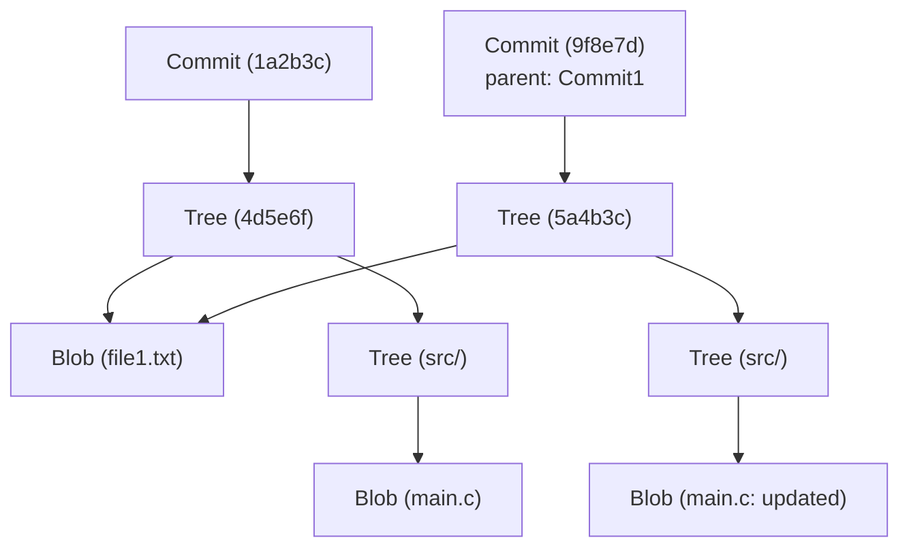

# Внутренняя архитектура Git: понимание распределенного контроля версий через commit, tree и blob

Для многих инженеров-программистов Git — это незаменимый инструмент, используемый ежедневно. Команды вроде `git add`, `git commit` и `git push` могут казаться естественными, как дыхание, но на удивление мало людей глубоко понимают, "какие структуры данных работают внутри Git". В этой статье мы раскроем внутреннюю архитектуру Git, сосредоточив внимание на его фундаментальной философии и трех основных структурах данных: объектах `blob`, `tree` и `commit`.

## Базовая философия Git: история как снимки состояния

Многие системы контроля версий (такие как Subversion) используют подход записи "различий (дельт)" для файлов. То есть они сохраняют историю того, когда файл был создан и какие изменения были внесены в него впоследствии.

Напротив, подход Git принципиально иной. Git рассматривает данные как "серию снимков файловой системы". При каждом коммите Git фиксирует состояние всех файлов в этот момент, как будто делает фотографию. Если файл не изменился, Git не сохраняет его заново, а сохраняет только ссылку (указатель) на ранее сохраненный идентичный файл. Это позволяет создавать ветки и выполнять слияние с невероятной скоростью.

Эта концепция "снимков состояния" поддерживается объектной моделью Git, которую мы сейчас рассмотрим.

## Общий обзор объектной модели Git

Ядро Git — это просто хранилище типа ключ-значение (Key-Value Store). Все данные сохраняются в каталоге `.git/objects`, а ключом служит SHA-1 хэш (40-символьная шестнадцатеричная строка).

Существует три основных типа объектов данных, с которыми в основном работает Git:

1. **Blob (Блоб)**: Само содержимое (данные) файла.
2. **Tree (Дерево)**: Структура каталогов. Хранит указатели на файлы (Blob) или другие каталоги (Tree), а также имена файлов и права доступа.
3. **Commit (Коммит)**: Хранит метаданные (автор, дата, сообщение), указатель на один объект Tree, представляющий корневой каталог проекта, и указатели на родительские коммиты.

Давайте визуализируем, как они взаимодействуют, используя диаграмму Mermaid.



Приведенная выше диаграмма показывает отношения между двумя коммитами. `Commit2` имеет в качестве родителя `Commit1`, и поскольку файл `file1.txt` не изменился, оба дерева ссылаются на один и тот же `Blob`. Именно так Git эффективно хранит данные.

## Объект Blob: хранение содержимого файла

Blob означает "Binary Large Object" и является единицей хранения самого содержимого файла в Git. Важный момент здесь заключается в том, что **у Blob нет имени файла**. Имена файлов и структура каталогов управляются объектом Tree, который мы обсудим позже.

Ключ (SHA-1 хэш) объекта Blob вычисляется на основе самого содержимого файла и информации заголовка, такой как размер. То есть, даже если два файла находятся в совершенно разных каталогах, если их содержимое абсолютно идентично, внутри Git они будут сохранены как один объект Blob, что экономит дисковое пространство.

Вы можете самостоятельно вычислить хэш Blob из файла, используя низкоуровневые команды Git (Plumbing).

```bash
$ echo 'Hello Git' > hello.txt
$ git hash-object -w hello.txt
980a0d5f19a64b4b30a87d4206aade58726b60e3
```

Хэш-значение, выводимое этой командой, является идентификатором содержимого этого файла. Содержимое файла сохраняется в сжатом виде по пути `.git/objects/98/0a0d5...`.

## Объект Tree: представление структуры каталогов

Даже если содержимое файла можно сохранить, это не имеет смысла, если мы не знаем его имени и в каком каталоге он находится. Эту проблему решает **объект Tree**.

Объект Tree выполняет роль каталога UNIX. Одно дерево содержит несколько записей. Каждая запись включает следующую информацию:

- Режим файла (исполняемый файл, обычный файл, символическая ссылка и т.д.)
- Тип объекта (blob или tree)
- Хэш-значение объекта (SHA-1)
- Имя файла или каталога

Например, содержимое корневого дерева проекта может выглядеть так:

```bash
$ git ls-tree HEAD
100644 blob 980a0d5f19a64b4b30a87d4206aade58726b60e3    hello.txt
040000 tree 8b137891791fe96927ad78e64b0aad7bded08bdc    src
```

Таким образом, объект Tree представляет все сложное дерево каталогов, связывая Blob и другие Tree.

## Объект Commit: придание смысла снимку состояния

С помощью объектов Tree мы можем представить файловую структуру всего проекта в определенный момент времени. Однако само по себе это не объясняет связи истории: "кто", "когда" и "почему" создал это состояние, или "каким было предыдущее состояние". Эту информацию записывает **объект Commit**.

Объект Commit содержит следующую информацию:

1. **Хэш Tree**: Хэш корневого дерева проекта, на которое указывает этот коммит.
2. **Хэш родительского Commit**: Хэш коммита (родителя), непосредственно предшествующего этому коммиту. У первого коммита нет родителя. У коммитов слияния (merge) может быть несколько родителей.
3. **Автор (Author) и Коммитер (Committer)**: Имя, адрес электронной почты, временная метка.
4. **Сообщение коммита**: Причина изменения и подробное описание.

Давайте посмотрим на содержимое коммита с помощью команды `git cat-file -p`:

```bash
$ git cat-file -p HEAD
tree 4b825dc642cb6eb9a060e54bf8d69288fbee4904
parent a3c2f1e809b4d5a92c30b2c14078970e28f307f9
author John Doe <john@example.com> 1695628790 +0900
committer John Doe <john@example.com> 1695628790 +0900

Add hello.txt to the project
```

Как видите, объект Commit — это просто текстовые данные. Вычисляется SHA-1 хэш самих этих текстовых данных, который становится знакомым нам "хэшем коммита".

Поскольку хэш коммита вычисляется из всей информации, включая не только изменения, но и хэш родителя, время создания и сообщение, любая попытка подделать содержимое коммита позже изменит значение хэша. Именно этот механизм гарантирует высокую целостность данных (Integrity) в Git.

## Ветки и HEAD: просто указатели

Поняв внутреннюю архитектуру Git, становится сразу ясно, почему "ветки" (branches), самая мощная функция Git, такие легковесные.

Ветка в Git — это просто **указатель (текстовый файл), указывающий на конкретный объект Commit**. Если посмотреть содержимое файла `.git/refs/heads/main`, там просто записан последний хэш коммита (строка из 40 символов).

```bash
$ cat .git/refs/heads/main
a3c2f1e809b4d5a92c30b2c14078970e28f307f9
```

Операция создания новой ветки (`git branch feature`) просто создает новый файл в `.git/refs/heads/feature`, содержащий эту 40-символьную строку. Копировать всю файловую систему не нужно, поэтому это происходит мгновенно.

А `HEAD` — это то, что записывает ветку, над которой вы сейчас работаете. Файл `.git/HEAD` содержит ссылку на текущую извлеченную ветку (checked out branch).

```bash
$ cat .git/HEAD
ref: refs/heads/main
```

При создании коммита Git работает следующим образом:
1. Создает новый Blob (измененные файлы)
2. Создает новый Tree (измененная структура каталогов)
3. Создает новый Commit (указывающий на новый Tree, с родителем, на которого в данный момент указывает HEAD)
4. Обновляет указатель ветки, на которую указывает HEAD (в данном случае `main`), чтобы он указывал на вновь созданный Commit.

Этот чрезвычайно простой и эффективный процесс обновления является источником скорости работы Git.

## Сборка мусора и Packfile в Git

При постоянном использовании Git с каждым изменением генерируются объекты Blob, и каталог `.git/objects` разрастается. Поскольку каждый Blob — это снимок всего файла, даже изменение одной строки сохраняет копию всего файла (хотя и сжатую) как новый Blob.

Поскольку это неэффективно, в Git есть механизм, называемый **Packfile**. Git периодически (или когда команда `git gc` выполняется вручную) выполняет сборку мусора и объединяет множество свободных объектов (Loose Objects) в один Packfile (файл `.pack`).

При этом Git выполняет очень умную оптимизацию. Он находит Blob со схожим содержимым, сохраняет один как полные данные, а другой как "дельту" (разницу). Это резко уменьшает размер файла. Модель сохранения истории — "снимок состояния", но под капотом используется технология "дельт" как оптимизация для экономии дискового пространства.

## Заключение

Хотя интерфейс командной строки (CLI) Git может казаться сложным и иногда неинтуитивным, структуры данных, работающие за кулисами, удивительно просты и элегантны.

- **Blob**: Содержимое файла
- **Tree**: Структура каталогов и имен файлов
- **Commit**: Метаданные снимка и ссылки на историю
- **Branch/Tag**: Легковесные указатели на коммиты

Объединение этих элементов создает надежную и быструю распределенную систему контроля версий. Понимание внутренней архитектуры Git позволит вам четко представлять, что Git делает под капотом при выполнении сложных операций, таких как разрешение конфликтов, изменение истории (например, rebase) или восстановление утерянных коммитов.

Git можно назвать произведением искусства в виде красивых структур данных, а не просто инструментом. В следующий раз, когда будете использовать Git в повседневной разработке, подумайте немного о взаимодействии этих невидимых "деревьев" (Tree) и "блобов" (Blob).
