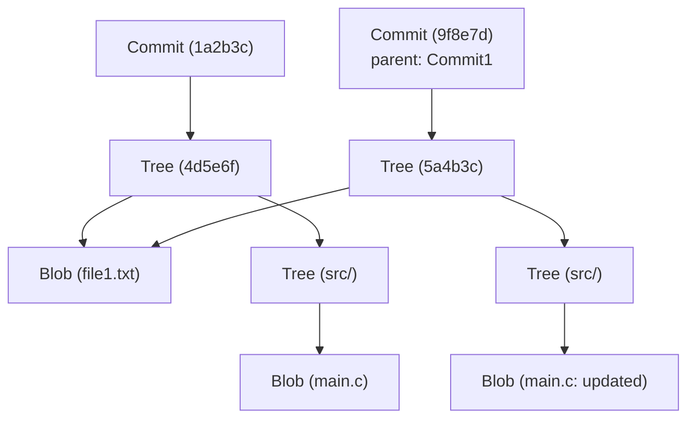

# Git 内部架构：从 commit、tree、blob 理解分布式版本控制

对于许多软件工程师来说，Git 是日常开发中不可或缺的工具。像 `git add`、`git commit`、`git push` 这些命令你可能已经用得如同呼吸般自然，但出人意料的是，很少有人深入理解“Git 内部运行的是什么样的数据结构”。本文将聚焦于 Git 的基本哲学及其核心数据结构——`blob`、`tree` 和 `commit` 这三个对象，为你揭开 Git 内部架构的面纱。

## Git 的基本哲学：作为快照的历史记录

许多版本控制系统（如 Subversion 等）采用的是记录文件“差异（delta）”的方法。也就是说，它们会保存某个文件被创建后，后续每次修改了什么内容的历史记录。

相比之下，Git 的方法有着根本的不同。Git 将数据视为“一系列文件系统快照”。每次提交时，Git 都会像拍照一样记录下那一瞬间所有文件的状态。如果文件没有发生变化，Git 不会再次保存该文件，而是仅仅保存一个指向之前已保存的相同文件的链接（指针）。这使得极其快速的分支创建和合并处理成为可能。

支撑这个“快照”概念的，正是接下来要解说的 Git 对象模型。

## Git 对象模型全貌

Git 的核心（Core）只是一个简单的键值存储（Key-Value Store）。所有数据都以 SHA-1 哈希值（40 个字符的十六进制字符串）作为键，保存在 `.git/objects` 目录下。

Git 主要处理的数据对象有以下三种主要类型：

1. **Blob**：文件内容（数据）本身。
2. **Tree（树）**：目录结构。保存指向文件（Blob）或其他目录（Tree）的指针，以及文件名和权限信息。
3. **Commit（提交）**：保存元数据（作者、日期、提交信息），一个指向代表项目根目录的 Tree 对象的指针，以及指向父提交的指针。

让我们使用 Mermaid 图表来可视化它们是如何协同工作的。



上面的图表展示了两个提交之间的关系。`Commit2` 以 `Commit1` 为父节点，因为 `file1.txt` 没有被修改，所以两个 Tree 都引用了同一个 `Blob`。这就是 Git 高效保存数据的机制。

## Blob 对象：文件内容的保存

Blob 是“Binary Large Object”的缩写，在 Git 中是保存文件内容本身的单位。这里的重点是，**Blob 不包含文件名**。文件名和目录结构由后文将提到的 Tree 对象来管理。

Blob 对象的键（SHA-1 哈希值）是根据文件内容本身以及大小等头部信息计算出来的。也就是说，即使是位于完全不同目录下的两个文件，只要内容完全相同，在 Git 内部就会被保存为一个 Blob 对象，从而节省磁盘空间。

实际上，我们可以使用 Git 的底层命令（Plumbing 命令）来计算文件的 Blob 哈希值。

```bash
$ echo 'Hello Git' > hello.txt
$ git hash-object -w hello.txt
980a0d5f19a64b4b30a87d4206aade58726b60e3
```

这个命令输出的哈希值就是这个文件内容的 ID。文件内容会被压缩并保存到 `.git/objects/98/0a0d5...` 这个路径下。

## Tree 对象：目录结构的表现

即使保存了文件内容，如果不知道它对应的文件名以及存放在哪个目录下，也没有任何意义。解决这个问题的是 **Tree 对象**。

Tree 对象扮演着类似 UNIX 目录的角色。一个 Tree 包含多个条目（entry）。每个条目包含以下信息：

- 文件模式（如可执行文件、普通文件、符号链接等）
- 对象类型（blob 或 tree）
- 对象的哈希值（SHA-1）
- 文件名或目录名

例如，某个项目根目录的 Tree 的内容可能如下所示：

```bash
$ git ls-tree HEAD
100644 blob 980a0d5f19a64b4b30a87d4206aade58726b60e3    hello.txt
040000 tree 8b137891791fe96927ad78e64b0aad7bded08bdc    src
```

就这样，Tree 对象通过将 Blob 和其他 Tree 捆绑在一起，来表现整个复杂的目录树。

## Commit 对象：赋予快照意义

通过 Tree 对象，我们能够表现某个时间点整个项目的文件结构。但是，仅凭这些我们无法知道历史的脉络：“谁”在“何时”“为什么”创建了这个状态，或者“之前的状态是怎样的”。记录这些信息的是 **Commit 对象**。

Commit 对象包含以下信息：

1. **Tree 哈希**：该提交所指向的项目根 Tree 的哈希。
2. **父 Commit 哈希**：该提交的前一个提交（父）的哈希。如果是第一次提交，则不存在父节点。合并（merge）提交会有多个父节点。
3. **作者（Author）和提交者（Committer）**：名字、邮箱地址、时间戳。
4. **提交信息**：修改的原因或详细说明。

让我们使用 `git cat-file -p` 命令实际查看一下某个提交的内容。

```bash
$ git cat-file -p HEAD
tree 4b825dc642cb6eb9a060e54bf8d69288fbee4904
parent a3c2f1e809b4d5a92c30b2c14078970e28f307f9
author John Doe <john@example.com> 1695628790 +0900
committer John Doe <john@example.com> 1695628790 +0900

Add hello.txt to the project
```

如上所示，Commit 对象其实只是纯文本数据。这个文本数据本身的 SHA-1 哈希值被计算出来，就成了我们所熟悉的“提交哈希（commit hash）”。

因为提交哈希不仅仅由修改内容计算得出，还包含了父哈希、创建时间、提交信息等所有信息，所以一旦尝试在事后篡改提交内容，哈希值就会改变。这是保证 Git 强大的数据完整性（Integrity）的机制。

## 分支与 HEAD：仅仅是指针

一旦理解了 Git 的内部架构，就能立刻明白 Git 最强大的功能——“分支（Branch）”为何如此轻量级。

在 Git 中，分支只不过是**一个指向特定 Commit 对象的指针（文本文件）**而已。查看 `.git/refs/heads/main` 这个文件的内容，你会发现里面仅仅写着最新提交的哈希值（40 个字符的字符串）。

```bash
$ cat .git/refs/heads/main
a3c2f1e809b4d5a92c30b2c14078970e28f307f9
```

创建新分支（`git branch feature`）的操作，仅仅是在 `.git/refs/heads/feature` 创建一个包含这 40 个字符字符串的新文件而已。根本不需要复制整个文件系统，因此一瞬间就能完成。

而记录当前正在工作的分支的，就是 `HEAD`。`.git/HEAD` 文件中记录了指向当前检出（checkout）分支的引用。

```bash
$ cat .git/HEAD
ref: refs/heads/main
```

当你创建一个提交时，Git 会执行以下操作：
1. 创建新的 Blob（针对修改过的文件）
2. 创建新的 Tree（针对改变的目录结构）
3. 创建新的 Commit（指向新的 Tree，并将当前 HEAD 所指向的提交作为父节点）
4. 将 HEAD 所指向的分支（这里是 `main`）的指针，重写为新创建的 Commit

这个极其简单且没有冗余的更新过程，正是 Git 运行速度的源泉。

## Git 的垃圾回收与 Packfile

随着持续使用 Git，每次修改都会生成 Blob 对象，`.git/objects` 目录会不断膨胀。由于每个 Blob 都是整个文件的快照，即使只修改了一行，整个文件（虽然经过了压缩）的拷贝也会作为新的 Blob 保存下来。

这显然不够高效，因此 Git 准备了名为 **Packfile** 的机制。Git 会定期（或在手动执行 `git gc` 命令时）进行垃圾回收，将多个松散对象（Loose Objects）打包到一个 Packfile（`.pack` 文件）中。

此时，Git 会进行非常聪明的优化。它会找出内容相似的 Blob，将其中一个作为完整数据保存，而将另一个作为“差异（delta）”保存。这使得文件大小急剧缩小。也就是说，历史记录的保存模型是“快照”，但作为节省磁盘空间的幕后优化，Git 利用了“差异”技术。

## 总结

虽然 Git 的命令行界面（CLI）很复杂，有时也会让人觉得不够直观，但其背后运行的数据结构却令人惊讶地简单和优雅。

- **Blob**：文件内容
- **Tree**：目录和文件名的结构
- **Commit**：快照的元数据和历史链接
- **Branch/Tag**：指向提交的轻量级指针

这些要素组合在一起，实现了一个健壮且高速的分布式版本控制系统。通过理解 Git 的内部架构，在进行解决冲突、修改历史（如 rebase）、恢复丢失的提交等高级操作时，你就能在脑海中清晰地勾勒出 Git 内部到底在做些什么。

可以说，Git 不仅仅是一个工具，更是一件美丽的、基于数据结构的艺术品。在日常开发中使用 Git 时，不妨稍微想一想这些看不见的“Tree”和“Blob”是如何协同工作的。
