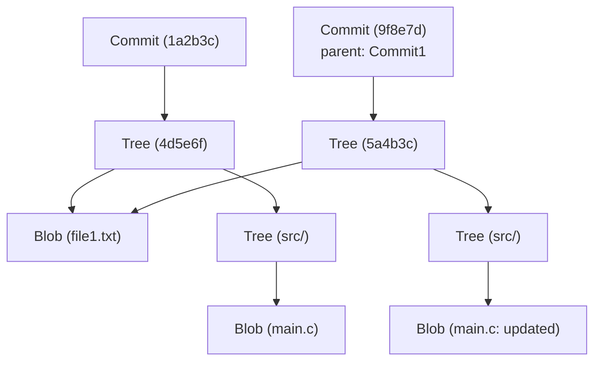

# Git 內部架構：從 commit、tree、blob 理解分散式版本控制

對於許多軟體工程師來說，Git 是日常開發中不可或缺的工具。像 `git add`、`git commit`、`git push` 這些指令你可能已經用得如同呼吸般自然，但出乎意料的是，很少有人深入理解「Git 內部運作的是什麼樣的資料結構」。本文將聚焦於 Git 的基本哲學及其核心資料結構——`blob`、`tree` 和 `commit` 這三個物件，為你揭開 Git 內部架構的面紗。

## Git 的基本哲學：作為快照的歷史紀錄

許多版本控制系統（如 Subversion 等）採用的是記錄檔案「差異（delta）」的方法。也就是說，它們會保存某個檔案被建立後，後續每次修改了什麼內容的歷史紀錄。

相比之下，Git 的方法有著根本的不同。Git 將資料視為「一系列檔案系統快照」。每次提交時，Git 都會像拍照一樣記錄下那一瞬間所有檔案的狀態。如果檔案沒有發生變化，Git 不會再次儲存該檔案，而是僅僅儲存一個指向之前已儲存的相同檔案的連結（指標）。這使得極其快速的分支建立和合併處理成為可能。

支撐這個「快照」概念的，正是接下來要解說的 Git 物件模型。

## Git 物件模型全貌

Git 的核心（Core）只是一個簡單的鍵值儲存（Key-Value Store）。所有資料都以 SHA-1 雜湊值（40 個字元的十六進位字串）作為鍵，保存在 `.git/objects` 目錄下。

Git 主要處理的資料物件有以下三種主要類型：

1. **Blob**：檔案內容（資料）本身。
2. **Tree（樹）**：目錄結構。保存指向檔案（Blob）或其他目錄（Tree）的指標，以及檔案名稱和權限資訊。
3. **Commit（提交）**：保存元資料（作者、日期、提交訊息），一個指向代表專案根目錄的 Tree 物件的指標，以及指向父提交的指標。

讓我們使用 Mermaid 圖表來視覺化它們是如何協同運作的。



上面的圖表展示了兩個提交之間的關係。`Commit2` 以 `Commit1` 為父節點，因為 `file1.txt` 沒有被修改，所以兩個 Tree 都引用了同一個 `Blob`。這就是 Git 高效儲存資料的機制。

## Blob 物件：檔案內容的儲存

Blob 是「Binary Large Object」的縮寫，在 Git 中是儲存檔案內容本身的單位。這裡的重點是，**Blob 不包含檔案名稱**。檔案名稱和目錄結構由後文將提到的 Tree 物件來管理。

Blob 物件的鍵（SHA-1 雜湊值）是根據檔案內容本身以及大小等標頭資訊計算出來的。也就是說，即使是位於完全不同目錄下的兩個檔案，只要內容完全相同，在 Git 內部就會被儲存為一個 Blob 物件，從而節省磁碟空間。

實際上，我們可以使用 Git 的底層指令（Plumbing 指令）來計算檔案的 Blob 雜湊值。

```bash
$ echo 'Hello Git' > hello.txt
$ git hash-object -w hello.txt
980a0d5f19a64b4b30a87d4206aade58726b60e3
```

這個指令輸出的雜湊值就是這個檔案內容的 ID。檔案內容會被壓縮並儲存到 `.git/objects/98/0a0d5...` 這個路徑下。

## Tree 物件：目錄結構的表現

即使儲存了檔案內容，如果不知道它對應的檔案名稱以及存放在哪個目錄下，也沒有任何意義。解決這個問題的是 **Tree 物件**。

Tree 物件扮演著類似 UNIX 目錄的角色。一個 Tree 包含多個項目（entry）。每個項目包含以下資訊：

- 檔案模式（如可執行檔、一般檔案、符號連結等）
- 物件類型（blob 或 tree）
- 物件的雜湊值（SHA-1）
- 檔案名稱或目錄名稱

例如，某個專案根目錄的 Tree 的內容可能如下所示：

```bash
$ git ls-tree HEAD
100644 blob 980a0d5f19a64b4b30a87d4206aade58726b60e3    hello.txt
040000 tree 8b137891791fe96927ad78e64b0aad7bded08bdc    src
```

就這樣，Tree 物件透過將 Blob 和其他 Tree 捆綁在一起，來表現整個複雜的目錄樹。

## Commit 物件：賦予快照意義

透過 Tree 物件，我們能夠表現某個時間點整個專案的檔案結構。但是，僅憑這些我們無法知道歷史的脈絡：「誰」在「何時」「為什麼」建立了這個狀態，或者「之前的狀態是怎樣的」。記錄這些資訊的是 **Commit 物件**。

Commit 物件包含以下資訊：

1. **Tree 雜湊**：該提交所指向的專案根 Tree 的雜湊。
2. **父 Commit 雜湊**：該提交的前一個提交（父）的雜湊。如果是第一次提交，則不存在父節點。合併（merge）提交會有多個父節點。
3. **作者（Author）和提交者（Committer）**：名字、電子信箱、時間戳記。
4. **提交訊息**：修改的原因或詳細說明。

讓我們使用 `git cat-file -p` 指令實際查看一下某個提交的內容。

```bash
$ git cat-file -p HEAD
tree 4b825dc642cb6eb9a060e54bf8d69288fbee4904
parent a3c2f1e809b4d5a92c30b2c14078970e28f307f9
author John Doe <john@example.com> 1695628790 +0900
committer John Doe <john@example.com> 1695628790 +0900

Add hello.txt to the project
```

如上所示，Commit 物件其實只是純文字資料。這個文字資料本身的 SHA-1 雜湊值被計算出來，就成了我們所熟悉的「提交雜湊（commit hash）」。

因為提交雜湊不僅僅由修改內容計算得出，還包含了父雜湊、建立時間、提交訊息等所有資訊，所以一旦嘗試在事後篡改提交內容，雜湊值就會改變。這是保證 Git 強大的資料完整性（Integrity）的機制。

## 分支與 HEAD：僅僅是指標

一旦理解了 Git 的內部架構，就能立刻明白 Git 最強大的功能——「分支（Branch）」為何如此輕量級。

在 Git 中，分支只不過是**一個指向特定 Commit 物件的指標（文字檔）**而已。查看 `.git/refs/heads/main` 這個檔案的內容，你會發現裡面僅僅寫著最新提交的雜湊值（40 個字元的字串）。

```bash
$ cat .git/refs/heads/main
a3c2f1e809b4d5a92c30b2c14078970e28f307f9
```

建立新分支（`git branch feature`）的操作，僅僅是在 `.git/refs/heads/feature` 建立一個包含這 40 個字元字串的新檔案而已。根本不需要複製整個檔案系統，因此一瞬間就能完成。

而記錄當前正在工作的分支的，就是 `HEAD`。`.git/HEAD` 檔案中記錄了指向當前檢出（checkout）分支的參照。

```bash
$ cat .git/HEAD
ref: refs/heads/main
```

當你建立一個提交時，Git 會執行以下操作：
1. 建立新的 Blob（針對修改過的檔案）
2. 建立新的 Tree（針對改變的目錄結構）
3. 建立新的 Commit（指向新的 Tree，並將當前 HEAD 所指向的提交作為父節點）
4. 將 HEAD 所指向的分支（這裡是 `main`）的指標，重寫為新建立的 Commit

這個極其簡單且沒有冗餘的更新過程，正是 Git 運行速度的源泉。

## Git 的垃圾回收與 Packfile

隨著持續使用 Git，每次修改都會生成 Blob 物件，`.git/objects` 目錄會不斷膨脹。由於每個 Blob 都是整個檔案的快照，即使只修改了一行，整個檔案（雖然經過了壓縮）的拷貝也會作為新的 Blob 儲存下來。

這顯然不夠高效，因此 Git 準備了名為 **Packfile** 的機制。Git 會定期（或在手動執行 `git gc` 指令時）進行垃圾回收，將多個鬆散物件（Loose Objects）打包到一個 Packfile（`.pack` 檔案）中。

此時，Git 會進行非常聰明的最佳化。它會找出內容相似的 Blob，將其中一個作為完整資料儲存，而將另一個作為「差異（delta）」儲存。這使得檔案大小急劇縮小。也就是說，歷史紀錄的保存模型是「快照」，但作為節省磁碟空間的幕後最佳化，Git 利用了「差異」技術。

## 總結

雖然 Git 的命令列介面（CLI）很複雜，有時也會讓人覺得不夠直觀，但其背後運行的資料結構卻令人驚訝地簡單和優雅。

- **Blob**：檔案內容
- **Tree**：目錄和檔案名稱的結構
- **Commit**：快照的元資料和歷史連結
- **Branch/Tag**：指向提交的輕量級指標

這些要素組合在一起，實現了一個健壯且高速的分散式版本控制系統。透過理解 Git 的內部架構，在進行解決衝突、修改歷史（如 rebase）、恢復遺失的提交等進階操作時，你就能在腦海中清晰地勾勒出 Git 內部到底在做些什麼。

可以說，Git 不僅僅是一個工具，更是一件美麗的、基於資料結構的藝術品。在日常開發中使用 Git 時，不妨稍微想一想這些看不見的「Tree」和「Blob」是如何協同運作的。
