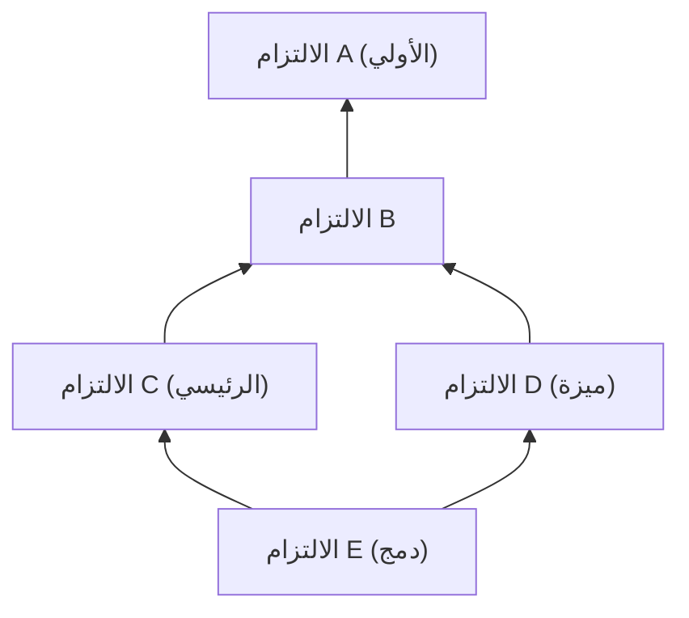
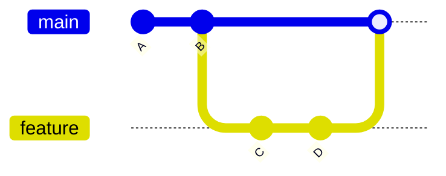
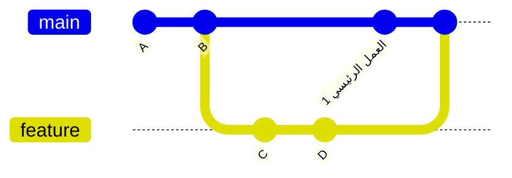
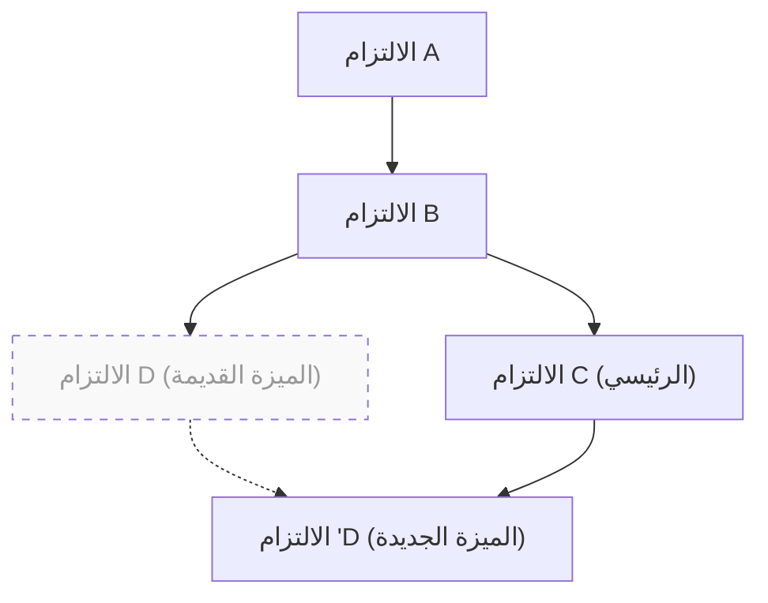

# 1. مقدمة: لماذا يمثل الاختيار بين "merge و rebase" تحدياً مستمراً؟

Git هو نظام تحكم في الإصدارات لا غنى عنه في تطوير البرمجيات الحديثة. عندما يقوم العديد من المطورين بتعديل قاعدة الكود في وقت واحد، فإن نموذج الفروع القوي في Git يظهر فاعليته. ومع ذلك، في تطوير الفرق، يمثل النقاش حول "أيهما يجب استخدامه: `merge` أو `rebase`" موضوعاً يؤرق دائماً المطورين، من المبتدئين إلى الخبراء.

في هذا المقال، سنتعمق في الفروق بين آليات `git merge` و `git rebase`، من خلال استكشاف البنية الداخلية لـ Git، مثل الرسم البياني الموجه غير الدوري (DAG) والخصائص الرياضية لتجزئة الالتزام (Commit Hash). وبعد ذلك، سنشرح بالتفصيل كيفية التمييز بينهما في العمل الفعلي، مع تقديم أمثلة على سير العمل (Workflows). بدلاً من مجرد سرد الأوامر، فإن فهم العمليات الحسابية التي يقوم بها Git في الخلفية سيزيل الخوف من التعارضات (Conflicts)، مما يتيح لك بناء سجل تاريخي نظيف وقابل للتتبع.

---

# 2. البنية الداخلية لـ Git: تجزئة الالتزام ونموذج الكائنات

لفهم كيف يقوم Git بدمج السجل التاريخي، يجب أن نعرف أولاً كيف يخزن Git البيانات. لا يقوم Git فقط بحفظ اختلافات (Patches) تغييرات الملفات، بل يحتفظ بلقطة (Snapshot) لنظام الملفات بأكمله في نقطة زمنية معينة.

## 2.1 الخصائص التشفيرية لتجزئة الالتزام (Commit Hash)

يتم تعريف كل التزام (Commit) في Git بشكل فريد بواسطة سلسلة من 40 حرفاً سداسياً عشرياً (Hexadecimal)، يتم حسابها بناءً على محتواه باستخدام دالة التجزئة SHA-1 (Secure Hash Algorithm 1). يتكون كائن الالتزام من العناصر التالية:

1. **مؤشر لكائن Tree**: لقطة من هيكل الدليل والملفات (Blob) في تلك النقطة.
2. **مؤشر للالتزام الأب (Parent Commit)**: قيمة تجزئة واحدة أو أكثر للالتزامات الآباء (الالتزام الأول لا يحتوي على أب، والتزام الدمج يحتوي على أبوين أو أكثر).
3. **معلومات المؤلف (Author)**: الشخص الذي كتب الكود والوقت.
4. **معلومات الملتزم (Committer)**: الشخص الذي أنشأ أو طبق الالتزام والوقت.
5. **رسالة الالتزام (Commit Message)**: نص يوضح القصد من التغيير.

رياضياً، تُعرّف قيمة التجزئة $H(C)$ لكائن الالتزام $C$ على النحو التالي:

$$
H(C) = \text{SHA-1}( \text{tree} \parallel \text{parent} \parallel \text{author} \parallel \text{committer} \parallel \text{message} )
$$

هنا، تمثل $\parallel$ دمج (Concatenation) البيانات. نظراً لخصائص دالة التجزئة، فإن تغيير حرف واحد فقط في رسالة الالتزام، أو حتى وجود التزام أب مختلف، سيؤدي إلى إنشاء قيمة تجزئة مختلفة تماماً. وهذا يعني أن **الالتزام غير قابل للتغيير (Immutable)**. عندما يقال إن `rebase` "يعيد كتابة السجل التاريخي"، فهذا يعني فعلياً أنه "ينشئ التزامات جديدة بمحتوى مشابه ولكن بقيم تجزئة مختلفة".

حجم مساحة التجزئة هو $2^{160}$، ويمكن تقريب احتمال $P$ لحدوث تصادم (Collision) (أي أن يكون لالتزامين مختلفين نفس قيمة التجزئة) باستخدام نظرية مفارقة عيد الميلاد (Birthday Paradox) على النحو التالي (حيث $n$ هو عدد الالتزامات):

$$
P(\text{collision}) \approx 1 - \exp\left(-\frac{n^2}{2 \times 2^{160}}\right)
$$

هذا الاحتمال منخفض للغاية، وعملياً من شبه المستحيل أن تتصادم تجزئة التزامات Git.

---

# 3. نظرية الرسومات البيانية و DAG: النموذج الرياضي لسجل Git

يُنمذج السجل التاريخي لالتزامات Git على أنه "رسم بياني موجه غير دوري" (Directed Acyclic Graph, DAG) في نظرية الرسومات البيانية.

## 3.1 ما هو DAG (الرسم البياني الموجه غير الدوري)؟

في الرسم البياني $G = (V, E)$، تمثل $V$ مجموعة الالتزامات (العُقد - Vertices)، وتمثل $E$ مجموعة الحواف الموجهة (Directed Edges) التي تشير إلى علاقات الآباء والأبناء بين الالتزامات. في Git، يتجه اتجاه الحافة من "الالتزام الابن إلى الالتزام الأب". هذا لأن الالتزام الجديد يحتفظ بمؤشر إلى الالتزام السابق.



أهم ميزة لـ DAG هي "عدم وجود دورات (Cycles)". بفضل هذا، فإن الخوارزمية التي تتتبع السجل التاريخي للوراء لا تقع في حلقة مفرغة، وتصل بالتأكيد إلى النهاية (الالتزام الأولي).

## 3.2 الفرز الطوبولوجي وترتيب السجل

عند عرض السجل التاريخي باستخدام أوامر مثل `git log`، يتم ترتيب DAG كقائمة أحادية البعد بواسطة خوارزمية الفرز الطوبولوجي (Topological Sort). لأي حافة موجهة $u \to v$ في DAG (حيث $u$ هو ابن $v$)، يتم ترتيبها بحيث يظهر $u$ قبل $v$ في القائمة.

---

# 4. آليات git merge وأنواعها

الأمر الأساسي لدمج التغييرات من الفروع هو `git merge`. ومع ذلك، بناءً على الحالة الحالية، يختار Git تلقائياً استراتيجية دمج مختلفة.

## 4.1 دمج التقديم السريع (Fast-Forward) (--ff)

إذا كان الفرع الوجهة (مثال: `main`) هو السلف المباشر للفرع المصدر (مثال: `feature`)، يقوم Git بتنفيذ دمج "التقديم السريع (Fast-Forward)". هذه العملية لا تُنشئ التزاماً جديداً، بل مجرد تحريك مؤشر الفرع للأمام.



يحافظ دمج Fast-Forward على السجل التاريخي في خط مستقيم، ولكن من عيوبه فقدان السياق حول "أي مجموعة من الالتزامات تمثل تطوير ميزة (feature) واحدة".

## 4.2 الدمج بدون التقديم السريع (Non-Fast-Forward) (--no-ff)

عند تحديد `git merge --no-ff` صراحةً، حتى وإن كان الموقف يسمح بـ Fast-Forward، يتم دائماً إنشاء "التزام دمج (Merge Commit)" جديد. التزام الدمج هو التزام خاص يمتلك أبوين.



ميزة هذه الطريقة هي أن وجود وتاريخ فرع الميزة يبقى بوضوح على DAG. عند حدوث مشكلة، يمكن التراجع بأمان عن الميزة بأكملها دفعة واحدة عن طريق تنفيذ `git revert -m 1 <تجزئة التزام الدمج>`.

## 4.3 خوارزمية الدمج ثلاثي الاتجاهات (3-Way Merge)

إذا كان لدى كل من الفرع الوجهة والفرع المصدر التزامات خاصة بهما، ينفذ Git دمجاً ثلاثي الاتجاهات. في هذه الحالة، يبحث Git في DAG للعثور على "أدنى سلف مشترك (Lowest Common Ancestor, LCA)" للفرعين.

التعقيد الزمني $T_{\text{LCA}}$ لخوارزمية العثور على LCA يمكن تنفيذه في وقت خطي بالنسبة لعدد العُقد $|V|$ وعدد الحواف $|E|$:

$$
T_{\text{LCA}} = \mathcal{O}(|V| + |E|)
$$

يقارن Git بين ثلاثة أشياء: "حالة LCA"، "حالة الفرع الحالي"، و"حالة الفرع الآخر"، وإذا لم تتعارض التغييرات، يقوم تلقائياً بإنشاء التزام دمج.

---

# 5. آلية git rebase وإعادة بناء السجل التاريخي

بينما يقوم `git merge` بـ "دمج" السجل، يقوم `git rebase` بـ "إعادة بناء (إعادة ربط)" السجل.

## 5.1 ما يحدث خلف كواليس Rebase

عندما تقوم بإعادة ربط (Rebase) فرع `feature` بفرع `main` (باستخدام `git rebase main`)، تكون العمليات الداخلية كما يلي:

1. إيجاد السلف المشترك (LCA) لفرعي `feature` و `main`.
2. حفظ الفروقات (Diffs) من LCA إلى طرف فرع `feature` في منطقة مؤقتة.
3. نقل مؤشر فرع `feature` إلى طرف فرع `main`.
4. تطبيق الفروقات المحفوظة تباعاً واحداً تلو الآخر (Cherry-Pick) فوق الأساس الجديد (طرف `main`)، وإنشاء التزامات جديدة.



النقطة المهمة هنا هي أن الالتزام $'D$ الناتج عن إعادة الربط **له تجزئة مختلفة تماماً** عن الالتزام الأصلي $D$، لأنه يمتلك التزاماً أباً مختلفاً (راجع تعريف دالة التجزئة $H(C)$ المذكور سابقاً).

## 5.2 إعادة الربط التفاعلية (Interactive Rebase)

يتيح لك استخدام `git rebase -i` (أو `--interactive`) التلاعب بالسجل التاريخي للالتزامات كما تشاء. إنها الأداة الأقوى لترتيب السجل المحلي.

- `pick`: احتفاظ بالالتزام كما هو.
- `reword`: تعديل رسالة الالتزام فقط.
- `edit`: الإيقاف المؤقت لتعديل محتوى الالتزام.
- `squash`: دمج هذا الالتزام مع الالتزام السابق ودمج الرسائل معاً.
- `fixup`: مثل `squash` ولكن مع تجاهل رسالة هذا الالتزام.
- `drop`: حذف الالتزام تماماً.

من الناحية الرياضية، إذا كان هناك $N$ من الالتزامات في فرع ما، فإن المتغيرات (التباديل) الممكنة $P$ للسجل الخطي التي يمكن إنشاؤها عن طريق تغيير ترتيب إعادة الربط هي كما يلي:

$$
P = N!
$$

يمنح Git المطورين حرية اختيار من بين $N!$ طريقة، مما يتيح إبقاء السجل التاريخي منطقياً وجميلاً.

---

# 6. القاعدة الذهبية لإعادة الربط (The Golden Rule of Rebase)

بالرغم من قوة `rebase` الهائلة، إلا أن هناك قاعدة واحدة مطلقة.

> **"يجب ألا تقوم أبداً بإعادة ربط (Rebase) السجل التاريخي العام (Public History)."**
> *(Never rebase public history)*

## 6.1 لماذا لا يجب إعادة ربط السجل العام؟

Git هو نظام لا مركزي. التزاماتك التي تم دفعها إلى `origin/main` تم استنساخها (Cloned) بالفعل في المستودعات المحلية للمطورين الآخرين. ماذا يحدث إذا قمت بإعادة ربط التزامات تم دفعها بالفعل، وأعدت كتابة السجل التاريخي، ثم قمت بالكتابة فوقه بالقوة باستخدام `git push --force`؟

سوف يتفرع DAG الموجود في أجهزة المطورين الآخرين بشكل جذري عن DAG الموجود في المستودع البعيد (Remote). عندما يقوم المطورون الآخرون بتشغيل `git pull`، سيحاول Git دمج مجموعات من الالتزامات ذات تواريخ مختلفة بالقوة، مما يؤدي إلى حدوث عدد هائل من التعارضات والتزامات مكررة (التزامات لها نفس التغييرات ولكن بقيم تجزئة مختلفة)، وستسود الفوضى في المستودع.

القاعدة الذهبية هي إجراء إعادة الربط (Rebase) **"فقط على الفروع المحلية التي لم تشاركها بعد مع أي شخص"**.

---

# 7. حل التعارضات (Conflicts) و git rebase --continue

عندما يقوم عدة أشخاص بتعديل نفس الجزء من نفس الملف، يحدث تعارض (Conflict). تختلف عملية حل التعارضات بين `merge` و `rebase`.

## 7.1 حل التعارضات في Merge

في حالة `git merge`، يحدث حل التعارضات **مرة واحدة فقط**. قبل إنشاء التزام الدمج النهائي مباشرة، تقوم بتصحيح جميع أجزاء التعارض دفعة واحدة.

## 7.2 حل التعارضات في Rebase

في حالة `git rebase`، نظراً لطبيعته في إعادة تطبيق الالتزامات واحداً تلو الآخر، **من الممكن حدوث تعارض في كل التزام**.

عندما يحدث تعارض أثناء إعادة الربط، يقوم Git بإيقاف العملية مؤقتاً. تسلسل الحل هو كما يلي:

1. افتح محرر نصوص أو بيئة تطوير متكاملة (IDE مثل VS Code)، وقم بتصحيح علامات التعارض (`<<<<<<<` و `======` و `>>>>>>>`) يدوياً.
2. أضف الملفات المصححة إلى الفهرس (Index):
   ```bash
   git add <الملف المعدل>
   ```
3. لا تقم بإنشاء التزام، بل استأنف عملية إعادة الربط:
   ```bash
   git rebase --continue
   ```

إذا كنت ترغب في إلغاء عملية إعادة الربط نفسها والعودة إلى الحالة الأصلية، فقم بتنفيذ الأمر التالي:
```bash
git rebase --abort
```
(※ إذا لم تكن هناك حاجة لحل التعارض وأردت تخطي هذا الالتزام بالكامل، استخدم `git rebase --skip`)

---

# 8. الاستخدام الصحيح في العمل الفعلي (تطبيق سير العمل)

إذن، كيف يجب أن نميز بين استخدام `merge` و `rebase` في بيئة التطوير الفعلية؟ إليك النهج الأكثر قياسية وأماناً.

## 8.1 [السيناريو 1] ترتيب سجل العمل المحلي (استخدام Rebase)

لنفترض أنك تعمل على فرع ميزة (feature)، وتراكمت لديك الكثير من الالتزامات الصغيرة (مثل "تصحيح خطأ مطبعي" أو "حفظ مؤقت"). قبل فتح طلب سحب (Pull Request - PR)، استخدم إعادة الربط التفاعلية لترتيب هذه الالتزامات في وحدات ذات معنى.

```bash
# نفذ هذا أثناء تواجدك في فرع feature
git rebase -i HEAD~5
# (سيتم فتح المحرر، استخدم squash و fixup لتنظيف السجل)
```

بذلك، يمكنك إنشاء سجل التزامات جميل ومفهوم يسهل على المراجعين (Reviewers) فهم نواياك.

## 8.2 [السيناريو 2] مواكبة أحدث فرع main (استخدام Rebase)

إذا طالت فترة التطوير، واستمر دمج تغييرات الآخرين في فرع `main`، فإن فرع `feature` الخاص بك سيصبح قديماً. في هذه الحالة، قم بإعادة ربط فرع `feature` بأحدث `main` لمواكبته.

```bash
# الحصول على أحدث المعلومات لـ main
git fetch origin

# نقل فرع feature فوق أحدث main
git rebase origin/main
```

هذا يجعل السجل التاريخي مستقيماً، مما يمنع التعارضات عند الدمج لاحقاً. كما يمنع إنشاء التزامات دمج غير ضرورية ("Merge branch 'main' into feature").

## 8.3 [السيناريو 3] دمج ميزة مكتملة (استخدام Merge)

اكتمل التطوير في فرع `feature`، وحان وقت دمجها في فرع `main`. هنا نستخدم **`git merge --no-ff`** (وهذا يعادل اختيار "Create a merge commit" في Pull Request على منصات مثل GitHub).

```bash
git checkout main
git merge --no-ff feature -m "دمج ميزة: تنفيذ ميزة تسجيل دخول المستخدم"
git push origin main
```

هذا يترك نقطة التقاء تاريخية (التزام دمج) على DAG لفرع `main` تفيد بأنه "هنا تم دمج ميزة واحدة". عند مراجعة السجل لاحقاً، سيكون من الأسهل تتبع الكود حسب الميزة (Feature).

---

# 9. الخلاصة (ملخص)

في استخدام Git، إن الأساليب المتطرفة مثل "إنجاز كل شيء باستخدام Merge" أو "جعل كل شيء مستقيماً باستخدام Rebase" لها مزاياها وعيوبها.

أفضل ممارسة في العمل الفعلي هي النهج الهجين (Hybrid): **"ترتيب السجل الخاص المحلي بشكل جميل باستخدام rebase، والاحتفاظ بسياق السجل العام المتكامل باستخدام merge --no-ff"**.

- **محلياً (مساحة العمل الشخصية)**: استخدم `rebase` لإزالة الالتزامات غير الضرورية، ومواكبة أحدث خط رئيسي، والحفاظ على سجل خطي.
- **عالمياً (مساحة العمل المشتركة)**: استخدم `merge --no-ff` لتسجيل وجود فرع الميزة كالتزام دمج على DAG، مما يسهل عمليات التراجع (Revert) والتتبع.

من خلال فهم الخلفية المعمارية والرياضية مثل هيكل DAG وآليات دوال التجزئة، ترتقي أوامر Git من مجرد حفظ عن ظهر قلب إلى "تصميم مقصود للسجل التاريخي". بالالتزام بالقاعدة الذهبية لإعادة الربط واختيار الأوامر المثلى وفقاً للموقف، يمكنك بناء سجل التزامات نظيف سهل القراءة والصيانة للفريق بأكمله.
