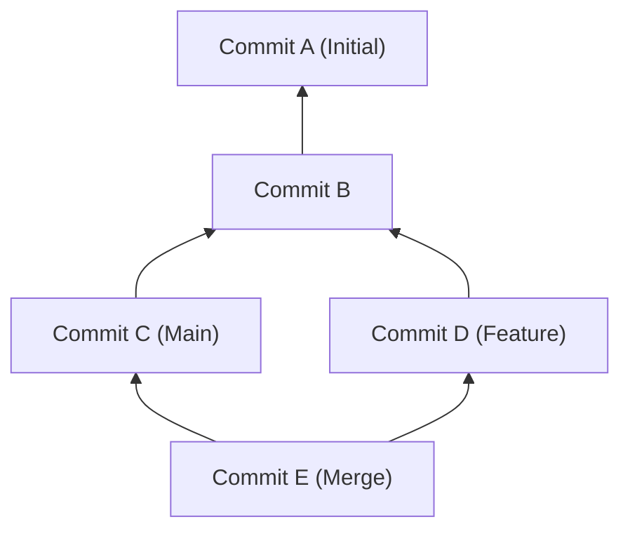
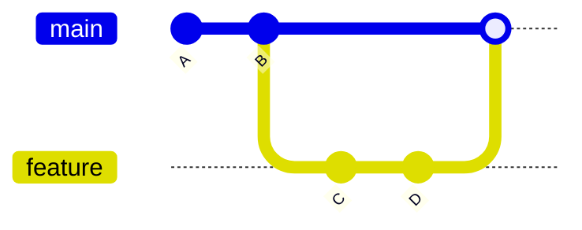
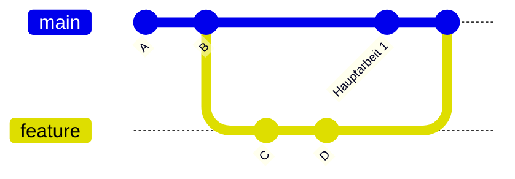
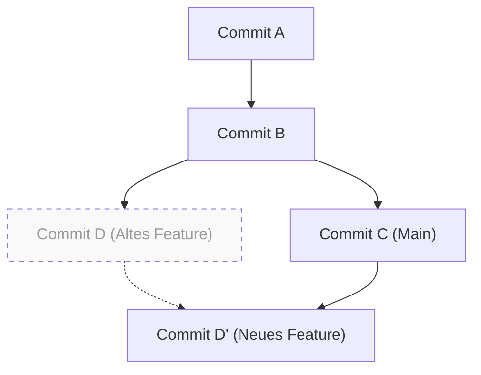

# 1. Einführung: Warum „merge oder rebase“ ein ewiges Thema ist

Git ist ein unverzichtbares Versionskontrollsystem in der modernen Softwareentwicklung. Wenn mehrere Entwickler gleichzeitig die Codebasis ändern, spielt das leistungsstarke Branching-Modell von Git seine Stärken aus. In der Teamentwicklung ist die Diskussion darüber, ob man `merge` oder `rebase` verwenden sollte, jedoch eines der Themen, das Entwickler vom Anfänger bis zum Experten immer wieder beschäftigt.

In diesem Artikel werden wir die Unterschiede im Mechanismus von `git merge` und `git rebase` tiefgehend untersuchen, indem wir die interne Struktur von Git, wie den DAG (gerichteter azyklischer Graph) und die mathematischen Eigenschaften von Commit-Hashes, entschlüsseln. Darüber hinaus werden wir anhand von konkreten Workflows ausführlich erklären, wie man diese beiden in der Praxis richtig einsetzt. Indem Sie nicht nur die Befehle kennenlernen, sondern auch verstehen, welche Berechnungen Git im Hintergrund durchführt, verlieren Sie die Angst vor Konflikten und können eine saubere, nachvollziehbare Historie aufbauen.

---

# 2. Interne Struktur von Git: Commit-Hashes und Objektmodell

Um zu verstehen, wie Git die Historie integriert, müssen wir zunächst wissen, wie Git Daten speichert. Git speichert nicht einfach nur die Unterschiede (Patches) von Dateiänderungen, sondern einen Schnappschuss (Snapshot) des gesamten Dateisystems zu einem bestimmten Zeitpunkt.

## 2.1 Kryptographische Eigenschaften von Commit-Hashes

Jeder Commit in Git wird durch eine 40-stellige Hexadezimalzahl, die mit der Hash-Funktion SHA-1 (Secure Hash Algorithm 1) basierend auf seinem Inhalt berechnet wird, eindeutig identifiziert. Ein Commit-Objekt besteht aus den folgenden Elementen:

1. **Zeiger auf das Tree-Objekt**: Ein Schnappschuss der Verzeichnisstruktur und der Dateien (Blobs) zu diesem Zeitpunkt.
2. **Zeiger auf den Eltern-Commit**: Die Hash-Werte eines oder mehrerer Eltern-Commits (der erste Commit hat keinen Elternteil, ein Merge-Commit hat zwei oder mehr).
3. **Autor-Informationen (Author)**: Die Person, die den Code geschrieben hat, und das Datum.
4. **Committer-Informationen (Committer)**: Die Person, die den Commit erstellt/angewendet hat, und das Datum.
5. **Commit-Nachricht**: Text, der die Absicht der Änderung erklärt.

Mathematisch ausgedrückt wird der Hash-Wert $H(C)$ für ein Commit-Objekt $C$ wie folgt definiert:

$$
H(C) = \text{SHA-1}( \text{tree} \parallel \text{parent} \parallel \text{author} \parallel \text{committer} \parallel \text{message} )
$$

Hierbei steht $\parallel$ für die Verkettung von Daten. Aufgrund der Eigenschaften der Hash-Funktion führt selbst die Änderung eines einzigen Zeichens in der Commit-Nachricht oder ein anderer Eltern-Commit zu einem völlig anderen Hash-Wert. Das bedeutet: **Commits sind unveränderlich (immutable)**. Wenn später gesagt wird, dass `rebase` "die Historie umschreibt", so bedeutet das in Wirklichkeit, dass "neue Commits erstellt werden, die einen ähnlichen Inhalt, aber unterschiedliche Hash-Werte haben".

Die Größe des Hash-Raums beträgt $2^{160}$. Die Wahrscheinlichkeit $P$, dass eine Kollision auftritt (dass verschiedene Commits denselben Hash-Wert haben), kann mithilfe der Theorie des Geburtstagsparadoxons (Birthday Paradox) wie folgt angenähert werden (wobei $n$ die Anzahl der Commits ist):

$$
P(\text{collision}) \approx 1 - \exp\left(-\frac{n^2}{2 \times 2^{160}}\right)
$$

Diese Wahrscheinlichkeit ist extrem gering, und in der Praxis ist es nahezu unmöglich, dass Git-Commit-Hashes kollidieren.

---

# 3. Graphentheorie und DAG: Das mathematische Modell der Git-Historie

Die Commit-Historie von Git wird als „gerichteter azyklischer Graph“ (Directed Acyclic Graph, DAG) aus der Graphentheorie modelliert.

## 3.1 Was ist ein DAG (gerichteter azyklischer Graph)?

In einem Graphen $G = (V, E)$ ist $V$ die Menge der Commits (Knoten) und $E$ die Menge der gerichteten Kanten, die die Eltern-Kind-Beziehungen zwischen den Commits darstellen. In Git ist die Richtung der Kanten „vom Kind-Commit zum Eltern-Commit“ gerichtet, da neue Commits Zeiger auf vergangene Commits speichern.



Das Hauptmerkmal eines DAG ist, dass „keine Zyklen (Schleifen) existieren“. Dadurch geraten Algorithmen, die die Commit-Historie zurückverfolgen, nie in eine Endlosschleife und erreichen sicher das Ende (den initialen Commit).

## 3.2 Topologische Sortierung und die Reihenfolge der Historie

Wenn Git die Historie mit Befehlen wie `git log` anzeigt, wird der DAG durch den Algorithmus der topologischen Sortierung (Topological Sort) als eindimensionale Liste geordnet. Für jede gerichtete Kante $u \to v$ im DAG ($u$ ist das Kind von $v$) wird die Liste so sortiert, dass $u$ vor $v$ steht.

---

# 4. Der Mechanismus und die Arten von git merge

Der grundlegendste Befehl zur Integration von Branch-Änderungen ist `git merge`. Je nach aktuellem Zustand wählt Git jedoch automatisch unterschiedliche Merge-Strategien aus.

## 4.1 Fast-Forward-Merge (--ff)

Wenn der Ziel-Branch (z. B. `main`) ein direkter Vorfahre des Quell-Branch (z. B. `feature`) ist, führt Git einen „Fast-Forward“-Merge (Vorspulen) aus. Dabei wird kein neuer Commit erstellt, sondern lediglich der Branch-Zeiger nach vorne verschoben.



Ein Fast-Forward-Merge hält die Historie geradlinig, hat aber den Nachteil, dass der Kontext verloren geht, „welche Commit-Gruppe als eine einzige Feature-Entwicklung zusammengehörte“.

## 4.2 Non-Fast-Forward-Merge (--no-ff)

Wenn Sie explizit `git merge --no-ff` angeben, wird in jedem Fall ein neuer „Merge-Commit“ erstellt, selbst wenn ein Fast-Forward möglich wäre. Ein Merge-Commit ist ein spezieller Commit mit zwei Elternteilen.



Der Vorteil dieser Methode besteht darin, dass die Existenz und die Geschichte des Feature-Branches deutlich im DAG erhalten bleiben. Wenn ein Problem auftritt, kann durch Ausführen von `git revert -m 1 <Hash des Merge-Commits>` das gesamte Feature auf einmal sicher rückgängig gemacht (reverted) werden.

## 4.3 3-Way-Merge-Algorithmus (3-Wege-Merge)

Wenn der Ziel- und der Quell-Branch jeweils eigene Commits haben, führt Git einen 3-Way-Merge durch. Dabei durchsucht Git den DAG, um den „nächsten gemeinsamen Vorfahren“ (Lowest Common Ancestor, LCA) der beiden Branches zu finden.

Die zeitliche Komplexität $T_{\text{LCA}}$ des Algorithmus zum Finden des LCA ist linear in Bezug auf die Anzahl der Knoten $|V|$ und Kanten $|E|$:

$$
T_{\text{LCA}} = \mathcal{O}(|V| + |E|)
$$

Git vergleicht den „Zustand des LCA“, den „Zustand des aktuellen Branches“ und den „Zustand des anderen Branches“. Wenn die Änderungen nicht im Konflikt stehen, wird automatisch ein Merge-Commit generiert.

---

# 5. Der Mechanismus von git rebase und die Rekonstruktion der Historie

Während `git merge` die Historie „integriert“, wird sie bei `git rebase` „rekonstruiert“ (neu angesetzt).

## 5.1 Die Vorgänge hinter Rebase

Die internen Vorgänge beim Rebasen eines `feature`-Branches auf den `main`-Branch (`git rebase main`) sind wie folgt:

1. Finde den gemeinsamen Vorfahren (LCA) des `feature`-Branches und des `main`-Branches.
2. Speichere die Diffs (Änderungen) der Commits vom LCA bis zur Spitze des `feature`-Branches in einem temporären Bereich.
3. Verschiebe den Zeiger des `feature`-Branches auf die Spitze des `main`-Branches.
4. Wende die gespeicherten Diffs der Reihe nach auf die neue Basis (die Spitze von `main`) an (Cherry-Pick) und generiere so neue Commits.



Hierbei ist wichtig, dass der durch den Rebase erstellte Commit $D'$ einen **anderen Eltern-Commit als der ursprüngliche Commit $D$ hat und somit einen völlig anderen Hash-Wert besitzt** (siehe Definition der Hash-Funktion $H(C)$ weiter oben).

## 5.2 Interaktives Rebase (Interactive Rebase)

Mit `git rebase -i` (oder `--interactive`) können Sie die Commit-Historie ganz nach Ihren Wünschen bearbeiten. Dies ist das mächtigste Werkzeug, um die lokale Historie zu bereinigen.

- `pick`: Den Commit so übernehmen, wie er ist.
- `reword`: Nur die Commit-Nachricht bearbeiten.
- `edit`: Den Vorgang pausieren, um den Inhalt des Commits zu bearbeiten.
- `squash`: Diesen Commit mit dem vorherigen Commit verschmelzen und auch die Nachrichten kombinieren.
- `fixup`: Wie `squash`, jedoch wird die Nachricht dieses Commits verworfen.
- `drop`: Den Commit vollständig löschen.

Aus mathematischer Sicht ergeben sich bei $N$ Commits in einem Branch folgende Variationen (Permutationen) $P$ an möglichen linearen Historien, die durch Ändern der Reihenfolge beim Rebase generiert werden können:

$$
P = N!
$$

Git gibt Entwicklern $N!$ Möglichkeiten und erlaubt es so, die Historie in einem logischen und aufgeräumten Zustand zu halten.

---

# 6. Die Goldene Regel des Rebasens (The Golden Rule of Rebase)

`rebase` ist extrem mächtig, aber es gibt eine absolute Regel:

> **„Rebasen Sie niemals eine veröffentlichte, öffentliche Historie!“**
> *(Never rebase public history)*

## 6.1 Warum darf man eine öffentliche Historie nicht rebasen?

Git ist dezentralisiert. Die Commits, die Sie nach `origin/main` pushen, werden auch in die lokalen Repositories anderer Entwickler geklont (kopiert). Was passiert, wenn Sie einen bereits gepushten Commit rebasen, die Historie neu schreiben und diese mit `git push --force` erzwingen?

Der DAG in den lokalen Repositories der anderen Entwickler weicht grundlegend vom DAG auf dem Remote-Server ab. Wenn ein anderer Entwickler `git pull` ausführt, wird Git versuchen, Commits mit unterschiedlicher Historie gewaltsam zusammenzuführen. Dies führt zu massiven Konflikten und doppelten Commits (Commits mit gleichem Inhalt, aber unterschiedlichen Hashes), was das Repository in einen chaotischen Zustand versetzt.

Die eiserne Regel lautet: Führen Sie Rebase **nur auf „lokalen Branches, die noch mit niemandem geteilt wurden“** aus.

---

# 7. Konfliktauflösung und git rebase --continue

Wenn mehrere Personen dieselbe Stelle in derselben Datei ändern, entsteht ein Konflikt (Conflict). Bei `merge` und `rebase` unterscheidet sich der Prozess der Konfliktauflösung.

## 7.1 Konfliktauflösung beim Merge

Bei `git merge` tritt die Konfliktauflösung **nur einmal** auf. Kurz bevor der endgültige Merge-Commit erstellt wird, werden alle Konflikte auf einmal behoben.

## 7.2 Konfliktauflösung beim Rebase

Aufgrund der Eigenschaft von `git rebase`, Commits nacheinander neu anzuwenden, besteht **die Möglichkeit, dass bei jedem einzelnen Commit ein Konflikt auftritt**.

Wenn während eines Rebase ein Konflikt auftritt, pausiert Git den Vorgang. Der Ablauf zur Lösung sieht wie folgt aus:

1. Öffnen Sie einen Editor oder eine IDE (wie VS Code) und beheben Sie die Konfliktmarkierungen (`<<<<<<<`, `======` und `>>>>>>>`) manuell.
2. Fügen Sie die bearbeitete Datei dem Index hinzu:
   ```bash
   git add <bearbeitete Datei>
   ```
3. Setzen Sie den Rebase-Vorgang fort, ohne einen neuen Commit zu erstellen:
   ```bash
   git rebase --continue
   ```

Wenn Sie den Rebase komplett abbrechen und in den ursprünglichen Zustand zurückkehren möchten, führen Sie folgenden Befehl aus:
```bash
git rebase --abort
```
(*Wenn keine Konfliktauflösung erforderlich ist und Sie den gesamten Commit überspringen möchten, verwenden Sie `git rebase --skip`.*)

---

# 8. Der richtige Einsatz in der Praxis (Workflow-Praxis)

Wie sollten Sie nun in der tatsächlichen Entwicklungsumgebung zwischen `merge` und `rebase` wählen? Hier stellen wir den standardmäßigsten und sichersten Ansatz vor.

## 8.1 [Szenario 1] Bereinigung der lokalen Arbeitshistorie (Verwendung von Rebase)

Angenommen, Sie haben während der Entwicklung in einem Feature-Branch viele kleine Commits angesammelt (z. B. "Tippfehler behoben", "Temporär gespeichert" usw.). Bevor Sie einen Pull Request (PR) erstellen, nutzen Sie interaktives Rebase, um diese zu sinnvollen Einheiten zusammenzufassen.

```bash
# Ausführen, während Sie sich im feature-Branch befinden
git rebase -i HEAD~5
# (Ein Editor öffnet sich; nutzen Sie squash oder fixup, um die Historie zu bereinigen)
```

Dadurch können Sie eine saubere Commit-Historie erstellen, bei der die Absichten für den Reviewer leichter nachvollziehbar sind.

## 8.2 [Szenario 2] Aktualisierung auf den neuesten main-Branch (Verwendung von Rebase)

Wenn die Entwicklung länger dauert und fortlaufend Änderungen anderer Personen in den `main`-Branch gemergt werden, wird Ihr eigener `feature`-Branch veraltet sein. In diesem Fall aktualisieren Sie Ihren `feature`-Branch, indem Sie ihn auf den neuesten Stand von `main` rebasen.

```bash
# Die neuesten Informationen von main abrufen
git fetch origin

# Den feature-Branch auf den neuesten main-Branch aufsetzen
git rebase origin/main
```

Dadurch bleibt die Historie linear, und Sie können Konflikte bei späteren Merges vermeiden. Außerdem wird verhindert, dass überflüssige Merge-Commits ("Merge branch 'main' into feature") erstellt werden.

## 8.3 [Szenario 3] Integration abgeschlossener Features (Verwendung von Merge)

Wenn die Entwicklung im `feature`-Branch abgeschlossen ist, kommt die Phase der Integration in den `main`-Branch. Hier verwenden Sie **`git merge --no-ff`** (das entspricht der Auswahl von "Create a merge commit" bei einem Pull Request auf GitHub).

```bash
git checkout main
git merge --no-ff feature -m "Merge feature: Implementierung der Benutzer-Login-Funktion"
git push origin main
```

Dadurch bleibt im DAG des `main`-Branches ein Knotenpunkt in der Historie (Merge-Commit) erhalten, der besagt: „Hier wurde ein Feature gemergt“. Wenn Sie später die Historie betrachten, können Sie den Code pro Feature-Einheit viel leichter nachvollziehen.

---

# 9. Fazit (Zusammenfassung)

Bei der Arbeit mit Git haben extreme Ansätze wie „Alles mit Merge erledigen“ oder „Alles mit Rebase linear halten“ jeweils ihre Vor- und Nachteile.

Die Best Practice in der Praxis ist ein hybrider Ansatz: **„Nutzen Sie rebase, um die private lokale Historie schön aufzuräumen, und verwenden Sie merge --no-ff für die öffentliche Integrationshistorie, um den Kontext zu erhalten.“**

- **Lokal (persönlicher Arbeitsbereich)**: Verwenden Sie `rebase`, um unnötige Commits zu eliminieren, der neuesten Mainline zu folgen und eine lineare Historie beizubehalten.
- **Global (geteilter Arbeitsbereich)**: Verwenden Sie `merge --no-ff`, um die Existenz des Feature-Branches als Merge-Commit im DAG aufzuzeichnen und so Reverts und Tracking zu erleichtern.

Durch das Verständnis des mathematischen und architektonischen Hintergrunds, wie der Struktur des DAGs und der Funktionsweise von Hash-Funktionen, werden Git-Befehle von purem Auswendiglernen zum „Entwurf einer Historie mit Absicht“ erhoben. Beachten Sie die Goldene Regel des Rebasens, wählen Sie je nach Situation den optimalen Befehl und bauen Sie eine saubere Commit-Historie auf, die für das gesamte Team leicht lesbar und wartbar ist.
