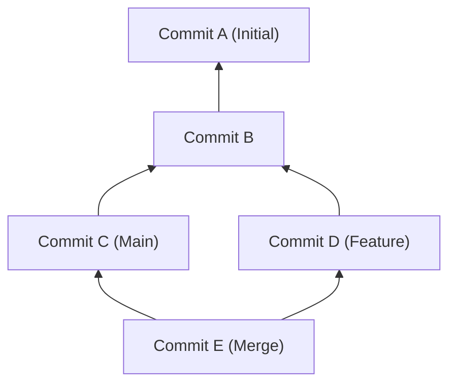
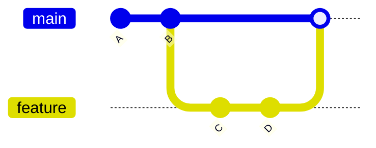
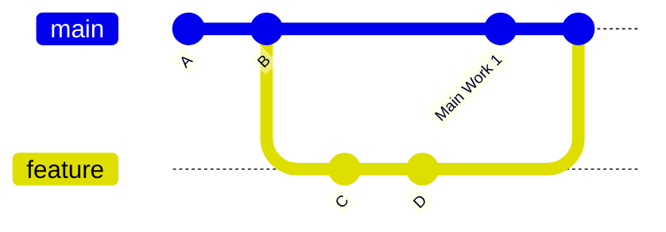
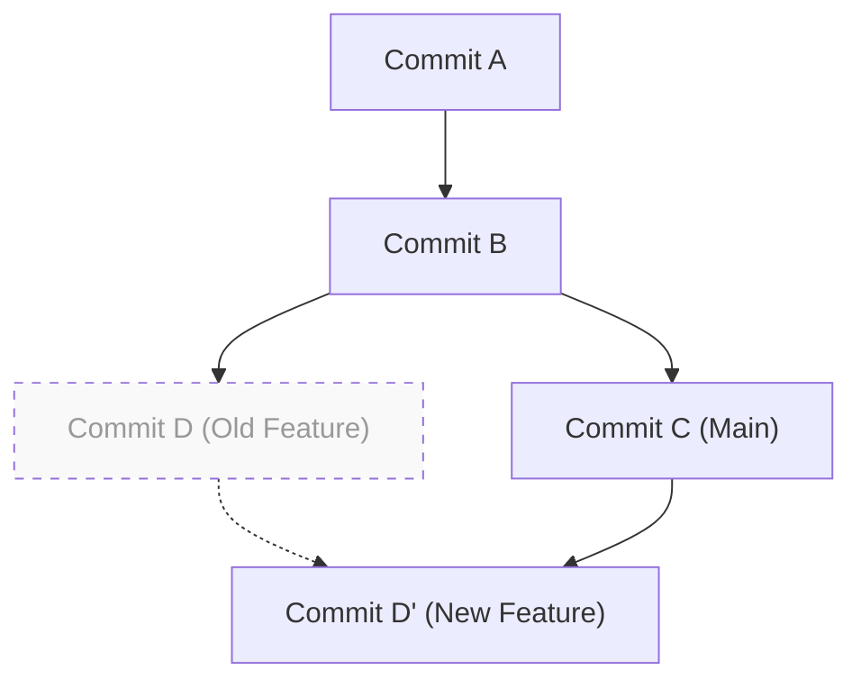

# 1. Introduction: Why "merge vs. rebase" is an Eternal Question

Git is an essential version control system in modern software development. When multiple developers make changes to a codebase simultaneously, Git's powerful branching model proves its worth. However, in team development, the debate over "whether to use `merge` or `rebase`" is a topic that constantly troubles developers, from beginners to experts.

In this article, we will delve deeply into the mechanical differences between `git merge` and `git rebase` by unraveling Git's internal structure, such as the DAG (Directed Acyclic Graph) and the mathematical properties of commit hashes. Then, we will thoroughly explain how to use them properly in practice, incorporating specific workflows. By understanding not just the commands but also the calculations Git performs behind the scenes, you will eliminate the fear of conflicts and become able to build a clean, traceable history.

---

# 2. Git's Internal Structure: Commit Hashes and the Object Model

To understand how Git integrates history, you first need to know how Git stores data. Git does not merely save the diffs (patches) of file changes; it saves a snapshot of the entire file system at a given point in time.

## 2.1 Cryptographic Properties of Commit Hashes

Each commit in Git is uniquely identified by a 40-character hexadecimal number generated by the SHA-1 (Secure Hash Algorithm 1) hash function, which is calculated based on its contents. A commit object consists of the following elements:

1. **Pointer to a Tree object**: A snapshot of the directory structure and files (Blobs) at that time
2. **Pointers to parent commits**: The hash values of one or more parent commits (the initial commit has no parents, while a merge commit has two or more parents)
3. **Author information**: The person who wrote the code and the date/time
4. **Committer information**: The person who created/applied the commit and the date/time
5. **Commit message**: Text explaining the intent of the changes

Expressed mathematically, the hash value $H(C)$ for a commit object $C$ is defined as follows:

$$
H(C) = \text{SHA-1}( \text{tree} \parallel \text{parent} \parallel \text{author} \parallel \text{committer} \parallel \text{message} )
$$

Here, $\parallel$ represents the concatenation of data. Due to the characteristics of hash functions, even changing a single character in the commit message or having a different parent commit generates an entirely different hash value. In other words, **commits are immutable**. The reason why `rebase` (discussed later) is described as "rewriting history" is that it actually "creates new commits with similar content but different hash values."

The size of the hash space is $2^{160}$, and the probability $P$ of a collision (different commits having the same hash value) can be approximated using the theory of the Birthday Paradox as follows ($n$ is the number of commits):

$$
P(\text{collision}) \approx 1 - \exp\left(-\frac{n^2}{2 \times 2^{160}}\right)
$$

This probability is extremely low, and practically speaking, it is almost impossible for Git commit hashes to collide.

---

# 3. Graph Theory and DAG: The Mathematical Model of Git History

Git's commit history is modeled as a "Directed Acyclic Graph (DAG)" in graph theory.

## 3.1 What is a DAG (Directed Acyclic Graph)?

In a graph $G = (V, E)$, $V$ is a set of commits (vertices), and $E$ is a set of directed edges indicating the parent-child relationship between commits. In Git, the direction of the edges points from the "child commit to the parent commit." This is because new commits hold a pointer to past commits.



The most significant feature of a DAG is that "there are no cycles." This ensures that the algorithm tracing the commit history never falls into an infinite loop and can reliably reach the end (the initial commit).

## 3.2 Topological Sort and the Order of History

When displaying history with commands like `git log`, the DAG is ordered as a one-dimensional list using a Topological Sort algorithm. For any directed edge $u \to v$ in the DAG ($u$ is a child of $v$), it rearranges them so that $u$ comes before $v$ in the list.

---

# 4. The Mechanisms and Types of git merge

The most basic command to integrate changes from a branch is `git merge`. However, Git automatically selects different merge strategies depending on the current state.

## 4.1 Fast-Forward Merge (--ff)

If the branch you are merging into (e.g., `main`) is a direct ancestor of the branch you are merging from (e.g., `feature`), Git performs a "Fast-Forward" merge. This is an operation that simply moves the branch pointer forward without creating a new commit.



A Fast-Forward merge keeps the history straight, but it has the disadvantage of losing the context of "which group of commits were grouped together as a single feature development (feature)."

## 4.2 Non-Fast-Forward Merge (--no-ff)

If you explicitly specify `git merge --no-ff`, it will always create a new "merge commit," even in a situation where a Fast-Forward is possible. A merge commit is a special commit that has two parents.



The advantage of this method is that the existence and history of the feature branch clearly remain on the DAG. If an issue occurs, you can safely undo (revert) the entire feature at once by running `git revert -m 1 <merge commit hash>`.

## 4.3 3-Way Merge Algorithm

When both the target and source branches have their own unique commits, Git performs a 3-way merge. At this time, Git traverses the DAG and finds the "Lowest Common Ancestor (LCA)" of the two branches.

The time complexity $T_{\text{LCA}}$ of the algorithm to find the LCA can be executed in linear time relative to the number of vertices $|V|$ and edges $|E|$:

$$
T_{\text{LCA}} = \mathcal{O}(|V| + |E|)
$$

Git compares three states: the "state of the LCA," the "state of the current branch," and the "state of the other branch." If the changes do not conflict, it automatically generates a merge commit.

---

# 5. The Mechanism of git rebase and Reconstructing History

While `git merge` "integrates" history, `git rebase` "reconstructs (re-attaches)" history.

## 5.1 The Movements Behind Rebase

The internal operation when rebasing the `feature` branch onto the `main` branch (`git rebase main`) is as follows:

1. Find the lowest common ancestor (LCA) of the `feature` branch and the `main` branch.
2. Save the diffs of the commits from the LCA to the tip of the `feature` branch in a temporary area.
3. Move the pointer of the `feature` branch to the tip of the `main` branch.
4. Apply the saved diffs one by one sequentially onto the new base (the tip of `main`) (Cherry-Pick) to generate new commits.



What's important here is that the commit $D'$ generated by the rebase **has a completely different hash value because its parent commit is different** from the original commit $D$ (refer to the definition of the hash function $H(C)$ mentioned above).

## 5.2 Interactive Rebase

Using `git rebase -i` (or `--interactive`), you can manipulate the commit history as you wish. This is the most powerful tool for organizing local history.

- `pick`: Use the commit as is
- `reword`: Modify only the commit message
- `edit`: Pause to amend the contents of the commit
- `squash`: Meld this commit into the previous commit, combining their messages
- `fixup`: Same as `squash`, but discards the message of this commit
- `drop`: Completely remove the commit

Mathematically speaking, if a branch has $N$ commits, the permutations (variations of linear history) $P$ that can be generated by reordering during a rebase are as follows:

$$
P = N!
$$

Git gives developers the freedom of $N!$ ways, allowing them to keep the history in a logical and beautiful state.

---

# 6. The Golden Rule of Rebase

`rebase` is incredibly powerful, but there is one absolute rule.

> **"Never rebase public history"**
> *(Never rebase public history)*

## 6.1 Why should you not rebase public history?

Git is distributed. The commits you pushed to `origin/main` are also cloned to the local repositories of other developers. If you rewrite the history by rebasing commits that have already been pushed, and force-overwrite them with `git push --force`, what will happen?

The DAGs on other developers' local machines and the remote DAG will fundamentally diverge. When other developers run `git pull`, Git will forcefully try to merge the groups of commits with different histories, causing a massive amount of conflicts and duplicate commits (commits with the same changes but different hashes), and the repository will fall into a state of panic.

The ironclad rule is to perform rebases **"only on local branches that you haven't shared with anyone yet."**

---

# 7. Resolving Conflicts and git rebase --continue

When multiple people change the same part of the same file, a conflict occurs. The process of resolving conflicts differs between `merge` and `rebase`.

## 7.1 Conflict Resolution in Merge

In the case of `git merge`, conflict resolution happens **only once**. You fix all the conflicting parts at once right before creating the final merge commit.

## 7.2 Conflict Resolution in Rebase

In the case of `git rebase`, because commits are re-applied one by one, **conflicts can occur at each commit**.

When a conflict occurs during a rebase, Git pauses the process. The flow of resolution is as follows:

1. Open your editor or IDE (like VS Code) and manually fix the conflict markers (`<<<<<<<`, `======`, `>>>>>>>`).
2. Add the modified files to the index:
   ```bash
   git add <modified_file>
   ```
3. Do not create a commit, just resume the rebase process:
   ```bash
   git rebase --continue
   ```

If you want to cancel the rebase itself and return to the original state, run the following command:
```bash
git rebase --abort
```
(* If you don't need to resolve the conflict and want to skip that entire commit, use `git rebase --skip`)

---

# 8. Proper Usage in Practice (Workflow Practice)

So, how should you properly use `merge` and `rebase` in an actual development environment? Here we introduce the most standard and safe approach.

## 8.1 [Scenario 1] Organizing Local Working History (Using Rebase)

Suppose you are developing on a feature branch, and many minor commits ("typo fix", "temporary save", etc.) have piled up. Before submitting a Pull Request (PR), you use interactive rebase to organize these into meaningful units.

```bash
# Execute while on the feature branch
git rebase -i HEAD~5
# (The editor opens, and you clean up the history using squash and fixup)
```

By doing this, you can create a beautiful commit history whose intent is easy for reviewers to understand.

## 8.2 [Scenario 2] Catching Up with the Latest main Branch (Using Rebase)

If development drags on and other people's changes keep getting merged into the `main` branch, your `feature` branch will become outdated. In this case, you rebase your `feature` branch onto the latest `main` to catch up.

```bash
# Fetch the latest information from main
git fetch origin

# Rebase the feature branch onto the latest main
git rebase origin/main
```

This keeps the history linear and prevents conflicts during subsequent merges. It also prevents the generation of unnecessary merge commits ("Merge branch 'main' into feature").

## 8.3 [Scenario 3] Integrating Completed Features (Using Merge)

Development on the `feature` branch is complete, and it is finally the phase to integrate it into the `main` branch. Here, we use **`git merge --no-ff`** (This is the same as choosing "Create a merge commit" in a Pull Request on GitHub, etc.).

```bash
git checkout main
git merge --no-ff feature -m "Merge feature: Implement user login functionality"
git push origin main
```

By doing this, a node in history (a merge commit) saying "a single feature was merged here" is left on the DAG of the `main` branch. When looking back at the history later, it becomes easier to trace the code by feature units.

---

# 9. Conclusion (Summary)

In Git operations, extreme approaches like "doing everything with Merge" or "making everything linear with Rebase" each have their pros and cons.

The best practice in real-world environments is a hybrid approach: **"Cleanly organize local private history with rebase, and preserve context in public integration history with merge --no-ff."**

- **Local (Personal workspace)**: Use `rebase` to eliminate useless commits, catch up with the latest mainline, and maintain a linear history.
- **Global (Shared workspace)**: Use `merge --no-ff` to record the existence of a feature branch as a merge commit on the DAG, making reverts and tracking easier.

By understanding the mathematical and architectural backgrounds, such as the structure of the DAG and how hash functions work, Git commands are elevated from mere memorization to "designing history with intent." While adhering to the golden rule of rebase, let's select the optimal commands depending on the situation and build a clean commit history that is easy to read and maintain for the entire team.
