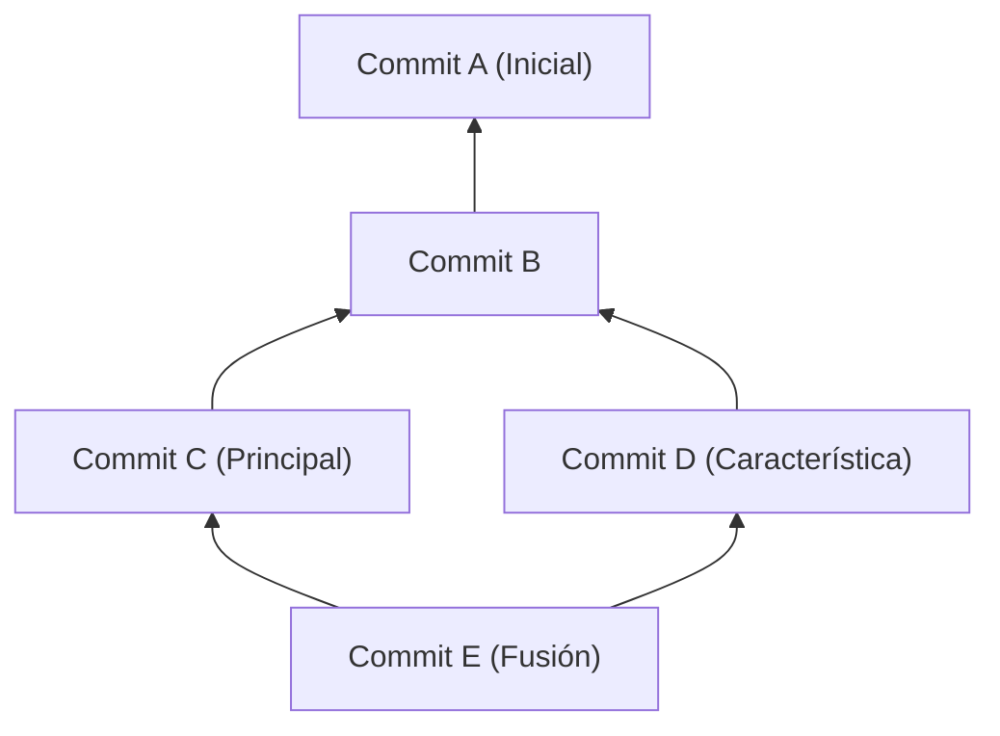
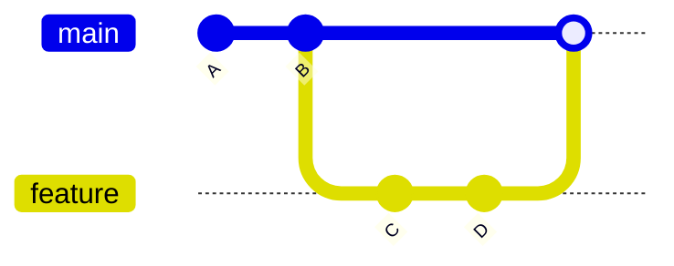
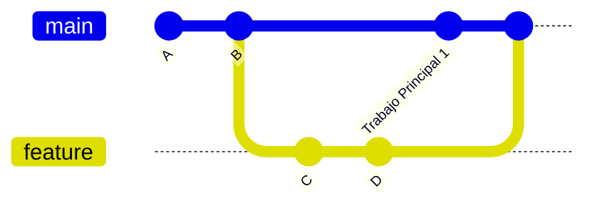
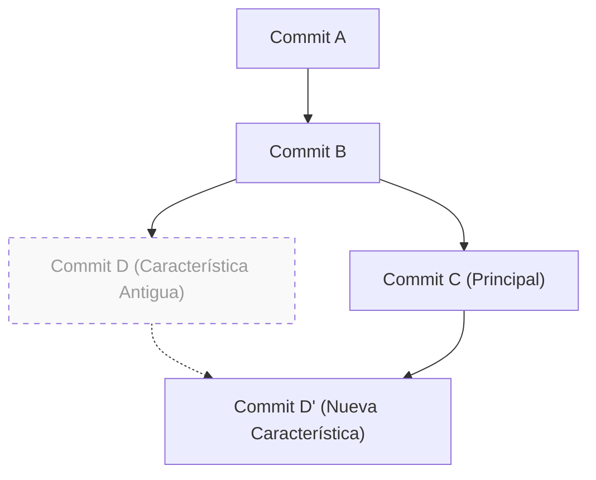

# 1. Introducción: ¿Por qué "merge o rebase" es un dilema eterno?

Git es un sistema de control de versiones indispensable en el desarrollo de software moderno. Cuando múltiples desarrolladores cambian simultáneamente una base de código, el poderoso modelo de ramas de Git demuestra su valía. Sin embargo, en el desarrollo en equipo, el debate sobre "si usar `merge` o `rebase`" es uno de los temas que siempre preocupa a los desarrolladores, desde principiantes hasta expertos.

En este artículo, desentrañaremos las diferencias en los mecanismos de `git merge` y `git rebase`, partiendo de la estructura interna de Git, el DAG (Grafo Dirigido Acíclico), y las propiedades matemáticas de los hashes de los commits. Luego, explicaremos a fondo cómo usar y diferenciar ambos en la práctica, acompañándolo con flujos de trabajo concretos. Al ir más allá de la simple introducción de comandos y comprender qué cálculos realiza Git en segundo plano, perderás el miedo a los conflictos y podrás construir un historial limpio y rastreable.

---

# 2. Estructura interna de Git: Hashes de commits y modelo de objetos

Para comprender cómo Git integra el historial, primero debemos saber cómo Git almacena los datos. Git no solo almacena las diferencias (parches) de los cambios en los archivos, sino que guarda una instantánea de todo el sistema de archivos en un momento dado.

## 2.1 Propiedades criptográficas de los hashes de los commits

Cada commit en Git se identifica de forma única por un número hexadecimal de 40 dígitos generado por la función hash SHA-1 (Secure Hash Algorithm 1) calculada a partir de su contenido. Un objeto commit consta de los siguientes elementos:

1. **Puntero al objeto Tree**: Una instantánea de la estructura de directorios y archivos (Blob) en ese momento.
2. **Puntero al commit padre**: El valor hash de uno o más commits padres (el primer commit no tiene padre, y un commit de fusión (merge) tiene dos o más padres).
3. **Información del autor (Author)**: Quién escribió el código y cuándo.
4. **Información del confirmador (Committer)**: Quién creó y aplicó el commit y cuándo.
5. **Mensaje del commit**: Texto que explica la intención del cambio.

Expresado matemáticamente, el valor hash $H(C)$ para un objeto commit $C$ se define de la siguiente manera:

$$
H(C) = \text{SHA-1}( \text{tree} \parallel \text{parent} \parallel \text{author} \parallel \text{committer} \parallel \text{message} )
$$

Aquí, $\parallel$ representa la concatenación de datos. Debido a las propiedades de la función hash, incluso cambiar un solo carácter en el mensaje del commit, o tener un commit padre diferente, generará un valor hash completamente distinto. Es decir, **los commits son inmutables (Immutable)**. Cuando se dice más adelante que `rebase` "reescribe el historial", en realidad significa "crea nuevos commits con un contenido similar pero con valores hash diferentes".

El tamaño del espacio de hashes es $2^{160}$, y la probabilidad $P$ de que ocurra una colisión (que diferentes commits tengan el mismo valor hash) se puede aproximar utilizando la teoría de la paradoja del cumpleaños (Birthday Paradox) (donde $n$ es el número de commits):

$$
P(\text{colisión}) \approx 1 - \exp\left(-\frac{n^2}{2 \times 2^{160}}\right)
$$

Esta probabilidad es extremadamente baja, por lo que en la práctica es casi imposible que los hashes de los commits de Git colisionen.

---

# 3. Teoría de grafos y DAG: Modelo matemático del historial de Git

El historial de commits de Git se modela como un "Grafo Dirigido Acíclico (Directed Acyclic Graph, DAG)" en la teoría de grafos.

## 3.1 ¿Qué es un DAG (Grafo Dirigido Acíclico)?

En un grafo $G = (V, E)$, $V$ es el conjunto de commits (vértices), y $E$ es el conjunto de aristas dirigidas que indican la relación padre-hijo entre los commits. En Git, la dirección de la arista va "del commit hijo al commit padre". Esto se debe a que un nuevo commit mantiene un puntero a los commits pasados.



La característica principal de un DAG es que "no existen ciclos". Gracias a esto, los algoritmos que retroceden en el historial de commits no caen en bucles infinitos y pueden llegar con seguridad al final (el commit inicial).

## 3.2 Ordenación topológica y orden del historial

Cuando se muestra el historial con comandos como `git log` de Git, el DAG se ordena como una lista unidimensional mediante el algoritmo de ordenación topológica (Topological Sort). Para cualquier arista dirigida $u \to v$ en el DAG ($u$ es hijo de $v$), se reordenan para que $u$ aparezca antes que $v$ en la lista.

---

# 4. Mecanismos y tipos de git merge

El comando más básico para integrar cambios de ramas es `git merge`. Sin embargo, Git selecciona automáticamente diferentes estrategias de fusión según el estado actual.

## 4.1 Fusión Fast-Forward (--ff)

Si la rama de destino de la integración (ej: `main`) es un ancestro directo de la rama de origen (ej: `feature`), Git ejecuta una fusión "Fast-Forward (avance rápido)". Es una operación que no crea un nuevo commit, sino que simplemente avanza el puntero de la rama.



La fusión Fast-Forward mantiene el historial lineal, pero tiene la desventaja de que se pierde el contexto de "qué grupo de commits se agruparon como el desarrollo de una sola característica (feature)".

## 4.2 Fusión Non-Fast-Forward (--no-ff)

Si se especifica explícitamente `git merge --no-ff`, siempre se creará un nuevo "commit de fusión (merge commit)", incluso en situaciones donde es posible hacer un Fast-Forward. Un commit de fusión es un commit especial que tiene dos padres.



La ventaja de este método es que la existencia y la historia de la rama de la característica quedan claramente registradas en el DAG. Cuando ocurre un problema, al ejecutar `git revert -m 1 <hash del commit de fusión>`, es posible deshacer (revertir) de forma segura toda la característica a la vez.

## 4.3 Algoritmo de fusión de 3 vías (3-Way Merge)

Cuando las ramas de destino y origen tienen sus propios commits únicos, Git ejecuta una fusión de 3 vías. En este momento, Git explora el DAG y encuentra el "ancestro común más bajo (Lowest Common Ancestor, LCA)" de las dos ramas.

La complejidad temporal $T_{\text{LCA}}$ del algoritmo para encontrar el LCA se puede ejecutar en tiempo lineal con respecto al número de vértices $|V|$ y aristas $|E|$:

$$
T_{\text{LCA}} = \mathcal{O}(|V| + |E|)
$$

Git compara 3 estados: "el estado del LCA", "el estado de la rama actual" y "el estado de la otra rama", y si los cambios no entran en conflicto, genera automáticamente un commit de fusión.

---

# 5. Mecanismo de git rebase y reconstrucción del historial

Mientras que `git merge` "integra" el historial, `git rebase` "reconstruye (reemplaza)" el historial.

## 5.1 Los movimientos detrás de Rebase

El comportamiento interno al hacer rebase de la rama `feature` a la rama `main` (`git rebase main`) es el siguiente:

1. Encontrar el ancestro común (LCA) entre la rama `feature` y la rama `main`.
2. Guardar las diferencias de los commits desde el LCA hasta la punta de la rama `feature` en un área temporal.
3. Mover el puntero de la rama `feature` a la punta de la rama `main`.
4. Aplicar (Cherry-Pick) secuencialmente las diferencias guardadas sobre la nueva base (la punta de `main`), una por una, y generar nuevos commits.



Lo importante aquí es que el commit $D'$ generado por el rebase **tiene un commit padre diferente al del commit original $D$, por lo que tiene un valor hash completamente distinto** (consulta la definición de la función hash $H(C)$ mencionada anteriormente).

## 5.2 Rebase Interactivo (Interactive Rebase)

El uso de `git rebase -i` (o `--interactive`) permite manipular el historial de commits a tu antojo. Esta es la herramienta más poderosa para organizar el historial local.

- `pick` : Utiliza el commit tal cual
- `reword` : Modifica solo el mensaje del commit
- `edit` : Pausa para modificar el contenido del commit
- `squash` : Fusiona este commit con el commit anterior y combina sus mensajes
- `fixup` : Igual que `squash`, pero descarta el mensaje de este commit
- `drop` : Elimina el commit por completo

Desde un punto de vista matemático, si una rama tiene $N$ commits, el número de variaciones (permutaciones) del historial lineal que se pueden generar reordenando el rebase, $P$, es:

$$
P = N!
$$

Git otorga a los desarrolladores la libertad de $N!$ formas, lo que permite mantener el historial en un estado lógico y hermoso.

---

# 6. La regla de oro del Rebase (The Golden Rule of Rebase)

Aunque `rebase` es extremadamente poderoso, existe una regla absoluta.

> **"Nunca debes hacer rebase en historiales públicos que ya se han compartido"**
> *(Never rebase public history)*

## 6.1 ¿Por qué no debes hacer rebase en el historial público?

Git es distribuido. Los commits que has empujado (push) a `origin/main` también han sido clonados (duplicados) en los repositorios locales de otros desarrolladores. Si reescribes el historial haciendo rebase a commits que ya han sido empujados y los sobrescribes forzadamente con `git push --force`, ¿qué pasará?

El DAG local de otros desarrolladores y el DAG remoto se bifurcarán fundamentalmente. Cuando otros desarrolladores ejecuten `git pull`, Git intentará fusionar por la fuerza grupos de commits con historias diferentes, lo que causará una gran cantidad de conflictos y commits duplicados (mismos cambios pero con diferentes hashes), sumiendo el repositorio en el caos.

La regla de oro es hacer rebase **"solo en ramas locales que aún no se han compartido con nadie"**.

---

# 7. Resolución de conflictos y git rebase --continue

Si varias personas modifican la misma parte del mismo archivo, se producirá un conflicto. El proceso de resolución de conflictos es diferente entre `merge` y `rebase`.

## 7.1 Resolución de conflictos en Merge

En el caso de `git merge`, la resolución del conflicto ocurre **solo una vez**. Justo antes de crear el commit de fusión final, se corrigen todos los conflictos a la vez.

## 7.2 Resolución de conflictos en Rebase

En el caso de `git rebase`, debido a su naturaleza de reaplicar los commits uno por uno, **pueden ocurrir conflictos en cada commit**.

Cuando ocurre un conflicto durante el rebase, Git pausa el proceso. El flujo de resolución es el siguiente:

1. Abre tu editor o IDE (como VS Code) y corrige manualmente los marcadores de conflicto (`<<<<<<<`, `======`, `>>>>>>>`).
2. Agrega los archivos modificados al índice (index):
   ```bash
   git add <archivo modificado>
   ```
3. Sin crear un commit, reanuda el proceso de rebase:
   ```bash
   git rebase --continue
   ```

Si deseas cancelar el rebase por completo y volver al estado original, ejecuta el siguiente comando:
```bash
git rebase --abort
```
(※ Si no necesitas resolver un conflicto y quieres omitir ese commit en particular, usa `git rebase --skip`)

---

# 8. Uso correcto en la práctica (Práctica de flujo de trabajo)

Entonces, en un entorno de desarrollo real, ¿cómo deberíamos diferenciar el uso de `merge` y `rebase`? Aquí presentamos el enfoque más estándar y seguro.

## 8.1 【Escenario 1】 Organización del historial de trabajo local (Uso de Rebase)

Supongamos que durante el desarrollo en una rama de característica (feature), se han acumulado muchos commits pequeños ("corrección de error tipográfico", "guardado temporal", etc.). Antes de enviar un Pull Request (PR), usas un rebase interactivo para organizar estos en unidades significativas.

```bash
# Ejecutar estando en la rama feature
git rebase -i HEAD~5
# (Se abre el editor, usas squash y fixup para limpiar el historial)
```

Esto permite crear un historial de commits hermoso y donde la intención sea clara para los revisores.

## 8.2 【Escenario 2】 Seguimiento de la rama main más reciente (Uso de Rebase)

Si el desarrollo se alarga y los cambios de otras personas se siguen fusionando en la rama `main`, tu rama `feature` quedará desactualizada. En este caso, haces un rebase de tu rama `feature` sobre la última `main` para seguirla.

```bash
# Obtener la última información de main
git fetch origin

# Mover la rama feature a la cima del main más reciente
git rebase origin/main
```

Esto hace que el historial sea lineal y previene conflictos en fusiones posteriores. Además, evita que se generen commits de fusión innecesarios ("Merge branch 'main' into feature").

## 8.3 【Escenario 3】 Integración de una característica completada (Uso de Merge)

El desarrollo en la rama `feature` ha terminado y finalmente es la fase de integración en la rama `main`. Aquí se usa **`git merge --no-ff`** (es equivalente a elegir "Create a merge commit" en un Pull Request en GitHub, etc.).

```bash
git checkout main
git merge --no-ff feature -m "Merge feature: Implementación de la función de inicio de sesión de usuario"
git push origin main
```

De esta manera, en el DAG de la rama `main` queda un nodo en la historia (un commit de fusión) que indica "aquí se fusionó una característica completa". Al mirar el historial más tarde, será más fácil seguir el código por unidad funcional.

---

# 9. Conclusión (Resumen)

En las operaciones de Git, los enfoques extremos como "resolver todo con Merge" o "hacer todo lineal con Rebase" tienen sus propias ventajas y desventajas.

La mejor práctica en el entorno laboral es un enfoque híbrido: **"Organizar bellamente el historial privado local con rebase, y preservar el contexto en el historial público de integración con merge --no-ff"**.

- **Local (Espacio de trabajo personal)**: Usar `rebase` para eliminar commits inútiles, seguir la línea principal más reciente y mantener un historial lineal.
- **Global (Espacio de trabajo compartido)**: Usar `merge --no-ff` para registrar la existencia de ramas de características como commits de fusión en el DAG, facilitando la reversión y el rastreo.

Al comprender los fundamentos arquitectónicos y matemáticos, como la estructura del DAG y el mecanismo de las funciones hash, los comandos de Git se elevan de la simple memorización al "diseño intencional del historial". Siguiendo la regla de oro del rebase, seleccionemos el comando óptimo según la situación y construyamos un historial de commits limpio que sea fácil de leer y mantener para todo el equipo.
