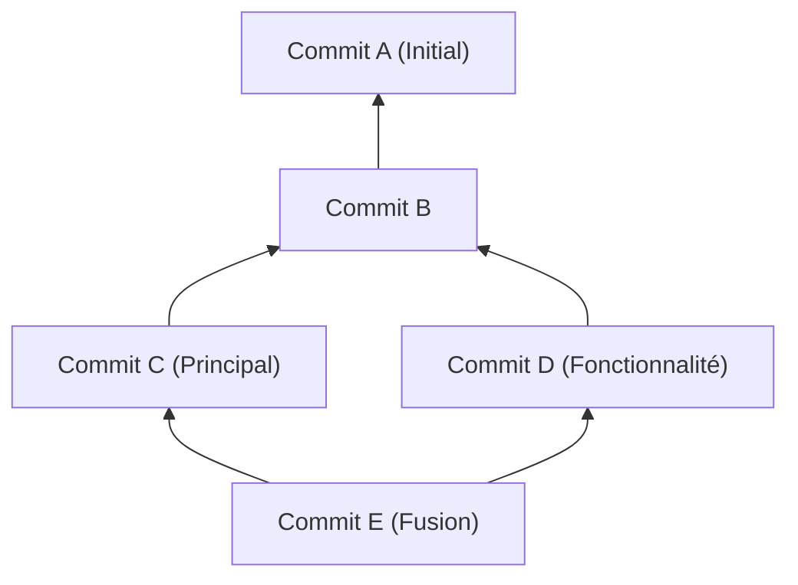
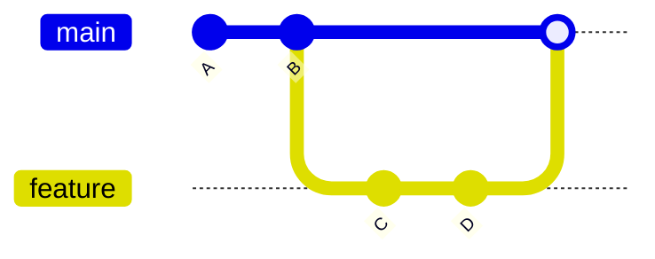
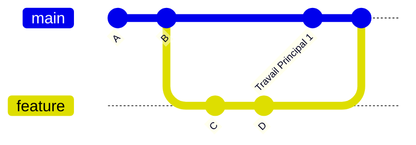
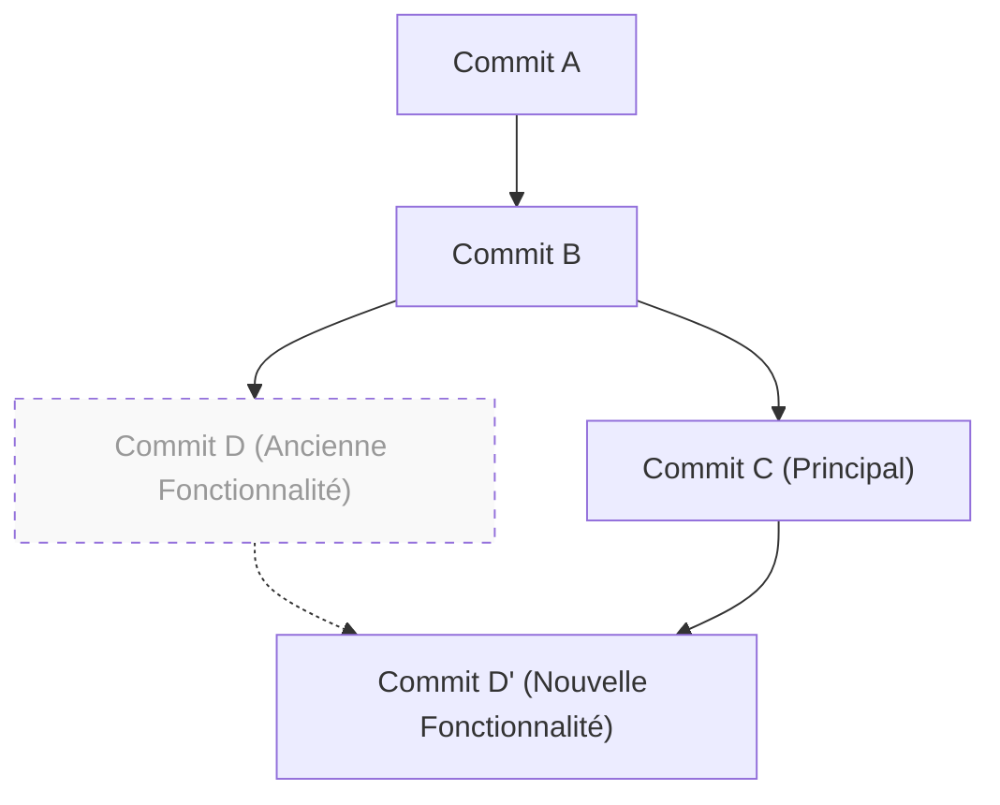

# 1. Introduction : Pourquoi le choix entre "merge ou rebase" est-il un débat éternel ?

Git est un système de contrôle de version indispensable dans le développement logiciel moderne. Lorsque plusieurs développeurs modifient simultanément une base de code, le puissant modèle de branches de Git prend tout son sens. Cependant, dans le développement en équipe, le débat sur "s'il faut utiliser `merge` ou `rebase`" est un sujet qui tourmente constamment les développeurs, des débutants aux experts.

Dans cet article, nous explorerons les différences de mécanisme entre `git merge` et `git rebase` en partant de la structure interne de Git, à savoir le graphe orienté acyclique (DAG) et les propriétés mathématiques des hachages de commit. Ensuite, nous expliquerons en profondeur comment les utiliser correctement en pratique, en nous appuyant sur des flux de travail (workflows) concrets. En allant au-delà d'une simple introduction aux commandes et en comprenant les calculs que Git effectue en arrière-plan, vous perdrez votre peur des conflits et serez en mesure de construire un historique propre et traçable.

---

# 2. Structure interne de Git : Hachages de commit et modèle d'objets

Pour comprendre comment Git intègre l'historique, il faut d'abord savoir comment Git stocke les données. Git ne sauvegarde pas simplement les différences (patchs) des modifications de fichiers, mais plutôt un instantané (snapshot) de l'ensemble du système de fichiers à un moment donné.

## 2.1 Propriétés cryptographiques des hachages de commit

Chaque commit dans Git est identifié de manière unique par un nombre hexadécimal de 40 caractères calculé à partir de son contenu à l'aide de la fonction de hachage SHA-1 (Secure Hash Algorithm 1). L'objet commit est composé des éléments suivants :

1. **Pointeur vers l'objet Tree** : Un instantané de la structure des répertoires et des fichiers (Blob) à ce moment-là.
2. **Pointeurs vers les commits parents** : Les valeurs de hachage d'un ou plusieurs commits parents (le premier commit n'a pas de parent, et un commit de fusion a deux parents ou plus).
3. **Informations de l'auteur (Author)** : La personne qui a écrit le code et la date/heure.
4. **Informations du validateur (Committer)** : La personne qui a créé/appliqué le commit et la date/heure.
5. **Message de commit** : Texte expliquant l'intention de la modification.

Exprimée mathématiquement, la valeur de hachage $H(C)$ pour l'objet commit $C$ est définie comme suit :

$$
H(C) = \text{SHA-1}( \text{tree} \parallel \text{parent} \parallel \text{author} \parallel \text{committer} \parallel \text{message} )
$$

Ici, $\parallel$ représente la concaténation des données. En raison des caractéristiques de la fonction de hachage, le simple fait de changer une lettre dans le message de commit, ou d'avoir un commit parent différent, générera une valeur de hachage complètement différente. En d'autres termes, **les commits sont immuables (Immutable)**. Lorsque l'on dit que le `rebase`, décrit plus loin, "réécrit l'historique", c'est parce qu'il crée en fait de "nouveaux commits avec des contenus similaires mais des valeurs de hachage différentes".

La taille de l'espace de hachage est de $2^{160}$, et la probabilité $P$ qu'une collision (deux commits différents ayant la même valeur de hachage) se produise peut être approximée par la théorie du paradoxe des anniversaires (Birthday Paradox) comme suit ($n$ étant le nombre de commits) :

$$
P(\text{collision}) \approx 1 - \exp\left(-\frac{n^2}{2 \times 2^{160}}\right)
$$

Cette probabilité est extrêmement faible et, en pratique, il est presque impossible que les hachages de commit de Git entrent en collision.

---

# 3. Théorie des graphes et DAG : Modèle mathématique de l'historique Git

L'historique des commits de Git est modélisé comme un "graphe orienté acyclique" (Directed Acyclic Graph, DAG) en théorie des graphes.

## 3.1 Qu'est-ce qu'un DAG (graphe orienté acyclique) ?

Dans un graphe $G = (V, E)$, $V$ est l'ensemble des commits (sommets), et $E$ est l'ensemble des arêtes orientées montrant les relations parent-enfant entre les commits. Dans Git, la direction des arêtes va "du commit enfant vers le commit parent". C'est parce le nouveau commit conserve un pointeur vers le commit passé.



La caractéristique principale d'un DAG est l'absence de cycles (boucles). Grâce à cela, les algorithmes qui remontent l'historique des commits ne tombent jamais dans une boucle infinie et peuvent atteindre la fin (le commit initial) à coup sûr.

## 3.2 Tri topologique et ordre de l'historique

Lors de l'affichage de l'historique avec des commandes comme `git log`, le DAG est ordonné sous forme de liste unidimensionnelle par un algorithme de tri topologique (Topological Sort). Pour toute arête orientée $u \to v$ ($u$ est l'enfant de $v$) dans le DAG, l'algorithme les réorganise de sorte que $u$ apparaisse avant $v$ dans la liste.

---

# 4. Le mécanisme et les types de git merge

La commande la plus fondamentale pour intégrer les modifications d'une branche est `git merge`. Cependant, en fonction de l'état actuel, Git choisit automatiquement une stratégie de fusion différente.

## 4.1 Fusion Fast-Forward (--ff)

Si la branche cible de l'intégration (ex. : `main`) est un ancêtre direct de la branche source de l'intégration (ex. : `feature`), Git effectue une fusion "Fast-Forward" (avance rapide). C'est une opération qui ne crée pas de nouveau commit, mais qui avance simplement le pointeur de la branche.



La fusion Fast-Forward maintient l'historique en ligne droite, mais elle a l'inconvénient de perdre le contexte de "quels groupes de commits constituaient le développement d'une fonctionnalité (feature) spécifique".

## 4.2 Fusion Non-Fast-Forward (--no-ff)

Si vous spécifiez explicitement `git merge --no-ff`, Git créera toujours un nouveau "commit de fusion", même dans une situation où le Fast-Forward est possible. Un commit de fusion est un commit spécial avec deux parents.



L'avantage de cette méthode est que l'existence et l'histoire de la branche de fonctionnalité restent claires sur le DAG. Lorsqu'un problème survient, il est possible d'annuler (revert) en toute sécurité l'ensemble de la fonctionnalité en exécutant `git revert -m 1 <hachage du commit de fusion>`.

## 4.3 Algorithme de fusion à 3 voies (3-Way Merge)

Si la branche cible et la branche source ont chacune leurs propres commits, Git exécute une fusion à 3 voies. Git explore alors le DAG et trouve "l'ancêtre commun le plus proche" (Lowest Common Ancestor, LCA) des deux branches.

La complexité algorithmique $T_{\text{LCA}}$ pour trouver le LCA peut être exécutée en temps linéaire par rapport au nombre de sommets $|V|$ et d'arêtes $|E|$ :

$$
T_{\text{LCA}} = \mathcal{O}(|V| + |E|)
$$

Git compare trois états : "l'état du LCA", "l'état de la branche actuelle" et "l'état de l'autre branche". S'il n'y a pas de conflit de modifications, il générera automatiquement un commit de fusion.

---

# 5. Le mécanisme de git rebase et la reconstruction de l'historique

Alors que `git merge` "intègre" l'historique, `git rebase` "reconstruit" (rattache) l'historique.

## 5.1 Le fonctionnement interne de Rebase

Lorsque vous rebasez la branche `feature` sur la branche `main` (`git rebase main`), le fonctionnement interne est le suivant :

1. Trouver l'ancêtre commun (LCA) entre la branche `feature` et la branche `main`.
2. Sauvegarder dans une zone temporaire les différences des commits entre le LCA et l'extrémité de la branche `feature`.
3. Déplacer le pointeur de la branche `feature` vers l'extrémité de la branche `main`.
4. Appliquer les différences sauvegardées une par une sur la nouvelle base (l'extrémité de `main`) dans l'ordre (Cherry-Pick), créant ainsi de nouveaux commits.



Le point important ici est que le commit généré par le rebase $D'$ a **des commits parents différents du commit d'origine $D$, et aura donc une valeur de hachage complètement différente** (voir la définition de la fonction de hachage $H(C)$ mentionnée précédemment).

## 5.2 Rebase interactif (Interactive Rebase)

L'utilisation de `git rebase -i` (ou `--interactive`) vous permet de manipuler l'historique des commits à votre guise. C'est l'outil ultime pour nettoyer l'historique local.

- `pick` : Conserver le commit tel quel.
- `reword` : Modifier uniquement le message du commit.
- `edit` : Suspendre le processus pour modifier le contenu du commit.
- `squash` : Fusionner ce commit avec le commit précédent et combiner leurs messages.
- `fixup` : Semblable à `squash`, mais ignore le message de ce commit.
- `drop` : Supprimer complètement le commit.

D'un point de vue mathématique, si une branche contient $N$ commits, les variations (permutations) d'historique linéaire $P$ qui peuvent être générées en changeant l'ordre lors du rebase sont les suivantes :

$$
P = N!
$$

Git donne aux développeurs $N!$ degrés de liberté, ce qui leur permet de garder un historique logique et élégant.

---

# 6. La règle d'or du Rebase (The Golden Rule of Rebase)

Bien que `rebase` soit très puissant, il existe une règle absolue.

> **"Ne jamais rebaser un historique public."**
> *(Never rebase public history)*

## 6.1 Pourquoi ne faut-il pas rebaser un historique public ?

Git est distribué. Les commits que vous avez poussés sur `origin/main` ont également été clonés (dupliqués) dans les dépôts locaux des autres développeurs. Si vous rebasez un commit déjà poussé pour réécrire l'historique, puis que vous forcez l'écrasement avec `git push --force`, que se passera-t-il ?

Le DAG local des autres développeurs et le DAG distant vont diverger fondamentalement. Lorsque les autres développeurs exécuteront `git pull`, Git tentera de forcer la fusion de groupes de commits ayant des historiques différents, ce qui entraînera d'énormes conflits et des commits en double (des commits ayant le même contenu mais des hachages différents), plongeant le dépôt dans un état de panique.

La règle d'or est de **"n'utiliser rebase que sur des branches locales qui n'ont pas encore été partagées avec d'autres"**.

---

# 7. Résolution des conflits et git rebase --continue

Si plusieurs personnes modifient la même partie d'un même fichier, un conflit se produit. Le processus de résolution des conflits est différent pour `merge` et `rebase`.

## 7.1 Résolution des conflits dans Merge

Avec `git merge`, la résolution des conflits ne se produit **qu'une seule fois**. Vous corrigez tous les conflits en une seule fois juste avant de créer le commit de fusion final.

## 7.2 Résolution des conflits dans Rebase

Avec `git rebase`, en raison de sa nature consistant à réappliquer les commits un par un, **un conflit peut survenir pour chaque commit**.

Si un conflit survient pendant le rebase, Git interrompt le processus. Le flux de résolution est le suivant :

1. Ouvrez un éditeur de texte ou un IDE (comme VS Code) et corrigez manuellement les marqueurs de conflit (`<<<<<<<`, `======`, `>>>>>>>`).
2. Ajoutez les fichiers corrigés à l'index :
   ```bash
   git add <fichiers_modifiés>
   ```
3. Sans créer de commit, reprenez le processus de rebase :
   ```bash
   git rebase --continue
   ```

Si vous souhaitez annuler le rebase lui-même et revenir à l'état d'origine, exécutez la commande suivante :
```bash
git rebase --abort
```
(*Si la résolution d'un conflit n'est pas nécessaire et que vous souhaitez sauter ce commit, utilisez `git rebase --skip`.*)

---

# 8. Utilisation correcte en pratique (Pratiques de Workflow)

Alors, comment devez-vous utiliser `merge` et `rebase` dans des environnements de développement réels ? Voici l'approche la plus standard et la plus sûre.

## 8.1 [Scénario 1] Nettoyer l'historique de travail local (Utilisation de Rebase)

Supposons que vous développiez sur une branche de fonctionnalité et que de nombreux petits commits (comme des "corrections de fautes de frappe" ou "sauvegardes temporaires") se soient accumulés. Avant de créer une Pull Request (PR), utilisez le rebase interactif pour les organiser en unités significatives.

```bash
# Exécuté sur la branche feature
git rebase -i HEAD~5
# (L'éditeur s'ouvre, et vous pouvez utiliser squash et fixup pour nettoyer l'historique)
```

Cela crée un historique de commits clair, rendant vos intentions facilement compréhensibles pour le réviseur.

## 8.2 [Scénario 2] Suivre les dernières modifications de la branche main (Utilisation de Rebase)

Si le développement prend du temps et que les modifications des autres sont continuellement fusionnées dans la branche `main`, votre branche `feature` deviendra obsolète. Dans ce cas, suivez le rythme en rebasant votre branche `feature` sur la dernière version de `main`.

```bash
# Récupérer les dernières informations de main
git fetch origin

# Rattacher la branche feature au sommet de la dernière version de main
git rebase origin/main
```

Cela maintient un historique en ligne droite et permet d'éviter les conflits lors de la fusion ultérieure. Cela empêche également la création de commits de fusion inutiles ("Merge branch 'main' into feature").

## 8.3 [Scénario 3] Intégration de fonctionnalités terminées (Utilisation de Merge)

Une fois le développement sur la branche `feature` terminé, il est temps de l'intégrer dans la branche `main`. Ici, utilisez **`git merge --no-ff`** (c'est la même chose que de choisir "Create a merge commit" dans une Pull Request sur GitHub).

```bash
git checkout main
git merge --no-ff feature -m "Merge feature: Implémentation de la fonction de connexion utilisateur"
git push origin main
```

Cela laisse un point nodal historique (un commit de fusion) sur le DAG de la branche `main`, indiquant qu'"une fonctionnalité a été fusionnée ici". Lorsque vous regardez l'historique plus tard, il est plus facile de suivre le code par fonctionnalité.

---

# 9. Conclusion (Résumé)

Lors de l'utilisation de Git, les approches extrêmes telles que "tout résoudre avec Merge" ou "tout garder en ligne droite avec Rebase" ont chacune leurs avantages et leurs inconvénients.

La meilleure pratique en milieu professionnel est une approche hybride : **"utiliser rebase pour nettoyer élégamment l'historique privé local, et utiliser merge --no-ff pour conserver le contexte dans l'historique public d'intégration"**.

- **Local (espace de travail personnel)** : Utilisez `rebase` pour éliminer les commits inutiles et maintenir un historique linéaire en suivant les dernières modifications de la branche principale.
- **Global (espace de travail partagé)** : Utilisez `merge --no-ff` pour enregistrer l'existence de la branche de fonctionnalité sous forme de commit de fusion dans le DAG, facilitant ainsi les reverts et le suivi.

En comprenant le contexte mathématique et architectural tel que la structure du DAG et le fonctionnement de la fonction de hachage, les commandes Git passent de la simple mémorisation à la "conception intentionnelle d'un historique". En respectant la règle d'or du rebase, choisissez les commandes optimales pour chaque situation et construisez un historique de commits propre, facile à lire et à maintenir pour toute l'équipe.
