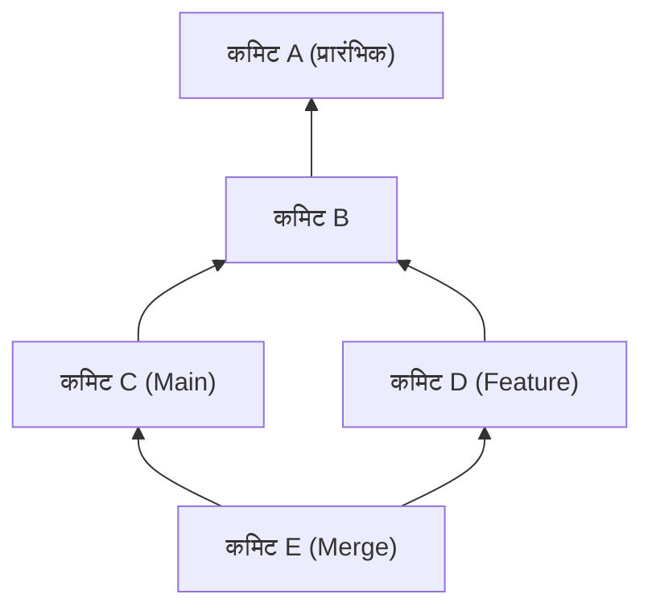
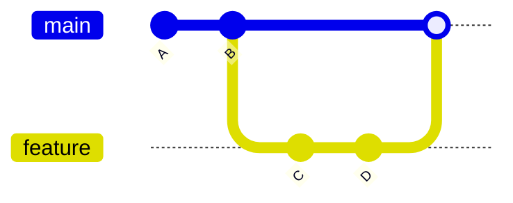
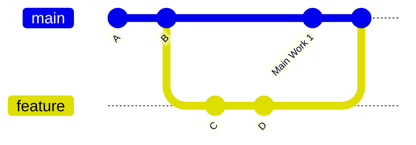
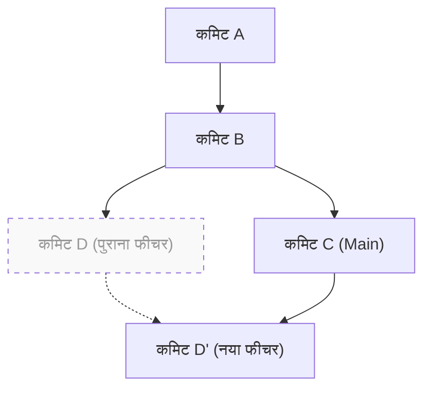

# 1. परिचय: "merge या rebase" हमेशा एक बहस का विषय क्यों है?

Git आधुनिक सॉफ़्टवेयर विकास में एक अपरिहार्य वर्ज़न कंट्रोल सिस्टम है। जब कई डेवलपर्स एक साथ कोडबेस में परिवर्तन करते हैं, तो Git का शक्तिशाली ब्रांच मॉडल अपनी ताकत दिखाता है। हालाँकि, टीम डेवलपमेंट में "क्या `merge` या `rebase` का उपयोग करना चाहिए" यह चर्चा हमेशा शुरुआती लोगों से लेकर अनुभवी डेवलपर्स तक को परेशान करने वाले विषयों में से एक रही है।

इस लेख में, हम Git की आंतरिक संरचना, जैसे DAG (Directed Acyclic Graph) और कमिट हैश के गणितीय गुणों से शुरू करते हुए, `git merge` और `git rebase` के मैकेनिज़्म के बीच के अंतर को गहराई से समझेंगे। इसके अलावा, हम व्यावहारिक वर्कफ़्लो के साथ विस्तार से बताएंगे कि वास्तविक काम में इनका सही तरीके से उपयोग कैसे किया जाए। केवल कमांड्स के परिचय से आगे बढ़कर, बैकग्राउंड में Git किस तरह की गणनाएँ कर रहा है, यह समझने से आपका कॉन्फ्लिक्ट (टकराव) का डर खत्म हो जाएगा और आप एक साफ़ और ट्रैक करने योग्य इतिहास (history) बना सकेंगे।

---

# 2. Git की आंतरिक संरचना: कमिट हैश और ऑब्जेक्ट मॉडल

Git इतिहास को कैसे इंटीग्रेट (एकीकृत) करता है, इसे समझने के लिए पहले यह जानना ज़रूरी है कि Git डेटा को कैसे सेव करता है। Git केवल फ़ाइल में बदलावों के अंतर (पैच) को सेव नहीं करता है, बल्कि यह किसी विशिष्ट समय पर पूरे फ़ाइल सिस्टम के स्नैपशॉट को सेव करता है।

## 2.1 कमिट हैश के क्रिप्टोग्राफ़िक गुण

Git का प्रत्येक कमिट इसके कंटेंट के आधार पर कैलकुलेट किए गए SHA-1 (Secure Hash Algorithm 1) हैश फ़ंक्शन द्वारा 40-अंकीय हेक्साडेसिमल संख्या से विशिष्ट रूप से पहचाना जाता है। कमिट ऑब्जेक्ट में निम्नलिखित तत्व (elements) होते हैं:

1. **Tree ऑब्जेक्ट का पॉइंटर**: उस समय के डायरेक्टरी स्ट्रक्चर और फ़ाइल (Blob) का स्नैपशॉट।
2. **पैरेंट कमिट का पॉइंटर**: एक या अधिक पैरेंट कमिट्स के हैश मान (पहले कमिट का कोई पैरेंट नहीं होता है, और मर्ज कमिट के 2 या अधिक पैरेंट होते हैं)।
3. **लेखक की जानकारी (Author)**: वह व्यक्ति जिसने कोड लिखा है और उसका समय।
4. **कमिटर की जानकारी (Committer)**: वह व्यक्ति जिसने कमिट बनाया/लागू किया है और उसका समय।
5. **कमिट मैसेज**: बदलाव के उद्देश्य को स्पष्ट करने वाला टेक्स्ट।

गणितीय रूप से व्यक्त करें, तो कमिट ऑब्जेक्ट $C$ के लिए हैश मान $H(C)$ को इस प्रकार परिभाषित किया गया है:

$$
H(C) = \text{SHA-1}( \text{tree} \parallel \text{parent} \parallel \text{author} \parallel \text{committer} \parallel \text{message} )
$$

यहाँ, $\parallel$ डेटा के संयोजन को दर्शाता है। हैश फ़ंक्शन की विशेषताओं के कारण, भले ही कमिट मैसेज में एक अक्षर बदल दिया जाए, या पैरेंट कमिट अलग हो, पूरी तरह से अलग हैश मान उत्पन्न होता है। दूसरे शब्दों में, **कमिट अपरिवर्तनीय (Immutable) होते हैं**। बाद में जिस `rebase` का वर्णन "इतिहास को फिर से लिखने" के रूप में किया गया है, वह वास्तव में "एक नया कमिट बना रहा है जिसकी सामग्री समान है लेकिन हैश मान अलग है।"

हैश स्पेस का आकार $2^{160}$ है, और टकराव की संभावना (Collision) (यह संभावना कि विभिन्न कमिट्स का हैश मान समान होगा) $P$ को बर्थडे पैराडॉक्स (Birthday Paradox) थ्योरी का उपयोग करके इस प्रकार अनुमानित किया जा सकता है ($n$ कमिट्स की संख्या है):

$$
P(\text{collision}) \approx 1 - \exp\left(-\frac{n^2}{2 \times 2^{160}}\right)
$$

यह संभावना बहुत ही कम है, और व्यावहारिक रूप से यह लगभग असंभव है कि Git का कमिट हैश आपस में टकराए।

---

# 3. ग्राफ़ थ्योरी और DAG: Git इतिहास का गणितीय मॉडल

Git के कमिट इतिहास को ग्राफ़ थ्योरी में "डायरेक्टेड एसाइक्लिक ग्राफ़ (Directed Acyclic Graph, DAG)" के रूप में मॉडल किया गया है।

## 3.1 DAG (डायरेक्टेड एसाइक्लिक ग्राफ़) क्या है?

ग्राफ़ $G = (V, E)$ में, $V$ कमिट्स (Vertices) का सेट है, और $E$ कमिट्स के बीच पैरेंट-चाइल्ड संबंध को दर्शाने वाले डायरेक्टेड एजेज़ (Directed Edges) का सेट है। Git में, एजेज़ की दिशा "चाइल्ड कमिट से पैरेंट कमिट" की ओर होती है। ऐसा इसलिए है क्योंकि नए कमिट पिछले कमिट का पॉइंटर रखते हैं।



DAG की सबसे बड़ी विशेषता यह है कि "इसमें कोई चक्र (Cycle) नहीं होता है"। इस वजह से, कमिट इतिहास को पीछे ट्रेस करने वाला एल्गोरिदम कभी भी अनंत लूप में नहीं फँसता है, और यह निश्चित रूप से अंत (प्रारंभिक कमिट) तक पहुँच सकता है।

## 3.2 टोपोलॉजिकल सॉर्ट और इतिहास का क्रम

जब Git के `git log` कमांड आदि का उपयोग करके इतिहास प्रदर्शित किया जाता है, तो DAG को टोपोलॉजिकल सॉर्ट (Topological Sort) एल्गोरिदम का उपयोग करके एक 1-आयामी (1-dimensional) सूची के रूप में क्रमित किया जाता है। DAG में किसी भी डायरेक्टेड एज $u \to v$ ($u$, $v$ का चाइल्ड है) के लिए, यह इस तरह से पुनर्व्यवस्थित होता है कि सूची में $u$, $v$ से पहले आए।

---

# 4. git merge का मैकेनिज़्म और प्रकार

ब्रांच के बदलावों को इंटीग्रेट करने के लिए सबसे बुनियादी कमांड `git merge` है। हालाँकि, वर्तमान स्थिति के आधार पर, Git स्वचालित रूप से अलग-अलग मर्ज रणनीतियों का चयन करता है।

## 4.1 Fast-Forward मर्ज (--ff)

यदि लक्ष्य (जैसे: `main`) ब्रांच सोर्स (जैसे: `feature`) ब्रांच का प्रत्यक्ष पूर्वज (direct ancestor) है, तो Git "Fast-Forward" (तेज़ी से आगे बढ़ाना) मर्ज को निष्पादित करता है। यह एक ऐसा ऑपरेशन है जो नया कमिट नहीं बनाता है, बल्कि यह बस ब्रांच पॉइंटर को आगे बढ़ाता है।



Fast-Forward मर्ज इतिहास को एक सीधी रेखा में रखता है, लेकिन इसका एक नुकसान यह है कि "कौन से कमिट्स का समूह एक फीचर (feature) के विकास के रूप में एक साथ था", इसका संदर्भ (Context) खो जाता है।

## 4.2 Non-Fast-Forward मर्ज (--no-ff)

यदि आप स्पष्ट रूप से `git merge --no-ff` निर्दिष्ट करते हैं, तो भले ही Fast-Forward संभव हो, यह हमेशा एक नया "मर्ज कमिट" बनाएगा। मर्ज कमिट 2 पैरेंट्स वाला एक विशेष कमिट होता है।



इस पद्धति का लाभ यह है कि फीचर ब्रांच का अस्तित्व और इतिहास DAG पर स्पष्ट रूप से रहता है। जब कोई समस्या उत्पन्न होती है, तो आप `git revert -m 1 <मर्ज कमिट का हैश>` चलाकर पूरे फीचर को एक ही बार में सुरक्षित रूप से पूर्ववत (रिवर्ट) कर सकते हैं।

## 4.3 3-वे मर्ज (3-Way Merge) एल्गोरिदम

जब लक्ष्य ब्रांच और सोर्स ब्रांच दोनों के अपने स्वयं के कमिट होते हैं, तो Git 3-वे मर्ज निष्पादित करता है। इस समय, Git DAG को खोजता है और दोनों ब्रांचों के "न्यूनतम सामान्य पूर्वज (Lowest Common Ancestor, LCA)" का पता लगाता है।

LCA खोजने के लिए एल्गोरिदम की कम्प्यूटेशनल जटिलता (Computational Complexity) $T_{\text{LCA}}$ को वर्टिसेस की संख्या $|V|$ और एजेज़ की संख्या $|E|$ के सापेक्ष रैखिक समय (Linear Time) में निष्पादित किया जा सकता है:

$$
T_{\text{LCA}} = \mathcal{O}(|V| + |E|)
$$

Git तीन चीजों की तुलना करता है: "LCA की स्थिति", "वर्तमान ब्रांच की स्थिति", और "दूसरी ब्रांच की स्थिति", और यदि परिवर्तनों में कोई टकराव (conflict) नहीं होता है, तो यह स्वचालित रूप से एक मर्ज कमिट उत्पन्न करता है।

---

# 5. git rebase का मैकेनिज़्म और इतिहास का पुनर्निर्माण

जबकि `git merge` इतिहास को "एकीकृत (Integrate)" करता है, `git rebase` इतिहास का "पुनर्निर्माण (Rebuild)" करता है।

## 5.1 Rebase के पीछे की कार्यप्रणाली

जब आप `feature` ब्रांच को `main` ब्रांच में रिबेस करते हैं (`git rebase main`), तो आंतरिक कार्यप्रणाली इस प्रकार होती है:

1. `feature` ब्रांच और `main` ब्रांच के सामान्य पूर्वज (LCA) का पता लगाएं।
2. LCA से लेकर `feature` ब्रांच के शीर्ष तक के कमिट्स के अंतर को एक अस्थायी क्षेत्र (Temporary Area) में सेव करें।
3. `feature` ब्रांच के पॉइंटर को `main` ब्रांच के शीर्ष (Tip) पर ले जाएं।
4. सहेजे गए अंतरों को एक-एक करके नए बेस (`main` के शीर्ष) पर क्रमिक रूप से लागू (Cherry-Pick) करें, और नए कमिट्स बनाएं।



यहाँ सबसे महत्वपूर्ण बात यह है कि रिबेस द्वारा उत्पन्न कमिट $D'$, मूल कमिट $D$ से **एक अलग पैरेंट कमिट होने के कारण, पूरी तरह से अलग हैश मान रखता है** (ऊपर उल्लिखित हैश फ़ंक्शन परिभाषा $H(C)$ देखें)।

## 5.2 इंटरएक्टिव रिबेस (Interactive Rebase)

`git rebase -i` (या `--interactive`) का उपयोग करके, आप अपनी इच्छानुसार कमिट इतिहास में हेरफेर कर सकते हैं। स्थानीय (Local) इतिहास को व्यवस्थित करने के लिए यह सबसे शक्तिशाली टूल है।

- `pick` : कमिट को वैसे ही अपनाएं।
- `reword` : केवल कमिट मैसेज को संशोधित करें।
- `edit` : कमिट के कंटेंट को संशोधित करने के लिए रुकें।
- `squash` : इस कमिट को पिछले कमिट के साथ मिलाएँ, और संदेशों को भी जोड़ें।
- `fixup` : `squash` के समान, लेकिन इस कमिट के मैसेज को हटा दें।
- `drop` : कमिट को पूरी तरह से हटा दें।

गणितीय दृष्टिकोण से देखें तो, यदि किसी ब्रांच में $N$ कमिट हैं, तो रिबेस के क्रम को बदलकर उत्पन्न किए जा सकने वाले रैखिक इतिहास के रूपों (Permutations) $P$ की गणना इस प्रकार है:

$$
P = N!
$$

Git डेवलपर्स को $N!$ तरीकों की स्वतंत्रता देता है, जिससे वे अपने इतिहास को एक तार्किक और सुंदर स्थिति में रख सकते हैं।

---

# 6. रिबेस का सुनहरा नियम (The Golden Rule of Rebase)

`rebase` बहुत शक्तिशाली है, लेकिन इसका एक निरपेक्ष नियम (Absolute Rule) है:

> **"सार्वजनिक (Public) किए गए इतिहास पर कभी भी रिबेस (Rebase) न करें"**
> *(Never rebase public history)*

## 6.1 सार्वजनिक इतिहास को रिबेस क्यों नहीं करना चाहिए?

Git एक डिस्ट्रिब्यूटेड (Distributed) सिस्टम है। आपने जो कमिट `origin/main` पर पुश किए हैं, उन्हें अन्य डेवलपर्स के स्थानीय रिपॉजिटरी में भी क्लोन (प्रतिलिपि) किया गया है। अगर आप पहले से ही पुश किए गए कमिट्स को रिबेस करके इतिहास को फिर से लिखते हैं और `git push --force` का उपयोग करके इसे जबरन ओवरराइट करते हैं, तो क्या होगा?

अन्य डेवलपर्स के स्थानीय (Local) DAG और रिमोट (Remote) DAG मौलिक रूप से अलग हो जाएंगे। जब अन्य डेवलपर `git pull` निष्पादित करते हैं, तो Git अलग-अलग इतिहास वाले कमिट्स को जबरन मर्ज करने का प्रयास करेगा, जिससे भारी मात्रा में कॉन्फ्लिक्ट्स और डुप्लिकेट कमिट्स (समान परिवर्तन लेकिन अलग-अलग हैश वाले कमिट) उत्पन्न होंगे, और रिपॉजिटरी में अफरा-तफरी मच जाएगी।

यह एक सख्त नियम है कि रिबेस केवल **"उन स्थानीय ब्रांचों पर किया जाना चाहिए जिन्हें अभी तक किसी के साथ साझा नहीं किया गया है"**।

---

# 7. कॉन्फ्लिक्ट (टकराव) का समाधान और git rebase --continue

जब कई लोग एक ही फ़ाइल के एक ही हिस्से में बदलाव करते हैं, तो कॉन्फ्लिक्ट होता है। `merge` और `rebase` में कॉन्फ्लिक्ट को हल करने की प्रक्रिया अलग-अलग होती है।

## 7.1 Merge में कॉन्फ्लिक्ट का समाधान

`git merge` के मामले में, कॉन्फ्लिक्ट का समाधान **केवल एक बार** होता है। आप अंतिम मर्ज कमिट बनाने से ठीक पहले सभी टकराव वाले हिस्सों को एक ही बार में ठीक करते हैं।

## 7.2 Rebase में कॉन्फ्लिक्ट का समाधान

`git rebase` के मामले में, कमिट्स को एक-एक करके फिर से लागू करने की प्रकृति के कारण, **प्रत्येक कमिट पर कॉन्फ्लिक्ट होने की संभावना** होती है।

यदि रिबेस के दौरान कोई कॉन्फ्लिक्ट होता है, तो Git प्रक्रिया को रोक देगा। समाधान का प्रवाह (Flow) इस प्रकार है:

1. एडिटर या IDE (जैसे VS Code) खोलें और कॉन्फ्लिक्ट मार्कर्स (`<<<<<<<` , `======`, और `>>>>>>>`) को मैन्युअल रूप से ठीक करें।
2. संशोधित फ़ाइल को इंडेक्स में जोड़ें:
   ```bash
   git add <संशोधित_फ़ाइल>
   ```
3. बिना कोई कमिट बनाए रिबेस प्रक्रिया फिर से शुरू करें:
   ```bash
   git rebase --continue
   ```

यदि आप रिबेस को रद्द करना चाहते हैं और मूल स्थिति में वापस लौटना चाहते हैं, तो यह कमांड चलाएँ:
```bash
git rebase --abort
```
(* यदि आपको कॉन्फ्लिक्ट को हल करने की आवश्यकता नहीं है और आप उस कमिट को पूरी तरह से छोड़ना चाहते हैं, तो `git rebase --skip` का उपयोग करें।)

---

# 8. व्यावहारिक रूप से सही उपयोग (वर्कफ़्लो प्रैक्टिस)

तो, वास्तविक विकास के वातावरण में आपको `merge` और `rebase` का उपयोग कैसे करना चाहिए? यहाँ हम सबसे मानक (Standard) और सुरक्षित दृष्टिकोण प्रस्तुत कर रहे हैं।

## 8.1 [परिदृश्य 1] स्थानीय कार्य इतिहास को व्यवस्थित करना (Rebase का उपयोग)

मान लीजिए कि किसी फीचर ब्रांच में विकास के दौरान बहुत सारे छोटे-छोटे कमिट्स ("Typo फिक्स", "अस्थायी सेव", आदि) जमा हो गए हैं। पुल रिक्वेस्ट (PR) सबमिट करने से पहले, इन कमिट्स को सार्थक इकाइयों में व्यवस्थित करने के लिए इंटरएक्टिव रिबेस का उपयोग करें।

```bash
# फीचर ब्रांच में रहते हुए निष्पादित करें
git rebase -i HEAD~5
# (एडिटर खुलेगा, जहाँ आप squash और fixup का उपयोग करके इतिहास को साफ़ कर सकते हैं)
```

इससे, आप एक सुंदर कमिट इतिहास बना सकते हैं जिससे समीक्षकों (Reviewers) के लिए आपके इरादे को समझना आसान हो जाएगा।

## 8.2 [परिदृश्य 2] नवीनतम main ब्रांच के साथ अपडेट रहना (Rebase का उपयोग)

यदि विकास में अधिक समय लग रहा है, और अन्य लोगों के परिवर्तन लगातार `main` ब्रांच में मर्ज किए जा रहे हैं, तो आपकी `feature` ब्रांच पुरानी हो जाएगी। इस स्थिति में, आप अपनी `feature` ब्रांच को नवीनतम `main` ब्रांच में रिबेस करके इसे अपडेट कर सकते हैं।

```bash
# main की नवीनतम जानकारी प्राप्त करें
git fetch origin

# फीचर ब्रांच को नवीनतम main के शीर्ष पर स्थानांतरित करें
git rebase origin/main
```

इससे इतिहास एक सीधी रेखा बन जाता है, जिससे भविष्य में मर्ज करते समय कॉन्फ्लिक्ट्स को रोका जा सकता है। इसके अलावा, यह अनावश्यक मर्ज कमिट्स ("Merge branch 'main' into feature") उत्पन्न होने से भी रोकता है।

## 8.3 [परिदृश्य 3] पूर्ण हुए फीचर को एकीकृत करना (Merge का उपयोग)

यह वह चरण है जब `feature` ब्रांच में विकास पूरा हो चुका है, और आप अंततः इसे `main` ब्रांच में एकीकृत (Integrate) कर रहे हैं। यहाँ, हम **`git merge --no-ff`** का उपयोग करेंगे (यह GitHub जैसे प्लेटफ़ॉर्म पर पुल रिक्वेस्ट में "Create a merge commit" चुनने के समान है)।

```bash
git checkout main
git merge --no-ff feature -m "Merge feature: यूज़र लॉगिन फीचर का कार्यान्वयन"
git push origin main
```

इससे, `main` ब्रांच के DAG पर एक ऐतिहासिक नोड (मर्ज कमिट) बन जाएगा जो यह दर्शाएगा कि "यहाँ एक फीचर मर्ज किया गया था"। जब आप बाद में इतिहास को देखेंगे, तो फीचर के आधार पर कोड को ट्रैक करना आसान होगा।

---

# 9. निष्कर्ष (सारांश)

Git ऑपरेशन्स में "सब कुछ Merge के साथ करना" या "सब कुछ Rebase के साथ सीधा करना" जैसे चरम (Extreme) दृष्टिकोणों के अपने-अपने फायदे और नुकसान हैं।

वास्तविक अभ्यास में सबसे अच्छी प्रथा (Best Practice) यह हाइब्रिड (Hybrid) दृष्टिकोण है: **"अपने स्थानीय निजी इतिहास को खूबसूरती से व्यवस्थित करने के लिए rebase का उपयोग करें, और सार्वजनिक एकीकरण इतिहास के संदर्भ को बनाए रखने के लिए merge --no-ff का उपयोग करें।"**

- **स्थानीय (व्यक्तिगत कार्यक्षेत्र - Local)**: अनावश्यक कमिट्स को खत्म करने के लिए `rebase` का उपयोग करें, और नवीनतम मेनलाइन के साथ अपडेट रहकर एक सीधा इतिहास बनाए रखें।
- **ग्लोबल (साझा कार्यक्षेत्र - Global)**: फीचर ब्रांच के अस्तित्व को मर्ज कमिट के रूप में DAG में दर्ज करने के लिए `merge --no-ff` का उपयोग करें, ताकि इसे रिवर्ट या ट्रैक करना आसान हो।

DAG की संरचना और हैश फ़ंक्शन्स के तंत्र जैसी गणितीय और संरचनात्मक पृष्ठभूमि को समझकर, Git कमांड्स का उपयोग केवल याद रखने से "इरादे के साथ इतिहास डिजाइन करने" में बदल जाता है। रिबेस के सुनहरे नियम का पालन करते हुए, स्थिति के अनुसार सबसे उपयुक्त कमांड चुनें, और एक साफ़ कमिट इतिहास बनाएँ जिसे पूरी टीम के लिए पढ़ना और मेंटेन करना आसान हो।
