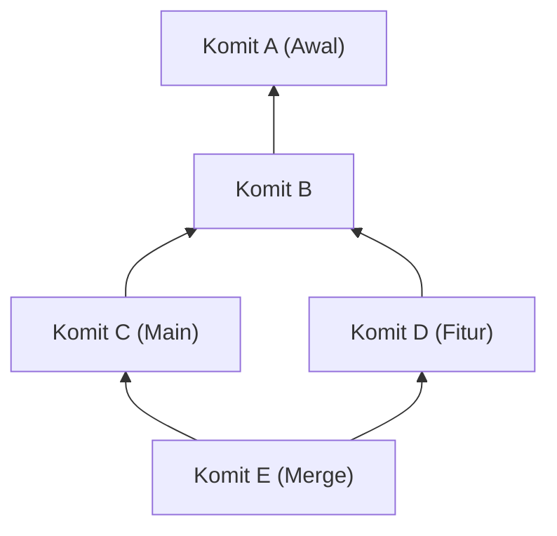
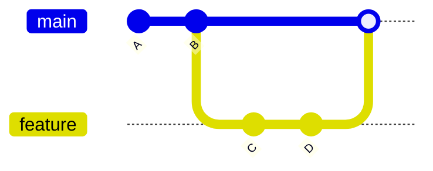
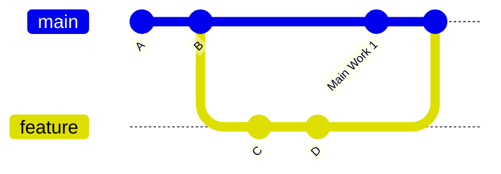
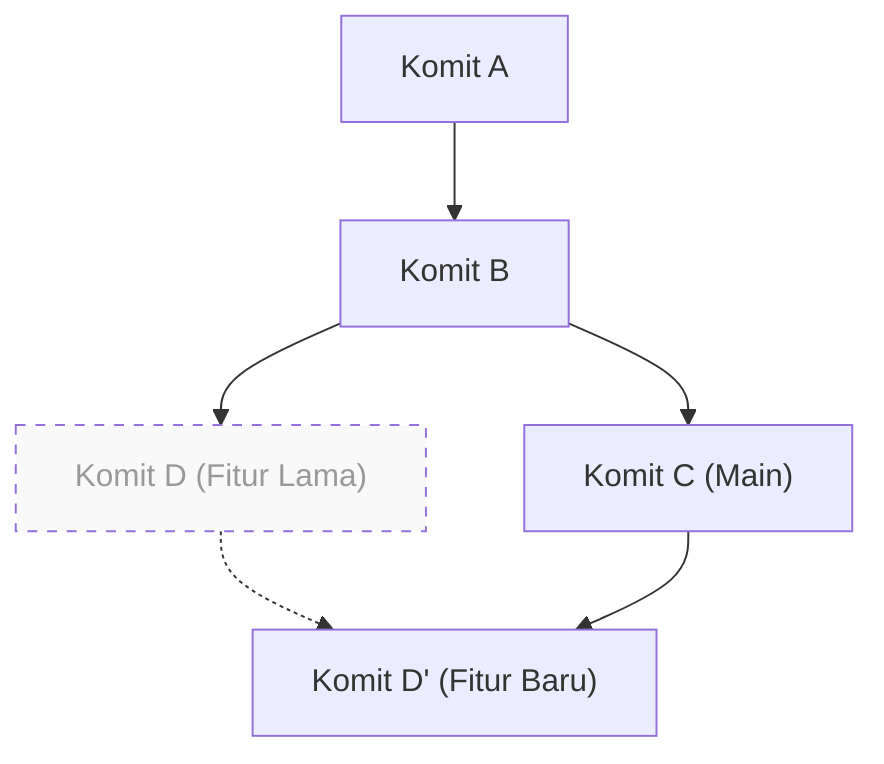

# 1. Pendahuluan: Mengapa "merge atau rebase" menjadi perdebatan abadi

Git adalah sistem pengontrol versi yang sangat penting dalam pengembangan perangkat lunak modern. Saat beberapa pengembang mengubah basis kode secara bersamaan, model cabang (branching) Git yang kuat akan sangat berguna. Namun, dalam pengembangan tim, perdebatan tentang "apakah harus menggunakan merge atau rebase" merupakan salah satu topik yang selalu membingungkan pengembang, mulai dari pemula hingga ahli.

Artikel ini akan mengupas perbedaan mekanisme antara `git merge` dan `git rebase` secara mendalam, mulai dari struktur internal Git yaitu DAG (Directed Acyclic Graph) dan sifat matematis dari hash komit. Selain itu, artikel ini juga akan menjelaskan secara menyeluruh bagaimana cara menggunakan keduanya secara tepat dalam praktik, disertai dengan alur kerja (workflow) yang konkret. Dengan memahami tidak hanya sekadar pengenalan perintah, tetapi juga perhitungan apa yang dilakukan Git di balik layar, Anda akan menghilangkan ketakutan terhadap konflik dan mampu membangun riwayat yang bersih serta mudah dilacak.

---

# 2. Struktur Internal Git: Hash Komit dan Model Objek

Untuk memahami bagaimana Git mengintegrasikan riwayat, pertama-tama kita perlu mengetahui bagaimana Git menyimpan data. Git tidak sekadar menyimpan perbedaan (patch) dari perubahan file, melainkan menyimpan cuplikan (snapshot) dari seluruh sistem file pada suatu titik waktu.

## 2.1 Sifat Kriptografi dari Hash Komit

Setiap komit Git diidentifikasi secara unik dengan 40 digit heksadesimal yang dihasilkan oleh fungsi hash SHA-1 (Secure Hash Algorithm 1) berdasarkan isinya. Objek komit terdiri dari elemen-elemen berikut:

1. **Pointer ke objek Tree**: Cuplikan struktur direktori dan file (Blob) pada saat itu.
2. **Pointer ke komit induk (parent)**: Nilai hash dari satu atau lebih komit induk (komit pertama tidak memiliki induk, sedangkan komit merge memiliki dua induk atau lebih).
3. **Informasi pembuat (Author)**: Orang yang menulis kode beserta tanggal dan waktunya.
4. **Informasi committer (Committer)**: Orang yang membuat/menerapkan komit beserta tanggal dan waktunya.
5. **Pesan komit**: Teks yang menjelaskan maksud perubahan.

Secara matematis, nilai hash $H(C)$ untuk objek komit $C$ didefinisikan sebagai berikut:

$$
H(C) = \text{SHA-1}( \text{tree} \parallel \text{parent} \parallel \text{author} \parallel \text{committer} \parallel \text{message} )
$$

Di sini, $\parallel$ merepresentasikan penggabungan data. Karena karakteristik fungsi hash, meskipun hanya mengubah satu karakter pada pesan komit, atau jika komit induknya berbeda, nilai hash yang dihasilkan akan benar-benar berbeda. Artinya, **komit bersifat tidak dapat diubah (Immutable)**. Alasan mengapa `rebase` yang akan dibahas nanti sering disebut "menulis ulang riwayat" sebenarnya adalah karena Git "membuat komit baru yang isinya mirip tetapi memiliki nilai hash yang berbeda".

Ukuran ruang hash adalah $2^{160}$, dan probabilitas $P$ terjadinya tabrakan (dua komit berbeda memiliki nilai hash yang sama) dapat diaproksimasi menggunakan teori Paradoks Ulang Tahun (Birthday Paradox) sebagai berikut ($n$ adalah jumlah komit):

$$
P(\text{collision}) \approx 1 - \exp\left(-\frac{n^2}{2 \times 2^{160}}\right)
$$

Probabilitas ini sangat rendah, sehingga secara praktis hampir tidak mungkin terjadi tabrakan hash komit pada Git.

---

# 3. Teori Graf dan DAG: Model Matematis Riwayat Git

Riwayat komit Git dimodelkan sebagai "Directed Acyclic Graph (DAG)" dalam teori graf.

## 3.1 Apa itu DAG (Directed Acyclic Graph)?

Dalam graf $G = (V, E)$, $V$ adalah himpunan komit (simpul/vertex), dan $E$ adalah himpunan edge berarah yang menunjukkan hubungan induk-anak antar komit. Pada Git, arah edge menuju dari "komit anak ke komit induk". Hal ini karena komit baru menyimpan pointer ke komit sebelumnya.



Fitur utama DAG adalah "tidak adanya siklus (putaran)". Dengan ini, algoritma yang menelusuri riwayat komit tidak akan terjebak dalam loop tak terbatas, dan pasti akan mencapai titik akhir (komit awal).

## 3.2 Topological Sort dan Urutan Riwayat

Saat menampilkan riwayat menggunakan perintah `git log`, DAG diurutkan sebagai daftar 1 dimensi menggunakan algoritma Topological Sort (Pengurutan Topologi). Untuk setiap edge berarah $u \to v$ dalam DAG ($u$ adalah anak dari $v$), daftar disusun sedemikian rupa sehingga $u$ selalu berada sebelum $v$.

---

# 4. Mekanisme dan Jenis git merge

Perintah paling dasar untuk mengintegrasikan perubahan pada cabang adalah `git merge`. Namun, bergantung pada status saat ini, Git secara otomatis akan memilih strategi merge yang berbeda.

## 4.1 Merge Fast-Forward (--ff)

Jika cabang tujuan integrasi (misalnya: `main`) adalah leluhur langsung dari cabang sumber integrasi (misalnya: `feature`), Git akan menjalankan merge "Fast-Forward". Ini adalah operasi yang tidak membuat komit baru, melainkan hanya memajukan pointer cabang ke depan.



Merge Fast-Forward menjaga riwayat tetap dalam satu garis lurus, namun memiliki kelemahan yaitu hilangnya konteks "kelompok komit mana yang digabungkan sebagai satu pengembangan fitur (feature)".

## 4.2 Merge Non-Fast-Forward (--no-ff)

Jika Anda secara eksplisit menentukan `git merge --no-ff`, Git akan selalu membuat "komit merge" baru meskipun situasi tersebut memungkinkan Fast-Forward. Komit merge adalah komit khusus yang memiliki dua induk.



Keuntungan dari metode ini adalah bahwa keberadaan dan riwayat cabang fitur tetap terekam dengan jelas pada DAG. Saat terjadi masalah, Anda dapat membatalkan (revert) seluruh fitur sekaligus dengan aman dengan menjalankan `git revert -m 1 <hash komit merge>`.

## 4.3 Algoritma 3-Way Merge

Ketika cabang tujuan dan cabang sumber masing-masing memiliki komitnya sendiri, Git akan menjalankan 3-Way Merge (merge 3 arah). Pada saat ini, Git menelusuri DAG dan menemukan "leluhur umum (Lowest Common Ancestor, LCA)" dari kedua cabang tersebut.

Kompleksitas perhitungan algoritma untuk menemukan LCA, $T_{\text{LCA}}$, dapat dieksekusi dalam waktu linear terhadap jumlah simpul $|V|$ dan jumlah edge $|E|$:

$$
T_{\text{LCA}} = \mathcal{O}(|V| + |E|)
$$

Git membandingkan tiga hal: "status LCA", "status cabang saat ini", dan "status cabang lawan". Jika tidak ada konflik perubahan, Git secara otomatis akan menghasilkan komit merge.

---

# 5. Mekanisme git rebase dan Rekonstruksi Riwayat

Jika `git merge` "mengintegrasikan" riwayat, maka `git rebase` "merekonstruksi (memindahkan)" riwayat.

## 5.1 Pergerakan di Balik Rebase

Operasi internal saat melakukan rebase pada cabang `feature` ke cabang `main` (`git rebase main`) adalah sebagai berikut:

1. Menemukan leluhur umum (LCA) antara cabang `feature` dan cabang `main`.
2. Menyimpan sementara perbedaan komit dari LCA hingga ujung cabang `feature`.
3. Memindahkan pointer cabang `feature` ke ujung cabang `main`.
4. Menerapkan (Cherry-Pick) perbedaan yang disimpan tadi satu per satu secara berurutan ke atas base baru (ujung `main`), dan membuat komit baru.



Hal penting di sini adalah komit yang dihasilkan oleh rebase $D'$ memiliki **induk komit yang berbeda dari komit aslinya $D$, sehingga memiliki nilai hash yang benar-benar berbeda** (merujuk pada definisi fungsi hash $H(C)$ yang disebutkan sebelumnya).

## 5.2 Rebase Interaktif (Interactive Rebase)

Dengan menggunakan `git rebase -i` (atau `--interactive`), Anda dapat memanipulasi riwayat komit sesuka hati. Ini adalah alat paling ampuh untuk merapikan riwayat lokal.

- `pick` : Menerima komit apa adanya
- `reword` : Hanya mengubah pesan komit
- `edit` : Menjeda untuk memodifikasi isi komit
- `squash` : Menggabungkan komit ini dengan komit sebelumnya, dan juga menggabungkan pesannya
- `fixup` : Sama seperti `squash`, tetapi membuang pesan dari komit ini
- `drop` : Menghapus komit sepenuhnya

Secara matematis, jika sebuah cabang memiliki $N$ komit, variasi (permutasi) riwayat linear $P$ yang dapat dihasilkan dengan mengubah urutan rebase adalah sebagai berikut:

$$
P = N!
$$

Git memberikan $N!$ macam kebebasan kepada pengembang, memungkinkan mereka untuk menjaga riwayat dalam kondisi yang logis dan indah.

---

# 6. Aturan Emas Rebase (The Golden Rule of Rebase)

`rebase` sangatlah kuat, namun terdapat satu aturan mutlak.

> **"Jangan pernah melakukan rebase pada riwayat publik yang telah dibagikan."**
> *(Never rebase public history)*

## 6.1 Mengapa Kita Tidak Boleh Melakukan Rebase pada Riwayat Publik?

Git bersifat terdistribusi. Komit yang Anda dorong (push) ke `origin/main` juga di-kloning (disalin) ke repositori lokal milik pengembang lain. Jika Anda merebase komit yang sudah di-push untuk menulis ulang riwayat, dan memaksakan penimpaan dengan `git push --force`, apa yang akan terjadi?

DAG lokal milik pengembang lain dan DAG jarak jauh (remote) akan bercabang secara mendasar. Ketika pengembang lain menjalankan `git pull`, Git akan mencoba memaksa penggabungan sekelompok komit yang memiliki sejarah berbeda. Hal ini akan menyebabkan banyak konflik dan komit duplikat (komit dengan perubahan yang sama tetapi hash yang berbeda), sehingga membuat repositori menjadi berantakan.

Aturan emasnya adalah rebase **hanya boleh dilakukan pada "cabang lokal yang belum dibagikan kepada siapa pun"**.

---

# 7. Penyelesaian Konflik dan git rebase --continue

Ketika beberapa orang mengubah bagian yang sama dari file yang sama, konflik akan terjadi. Proses penyelesaian konflik antara `merge` dan `rebase` berbeda.

## 7.1 Penyelesaian Konflik pada Merge

Pada `git merge`, penyelesaian konflik hanya terjadi **satu kali**. Sesaat sebelum membuat komit merge akhir, Anda memperbaiki semua bagian yang konflik sekaligus.

## 7.2 Penyelesaian Konflik pada Rebase

Pada `git rebase`, karena sifatnya yang menerapkan ulang komit satu per satu, ada kemungkinan **konflik terjadi pada setiap komit**.

Jika konflik terjadi selama rebase, Git akan menjeda prosesnya. Alur penyelesaiannya adalah sebagai berikut:

1. Buka editor atau IDE (seperti VS Code) dan perbaiki penanda konflik (seperti `<<<<<<<`, `======`, `>>>>>>>`) secara manual.
2. Tambahkan file yang telah diperbaiki ke dalam indeks:
   ```bash
   git add <file yang diperbaiki>
   ```
3. Tanpa membuat komit baru, lanjutkan proses rebase:
   ```bash
   git rebase --continue
   ```

Jika Anda ingin membatalkan rebase itu sendiri dan kembali ke keadaan semula, jalankan perintah berikut:
```bash
git rebase --abort
```
（*Jika penyelesaian konflik tidak diperlukan dan Anda ingin melewati komit tersebut, gunakan `git rebase --skip`*)

---

# 8. Penggunaan yang Tepat dalam Praktik (Praktik Workflow)

Lalu, bagaimana sebaiknya kita menggunakan `merge` dan `rebase` dalam praktik pengembangan yang sebenarnya? Di sini kita akan memperkenalkan pendekatan yang paling standar dan aman.

## 8.1 【Skenario 1】 Merapikan Riwayat Pekerjaan Lokal (Menggunakan Rebase)

Misalkan saat mengembangkan di cabang fitur, banyak komit kecil menumpuk (seperti "Perbaikan typo" atau "Simpan sementara"). Sebelum membuat Pull Request (PR), gunakan rebase interaktif untuk merapikannya ke dalam unit-unit yang bermakna.

```bash
# Jalankan saat berada di cabang feature
git rebase -i HEAD~5
# (Editor akan terbuka, gunakan squash atau fixup untuk membersihkan riwayat)
```

Dengan melakukan ini, Anda dapat membuat riwayat komit yang indah dan maksudnya mudah dipahami oleh pengulas (reviewer).

## 8.2 【Skenario 2】 Mengikuti Pembaruan Cabang main Terbaru (Menggunakan Rebase)

Jika pengembangan memakan waktu lama dan perubahan dari orang lain terus menerus di-merge ke cabang `main`, cabang `feature` milik Anda akan menjadi usang. Dalam kasus ini, lakukan rebase cabang `feature` Anda ke cabang `main` terbaru agar tetap sinkron.

```bash
# Dapatkan informasi terbaru dari main
git fetch origin

# Pindahkan cabang feature ke atas main terbaru
git rebase origin/main
```

Dengan cara ini, riwayat menjadi satu garis lurus dan dapat mencegah konflik pada merge selanjutnya. Selain itu, Anda juga mencegah pembuatan komit merge yang tidak perlu (seperti "Merge branch 'main' into feature").

## 8.3 【Skenario 3】 Mengintegrasikan Fitur yang Telah Selesai (Menggunakan Merge)

Pengembangan pada cabang `feature` telah selesai, dan sekarang saatnya memasuki fase integrasi ke cabang `main`. Di sini kita menggunakan **`git merge --no-ff`** (sama seperti memilih "Create a merge commit" di Pull Request pada GitHub, dll.).

```bash
git checkout main
git merge --no-ff feature -m "Merge feature: Implementasi fitur login pengguna"
git push origin main
```

Dengan ini, sebuah titik sejarah (komit merge) yang menunjukkan "satu fitur digabungkan di sini" akan tertinggal pada DAG cabang `main`. Saat Anda melihat riwayat di kemudian hari, akan lebih mudah untuk menelusuri kode berdasarkan unit fitur.

---

# 9. Kesimpulan (Ringkasan)

Dalam pengoperasian Git, pendekatan ekstrem seperti "selesaikan semuanya dengan Merge" atau "buat semuanya lurus dengan Rebase" masing-masing memiliki kelebihan dan kekurangan.

Praktik terbaik (best practice) dalam bekerja adalah pendekatan hibrida: **"Rapikan riwayat pribadi lokal dengan rebase, dan pertahankan konteks riwayat integrasi publik menggunakan merge --no-ff."**

- **Lokal (Ruang Kerja Pribadi)**: Gunakan `rebase` untuk membuang komit yang tidak perlu dan mengikuti mainline terbaru agar riwayat tetap lurus.
- **Global (Ruang Kerja Bersama)**: Gunakan `merge --no-ff` untuk mencatat keberadaan cabang fitur sebagai komit merge pada DAG, sehingga memudahkan revert dan pelacakan.

Dengan memahami latar belakang matematis dan arsitektural, seperti struktur DAG dan mekanisme fungsi hash, perintah Git akan meningkat dari sekadar hafalan menjadi "desain riwayat yang memiliki tujuan". Sambil mematuhi aturan emas rebase, pilihlah perintah yang paling tepat sesuai situasi untuk membangun riwayat komit yang bersih, mudah dibaca, dan mudah dipelihara bagi seluruh tim.
