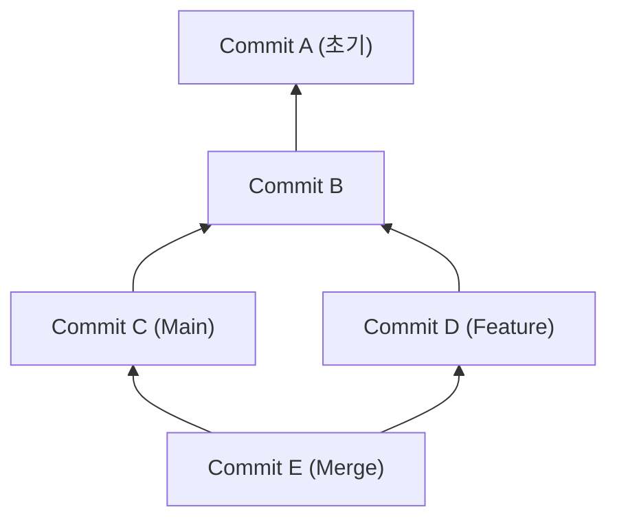
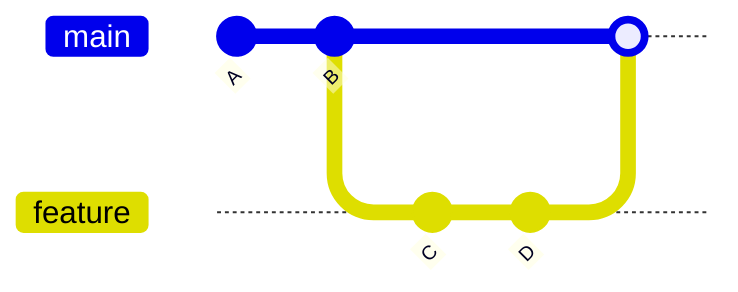
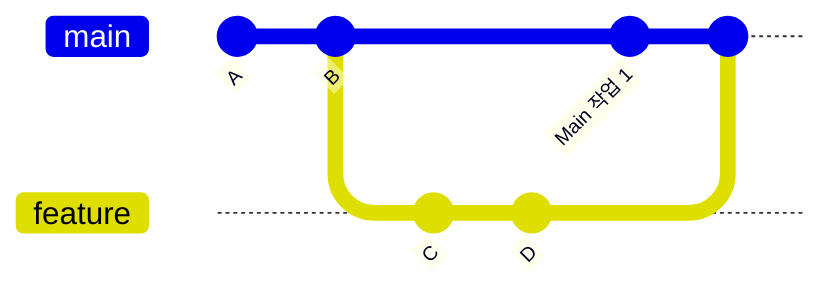
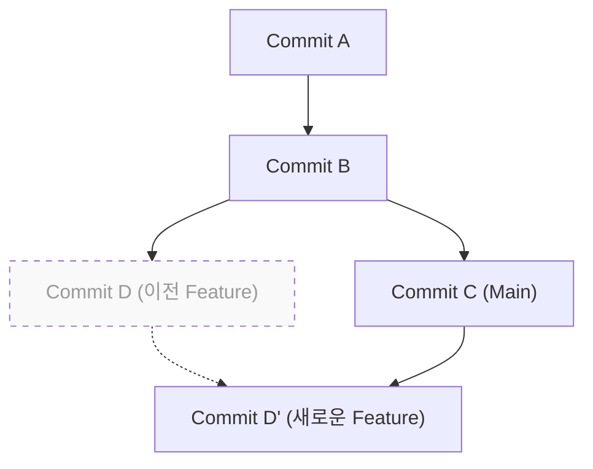

# 1. 들어가며：왜 "merge인가 rebase인가"는 영원한 숙제인가

Git은 현대 소프트웨어 개발에 있어서 필수적인 버전 관리 시스템입니다. 여러 개발자가 동시에 코드베이스를 변경할 때, Git의 강력한 브랜치 모델이 위력을 발휘합니다. 하지만, 팀 개발에서 "`merge`와 `rebase` 중 어느 것을 사용해야 하는가"라는 논쟁은 초보자부터 숙련자까지 항상 개발자를 괴롭히는 주제 중 하나입니다.

이 글에서는 Git의 내부 구조인 DAG(방향 비순환 그래프)와 커밋 해시의 수학적 성질을 통해, `git merge`와 `git rebase`의 메커니즘 차이를 깊이 파헤칩니다. 그리고 실무에서 이것들을 어떻게 구분해서 사용해야 하는지, 구체적인 워크플로우와 함께 철저하게 해설합니다. 단순한 명령어 소개에 그치지 않고, 이면에서 Git이 어떤 계산을 하고 있는지까지 이해함으로써, 충돌(Conflict)에 대한 두려움을 없애고 깔끔하고 추적 가능한 이력을 구축할 수 있게 됩니다.

---

# 2. Git의 내부 구조：커밋 해시와 객체 모델

Git이 이력을 어떻게 통합하는지 이해하기 위해서는 먼저 Git이 데이터를 어떻게 저장하고 있는지 알아야 합니다. Git은 단순한 파일 변경의 차이(패치)를 저장하는 것이 아니라, 특정 시점의 파일 시스템 전체의 스냅샷을 저장하고 있습니다.

## 2.1 커밋 해시의 암호학적 성질

Git의 각 커밋은 그 내용을 바탕으로 계산된 SHA-1(Secure Hash Algorithm 1) 해시 함수에 의한 40자리 16진수로 고유하게 식별됩니다. 커밋 객체는 다음 요소들로 구성됩니다:

1. **Tree 객체에 대한 포인터**: 그 시점의 디렉토리 구조와 파일(Blob)의 스냅샷
2. **부모 커밋에 대한 포인터**: 1개 이상의 부모 커밋의 해시값 (첫 커밋은 부모를 가지지 않으며, 병합 커밋은 2개 이상의 부모를 가집니다)
3. **작성자 정보(Author)**: 코드를 작성한 사람과 일시
4. **커미터 정보(Committer)**: 커밋을 생성하고 적용한 사람과 일시
5. **커밋 메시지**: 변경의 의도를 설명하는 텍스트

수학적으로 표현하면, 커밋 객체 $C$ 에 대한 해시값 $H(C)$ 는 다음과 같이 정의됩니다：

$$
H(C) = \text{SHA-1}( \text{tree} \parallel \text{parent} \parallel \text{author} \parallel \text{committer} \parallel \text{message} )
$$

여기서 $\parallel$ 은 데이터의 결합을 나타냅니다. 해시 함수의 특성에 따라, 커밋 메시지를 1글자만 바꾸거나 부모 커밋이 다르기만 해도 전혀 다른 해시값이 생성됩니다. 즉, **커밋은 불변(Immutable)** 입니다. 후술할 `rebase`가 "이력을 조작한다"고 표현되는 것은 실제로는 "내용은 비슷하지만 다른 해시값을 가지는 새로운 커밋을 생성하고 있기" 때문입니다.

해시 공간의 크기는 $2^{160}$ 이며, 충돌(다른 커밋이 같은 해시값을 가지는 것)이 발생할 확률 $P$ 는 생일 문제(Birthday Paradox)의 이론을 사용하면 다음과 같이 근사할 수 있습니다 ($n$ 은 커밋 수)：

$$
P(\text{collision}) \approx 1 - \exp\left(-\frac{n^2}{2 \times 2^{160}}\right)
$$

이 확률은 극히 낮아 실용상 Git의 커밋 해시가 충돌하는 일은 거의 있을 수 없습니다.

---

# 3. 그래프 이론과 DAG：Git 이력의 수학적 모델

Git의 커밋 이력은 그래프 이론의 "방향 비순환 그래프(Directed Acyclic Graph, DAG)"로 모델링됩니다.

## 3.1 DAG(방향 비순환 그래프)란

그래프 $G = (V, E)$ 에서, $V$ 는 커밋의 집합(정점), $E$ 는 커밋 간의 부모-자식 관계를 나타내는 방향 간선(Directed Edge)의 집합입니다. Git에서는 간선의 방향이 "자식 커밋에서 부모 커밋"으로 향합니다. 새로운 커밋은 과거의 커밋에 대한 포인터를 가지고 있기 때문입니다.



DAG의 가장 큰 특징은 "사이클(순환)이 존재하지 않는다"는 것입니다. 이로 인해 커밋 이력을 거슬러 올라가는 알고리즘은 무한 루프에 빠지지 않고 확실하게 종단(초기 커밋)에 도달할 수 있습니다.

## 3.2 위상 정렬(Topological Sort)과 이력의 순서

Git의 `git log` 명령어 등으로 이력을 표시할 때, DAG는 위상 정렬(Topological Sort) 알고리즘에 의해 1차원의 리스트로 순서가 매겨집니다. DAG에서의 임의의 방향 간선 $u \to v$ ($u$ 는 $v$ 의 자식)에 대해, 리스트 내에서 $u$ 가 $v$ 보다 앞에 오도록 정렬합니다.

---

# 4. git merge의 메커니즘과 종류

브랜치의 변경을 통합하는 가장 기본적인 명령어가 `git merge`입니다. 하지만 현재 상태에 따라 Git은 다른 병합 전략을 자동으로 선택합니다.

## 4.1 Fast-Forward 병합 (--ff)

통합 대상(예: `main`)의 브랜치가 통합할(예: `feature`) 브랜치의 직접적인 조상일 경우, Git은 "Fast-Forward(빨리 감기)" 병합을 실행합니다. 이는 새로운 커밋을 생성하지 않고 단순히 브랜치의 포인터를 앞으로 이동시키는 작업입니다.



Fast-Forward 병합은 이력을 일직선으로 유지하지만, "어떤 커밋들이 하나의 기능 개발(feature)로 묶여 있었는지"에 대한 컨텍스트가 손실되는 단점이 있습니다.

## 4.2 Non-Fast-Forward 병합 (--no-ff)

`git merge --no-ff`를 명시적으로 지정하면, Fast-Forward가 가능한 상황이더라도 반드시 새로운 "병합 커밋"을 생성합니다. 병합 커밋은 2개의 부모를 가지는 특별한 커밋입니다.



이 방법의 이점은 기능 브랜치의 존재와 역사가 DAG 상에 명확하게 남는다는 것입니다. 문제가 발생했을 때 `git revert -m 1 <병합 커밋의 해시>`를 실행하여 기능 전체를 한 번에 안전하게 취소(리버트)할 수 있습니다.

## 4.3 3방향 병합(3-Way Merge) 알고리즘

통합 대상과 통합할 브랜치가 각각 독자적인 커밋을 가지고 있는 경우, Git은 3방향 병합을 실행합니다. 이 때 Git은 DAG를 탐색하여 두 브랜치의 "공통 조상(Lowest Common Ancestor, LCA)"을 찾아냅니다.

LCA를 찾기 위한 알고리즘의 시간 복잡도 $T_{\text{LCA}}$ 는 정점 수 $|V|$ 와 간선 수 $|E|$ 에 대해 선형 시간에 실행 가능합니다：

$$
T_{\text{LCA}} = \mathcal{O}(|V| + |E|)
$$

Git은 "LCA의 상태", "현재 브랜치의 상태", "상대 브랜치의 상태" 3가지를 비교하여 변경 사항이 충돌하지 않으면 자동으로 병합 커밋을 생성합니다.

---

# 5. git rebase의 메커니즘과 이력의 재구성

`git merge`가 이력을 "통합"하는 반면, `git rebase`는 이력을 "재구성(다시 붙이기)"합니다.

## 5.1 Rebase의 이면에 있는 동작

`feature` 브랜치를 `main` 브랜치로 리베이스(`git rebase main`)할 때의 내부 동작은 다음과 같습니다：

1. `feature` 브랜치와 `main` 브랜치의 공통 조상(LCA)을 찾는다.
2. LCA부터 `feature` 브랜치 끝까지의 커밋 차이를 임시 영역에 저장한다.
3. `feature` 브랜치의 포인터를 `main` 브랜치의 끝으로 이동시킨다.
4. 저장해둔 차이를 새로운 베이스(`main`의 끝) 위에 하나씩 순차적으로 적용(Cherry-Pick)하여 새로운 커밋을 생성한다.



여기서 중요한 것은 리베이스로 인해 생성된 커밋 $D'$ 는 원래의 커밋 $D$ 와 **부모 커밋이 다르기 때문에 완전히 다른 해시값을 가진다**는 것입니다 (앞서 설명한 해시 함수의 정의 $H(C)$ 참조).

## 5.2 인터랙티브 리베이스(Interactive Rebase)

`git rebase -i` (또는 `--interactive`)를 사용하면 커밋 이력을 마음대로 조작할 수 있습니다. 이는 로컬 이력을 정리하기 위한 가장 강력한 도구입니다.

- `pick` : 커밋을 그대로 적용한다.
- `reword` : 커밋 메시지만 수정한다.
- `edit` : 커밋 내용을 수정하기 위해 일시 정지한다.
- `squash` : 이 커밋을 이전 커밋에 합치고, 메시지도 결합한다.
- `fixup` : `squash`와 같지만, 이 커밋의 메시지는 파기한다.
- `drop` : 커밋을 완전히 삭제한다.

수학적으로 보면, 어떤 브랜치에 $N$ 개의 커밋이 있을 경우 리베이스의 순서 변경으로 생성 가능한 선형 이력의 변형(순열) $P$ 는 다음과 같습니다.

$$
P = N!
$$

Git은 개발자에게 $N!$ 가지의 자유를 주어 이력을 논리적이고 아름다운 상태로 유지할 수 있게 해줍니다.

---

# 6. 리베이스의 황금률(The Golden Rule of Rebase)

`rebase`는 매우 강력하지만 하나의 절대적인 규칙이 존재합니다.

> **"공개된 퍼블릭한 이력에 대해서는 절대 리베이스를 해서는 안 된다"**
> *(Never rebase public history)*

## 6.1 왜 퍼블릭 이력을 리베이스하면 안 되는가?

Git은 분산형입니다. 당신이 `origin/main`에 푸시한 커밋은 다른 개발자의 로컬 저장소에도 클론(복제)되어 있습니다. 만약 당신이 이미 푸시한 커밋을 리베이스하여 이력을 조작하고 `git push --force`로 강제 덮어쓰기를 한다면 무슨 일이 일어날까요?

다른 개발자의 로컬에 있는 DAG와 리모트의 DAG가 근본적으로 분기되어 버립니다. 다른 개발자가 `git pull`을 실행하면 Git은 다른 역사를 가진 커밋 뭉치를 억지로 병합하려고 시도하고, 대량의 충돌이나 중복 커밋(동일한 변경 내용이지만 해시가 다른 커밋)이 발생하여 저장소가 패닉 상태에 빠집니다.

리베이스는 **"아직 아무와도 공유하지 않은 로컬 브랜치"**에 대해서만 수행하는 것이 철칙입니다.

---

# 7. 충돌(Conflict) 해결과 git rebase --continue

여러 사람이 같은 파일의 같은 부분을 변경한 경우 충돌이 발생합니다. `merge`와 `rebase`에서는 충돌을 해결하는 과정이 다릅니다.

## 7.1 Merge에서의 충돌 해결

`git merge`의 경우 충돌 해결은 **한 번만** 발생합니다. 최종적인 병합 커밋을 생성하기 직전에 모든 충돌 지점을 한 번에 수정합니다.

## 7.2 Rebase에서의 충돌 해결

`git rebase`의 경우 커밋을 하나씩 다시 적용해 나가는 특성상 **각 커밋마다 충돌이 발생할 가능성**이 있습니다.

리베이스 중에 충돌이 발생하면 Git은 처리를 일시 정지합니다. 해결 흐름은 다음과 같습니다：

1. 에디터나 IDE(VS Code 등)를 열어 충돌 마커(`<<<<<<<` 나 `======`, `>>>>>>>`)를 수동으로 수정한다.
2. 수정한 파일을 인덱스에 추가한다：
   ```bash
   git add <수정한 파일>
   ```
3. 커밋은 생성하지 않고 리베이스 처리를 재개한다：
   ```bash
   git rebase --continue
   ```

만약 리베이스 자체를 취소하고 원래 상태로 되돌리고 싶다면 다음 명령어를 실행합니다：
```bash
git rebase --abort
```
(※ 충돌 해결이 필요 없고 해당 커밋을 통째로 건너뛰고 싶을 때는 `git rebase --skip`을 사용합니다)

---

# 8. 실무에서의 올바른 사용법(워크플로우 실천)

그렇다면 실제 개발 현장에서는 `merge`와 `rebase`를 어떻게 구분해서 사용해야 할까요? 여기서는 가장 표준적이고 안전한 접근 방식을 소개합니다.

## 8.1 【시나리오 1】 로컬 작업 이력 정리(Rebase 활용)

기능 브랜치에서 개발 중, 자잘한 커밋("오타 수정", "임시 저장" 등)이 많이 쌓였다고 가정해 봅시다. 풀 리퀘스트(PR)를 올리기 전에, 이것들을 의미 있는 단위로 정리하기 위해 인터랙티브 리베이스를 사용합니다.

```bash
# feature 브랜치에 있는 상태에서 실행
git rebase -i HEAD~5
# (에디터가 열리면 squash나 fixup을 사용하여 이력을 정리한다)
```

이를 통해 리뷰어에게 의도가 잘 전달되는 아름다운 커밋 이력을 만들 수 있습니다.

## 8.2 【시나리오 2】 최신 main 브랜치 따라가기(Rebase 활용)

개발이 길어지고 `main` 브랜치에 다른 사람들의 변경 사항이 계속 병합되는 경우, 자신의 `feature` 브랜치가 구버전이 되어 버립니다. 이 경우 `feature` 브랜치를 최신 `main`으로 리베이스하여 변경 사항을 쫓아갑니다.

```bash
# main의 최신 정보를 가져옴
git fetch origin

# feature 브랜치를 최신 main 위에 다시 이어 붙임
git rebase origin/main
```

이로 인해 이력이 일직선이 되어 나중에 병합할 때의 충돌을 방지할 수 있습니다. 또한, 불필요한 병합 커밋("Merge branch 'main' into feature")이 생성되는 것을 막을 수 있습니다.

## 8.3 【시나리오 3】 완성된 기능 통합(Merge 활용)

`feature` 브랜치에서의 개발이 완료되고 마침내 `main` 브랜치에 통합하는 단계입니다. 여기서는 **`git merge --no-ff`**를 사용합니다 (GitHub 등의 Pull Request에서 "Create a merge commit"을 선택하는 것과 동일합니다).

```bash
git checkout main
git merge --no-ff feature -m "Merge feature: 사용자 로그인 기능 구현"
git push origin main
```

이로 인해 `main` 브랜치의 DAG 상에 "여기서 하나의 기능이 병합되었다"는 역사의 결절점(병합 커밋)이 남습니다. 나중에 이력을 볼 때 기능 단위로 코드를 추적하기 쉬워집니다.

---

# 9. 결론(요약)

Git을 조작할 때 "모든 것을 Merge로 해결한다"거나 "모든 것을 Rebase로 일직선으로 만든다"와 같은 극단적인 접근 방식은 각각 장단점이 있습니다.

실무에서의 모범 사례는 **"로컬의 프라이빗한 이력은 rebase로 아름답게 정리하고, 퍼블릭한 통합 이력은 merge --no-ff로 문맥을 남긴다"**는 하이브리드 접근 방식입니다.

- **로컬(개인의 작업 공간)**: `rebase`를 사용하여 불필요한 커밋을 배제하고, 최신 메인 라인을 따라가며 일직선의 이력을 유지한다.
- **글로벌(공유 작업 공간)**: `merge --no-ff`를 사용하여 기능 브랜치의 존재를 병합 커밋으로 DAG에 기록하고, 리버트나 트래킹을 용이하게 한다.

DAG의 구조나 해시 함수의 원리 등 수학적, 아키텍처적 배경을 이해함으로써, Git 명령어는 단순한 암기에서 "의도를 가진 이력 설계"로 승화됩니다. 리베이스의 황금률을 지키면서 상황에 맞는 최적의 명령어를 선택하여, 팀 전체가 읽기 쉽고 유지 보수하기 편한 깔끔한 커밋 이력을 구축해 나갑시다.
