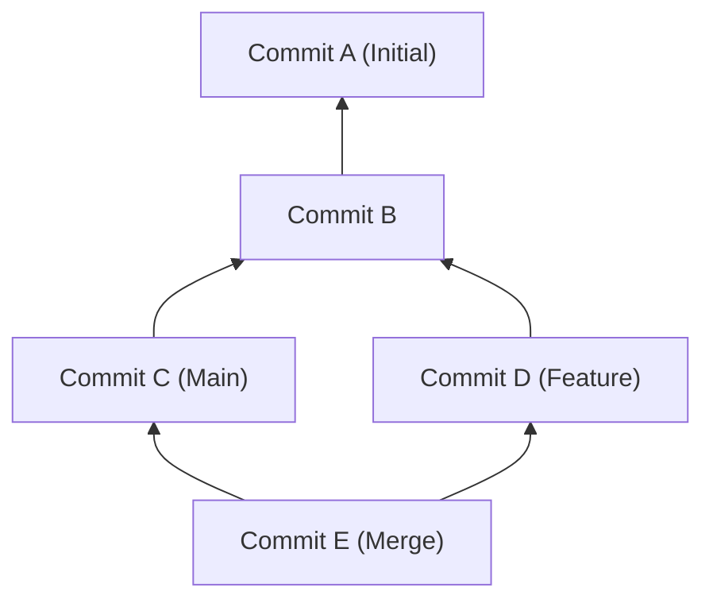
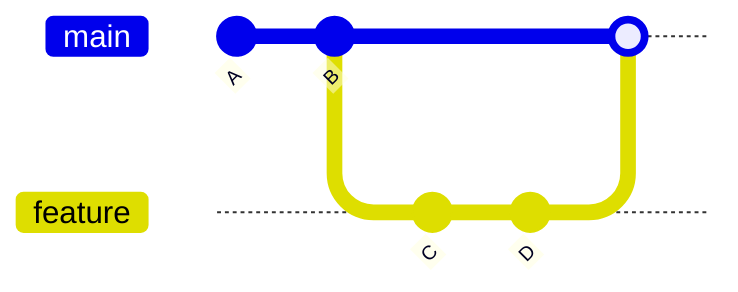
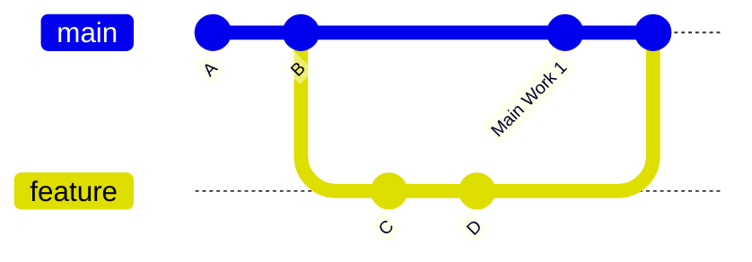
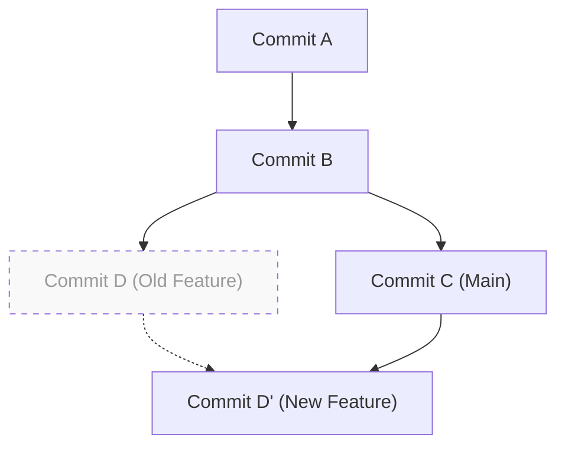

# 1. はじめに：なぜ「mergeかrebaseか」は永遠の課題なのか

Gitは現代のソフトウェア開発において不可欠なバージョン管理システムです。複数人の開発者が同時にコードベースを変更する際、Gitの強力なブランチモデルが威力を発揮します。しかし、チーム開発において「`merge` と `rebase` のどちらを使うべきか」という議論は、初心者から熟練者まで常に開発者を悩ませるトピックの一つです。

この記事では、Gitの内部構造であるDAG（有向非巡回グラフ）やコミットハッシュの数学的性質から紐解き、`git merge` と `git rebase` のメカニズムの違いを深く掘り下げます。そして、実務においてどのようにこれらを使い分けるべきか、具体的なワークフローを交えて徹底的に解説します。単なるコマンドの紹介にとどまらず、裏側でGitがどのような計算を行っているのかまで理解することで、コンフリクトへの恐怖をなくし、クリーンで追跡可能な履歴を構築できるようになります。

---

# 2. Gitの内部構造：コミットハッシュとオブジェクトモデル

Gitが履歴をどのように統合するかを理解するためには、まずGitがデータをどのように保存しているかを知る必要があります。Gitは単なるファイル変更の差分（パッチ）を保存しているわけではなく、ある時点のファイルシステム全体のスナップショットを保存しています。

## 2.1 コミットハッシュの暗号学的性質

Gitの各コミットは、その内容を元に計算されたSHA-1（Secure Hash Algorithm 1）ハッシュ関数による40桁の16進数で一意に識別されます。コミットオブジェクトは以下の要素から構成されます：

1. **Treeオブジェクトへのポインタ**: その時点のディレクトリ構造とファイル（Blob）のスナップショット
2. **親コミットへのポインタ**: 1つ以上の親コミットのハッシュ値（初回コミットは親を持たず、マージコミットは2つ以上の親を持ちます）
3. **作成者情報（Author）**: コードを書いた人と日時
4. **コミッター情報（Committer）**: コミットを作成・適用した人と日時
5. **コミットメッセージ**: 変更の意図を説明するテキスト

数学的に表現すると、コミットオブジェクト $C$ に対するハッシュ値 $H(C)$ は次のように定義されます：

$$
H(C) = \text{SHA-1}( \text{tree} \parallel \text{parent} \parallel \text{author} \parallel \text{committer} \parallel \text{message} )
$$

ここで、$\parallel$ はデータの結合を表します。ハッシュ関数の特性により、コミットメッセージを1文字変えただけでも、あるいは親コミットが異なるだけでも、全く異なるハッシュ値が生成されます。つまり、**コミットは不変（Immutable）** です。後述する `rebase` が「履歴を書き換える」と表現されるのは、実際には「内容が似ているが異なるハッシュ値を持つ新しいコミットを作成している」ためです。

ハッシュ空間の大きさは $2^{160}$ であり、衝突（異なるコミットが同じハッシュ値を持つこと）が発生する確率 $P$ は、誕生日攻撃（Birthday Paradox）の理論を用いると次のように近似できます（$n$ はコミット数）：

$$
P(\text{collision}) \approx 1 - \exp\left(-\frac{n^2}{2 \times 2^{160}}\right)
$$

この確率は極めて低く、実用上Gitのコミットハッシュが衝突することはほぼあり得ません。

---

# 3. グラフ理論とDAG：Git履歴の数学的モデル

Gitのコミット履歴は、グラフ理論における「有向非巡回グラフ（Directed Acyclic Graph, DAG）」としてモデル化されます。

## 3.1 DAG（有向非巡回グラフ）とは

グラフ $G = (V, E)$ において、$V$ はコミットの集合（頂点）、$E$ はコミット間の親子関係を示す有向エッジの集合です。Gitにおいては、エッジの向きは「子コミットから親コミット」へと向かいます。新しいコミットは過去のコミットへのポインタを保持しているためです。



DAGの最大の特徴は「サイクル（循環）が存在しない」ことです。これにより、コミット履歴を遡るアルゴリズムは無限ループに陥ることがなく、確実に終端（初期コミット）に到達できます。

## 3.2 トポロジカルソートと履歴の順序

Gitの `git log` コマンドなどで履歴を表示する際、DAGはトポロジカルソート（Topological Sort）アルゴリズムによって1次元のリストとして順序付けされます。DAGにおける任意の有向エッジ $u \to v$ （$u$ は $v$ の子）について、リスト内で $u$ が $v$ よりも前に来るように並べ替えます。

---

# 4. git merge のメカニズムと種類

ブランチの変更を統合する最も基本的なコマンドが `git merge` です。しかし、現在の状態に応じてGitは異なるマージ戦略を自動的に選択します。

## 4.1 Fast-Forward マージ（--ff）

統合先（例：`main`）のブランチが、統合元（例：`feature`）のブランチの直接の祖先である場合、Gitは「Fast-Forward（早送り）」マージを実行します。これは、新しいコミットを作成せず、単にブランチのポインタを前に進めるだけの操作です。



Fast-Forwardマージは履歴を一直線に保ちますが、「どのコミット群が一つの機能開発（feature）としてまとまっていたのか」というコンテキストが失われる欠点があります。

## 4.2 Non-Fast-Forward マージ（--no-ff）

`git merge --no-ff` を明示的に指定すると、たとえFast-Forward可能な状況であっても、必ず新しい「マージコミット」を作成します。マージコミットは2つの親を持つ特別なコミットです。



この方法の利点は、機能ブランチの存在と歴史がDAG上に明確に残ることです。問題が発生した際、`git revert -m 1 <マージコミットのハッシュ>` を実行することで、機能全体を一度に安全に取り消す（リバートする）ことが可能です。

## 4.3 3ウェイマージ（3-Way Merge）アルゴリズム

統合先と統合元のブランチがそれぞれ独自のコミットを持っている場合、Gitは3ウェイマージを実行します。この際、GitはDAGを探索し、2つのブランチの「共通の祖先（Lowest Common Ancestor, LCA）」を見つけ出します。

LCAを見つけるためのアルゴリズムの計算量 $T_{\text{LCA}}$ は、頂点数 $|V|$ とエッジ数 $|E|$ に対して線形時間で実行可能です：

$$
T_{\text{LCA}} = \mathcal{O}(|V| + |E|)
$$

Gitは「LCAの状態」「現在のブランチの状態」「相手のブランチの状態」の3つを比較し、変更が衝突していなければ自動的にマージコミットを生成します。

---

# 5. git rebase のメカニズムと履歴の再構築

`git merge` が履歴を「統合」するのに対し、`git rebase` は履歴を「再構築（付け替え）」します。

## 5.1 Rebaseの背後にある動き

`feature` ブランチを `main` ブランチにリベースする（`git rebase main`）際の内部動作は以下の通りです：

1. `feature` ブランチと `main` ブランチの共通祖先（LCA）を見つける。
2. LCAから `feature` ブランチの先端までのコミットの差分を一時領域に保存する。
3. `feature` ブランチのポインタを `main` ブランチの先端に移動させる。
4. 保存しておいた差分を、新しいベース（`main`の先端）の上へ1つずつ順に適用（Cherry-Pick）し、新しいコミットを生成する。



ここで重要なのは、リベースによって生成されたコミット $D'$ は、元のコミット $D$ とは**親コミットが異なるため、全く異なるハッシュ値を持つ**ということです（前述のハッシュ関数の定義 $H(C)$ を参照）。

## 5.2 インタラクティブリベース（Interactive Rebase）

`git rebase -i`（または `--interactive`）を使用すると、コミット履歴を思いのままに操作できます。これはローカルの履歴を整理するための最強のツールです。

- `pick` : コミットをそのまま採用する
- `reword` : コミットメッセージのみを修正する
- `edit` : コミットの内容を修正するために一時停止する
- `squash` : このコミットを前のコミットに融合し、メッセージも結合する
- `fixup` : `squash` と同じだが、このコミットのメッセージは破棄する
- `drop` : コミットを完全に削除する

数学的に見れば、あるブランチに $N$ 個のコミットがある場合、リベースの順序入れ替えによって生成可能な線形履歴のバリエーション（順列） $P$ は以下のようになります。

$$
P = N!
$$

Gitは開発者に $N!$ 通りの自由を与え、履歴を論理的で美しい状態に保つことを可能にしています。

---

# 6. リベースの黄金則（The Golden Rule of Rebase）

`rebase` は非常に強力ですが、一つの絶対的なルールが存在します。

> **「公開されたパブリックな履歴に対して絶対にリベースを行ってはならない」**
> *(Never rebase public history)*

## 6.1 なぜパブリックな履歴をリベースしてはいけないのか？

Gitは分散型です。あなたが `origin/main` にプッシュしたコミットは、他の開発者のローカルリポジトリにもクローン（複製）されています。もしあなたが既にプッシュ済みのコミットをリベースして履歴を書き換え、`git push --force` で強制上書きした場合、何が起きるでしょうか？

他の開発者のローカルにあるDAGと、リモートのDAGが根本的に分岐してしまいます。他の開発者が `git pull` を実行すると、Gitは異なる歴史を持つコミット群を無理やりマージしようとし、大量のコンフリクトや重複コミット（同じ変更内容だがハッシュが異なるコミット）が発生し、リポジトリがパニック状態に陥ります。

リベースは**「まだ誰とも共有していない、ローカルのブランチ」**に対してのみ行うのが鉄則です。

---

# 7. コンフリクト（競合）の解決と git rebase --continue

複数人が同じファイルの同じ箇所を変更した場合、コンフリクトが発生します。`merge` と `rebase` ではコンフリクトの解決プロセスが異なります。

## 7.1 Mergeにおけるコンフリクト解決

`git merge` の場合、コンフリクトの解決は**1回だけ**発生します。最終的なマージコミットを作成する直前に、すべての競合箇所を一度に修正します。

## 7.2 Rebaseにおけるコンフリクト解決

`git rebase` の場合、コミットを1つずつ再適用していく性質上、**各コミットごとにコンフリクトが発生する可能性**があります。

リベース中にコンフリクトが発生すると、Gitは処理を一時停止します。解決の流れは以下の通りです：

1. エディタやIDE（VS Codeなど）を開き、コンフリクトマーカー（`<<<<<<<` や `======`、`>>>>>>>`）を手動で修正する。
2. 修正したファイルをインデックスに追加する：
   ```bash
   git add <修正したファイル>
   ```
3. コミットは作成せず、リベース処理を再開する：
   ```bash
   git rebase --continue
   ```

もしリベース自体を取りやめて元の状態に戻したい場合は、以下のコマンドを実行します：
```bash
git rebase --abort
```
（※コンフリクトの解決が不要で、そのコミットごとスキップしたい場合は `git rebase --skip` を使用します）

---

# 8. 実務での正しい使い分け（ワークフロー実践）

では、実際の開発現場では `merge` と `rebase` をどのように使い分けるべきでしょうか。ここでは最もスタンダードで安全なアプローチを紹介します。

## 8.1 【シナリオ1】ローカルでの作業履歴の整理（Rebaseの利用）

機能ブランチで開発中、細かなコミット（「タイポ修正」「一時保存」など）がたくさん積み重なってしまったとします。プルリクエスト（PR）を出す前に、これらを意味のある単位に整理するためにインタラクティブリベースを使用します。

```bash
# featureブランチにいる状態で実行
git rebase -i HEAD~5
# （エディタが開き、squashやfixupを使って履歴を綺麗にする）
```

これにより、レビュアーにとって意図が伝わりやすい、美しいコミット履歴を作ることができます。

## 8.2 【シナリオ2】最新のmainブランチへの追従（Rebaseの利用）

開発が長引き、`main` ブランチに他の人の変更がどんどんマージされていく場合、自分の `feature` ブランチが古くなってしまいます。この場合、`feature` ブランチを最新の `main` にリベースして追従します。

```bash
# mainの最新情報を取得
git fetch origin

# featureブランチを最新のmainの上に付け替える
git rebase origin/main
```

これにより、履歴が一直線になり、後続のマージ時のコンフリクトを防ぐことができます。また、余計なマージコミット（"Merge branch 'main' into feature"）が生成されるのを防ぐことができます。

## 8.3 【シナリオ3】完成した機能の統合（Mergeの利用）

`feature` ブランチでの開発が完了し、いよいよ `main` ブランチに統合するフェーズです。ここでは **`git merge --no-ff`** を使用します（GitHubなどのPull Requestで「Create a merge commit」を選ぶのと同じです）。

```bash
git checkout main
git merge --no-ff feature -m "Merge feature: ユーザーログイン機能の実装"
git push origin main
```

これにより、`main` ブランチのDAG上に「ここで一つの機能がマージされた」という歴史の結節点（マージコミット）が残ります。後から履歴を見たときに、機能単位でコードを追いやすくなります。

---

# 9. 結論（まとめ）

Gitの操作において「すべてをMergeで済ませる」または「すべてをRebaseで一直線にする」といった極端なアプローチは、それぞれ長所と短所があります。

実務におけるベストプラクティスは、**「ローカルのプライベートな履歴は rebase で美しく整理し、パブリックな統合履歴は merge --no-ff で文脈を残す」**というハイブリッドなアプローチです。

- **ローカル（個人の作業スペース）**: `rebase` を使って、無駄なコミットを排除し、最新のメインラインに追従して一直線の履歴を維持する。
- **グローバル（共有の作業スペース）**: `merge --no-ff` を使って、機能ブランチの存在をマージコミットとしてDAGに記録し、リバートやトラッキングを容易にする。

DAGの構造やハッシュ関数の仕組みといった数学的・アーキテクチャ的な背景を理解することで、Gitコマンドは単なる暗記から「意図を持った履歴の設計」へと昇華します。リベースの黄金則を守りながら、状況に応じた最適なコマンドを選択し、チーム全体にとって読みやすく保守しやすいクリーンなコミット履歴を構築していきましょう。
