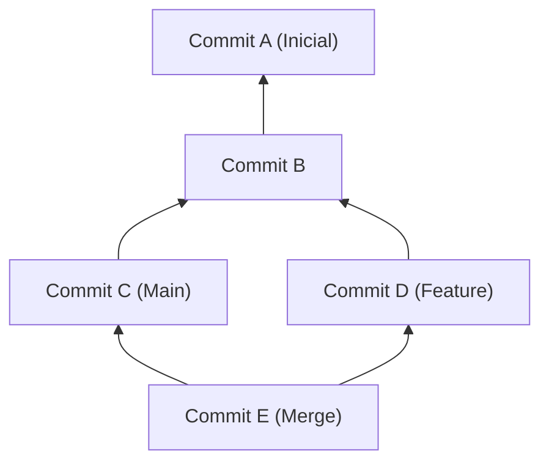
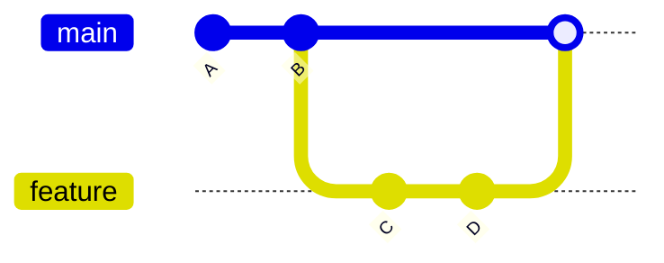
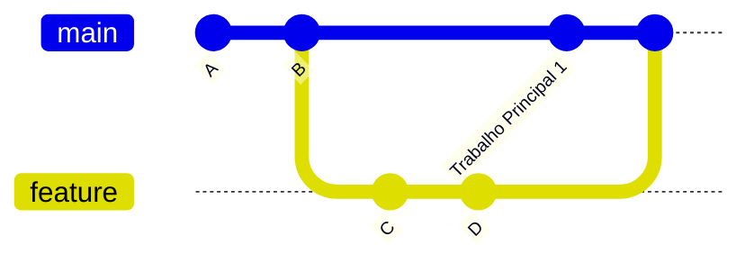
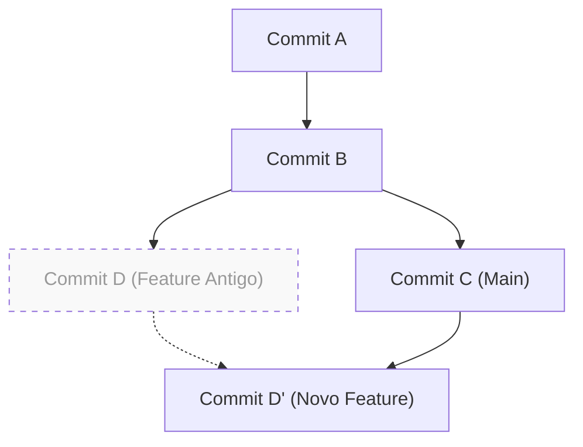

# 1. Introdução: Por que "merge ou rebase" é um dilema eterno

Git é um sistema de controle de versão indispensável no desenvolvimento de software moderno. Quando vários desenvolvedores alteram uma base de código simultaneamente, o poderoso modelo de branches do Git entra em ação. No entanto, no desenvolvimento em equipe, a discussão sobre "qual usar: `merge` ou `rebase`" é um tópico que sempre atormenta os desenvolvedores, de iniciantes a veteranos.

Neste artigo, desvendaremos a diferença entre os mecanismos de `git merge` e `git rebase`, explorando a estrutura interna do Git, como o DAG (Grafo Acíclico Direcionado) e as propriedades matemáticas dos hashes de commit. Além disso, explicaremos detalhadamente como usá-los corretamente na prática, com fluxos de trabalho específicos. Ao compreender as operações matemáticas que o Git realiza nos bastidores, e não apenas introduzir comandos, você perderá o medo de conflitos e poderá construir um histórico limpo e rastreável.

---

# 2. Estrutura interna do Git: Hashes de commit e modelo de objetos

Para entender como o Git integra o histórico, primeiro precisamos saber como ele armazena dados. O Git não armazena apenas as diferenças (patches) de alterações de arquivos, mas sim um instantâneo (snapshot) de todo o sistema de arquivos em um determinado momento.

## 2.1 Propriedades criptográficas dos hashes de commit

Cada commit no Git é identificado de forma única por um número hexadecimal de 40 dígitos gerado pela função de hash SHA-1 (Secure Hash Algorithm 1), calculada com base no seu conteúdo. Um objeto de commit é composto pelos seguintes elementos:

1. **Ponteiro para o objeto Tree**: O instantâneo da estrutura de diretórios e arquivos (Blob) naquele momento
2. **Ponteiro para o commit pai**: O valor do hash de um ou mais commits pais (o primeiro commit não tem pai e um commit de merge tem dois ou mais pais)
3. **Informações do autor (Author)**: A pessoa que escreveu o código e a data/hora
4. **Informações do committer (Committer)**: A pessoa que criou/aplicou o commit e a data/hora
5. **Mensagem de commit**: Texto explicando a intenção da alteração

Matematicamente, o valor do hash $H(C)$ para um objeto de commit $C$ é definido da seguinte forma:

$$
H(C) = \text{SHA-1}( \text{tree} \parallel \text{parent} \parallel \text{author} \parallel \text{committer} \parallel \text{message} )
$$

Aqui, $\parallel$ representa a concatenação de dados. Devido às propriedades da função de hash, mudar até mesmo um único caractere na mensagem de commit, ou ter um commit pai diferente, gerará um valor de hash completamente diferente. Ou seja, **os commits são imutáveis (Immutable)**. Quando dizemos que o `rebase`, que será explicado mais adiante, "reescreve o histórico", na verdade ele "cria novos commits com conteúdos semelhantes, mas com hashes diferentes".

O tamanho do espaço de hash é $2^{160}$ e a probabilidade $P$ de ocorrer uma colisão (dois commits diferentes com o mesmo valor de hash) pode ser aproximada usando a teoria do Paradoxo do Aniversário (onde $n$ é o número de commits):

$$
P(\text{collision}) \approx 1 - \exp\left(-\frac{n^2}{2 \times 2^{160}}\right)
$$

Essa probabilidade é extremamente baixa e, na prática, é quase impossível que os hashes de commit do Git colidam.

---

# 3. Teoria dos grafos e DAG: O modelo matemático do histórico do Git

O histórico de commits do Git é modelado como um "Grafo Acíclico Direcionado (DAG - Directed Acyclic Graph)" na teoria dos grafos.

## 3.1 O que é um DAG (Grafo Acíclico Direcionado)

Em um grafo $G = (V, E)$, $V$ é o conjunto de commits (vértices) e $E$ é o conjunto de arestas direcionadas que indicam as relações pai-filho entre os commits. No Git, a direção das arestas vai "do commit filho para o commit pai". Isso ocorre porque um novo commit contém um ponteiro para um commit passado.



A maior característica do DAG é a "ausência de ciclos (loops)". Isso garante que algoritmos que rastreiam o histórico de commits nunca entrem em um loop infinito e alcancem com segurança o fim (o commit inicial).

## 3.2 Ordenação topológica e a ordem do histórico

Quando o histórico é exibido usando comandos como `git log`, o DAG é ordenado como uma lista unidimensional usando o algoritmo de Ordenação Topológica (Topological Sort). Para qualquer aresta direcionada $u \to v$ no DAG ($u$ é filho de $v$), ele é reorganizado para que $u$ venha antes de $v$ na lista.

---

# 4. Mecanismos e tipos de git merge

O comando mais básico para integrar alterações de uma branch é o `git merge`. No entanto, dependendo do estado atual, o Git escolhe automaticamente estratégias de merge diferentes.

## 4.1 Merge Fast-Forward (--ff)

Se a branch de destino (ex: `main`) for um ancestral direto da branch de origem (ex: `feature`), o Git executará um merge "Fast-Forward" (avanço rápido). Esta operação não cria um novo commit; ela simplesmente avança o ponteiro da branch.



Um merge Fast-Forward mantém o histórico em linha reta, mas tem a desvantagem de perder o contexto de "quais commits agrupavam o desenvolvimento de uma única funcionalidade (feature)".

## 4.2 Merge Non-Fast-Forward (--no-ff)

Ao especificar explicitamente `git merge --no-ff`, o Git sempre criará um novo "commit de merge", mesmo que um Fast-Forward seja possível. Um commit de merge é um commit especial que tem dois pais.



A vantagem desse método é que a existência e a história da branch da funcionalidade permanecem claras no DAG. Se ocorrer um problema, é possível desfazer (reverter) com segurança a funcionalidade inteira de uma vez, executando `git revert -m 1 <hash do commit de merge>`.

## 4.3 Algoritmo 3-Way Merge (Merge de 3 vias)

Se a branch de destino e a branch de origem tiverem seus próprios commits independentes, o Git executará um merge de 3 vias. Neste caso, o Git explora o DAG e encontra o "ancestral comum mais baixo" (LCA - Lowest Common Ancestor) das duas branches.

A complexidade computacional $T_{\text{LCA}}$ do algoritmo para encontrar o LCA pode ser executada em tempo linear em relação ao número de vértices $|V|$ e arestas $|E|$:

$$
T_{\text{LCA}} = \mathcal{O}(|V| + |E|)
$$

O Git compara três estados: o "estado do LCA", o "estado da branch atual" e o "estado da outra branch". Se as alterações não entrarem em conflito, ele gerará um commit de merge automaticamente.

---

# 5. Mecanismo do git rebase e reconstrução do histórico

Enquanto o `git merge` "integra" o histórico, o `git rebase` "reconstrói (reorganiza)" o histórico.

## 5.1 O processo por trás do Rebase

Quando você faz o rebase da branch `feature` na branch `main` (`git rebase main`), as operações internas são as seguintes:

1. Encontra o ancestral comum (LCA) entre a branch `feature` e a branch `main`.
2. Salva as diferenças (diffs) dos commits, do LCA até o topo da branch `feature`, em uma área temporária.
3. Move o ponteiro da branch `feature` para o topo da branch `main`.
4. Aplica sequencialmente (Cherry-Pick) as diferenças salvas na nova base (o topo da `main`), criando novos commits um por um.



O ponto crucial aqui é que o commit gerado pelo rebase, $D'$, tem um **commit pai diferente do commit original $D$, portanto, ele tem um valor de hash completamente diferente** (consulte a definição da função de hash $H(C)$ mencionada anteriormente).

## 5.2 Interactive Rebase (Rebase Interativo)

Ao usar `git rebase -i` (ou `--interactive`), você pode manipular o histórico de commits como quiser. Esta é a ferramenta mais poderosa para organizar seu histórico local.

- `pick`: Mantém o commit como está.
- `reword`: Altera apenas a mensagem do commit.
- `edit`: Pausa para modificar o conteúdo do commit.
- `squash`: Funde este commit com o commit anterior, combinando também suas mensagens.
- `fixup`: Semelhante ao `squash`, mas descarta a mensagem deste commit.
- `drop`: Remove o commit completamente.

Matematicamente, se uma branch tem $N$ commits, as variações de histórico linear (permutações) $P$ que podem ser geradas pela reordenação no rebase são:

$$
P = N!
$$

O Git dá aos desenvolvedores $N!$ opções, permitindo-lhes manter o histórico lógico e elegante.

---

# 6. A Regra de Ouro do Rebase (The Golden Rule of Rebase)

Embora o `rebase` seja muito poderoso, existe uma regra absoluta:

> **"Nunca faça rebase em um histórico público compartilhado."**
> *(Never rebase public history)*

## 6.1 Por que você não deve fazer rebase em um histórico público?

O Git é distribuído. Os commits que você enviou para o `origin/main` também foram clonados nos repositórios locais de outros desenvolvedores. Se você fizer rebase de commits já enviados, reescrever o histórico e sobrescrever à força com `git push --force`, o que acontecerá?

O DAG no repositório local de outros desenvolvedores divergiria fundamentalmente do DAG remoto. Quando outros desenvolvedores executarem `git pull`, o Git tentará forçar o merge de grupos de commits com históricos diferentes, gerando um número massivo de conflitos e commits duplicados (mesmo conteúdo, mas hashes diferentes), deixando o repositório em pânico.

O rebase só deve ser executado em **"branches locais que você ainda não compartilhou com ninguém"**.

---

# 7. Resolução de conflitos e git rebase --continue

Se várias pessoas alterarem a mesma parte do mesmo arquivo, ocorrerá um conflito. O processo de resolução de conflitos é diferente entre `merge` e `rebase`.

## 7.1 Resolução de conflitos no Merge

Com o `git merge`, a resolução de conflitos ocorre **apenas uma vez**. Antes de criar o commit de merge final, você corrige todas as partes conflitantes de uma só vez.

## 7.2 Resolução de conflitos no Rebase

Com o `git rebase`, como os commits são reaplicados um por um, **podem ocorrer conflitos em cada commit**.

Se ocorrer um conflito durante um rebase, o Git irá pausar o processo. O fluxo de resolução é o seguinte:

1. Abra seu editor ou IDE (como VS Code) e resolva manualmente os marcadores de conflito (`<<<<<<<`, `======` e `>>>>>>>`).
2. Adicione os arquivos modificados ao índice:
   ```bash
   git add <arquivo_modificado>
   ```
3. Retome o processo de rebase sem criar um novo commit:
   ```bash
   git rebase --continue
   ```

Se você quiser cancelar o rebase e retornar ao estado original, execute o seguinte comando:
```bash
git rebase --abort
```
(*Se a resolução do conflito não for necessária e você quiser pular aquele commit específico, use `git rebase --skip`*)

---

# 8. Uso correto na prática (Workflow prático)

Então, como devemos escolher entre `merge` e `rebase` no desenvolvimento real? Aqui apresentamos a abordagem mais padrão e segura.

## 8.1 [Cenário 1] Organizar o histórico de trabalho local (Uso do Rebase)

Imagine que, ao desenvolver em uma branch de funcionalidade, muitos commits pequenos ("correção de erro de digitação", "salvamento temporário", etc.) se acumularam. Antes de abrir um Pull Request (PR), você usa o rebase interativo para organizá-los em unidades significativas.

```bash
# Execute enquanto estiver na branch feature
git rebase -i HEAD~5
# (O editor será aberto. Use squash ou fixup para limpar o histórico)
```

Isso criará um histórico de commits limpo e fácil para os revisores entenderem sua intenção.

## 8.2 [Cenário 2] Acompanhar as atualizações da branch main (Uso do Rebase)

Se o desenvolvimento demorar e alterações de outras pessoas continuarem sendo mescladas na branch `main`, sua branch `feature` ficará desatualizada. Neste caso, faça o rebase da sua branch `feature` na branch `main` mais recente.

```bash
# Obtenha as informações mais recentes da main
git fetch origin

# Faça o rebase da branch feature na versão mais recente da main
git rebase origin/main
```

Isso mantém o histórico linear e evita conflitos em merges futuros. Também evita a criação de commits de merge desnecessários ("Merge branch 'main' into feature").

## 8.3 [Cenário 3] Integrar uma funcionalidade concluída (Uso do Merge)

O desenvolvimento na branch `feature` está concluído e é hora de integrá-lo à branch `main`. Aqui, usamos **`git merge --no-ff`** (equivalente a escolher "Create a merge commit" em um Pull Request do GitHub).

```bash
git checkout main
git merge --no-ff feature -m "Merge feature: Implementação da funcionalidade de login de usuário"
git push origin main
```

Isso deixa um ponto de conexão histórico (commit de merge) no DAG da branch `main` dizendo que "uma funcionalidade foi mesclada aqui". Ao olhar para o histórico mais tarde, será mais fácil rastrear o código por funcionalidade.

---

# 9. Conclusão

Na operação do Git, as abordagens extremas de "fazer tudo com Merge" ou "manter tudo linear com Rebase" têm seus prós e contras.

A melhor prática no mundo real é uma abordagem híbrida: **"organize o histórico privado local de forma elegante com rebase e deixe o contexto no histórico público de integração com merge --no-ff"**.

- **Local (Espaço de trabalho pessoal)**: Use o `rebase` para eliminar commits desnecessários e acompanhar a linha principal mais recente para manter um histórico linear.
- **Global (Espaço de trabalho compartilhado)**: Use `merge --no-ff` para registrar a existência da branch de funcionalidade como um commit de merge no DAG, facilitando a reversão e o rastreamento.

Ao compreender a matemática e a arquitetura por trás da estrutura DAG e da função hash, os comandos Git passam da simples memorização para um "design de histórico intencional". Seguindo a Regra de Ouro do Rebase, vamos selecionar os comandos adequados à situação e construir um histórico de commits limpo, legível e de fácil manutenção para toda a equipe.
