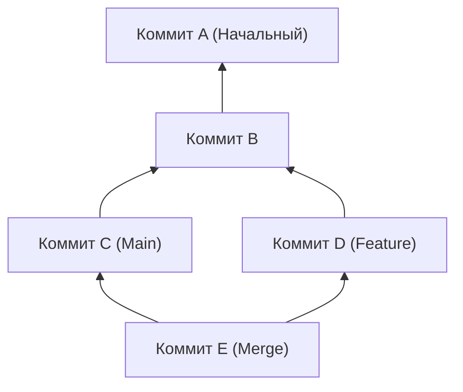
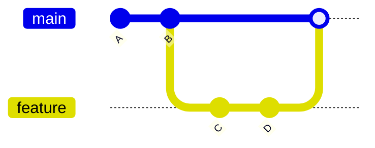
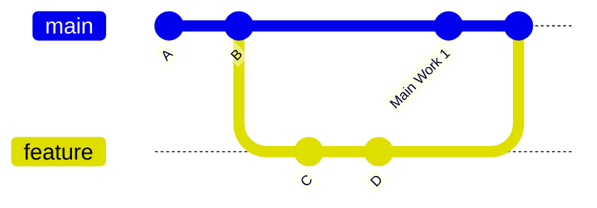
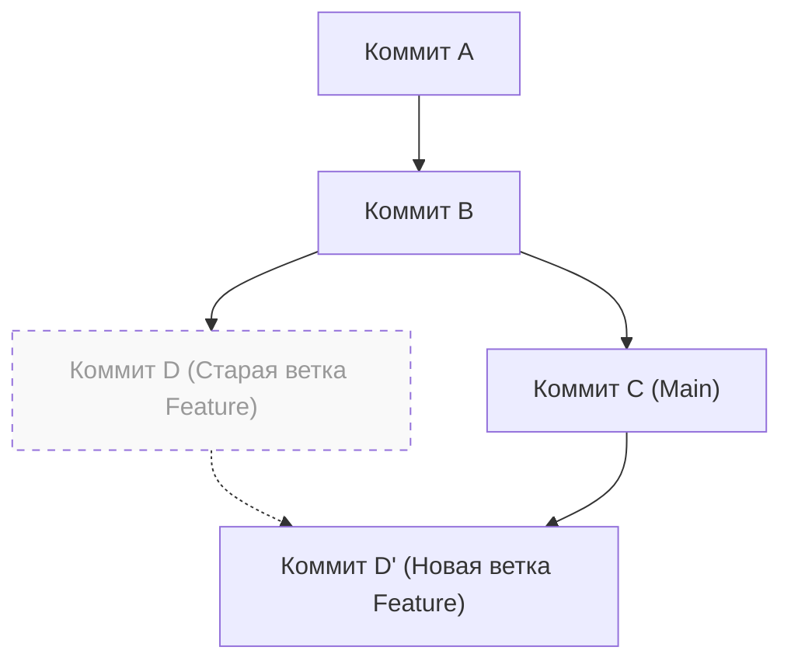

# 1. Введение: почему выбор между «merge» и «rebase» — это вечная проблема

Git является незаменимой системой контроля версий в современной разработке программного обеспечения. Когда несколько разработчиков одновременно вносят изменения в кодовую базу, мощная модель ветвления Git демонстрирует свою эффективность. Однако в командной разработке спор о том, что следует использовать: `merge` или `rebase`, является одной из тем, которая постоянно беспокоит разработчиков, от новичков до экспертов.

В этой статье мы подробно рассмотрим различия в механизмах работы `git merge` и `git rebase`, начиная с внутренней структуры Git — DAG (направленного ациклического графа) и математических свойств хешей коммитов. Затем мы тщательно объясним, как правильно использовать их на практике, сопровождая это конкретными рабочими процессами. Понимая не только сами команды, но и то, какие вычисления Git выполняет «под капотом», вы избавитесь от страха перед конфликтами и сможете создавать чистую, легко отслеживаемую историю.

---

# 2. Внутренняя структура Git: хеши коммитов и объектная модель

Чтобы понять, как Git интегрирует историю, сначала нужно узнать, как он хранит данные. Git не просто сохраняет различия (патчи) изменений файлов; он сохраняет снимки всей файловой системы на определенный момент времени.

## 2.1 Криптографические свойства хешей коммитов

Каждый коммит в Git однозначно идентифицируется 40-значным шестнадцатеричным числом, вычисленным на основе его содержимого с помощью хеш-функции SHA-1 (Secure Hash Algorithm 1). Объект коммита состоит из следующих элементов:

1. **Указатель на объект Tree**: снимок структуры каталогов и файлов (Blob) на тот момент времени.
2. **Указатель на родительский коммит**: хеш-значения одного или нескольких родительских коммитов (первый коммит не имеет родителя, а коммит слияния имеет два или более родителей).
3. **Информация об авторе (Author)**: кто написал код и когда.
4. **Информация о коммитере (Committer)**: кто создал и применил коммит, и когда.
5. **Сообщение коммита**: текст, объясняющий цель изменений.

В математическом выражении хеш-значение $H(C)$ для объекта коммита $C$ определяется следующим образом:

$$
H(C) = \text{SHA-1}( \text{tree} \parallel \text{parent} \parallel \text{author} \parallel \text{committer} \parallel \text{message} )
$$

Здесь $\parallel$ обозначает конкатенацию данных. Из-за свойств хеш-функции изменение даже одного символа в сообщении коммита или другой родительский коммит приведут к генерации совершенно иного хеш-значения. Это означает, что **коммиты неизменяемы (Immutable)**. Когда говорят, что `rebase` «переписывает историю» (о чем пойдет речь позже), на самом деле это означает создание новых коммитов с похожим содержимым, но с другими хеш-значениями.

Размер хеш-пространства составляет $2^{160}$, и вероятность коллизии (когда разные коммиты имеют одинаковое хеш-значение) $P$ можно приблизительно вычислить, используя парадокс дней рождения (Birthday Paradox), следующим образом (где $n$ — количество коммитов):

$$
P(\text{collision}) \approx 1 - \exp\left(-\frac{n^2}{2 \times 2^{160}}\right)
$$

Эта вероятность крайне мала, и на практике коллизия хешей коммитов Git практически невозможна.

---

# 3. Теория графов и DAG: математическая модель истории Git

История коммитов Git моделируется как «направленный ациклический граф» (Directed Acyclic Graph, DAG) в теории графов.

## 3.1 Что такое DAG (направленный ациклический граф)

В графе $G = (V, E)$, $V$ — это множество коммитов (вершин), а $E$ — множество направленных ребер, указывающих на отношения родитель-ребенок между коммитами. В Git ребра направлены от «дочернего коммита к родительскому коммиту». Это связано с тем, что новые коммиты хранят указатели на предыдущие коммиты.



Главной особенностью DAG является «отсутствие циклов». Благодаря этому алгоритмы обхода истории коммитов никогда не попадают в бесконечный цикл и гарантированно достигают конца (начального коммита).

## 3.2 Топологическая сортировка и порядок истории

При отображении истории, например, с помощью команды `git log`, DAG упорядочивается в одномерный список с использованием алгоритма топологической сортировки (Topological Sort). Для любого направленного ребра $u \to v$ в DAG ($u$ является потомком $v$), элементы сортируются так, чтобы $u$ находился перед $v$ в списке.

---

# 4. Механизмы и типы git merge

`git merge` — это самая базовая команда для интеграции изменений из веток. Однако, в зависимости от текущего состояния, Git автоматически выбирает разные стратегии слияния.

## 4.1 Слияние Fast-Forward (--ff)

Если целевая ветка (например, `main`) является прямым предком исходной ветки (например, `feature`), Git выполняет слияние «Fast-Forward» (перемотка вперед). Это операция, при которой новые коммиты не создаются, а просто указатель ветки перемещается вперед.



Слияние Fast-Forward сохраняет историю линейной, но имеет тот недостаток, что теряется контекст: «какие коммиты были сгруппированы как разработка одной функции (feature)».

## 4.2 Слияние Non-Fast-Forward (--no-ff)

Если явно указать `git merge --no-ff`, Git обязательно создаст новый «коммит слияния», даже если возможен Fast-Forward. Коммит слияния — это специальный коммит, имеющий двух родителей.



Преимущество этого метода в том, что существование и история функциональной ветки четко остаются в DAG. При возникновении проблем можно выполнить `git revert -m 1 <хеш коммита слияния>`, чтобы безопасно отменить (revert) всю функцию целиком за один раз.

## 4.3 Алгоритм трехстороннего слияния (3-Way Merge)

Если целевая и исходная ветки имеют свои собственные коммиты, Git выполняет трехстороннее слияние. При этом Git исследует DAG и находит «наименьшего общего предка» (Lowest Common Ancestor, LCA) двух веток.

Вычислительная сложность алгоритма поиска LCA, $T_{\text{LCA}}$, выполняется за линейное время относительно количества вершин $|V|$ и ребер $|E|$:

$$
T_{\text{LCA}} = \mathcal{O}(|V| + |E|)
$$

Git сравнивает три состояния: «состояние LCA», «состояние текущей ветки» и «состояние другой ветки», и, если изменения не конфликтуют, автоматически генерирует коммит слияния.

---

# 5. Механизм git rebase и реконструкция истории

В то время как `git merge` «интегрирует» историю, `git rebase` «реконструирует» (перебазирует) её.

## 5.1 Что происходит за кулисами Rebase

Внутренняя работа при ребейзе ветки `feature` на ветку `main` (`git rebase main`) выглядит следующим образом:

1. Найти общего предка (LCA) веток `feature` и `main`.
2. Сохранить разницу коммитов от LCA до конца ветки `feature` во временную область.
3. Переместить указатель ветки `feature` на конец ветки `main`.
4. Последовательно применить сохраненные изменения (Cherry-Pick) поверх новой базы (конца `main`), создавая новые коммиты.



Здесь важно отметить, что коммит $D'$, созданный в результате ребейза, имеет **совершенно другой хеш**, потому что у него другой родительский коммит, в отличие от исходного коммита $D$ (см. определение хеш-функции $H(C)$ выше).

## 5.2 Интерактивный ребейз (Interactive Rebase)

Использование `git rebase -i` (или `--interactive`) позволяет вам управлять историей коммитов по своему усмотрению. Это самый мощный инструмент для очистки локальной истории.

- `pick` : использовать коммит как есть
- `reword` : изменить только сообщение коммита
- `edit` : приостановить ребейз для изменения содержимого коммита
- `squash` : объединить этот коммит с предыдущим, а также объединить их сообщения
- `fixup` : то же, что и `squash`, но сообщение этого коммита отбрасывается
- `drop` : полностью удалить коммит

С математической точки зрения, если в ветке есть $N$ коммитов, количество возможных вариаций линейной истории (перестановок) $P$, генерируемых путем изменения порядка при ребейзе, выглядит следующим образом:

$$
P = N!
$$

Git предоставляет разработчикам $N!$ степеней свободы, позволяя поддерживать историю в логичном и красивом состоянии.

---

# 6. Золотое правило ребейза (The Golden Rule of Rebase)

Команда `rebase` очень мощная, но существует одно абсолютное правило.

> **«Никогда не выполняйте ребейз публичной истории»**
> *(Never rebase public history)*

## 6.1 Почему нельзя делать ребейз публичной истории?

Git — это распределенная система. Коммиты, которые вы запушили в `origin/main`, клонируются (копируются) в локальные репозитории других разработчиков. Что произойдет, если вы сделаете ребейз уже запушенных коммитов, перепишете историю и принудительно перезапишете её с помощью `git push --force`?

Локальный DAG у других разработчиков и удаленный DAG кардинально разойдутся. Когда другой разработчик выполнит `git pull`, Git попытается принудительно слить группы коммитов с разной историей, что приведет к огромному количеству конфликтов и дублирующихся коммитов (коммитов с одинаковыми изменениями, но разными хешами), повергая репозиторий в состояние паники.

Железное правило гласит: ребейз следует применять **только к «локальным веткам, которыми вы еще ни с кем не поделились»**.

---

# 7. Разрешение конфликтов и git rebase --continue

Конфликт возникает, когда несколько человек изменяют одно и то же место в одном и том же файле. Процесс разрешения конфликтов в `merge` и `rebase` отличается.

## 7.1 Разрешение конфликтов в Merge

В случае с `git merge` разрешение конфликтов происходит **только один раз**. Все конфликтующие участки исправляются за один раз, прямо перед созданием финального коммита слияния.

## 7.2 Разрешение конфликтов в Rebase

В случае с `git rebase`, из-за природы повторного применения коммитов один за другим, **существует вероятность возникновения конфликта на каждом коммите**.

Если во время ребейза возникает конфликт, Git приостанавливает процесс. Порядок разрешения следующий:

1. Открыть редактор или IDE (например, VS Code) и вручную исправить маркеры конфликтов (`<<<<<<<`, `======`, `>>>>>>>`).
2. Добавить исправленный файл в индекс:
   ```bash
   git add <исправленный файл>
   ```
3. Не создавая коммит, возобновить процесс ребейза:
   ```bash
   git rebase --continue
   ```

Если вы хотите прервать ребейз и вернуться к исходному состоянию, выполните следующую команду:
```bash
git rebase --abort
```
(※Если разрешение конфликта не требуется, и вы хотите полностью пропустить этот коммит, используйте `git rebase --skip`)

---

# 8. Правильное использование на практике (практика рабочих процессов)

Итак, как же правильно выбирать между `merge` и `rebase` в реальной разработке? Здесь мы представим самый стандартный и безопасный подход.

## 8.1 【Сценарий 1】Очистка локальной истории (использование Rebase)

Предположим, что во время разработки в функциональной ветке накопилось много мелких коммитов (таких как «исправление опечатки», «временное сохранение» и т. д.). Перед созданием Pull Request (PR) вы используете интерактивный ребейз, чтобы организовать их в осмысленные блоки.

```bash
# Выполнить, находясь в ветке feature
git rebase -i HEAD~5
# (Откроется редактор, используйте squash и fixup для очистки истории)
```

Это позволяет создать красивую историю коммитов, где намерения будут понятны ревьюерам.

## 8.2 【Сценарий 2】Следование за новейшей веткой main (использование Rebase)

Если разработка затягивается, и чужие изменения постоянно сливаются в `main`, ваша ветка `feature` устаревает. В этом случае вы делаете ребейз ветки `feature` на самую свежую `main`, чтобы не отставать.

```bash
# Получить новейшую информацию о main
git fetch origin

# Перебазировать ветку feature поверх свежей main
git rebase origin/main
```

В результате история становится линейной, что помогает избежать конфликтов при последующих слияниях. Кроме того, это предотвращает создание лишних коммитов слияния (например, "Merge branch 'main' into feature").

## 8.3 【Сценарий 3】Интеграция завершенной функции (использование Merge)

Разработка в ветке `feature` завершена, и настал этап интеграции в ветке `main`. Здесь используется **`git merge --no-ff`** (это эквивалентно выбору «Create a merge commit» в Pull Request на GitHub и т.д.).

```bash
git checkout main
git merge --no-ff feature -m "Merge feature: Реализация функции входа пользователя"
git push origin main
```

Благодаря этому в DAG ветки `main` останется исторический узел (коммит слияния), показывающий: «здесь была слита одна функция». При просмотре истории в будущем это облегчит отслеживание кода по функциональным блокам.

---

# 9. Заключение (итоги)

В работе с Git крайние подходы, такие как «решать всё только через Merge» или «делать всё линейным только через Rebase», имеют свои плюсы и минусы.

Лучшая практика в реальной работе — это гибридный подход: **«красиво организовывать локальную приватную историю с помощью rebase, а публичную историю интеграции сохранять с контекстом через merge --no-ff»**.

- **Локально (личное рабочее пространство)**: используйте `rebase` для устранения лишних коммитов и поддержания линейной истории, следуя за актуальной основной линией.
- **Глобально (общее рабочее пространство)**: используйте `merge --no-ff` для записи существования функциональной ветки в DAG в виде коммита слияния, что облегчает реверт и отслеживание.

Понимая математические и архитектурные основы, такие как структура DAG и механизмы хеш-функций, команды Git превращаются из простого заучивания в «проектирование истории с определенным намерением». Соблюдая золотое правило ребейза и выбирая оптимальные команды в зависимости от ситуации, давайте создавать чистую, легко читаемую и поддерживаемую историю коммитов для всей команды.
