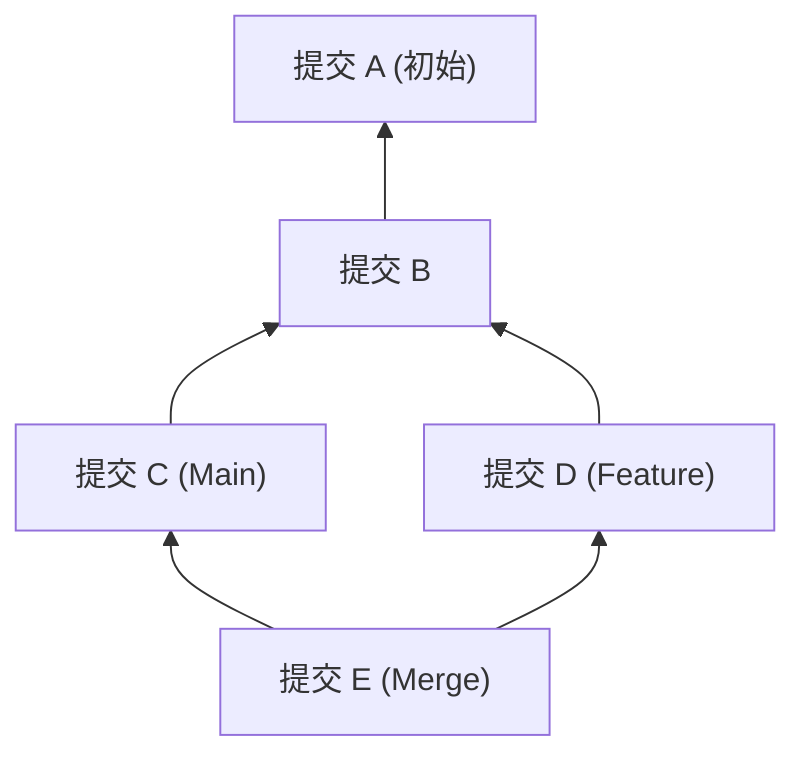
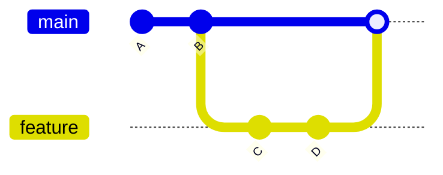
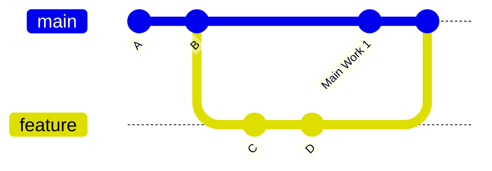
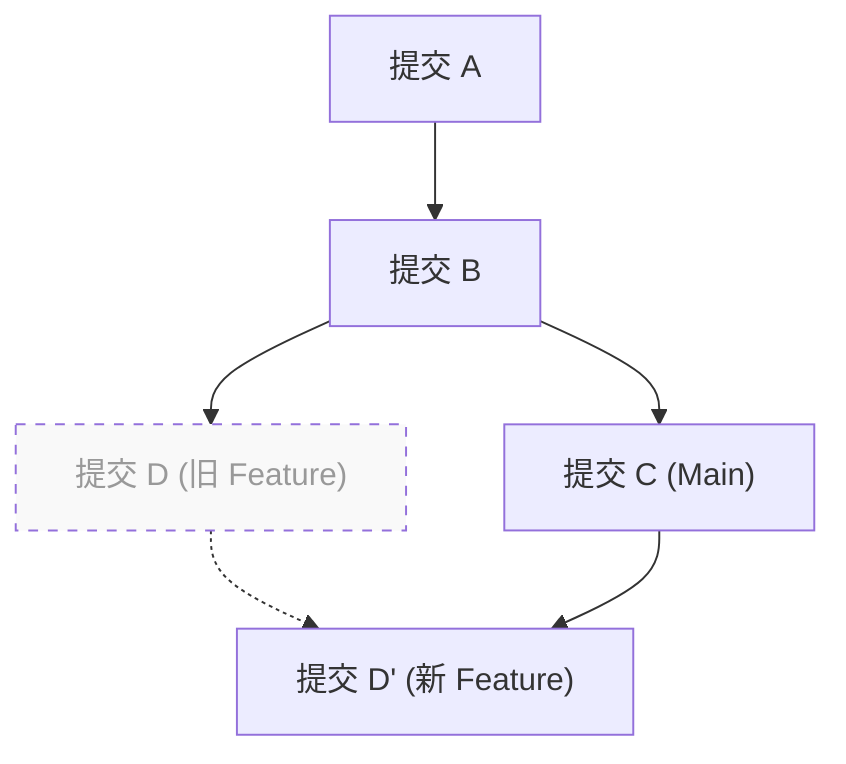

# 1. 前言：为什么“merge还是rebase”是一个永恒的难题

Git是现代软件开发中不可或缺的版本控制系统。当多名开发者同时修改代码库时，Git强大的分支模型发挥了巨大的作用。然而，在团队开发中“应该使用 `merge` 还是 `rebase`”的争论，是无论初学者还是资深开发者都经常面临的话题。

本文将从Git的内部结构（即DAG，有向无环图）以及提交哈希的数学性质出发，深入剖析 `git merge` 和 `git rebase` 的机制差异。并且，结合具体的实际工作流，彻底讲解在实际工作中应该如何区分使用它们。不仅仅是介绍命令，通过理解Git在后台进行怎样的计算，你将不再恐惧冲突，并能够构建出清晰且可追踪的历史记录。

---

# 2. Git的内部结构：提交哈希与对象模型

为了理解Git是如何整合历史记录的，首先需要知道Git是如何保存数据的。Git并不是仅仅保存文件更改的差异（补丁），而是保存某个时间点整个文件系统的快照。

## 2.1 提交哈希的密码学性质

Git的每个提交（Commit）都通过SHA-1（安全哈希算法1）哈希函数计算出一个40位的十六进制字符串来唯一标识。一个提交对象由以下元素构成：

1. **指向Tree对象的指针**: 此时的目录结构和文件（Blob）的快照
2. **指向父提交的指针**: 一个或多个父提交的哈希值（首次提交没有父提交，合并提交有两个或以上的父提交）
3. **作者信息（Author）**: 编写代码的人和时间
4. **提交者信息（Committer）**: 创建并应用该提交的人和时间
5. **提交信息**: 解释更改意图的文本

用数学语言表达，对于提交对象 $C$，其哈希值 $H(C)$ 定义如下：

$$
H(C) = \text{SHA-1}( \text{tree} \parallel \text{parent} \parallel \text{author} \parallel \text{committer} \parallel \text{message} )
$$

这里，$\parallel$ 表示数据的拼接。根据哈希函数的特性，即使提交信息只改变了一个字符，或者父提交不同，也会生成完全不同的哈希值。也就是说，**提交是不可变（Immutable）的**。后文提到的 `rebase` 被称为“重写历史”，实际上是因为“它创建了内容相似但哈希值不同的全新提交”。

哈希空间的大小为 $2^{160}$，发生碰撞（不同的提交具有相同的哈希值）的概率 $P$，可以使用生日攻击（Birthday Paradox）的理论进行如下近似（$n$ 为提交数）：

$$
P(\text{collision}) \approx 1 - \exp\left(-\frac{n^2}{2 \times 2^{160}}\right)
$$

这个概率极低，在实际应用中Git的提交哈希几乎不可能发生碰撞。

---

# 3. 图论与DAG：Git历史的数学模型

Git的提交历史可以被建模为图论中的“有向无环图（Directed Acyclic Graph, DAG）”。

## 3.1 什么是DAG（有向无环图）

在图 $G = (V, E)$ 中，$V$ 是提交的集合（顶点），$E$ 是表示提交之间父子关系的有向边的集合。在Git中，边的方向是“从子提交指向父提交”。这是因为新的提交持有着指向过去提交的指针。



DAG的最大特征是“不存在环（循环）”。正因如此，追溯提交历史的算法不会陷入死循环，并且必定能到达终点（初始提交）。

## 3.2 拓扑排序与历史顺序

当使用 `git log` 等命令显示历史记录时，DAG会通过拓扑排序（Topological Sort）算法被排序为一个一维列表。对于DAG中任意有向边 $u \to v$（$u$ 是 $v$ 的子节点），在列表中 $u$ 会被排列在 $v$ 的前面。

---

# 4. git merge 的机制与种类

整合分支更改最基本的命令是 `git merge`。但是，根据当前的状态，Git会自动选择不同的合并策略。

## 4.1 Fast-Forward 合并（--ff）

当目标分支（例：`main`）是来源分支（例：`feature`）的直接祖先时，Git会执行“Fast-Forward（快进）”合并。这不会创建新的提交，只是将分支的指针向前移动而已。



Fast-Forward合并能保持历史记录为一条直线，但缺点是会丢失“哪些提交是作为一个功能开发（feature）组合在一起的”这一上下文信息。

## 4.2 Non-Fast-Forward 合并（--no-ff）

如果显式指定 `git merge --no-ff`，即使处于可以Fast-Forward的情况下，也必定会创建一个新的“合并提交（Merge Commit）”。合并提交是具有两个父提交的特殊提交。



这种方法的优点是，功能分支的存在和历史会清晰地保留在DAG上。当发生问题时，可以通过执行 `git revert -m 1 <合并提交的哈希值>`，一次性安全地撤销（revert）整个功能。

## 4.3 三方合并（3-Way Merge）算法

如果目标分支和来源分支都各自拥有独有的提交，Git就会执行三方合并。此时，Git会遍历DAG，找出两个分支的“最近公共祖先（Lowest Common Ancestor, LCA）”。

寻找LCA的算法的时间复杂度 $T_{\text{LCA}}$ 相对于顶点数 $|V|$ 和边数 $|E|$ 是线性时间：

$$
T_{\text{LCA}} = \mathcal{O}(|V| + |E|)
$$

Git会将“LCA的状态”、“当前分支的状态”和“对方分支的状态”这三者进行比较，如果没有冲突，就会自动生成一个合并提交。

---

# 5. git rebase 的机制与历史的重构

`git merge` 是“整合”历史记录，而 `git rebase` 则是“重构（变基）”历史记录。

## 5.1 Rebase背后的运行机制

将 `feature` 分支变基到 `main` 分支（`git rebase main`）时的内部动作如下：

1. 找到 `feature` 分支和 `main` 分支的最近公共祖先（LCA）。
2. 将从 LCA 到 `feature` 分支最新提交之间的差异保存到临时区域。
3. 将 `feature` 分支的指针移动到 `main` 分支的最新提交。
4. 将保存的差异按照顺序，逐个应用（Cherry-Pick）到新的基底（`main`的最新提交）上，并生成新的提交。



这里的关键是，通过变基生成的新提交 $D'$ 与原提交 $D$ **因为父提交不同，所以拥有完全不同的哈希值**（参考前文的哈希函数定义 $H(C)$）。

## 5.2 交互式变基（Interactive Rebase）

使用 `git rebase -i`（或 `--interactive`），可以随心所欲地操作提交历史。这是用于整理本地历史的最强工具。

- `pick` : 原样保留该提交
- `reword` : 仅修改提交信息
- `edit` : 暂停以便修改提交内容
- `squash` : 将该提交融合到前一个提交中，并合并提交信息
- `fixup` : 与 `squash` 相同，但会丢弃该提交的提交信息
- `drop` : 完全删除该提交

从数学角度来看，如果某个分支有 $N$ 个提交，通过重新排列变基顺序可以生成的线性历史的变化（排列组合） $P$ 如下：

$$
P = N!
$$

Git赋予了开发者 $N!$ 种自由，使其能够将历史记录保持在充满逻辑感和美感的状态。

---

# 6. 变基的黄金法则（The Golden Rule of Rebase）

`rebase` 虽然非常强大，但有一个绝对的规则。

> **“绝对不要对已公开的公共历史进行变基”**
> *(Never rebase public history)*

## 6.1 为什么不能对公共历史进行变基？

Git是分布式的。你推送到 `origin/main` 的提交，已经被克隆（复制）到了其他开发者的本地仓库中。如果你对已经推送的提交进行变基并重写了历史，然后使用 `git push --force` 强制覆盖，会发生什么呢？

其他开发者本地的DAG和远程的DAG会在根本上产生分歧。当其他开发者执行 `git pull` 时，Git会强行尝试合并拥有不同历史的提交群，从而产生大量的冲突和重复提交（内容相同但哈希值不同的提交），导致仓库陷入混乱。

变基的铁则是：**只能对“尚未与任何人共享的、本地的分支”进行操作**。

---

# 7. 解决冲突与 git rebase --continue

当多人修改了同一个文件的同一个地方时，就会产生冲突。`merge` 和 `rebase` 解决冲突的过程是不同的。

## 7.1 Merge中的冲突解决

在使用 `git merge` 时，冲突的解决**只会发生一次**。在创建最终的合并提交之前，一次性修复所有的冲突处。

## 7.2 Rebase中的冲突解决

在使用 `git rebase` 时，由于其逐个重新应用提交的性质，**在每个提交处都有可能发生冲突**。

在变基过程中如果发生冲突，Git会暂停处理。解决的流程如下：

1. 打开编辑器或IDE（如VS Code），手动修复冲突标记（`<<<<<<<`、`======` 和 `>>>>>>>`）。
2. 将修复后的文件添加到暂存区：
   ```bash
   git add <修改后的文件>
   ```
3. 不要创建提交，直接继续变基流程：
   ```bash
   git rebase --continue
   ```

如果想中止变基并恢复到原来的状态，可以执行以下命令：
```bash
git rebase --abort
```
（※如果不需要解决冲突，想要直接跳过那个提交，可以使用 `git rebase --skip`）

---

# 8. 实际工作中的正确使用场景（工作流实践）

那么，在实际的开发场景中，我们应该如何区分使用 `merge` 和 `rebase` 呢？这里介绍最标准且最安全的方法。

## 8.1 【场景1】整理本地开发历史（使用 Rebase）

假设在功能分支上开发时，积累了许多细碎的提交（比如“修复拼写错误”、“临时保存”等）。在发起拉取请求（PR）之前，为了将这些提交整理成有意义的单元，可以使用交互式变基。

```bash
# 在 feature 分支下执行
git rebase -i HEAD~5
# （编辑器将打开，使用 squash 或 fixup 让历史变得整洁）
```

通过这种方式，可以制作出意图清晰、美观的提交历史，便于审查者理解。

## 8.2 【场景2】同步最新的 main 分支（使用 Rebase）

如果开发周期较长，并且不断有其他人的修改被合并到 `main` 分支中，你自己的 `feature` 分支就会变旧。在这种情况下，需要将 `feature` 分支变基到最新的 `main` 分支上以保持同步。

```bash
# 获取 main 的最新信息
git fetch origin

# 将 feature 分支重新基底到最新的 main 上
git rebase origin/main
```

这样可以使历史记录保持为一条直线，防止后续合并时发生冲突。同时，也能避免生成多余的合并提交（例如 "Merge branch 'main' into feature"）。

## 8.3 【场景3】整合已完成的功能（使用 Merge）

当 `feature` 分支的开发完成，终于进入要整合到 `main` 分支的阶段。在这里我们使用 **`git merge --no-ff`**（这与在 GitHub 等的 Pull Request 中选择“Create a merge commit”是一样的）。

```bash
git checkout main
git merge --no-ff feature -m "Merge feature: 实现用户登录功能"
git push origin main
```

这样一来，在 `main` 分支的DAG上就会留下一个“这里合并了一个功能”的历史节点（合并提交）。日后查看历史记录时，也能更容易地以功能为单位追踪代码。

---

# 9. 结论（总结）

在Git操作中，“一切都用Merge解决”或“一切都用Rebase保持直线”这样极端的做法，都有各自的优缺点。

实际工作中的最佳实践是：**“本地的私有历史使用 rebase 进行整理，使其美观；而公共的整合历史使用 merge --no-ff 来保留上下文”**的混合模式。

- **本地（个人工作区）**: 使用 `rebase` 排除无用的提交，紧跟最新的主线，保持直线的历史记录。
- **全局（共享工作区）**: 使用 `merge --no-ff`，将功能分支的存在作为合并提交记录在DAG中，便于后续的追踪和撤销（revert）。

通过理解DAG结构和哈希函数机制等数学及架构层面的背景，Git命令就不再是死记硬背，而是升华为“有目的的历史记录设计”。在遵守变基黄金法则的前提下，根据具体情况选择最合适的命令，为整个团队构建一个易于阅读和维护的整洁的提交历史吧。
