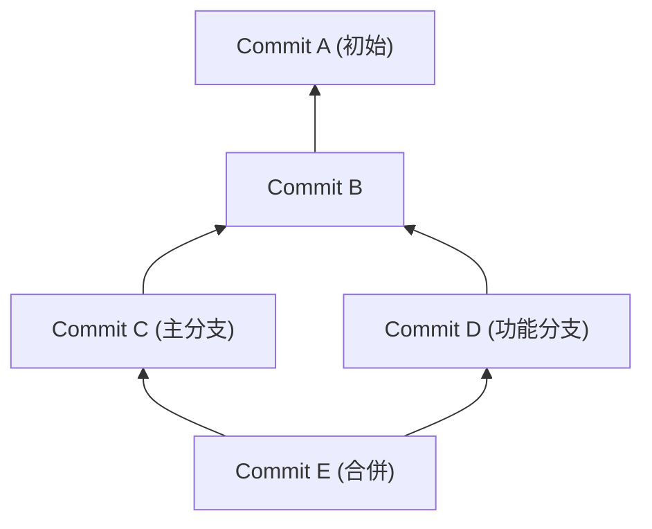
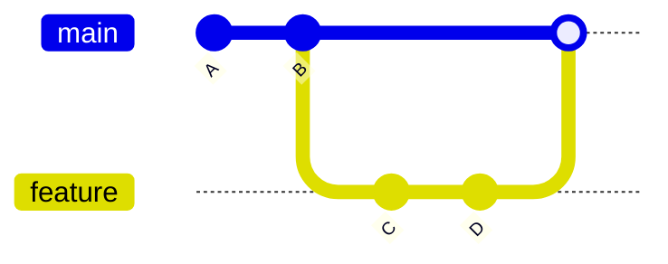
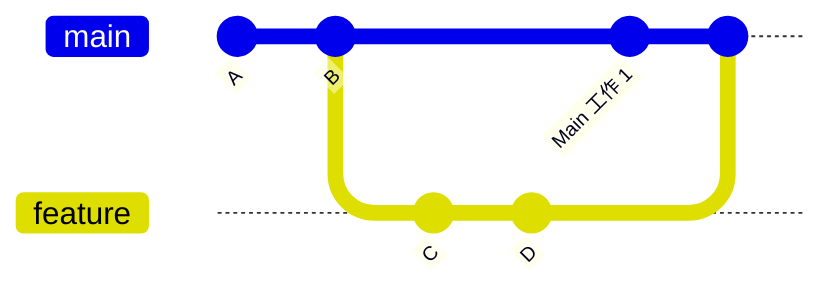
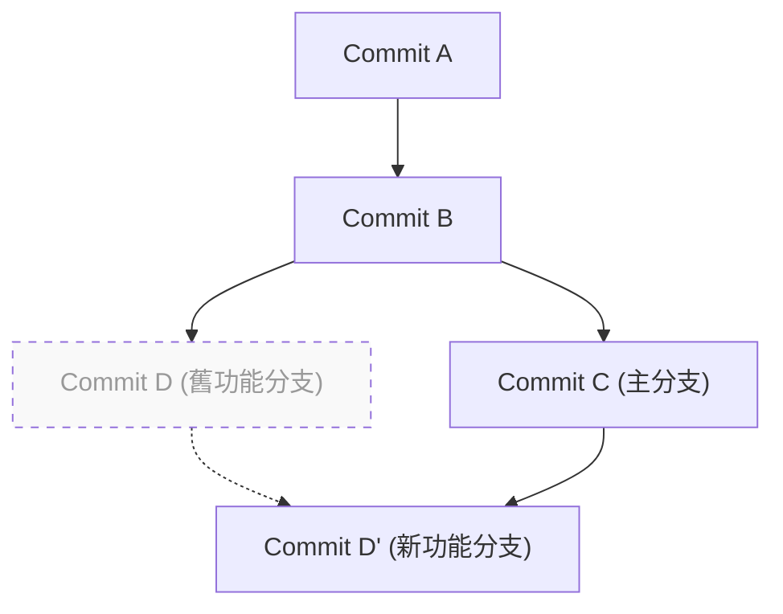

# 1. 前言：為什麼「要用 merge 還是 rebase」是個永遠的課題

Git 是現代軟體開發中不可或缺的版本控制系統。當多位開發者同時修改程式碼庫時，Git 強大的分支模型便能發揮其威力。然而，在團隊開發中，「該使用 `merge` 還是 `rebase`」的爭論，是從初學者到老手都經常煩惱的議題之一。

本文將從 Git 的內部結構：DAG（有向無環圖）以及提交（Commit）雜湊（Hash）的數學性質出發，深入探討 `git merge` 與 `git rebase` 的機制差異。接著，將配合具體的工作流程，徹底解說在實務上該如何正確區分使用它們。這不僅僅是介紹指令，透過理解 Git 在背後進行了哪些計算，你將不再對衝突（Conflict）感到恐懼，並能建立出乾淨且可追蹤的歷史紀錄。

---

# 2. Git 的內部結構：提交雜湊與物件模型

為了理解 Git 是如何整合歷史紀錄的，我們必須先了解 Git 是如何儲存資料的。Git 並不只是儲存檔案修改的差異（Patch），而是儲存特定時間點整個檔案系統的快照（Snapshot）。

## 2.1 提交雜湊的密碼學性質

Git 的每一個提交，都是透過 SHA-1（Secure Hash Algorithm 1）雜湊函數，根據其內容計算出一組 40 個字元的十六進位數字來唯一識別。提交物件（Commit Object）由以下元素組成：

1. **指向 Tree 物件的指標**：該時間點的目錄結構與檔案（Blob）的快照
2. **指向父提交的指標**：一個或多個父提交的雜湊值（首次提交沒有父提交，而合併提交則有兩個以上的父提交）
3. **作者資訊（Author）**：撰寫程式碼的人與時間
4. **提交者資訊（Committer）**：建立與套用提交的人與時間
5. **提交訊息（Commit Message）**：說明修改意圖的文字

用數學來表示，對於提交物件 $C$，其雜湊值 $H(C)$ 定義如下：

$$
H(C) = \text{SHA-1}( \text{tree} \parallel \text{parent} \parallel \text{author} \parallel \text{committer} \parallel \text{message} )
$$

這裡的 $\parallel$ 代表資料的串接。由於雜湊函數的特性，即使只改變了提交訊息中的一個字元，或是父提交不同，都會產生完全不同的雜湊值。也就是說，**提交是不可變的（Immutable）**。後文將提到 `rebase` 常被說成是「改寫歷史紀錄」，實際上它是「建立內容相似但雜湊值不同的新提交」。

雜湊空間的大小為 $2^{160}$，利用生日攻擊（Birthday Paradox）的理論，可以近似計算出發生碰撞（Collision，即不同提交擁有相同雜湊值）的機率 $P$（$n$ 為提交數量）：

$$
P(\text{collision}) \approx 1 - \exp\left(-\frac{n^2}{2 \times 2^{160}}\right)
$$

這個機率極低，在實務上 Git 的提交雜湊幾乎不可能發生碰撞。

---

# 3. 圖論與 DAG：Git 歷史的數學模型

Git 的提交歷史，在圖論中被模型化為「有向無環圖（Directed Acyclic Graph, DAG）」。

## 3.1 什麼是 DAG（有向無環圖）

在圖 $G = (V, E)$ 中，$V$ 是提交的集合（頂點），$E$ 是表示提交之間父子關係的有向邊集合。在 Git 中，邊的方向是「從子提交指向父提交」。這是因為新的提交會保存指向過去提交的指標。



DAG 最大的特徵是「不存在循環（Cycle）」。因此，追溯提交歷史的演算法不會陷入無限迴圈，並且能確實到達終點（初始提交）。

## 3.2 拓撲排序與歷史順序

當我們使用 `git log` 等指令顯示歷史紀錄時，DAG 會透過拓撲排序（Topological Sort）演算法被排序為一維的列表。對於 DAG 中任意的有向邊 $u \to v$（$u$ 為 $v$ 的子節點），在列表中 $u$ 會被排在 $v$ 的前面。

---

# 4. git merge 的機制與種類

整合分支變更最基本的指令就是 `git merge`。然而，根據目前的狀態，Git 會自動選擇不同的合併策略。

## 4.1 快轉合併（Fast-Forward, --ff）

如果整合目標（例如：`main`）分支是整合來源（例如：`feature`）分支的直接祖先，Git 就會執行「快轉（Fast-Forward）」合併。這是一個不會建立新提交，只是單純將分支指標向前推進的操作。



快轉合併能讓歷史紀錄保持一直線，但缺點是會失去「哪些提交是屬於同一個功能開發（feature）」的上下文資訊。

## 4.2 非快轉合併（Non-Fast-Forward, --no-ff）

如果明確指定 `git merge --no-ff`，即使在可以快轉合併的情況下，也必定會建立一個新的「合併提交（Merge Commit）」。合併提交是擁有兩個父節點的特殊提交。



這種方法的優點是，功能分支的存在與歷史會明確地保留在 DAG 上。當發生問題時，只要執行 `git revert -m 1 <合併提交的雜湊>`，就可以安全地一次將整個功能取消（Revert）。

## 4.3 三方合併（3-Way Merge）演算法

當整合目標與整合來源的分支各自擁有獨立的提交時，Git 會執行三方合併。此時，Git 會探索 DAG，並找出兩個分支的「共同祖先（Lowest Common Ancestor, LCA）」。

找出 LCA 的演算法時間複雜度 $T_{\text{LCA}}$，相對於頂點數 $|V|$ 與邊數 $|E|$，可以在線性時間內執行完成：

$$
T_{\text{LCA}} = \mathcal{O}(|V| + |E|)
$$

Git 會比較「LCA 的狀態」、「目前分支的狀態」與「對方分支的狀態」這三者，若變更沒有衝突，就會自動產生合併提交。

---

# 5. git rebase 的機制與歷史的重建

相較於 `git merge` 是將歷史「整合」，`git rebase` 則是將歷史「重建（移花接木）」。

## 5.1 Rebase 背後的運作方式

將 `feature` 分支變基到 `main` 分支（`git rebase main`）時，內部的運作方式如下：

1. 找出 `feature` 分支與 `main` 分支的共同祖先（LCA）。
2. 將從 LCA 到 `feature` 分支最前端的提交差異，儲存到暫存區域。
3. 將 `feature` 分支的指標移動到 `main` 分支的最前端。
4. 將儲存的差異，依序一個個套用（Cherry-Pick）到新的基底（`main` 的最前端）上，並產生新的提交。



這裡重要的是，透過 rebase 產生的提交 $D'$，**因為父提交與原本的提交 $D$ 不同，所以會有完全不同的雜湊值**（請參考前面提到的雜湊函數定義 $H(C)$）。

## 5.2 互動式變基（Interactive Rebase）

使用 `git rebase -i`（或 `--interactive`），可以隨心所欲地操作提交歷史。這是用來整理本地端歷史紀錄最強大的工具。

- `pick`：直接採用該提交
- `reword`：只修改提交訊息
- `edit`：暫停以修改提交內容
- `squash`：將此提交與前一個提交融合，並合併兩者的訊息
- `fixup`：與 `squash` 相同，但會捨棄此提交的訊息
- `drop`：完全刪除該提交

從數學的角度來看，如果一個分支上有 $N$ 個提交，透過 rebase 改變順序所能產生的線性歷史排列組合（排列）$P$ 如下：

$$
P = N!
$$

Git 給予了開發者 $N!$ 種自由，使其能夠保持歷史紀錄在合乎邏輯且優美的狀態。

---

# 6. Rebase 的黃金法則（The Golden Rule of Rebase）

`rebase` 雖然非常強大，但存在一個絕對的規則。

> **「絕對不要對已經公開的歷史紀錄進行 rebase」**
> *(Never rebase public history)*

## 6.1 為什麼不能對公開的歷史紀錄進行 rebase？

Git 是分散式的。你推送到 `origin/main` 的提交，也會被複製（Clone）到其他開發者的本地端儲存庫中。如果你對已經推送的提交進行 rebase 來改寫歷史，並且使用 `git push --force` 強制覆蓋，會發生什麼事呢？

其他開發者本地端的 DAG 會與遠端的 DAG 產生根本性的分歧。當其他開發者執行 `git pull` 時，Git 會試圖強制合併擁有不同歷史的提交群，導致產生大量衝突或重複的提交（內容相同但雜湊不同的提交），讓儲存庫陷入混亂狀態。

Rebase 的鐵則就是**只能對「尚未與任何人共享的本地端分支」**執行。

---

# 7. 解決衝突（Conflict）與 git rebase --continue

當多個人修改了同一個檔案的同一個地方時，就會發生衝突。`merge` 與 `rebase` 在解決衝突的過程上有所不同。

## 7.1 Merge 中的衝突解決

在使用 `git merge` 的情況下，衝突解決**只會發生一次**。在建立最終的合併提交之前，會一次性修正所有衝突的地方。

## 7.2 Rebase 中的衝突解決

在使用 `git rebase` 的情況下，由於是將提交一個一個重新套用，因此**每個提交都有可能發生衝突**。

在 rebase 過程中若發生衝突，Git 會暫停處理。解決的流程如下：

1. 開啟編輯器或 IDE（例如 VS Code），手動修正衝突標記（`<<<<<<<`、`======`、`>>>>>>>`）。
2. 將修正好的檔案加入索引：
   ```bash
   git add <修正的檔案>
   ```
3. 不建立提交，直接恢復 rebase 處理：
   ```bash
   git rebase --continue
   ```

如果是想要取消 rebase 本身並恢復到原本的狀態，則執行以下指令：
```bash
git rebase --abort
```
（※如果不需要解決衝突，想直接略過該提交，則使用 `git rebase --skip`）

---

# 8. 實務上的正確使用時機（工作流程實踐）

那麼，在實際的開發現場中，應該如何區分使用 `merge` 和 `rebase` 呢？這裡介紹最標準且安全的做法。

## 8.1 【情境 1】整理本地端的工作歷史（使用 Rebase）

假設在功能分支開發中，累積了許多細碎的提交（例如「修正拼寫錯誤」、「暫存」等）。在發出發布請求（Pull Request, PR）之前，為了將這些提交整理成有意義的單位，可以使用互動式變基。

```bash
# 在 feature 分支的狀態下執行
git rebase -i HEAD~5
# （編輯器會開啟，使用 squash 或 fixup 來讓歷史變得乾淨）
```

這樣一來，就能建立出讓審查者更容易理解意圖、優美的提交歷史。

## 8.2 【情境 2】跟上最新的 main 分支（使用 Rebase）

當開發時間拉長，`main` 分支不斷被合併了其他人的變更，自己的 `feature` 分支就會變舊。在這種情況下，將 `feature` 分支 rebase 到最新的 `main` 上以保持同步。

```bash
# 取得 main 的最新資訊
git fetch origin

# 將 feature 分支重新接到最新的 main 之上
git rebase origin/main
```

這樣可以讓歷史保持一直線，並防止後續合併時發生衝突。同時也能避免產生多餘的合併提交（"Merge branch 'main' into feature"）。

## 8.3 【情境 3】整合完成的功能（使用 Merge）

當 `feature` 分支上的開發完成，終於要整合到 `main` 分支的階段時。這裡要使用 **`git merge --no-ff`**（這等同於在 GitHub 等的 Pull Request 中選擇「Create a merge commit」）。

```bash
git checkout main
git merge --no-ff feature -m "Merge feature: 實作使用者登入功能"
git push origin main
```

如此一來，`main` 分支的 DAG 上就會留下「在這裡合併了一個功能」的歷史節點（合併提交）。日後回顧歷史時，就能以功能為單位輕鬆追蹤程式碼。

---

# 9. 結論（總結）

在 Git 的操作中，「全部都用 Merge 解決」或是「全部都用 Rebase 弄成一直線」這類極端的做法，各自都有其優缺點。

實務上的最佳實踐是**「本地端的私人歷史用 rebase 優美地整理，公開的整合歷史用 merge --no-ff 保留上下文」**這種混合式的方法。

- **本地端（個人的工作空間）**：使用 `rebase` 排除無謂的提交，並跟上最新的主線，維持一直線的歷史。
- **全域（共享的工作空間）**：使用 `merge --no-ff` 將功能分支的存在作為合併提交記錄在 DAG 上，讓 revert 或追蹤變得更容易。

透過理解 DAG 的結構與雜湊函數機制的數學及架構背景，Git 指令就不再只是單純的死記硬背，而是昇華為「有目的的歷史紀錄設計」。請遵守 rebase 的黃金法則，並根據情況選擇最合適的指令，建立出對整個團隊來說易讀且易於維護的乾淨提交歷史吧。
