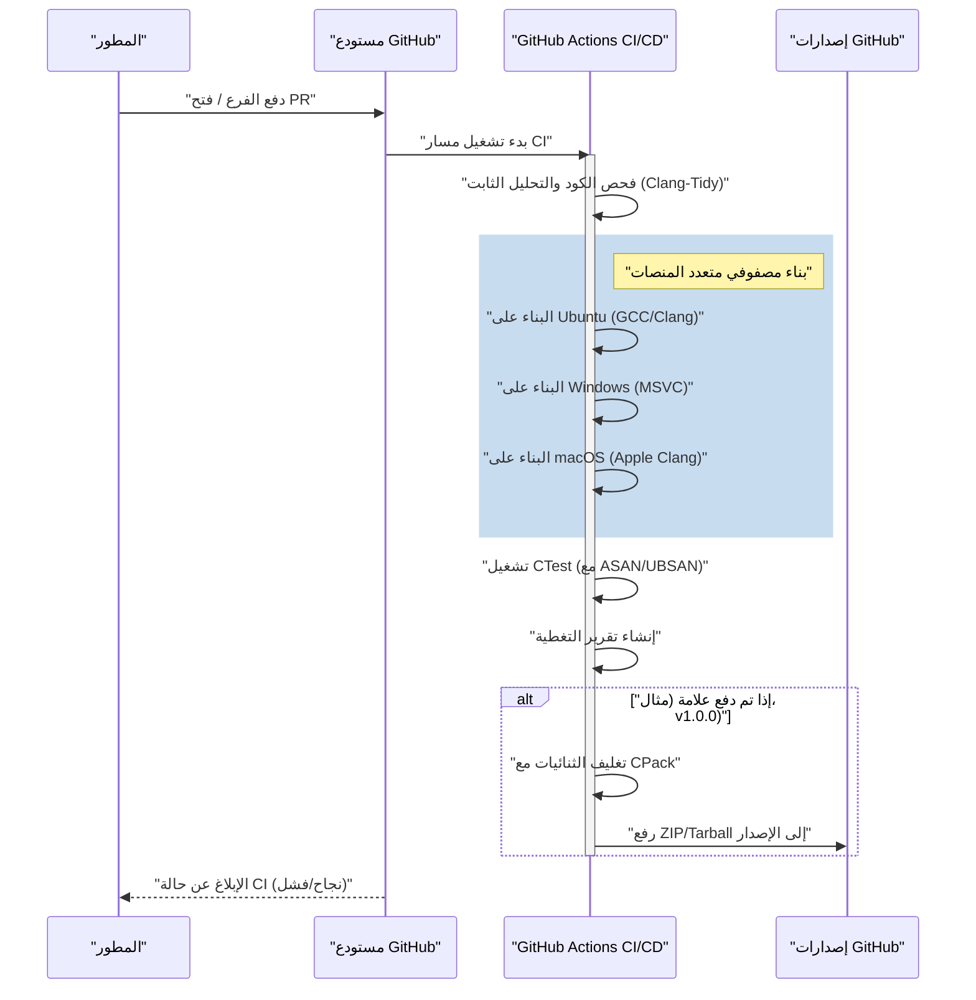
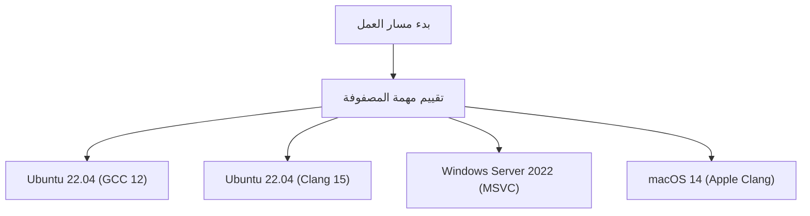

# إعداد مسار CI/CD لمشاريع C++ باستخدام GitHub Actions: الدليل الشامل

في نموذج تطوير البرمجيات الحديث، يعتبر التكامل المستمر (Continuous Integration: CI) والتسليم/النشر المستمر (Continuous Delivery/Deployment: CD) عنصرين أساسيين للحفاظ على عملية تطوير رشيقة وبرمجيات عالية الجودة. مع وجود العديد من لغات البرمجة، فإن إعداد مسار CI/CD في C++ يأتي مع صعوبات وتعقيدات فريدة مقارنة باللغات الأخرى (مثل Python، JavaScript، Go، إلخ).

في هذه المقالة، سنشرح بتفصيل شديد كيفية بناء مسار CI/CD قوي وعملي لمشاريع C++ من الصفر باستخدام GitHub Actions. سنغطي جميع التقنيات العملية، بدءًا من البناء المصفوفي (Matrix Build) عبر المنصات المتعددة (Windows، Linux، macOS)، دمج نظام البناء باستخدام CMake، الاختبار الآلي باستخدام CTest، أتمتة التحليل الثابت والديناميكي، قياس تغطية الكود، وحتى التسليم التلقائي للثنائيات المجمّعة عبر إصدارات جيتهاب (GitHub Releases).

## 1. أهمية CI/CD في مشاريع C++ والتحديات الخاصة بها

في تطوير تطبيقات الويب أو باستخدام لغات السكربت، غالباً ما يكون الاختبار والبناء على حاوية Docker واحدة كافياً. ومع ذلك، فإن C++ هي لغة تُترجم محليًا (natively compiled) وتعتمد بشكل كبير على معمارية الأجهزة ونظام التشغيل في بيئة التنفيذ.

عند تقديم CI/CD إلى مشاريع C++، فإن التحديات الرئيسية التي نواجهها هي كالتالي:

1. **تنوع المنصات**: تختلف واجهات برمجة التطبيقات (مثل Windows API، POSIX، إلخ) باختلاف أنظمة التشغيل مثل Windows وLinux وmacOS. من الشائع جدًا أن يعمل الكود في بيئة التطوير المحلية للمطور (مثل macOS) ولكنه يواجه أخطاء ترجمة (Compile Errors) على Linux أو Windows.
2. **اختلافات المترجمات (Compilers)**: المترجمات الرئيسية مثل Microsoft Visual C++ (MSVC) وGNU Compiler Collection (GCC) وClang تختلف في درجة تنفيذها وتفسيرها لمعايير C++ (C++17، C++20، C++23) وصرامة تحذيراتها.
3. **وقت البناء**: في مشاريع C++ الكبيرة، ليس من النادر أن يستغرق البناء من عشرات الدقائق إلى عدة ساعات. تتطلب بيئة CI استراتيجيات تخزين مؤقت (Caching) وتوازي (Parallelization) للبناء بكفاءة باستخدام موارد حوسبة محدودة.
4. **إدارة التبعيات**: لا تمتلك C++ مدير حزم قياسي مطلق مثل npm أو pip. من الضروري حل المكتبات بشكل صحيح في كل مرة على بيئة CI باستخدام أدوات مثل vcpkg، Conan، أو `FetchContent` في CMake.
5. **إدارة الذاكرة والسلوك غير المحدد**: نظرًا لوجود عمليات المؤشرات وإدارة الذاكرة اليدوية، فمن الضروري أتمتة الكشف عن تسرب الذاكرة والسلوك غير المحدد (Undefined Behavior) بالإضافة إلى اختبار المنطق العادي.

لحل هذه التحديات، تُعد GitHub Actions الحل الأمثل حيث يمكنها توفير أجهزة افتراضية لأنظمة تشغيل مختلفة عند الطلب، وتحديد مسارات العمل المعقدة من خلال الكود (Configuration as Code).

## 2. نظرة عامة على بنية مسار CI/CD

دعونا نتصور الصورة الكاملة لمسار CI/CD الذي سنقوم ببنائه. يوضح مخطط تسلسل Mermaid أدناه سير العمل من دفع الكود (Push) إلى الإصدار (Release).



في هذه البنية، نوفر ملاحظات سريعة (التحليل الثابت والبناء والاختبار) في مرحلة طلب السحب (Pull Request)، ونقوم بتغليف وتوزيع المخرجات عند إضافة علامة الإصدار (Version Tag).

## 3. إعداد المشروع باستخدام Modern CMake

أساس أي مسار CI ممتاز هو نظام بناء قوي. سنستخدم CMake، والذي يعد المعيار الفعلي (De facto standard) في C++. هنا، نعتمد نهجًا موجهًا نحو الأهداف (Target-oriented) يُعرف باسم "Modern CMake".

نفترض أن هيكل دليل المشروع هو كالتالي:

```text
my_cpp_project/
├── CMakeLists.txt
├── src/
│   ├── main.cpp
│   ├── calculator.cpp
│   └── calculator.h
└── tests/
    ├── CMakeLists.txt
    └── test_calculator.cpp
```

مثال على إعدادات `CMakeLists.txt` في الجذر:

```cmake
cmake_minimum_required(VERSION 3.20)
project(MyCppProject VERSION 1.0.0 LANGUAGES CXX)

# إعداد معيار C++
set(CMAKE_CXX_STANDARD 20)
set(CMAKE_CXX_STANDARD_REQUIRED ON)
set(CMAKE_CXX_EXTENSIONS OFF) # تعطيل الامتدادات الخاصة بالمترجم لزيادة قابلية النقل

# صرامة تحذيرات المترجم
function(set_project_warnings target_name)
    if(MSVC)
        target_compile_options(${target_name} PRIVATE /W4 /WX)
    else()
        target_compile_options(${target_name} PRIVATE -Wall -Wextra -Wpedantic -Werror)
    endif()
endfunction()

# إنشاء هدف المكتبة
add_library(CalculatorLib src/calculator.cpp)
target_include_directories(CalculatorLib PUBLIC ${CMAKE_CURRENT_SOURCE_DIR}/src)
set_project_warnings(CalculatorLib)

# إنشاء هدف الملف التنفيذي
add_executable(MyApplication src/main.cpp)
target_link_libraries(MyApplication PRIVATE CalculatorLib)
set_project_warnings(MyApplication)

# تفعيل الاختبارات
enable_testing()
add_subdirectory(tests)

# تعريف قواعد التثبيت (لـ CPack)
include(GNUInstallDirs)
install(TARGETS MyApplication CalculatorLib
    RUNTIME DESTINATION ${CMAKE_INSTALL_BINDIR}
    LIBRARY DESTINATION ${CMAKE_INSTALL_LIBDIR}
    ARCHIVE DESTINATION ${CMAKE_INSTALL_LIBDIR}
)

# إعدادات التغليف باستخدام CPack
set(CPACK_PROJECT_NAME ${PROJECT_NAME})
set(CPACK_PROJECT_VERSION ${PROJECT_VERSION})
set(CPACK_GENERATOR "ZIP;TGZ")
if(WIN32)
    set(CPACK_GENERATOR "ZIP")
endif()
include(CPack)
```

**النقاط المهمة:**
- `CMAKE_CXX_EXTENSIONS OFF`: يمنع الاعتماد على ميزات غير قياسية مثل امتدادات GNU، مما يضمن التوافق عبر المنصات.
- **صرامة التحذيرات (`-Werror` / `/WX`)**: من خلال التعامل مع تحذيرات المترجم كأخطاء في بيئة CI، فإننا نفرض جودة كود عالية بشكل صارم.
- **GNUInstallDirs**: يحل مسارات التثبيت القياسية لكل نظام تشغيل (مثل `/usr/local/bin` أو `C:\Program Files`) تلقائيًا.

## 4. أساسيات GitHub Actions واستراتيجية المصفوفة

تتكون GitHub Actions من ملفات YAML موجودة في دليل `.github/workflows/`.
أقوى ميزة لمشاريع C++ هي "استراتيجية المصفوفة" (Matrix Strategy). تتيح لك هذه الميزة إنشاء مجموعات ديناميكية من أنظمة التشغيل والمترجمات وتشغيلها بالتوازي.



فيما يلي تعريف وظيفة YAML الأساسي لبناء مصفوفة.

```yaml
jobs:
  build:
    name: "Build & Test [${{ matrix.os }} - ${{ matrix.compiler }}]"
    runs-on: ${{ matrix.os }}
    strategy:
      fail-fast: false # الاستمرار في بناء أنظمة التشغيل الأخرى حتى في حالة فشل إحدى الوظائف
      matrix:
        include:
          - os: ubuntu-latest
            compiler: gcc
            c_compiler: gcc
            cpp_compiler: g++
          - os: ubuntu-latest
            compiler: clang
            c_compiler: clang
            cpp_compiler: clang++
          - os: windows-latest
            compiler: msvc
            c_compiler: cl
            cpp_compiler: cl
          - os: macos-latest
            compiler: apple-clang
            c_compiler: clang
            cpp_compiler: clang++
```

الخيار `fail-fast: false` مهم جداً. على سبيل المثال، إذا تم استخدام واجهة برمجة تطبيقات (API) خاصة بنظام Linux بالخطأ، فسيفشل البناء على Ubuntu، ولكننا نريد أيضًا معرفة ما إذا كان البناء على Windows سينجح في نفس الوقت.

## 5. تكاليف البناء وتحسين المعالجة المتوازية باستخدام قانون أمدال

يعد CI/CD في البيئات السحابية معركة مع الوقت، حيث يرتبط وقت البناء مباشرة بوقت انتظار المطورين وتكاليف التشغيل.
هنا، دعونا نتناول التحسين في أوقات البناء رياضيًا باستخدام "قانون أمدال" (Amdahl's Law) في علوم الكمبيوتر.

قانون أمدال يُعرّف الحد الأقصى النظري لنسبة تحسين السرعة $S(N)$ عند استخدام $N$ معالجات، حيث $P$ هي نسبة الجزء القابل للتوازي من البرنامج، على النحو التالي:

$$ S(N) = \frac{1}{(1 - P) + \frac{P}{N}} $$

في عملية بناء C++، تكون ترجمة كل وحدة ترجمة (Translation Unit: ملف `.cpp`) في الكود المصدري مستقلة تمامًا، مما يجعل التوازي ممكنًا. من ناحية أخرى، فإن تكوين CMake ومرحلة ربط الثنائيات النهائية (Linking Phase) تكون بشكل أساسي تسلسلية (لا يمكن موازنتها).

بافتراض أن 80٪ من وقت البناء الإجمالي للمشروع هو مرحلة الترجمة ($P = 0.8$) و 20٪ هو المرحلة التسلسلية ($1 - P = 0.2$).
يوفر المشغل الافتراضي (Runner) لـ GitHub Actions (Linux) نواتين (2 مسارات/threads). لذا عندما تكون $N = 2$:

$$ S(2) = \frac{1}{0.2 + \frac{0.8}{2}} = \frac{1}{0.2 + 0.4} = \frac{1}{0.6} \approx 1.67 $$

باستخدام نواتين فقط، نحصل على تحسين في السرعة بنحو 1.67 مرة. لتحقيق ذلك، من الضروري تحديد خيار `--parallel` في أمر بناء CMake.

```yaml
    - name: "Build Project"
      run: cmake --build build --config Release --parallel 2
```

علاوة على ذلك، نأخذ في الاعتبار حساب التكلفة. تكلفة الاستخدام الإجمالية $C_{total}$ لـ GitHub Actions هي مجموع حاصل ضرب وقت تنفيذ الوظيفة $T_i$ في سعر الوحدة للمشغل $R_i$.

$$ C_{total} = \sum_{i=1}^{M} \left( T_i \times R_i \right) $$

لا يؤدي تقليل وقت البناء إلى تسريع حلقة الملاحظات فحسب، بل يؤدي أيضًا بشكل مباشر إلى تقليل تكاليف تشغيل المشروع (خاصة بالنسبة للمستودعات الخاصة). إذا كانت هناك حاجة إلى سرعات أعلى، فإن تطبيق `ccache` للتخزين المؤقت لنتائج الترجمة يُعد طريقة فعالة.

## 6. الاختبار الآلي ودمج المطهرات (Sanitizers)

لمنع الأخطاء بشكل استباقي في C++، يوصى بشدة بتقديم "المطهرات" (Sanitizers) التي تكتشف تسرب الذاكرة والسلوكيات غير المحددة أثناء وقت التشغيل (Runtime)، بالإضافة إلى اختبار الوحدة (Unit Testing). سنستخدم AddressSanitizer (ASAN) و UndefinedBehaviorSanitizer (UBSAN) التي طورتها جوجل.

نضيف خيارًا في CMake لتفعيل المطهرات.

```cmake
option(ENABLE_SANITIZERS "Enable ASAN and UBSAN" OFF)
if(ENABLE_SANITIZERS AND CMAKE_CXX_COMPILER_ID MATCHES "GNU|Clang")
    add_compile_options(-fsanitize=address,undefined -fno-omit-frame-pointer)
    add_link_options(-fsanitize=address,undefined)
endif()
```

نقوم بتفعيل هذا الخيار في وظيفة Ubuntu الخاصة بمسار CI ونقوم بتشغيل الاختبارات.

```yaml
    - name: "Configure CMake"
      env:
        CC: ${{ matrix.c_compiler }}
        CXX: ${{ matrix.cpp_compiler }}
      run: >
        cmake -B build
        -DCMAKE_BUILD_TYPE=Release
        -DENABLE_SANITIZERS=${{ matrix.os == 'ubuntu-latest' && 'ON' || 'OFF' }}

    - name: "Run CTest"
      working-directory: build
      env:
        ASAN_OPTIONS: "detect_leaks=1:symbolize=1"
        UBSAN_OPTIONS: "print_stacktrace=1"
      run: ctest --build-config Release --output-on-failure --parallel 2
```

نستخدم أمر `ctest` لتشغيل الاختبارات. من خلال تحديد `--output-on-failure`، سيتم عرض السجلات التفصيلية للاختبارات الفاشلة فقط في مخرجات CI، مما يمنع تضخم السجلات.

## 7. قياس التغطية (Code Coverage)

يعد تصور مقدار الكود الذي تغطيه الاختبارات أمرًا مهمًا لضمان الجودة. باستخدام بيئة Linux (GCC)، نقيس التغطية بواسطة `gcov` و `lcov`.

أولاً، نقوم بتعيين أعلام الترجمة (Compile Flags) في CMake لقياس التغطية.

```cmake
option(ENABLE_COVERAGE "Enable coverage reporting" OFF)
if(ENABLE_COVERAGE AND CMAKE_CXX_COMPILER_ID STREQUAL "GNU")
    add_compile_options(--coverage -O0 -g)
    add_link_options(--coverage)
endif()
```

نحدد وظيفة مستقلة لقياس التغطية في GitHub Actions.

```yaml
  coverage:
    name: "Test Coverage Analysis"
    runs-on: ubuntu-latest
    steps:
    - uses: actions/checkout@v4
    
    - name: "Install lcov"
      run: sudo apt-get update && sudo apt-get install -y lcov
      
    - name: "Configure CMake for Coverage"
      run: cmake -B build -DCMAKE_BUILD_TYPE=Debug -DENABLE_COVERAGE=ON
      
    - name: "Build & Test"
      run: |
        cmake --build build --parallel 2
        cd build && ctest --output-on-failure
      
    - name: "Generate lcov Report"
      working-directory: build
      run: |
        lcov --capture --directory . --output-file coverage.info
        lcov --remove coverage.info '/usr/*' '*_deps/*' '*tests/*' --output-file coverage.info
        
    - name: "Upload Coverage to Codecov"
      uses: codecov/codecov-action@v3
      with:
        files: build/coverage.info
```
باستخدام أمر `lcov --remove`، يتم استبعاد رؤوس النظام (System Headers) والمكتبات الخارجية (Third-party Libraries) ورمز الاختبار نفسه من قياس التغطية. يتيح لنا هذا الحصول على التغطية الخالصة للكود المصدري الخاص بالمشروع.

## 8. التسليم التلقائي للثنائيات عبر GitHub Releases (CD)

الآن سنبني جزء "CD" من CI/CD. عندما يقوم المطور بإضافة علامة إصدار في Git (مثل: `v1.2.0`) ويدفعها (Push)، سيتم تلقائيًا تجميع الثنائيات القابلة للتنفيذ لكل نظام تشغيل، وتغليفها في ملفات ZIP أو Tarball، ثم رفعها إلى GitHub Releases.

في هذه الخطوة، نستخدم أداة التغليف `CPack` المرفقة مع CMake.

```yaml
    - name: "Package Application (CPack)"
      if: startsWith(github.ref, 'refs/tags/v')
      working-directory: build
      run: cpack -C Release -V

    - name: "Upload Release Assets"
      if: startsWith(github.ref, 'refs/tags/v')
      uses: softprops/action-gh-release@v1
      with:
        files: |
          build/*.tar.gz
          build/*.zip
          build/*.sh
          build/*.exe
      env:
        GITHUB_TOKEN: ${{ secrets.GITHUB_TOKEN }}
```

باستخدام هذا الإعداد، بمجرد تنفيذ الأوامر `git tag v1.0.0` و `git push origin v1.0.0`، سيتم نشر ملف ZIP لمستخدمي Windows وملف Tarball لمستخدمي Linux/macOS تلقائيًا على صفحة الإصدار (Release Page) دون أي تدخل يدوي. إنها ميزة قوية للغاية في إيصال البرمجيات للمستخدمين.

## 9. ملف Workflow YAML الكامل

يظهر أدناه الكود الكامل والقوي والعملي لملف `.github/workflows/main.yml` الذي يجمع كل العناصر التي شرحناها حتى الآن.

```yaml
name: "C++ CI/CD Pipeline"

on:
  push:
    branches: [ "main", "develop" ]
    tags: [ "v*.*.*" ]
  pull_request:
    branches: [ "main" ]

env:
  BUILD_TYPE: Release

jobs:
  build-and-test:
    name: "Build [${{ matrix.os }} | ${{ matrix.compiler }}]"
    runs-on: ${{ matrix.os }}
    strategy:
      fail-fast: false
      matrix:
        include:
          - os: ubuntu-latest
            compiler: gcc
            c_compiler: gcc
            cpp_compiler: g++
          - os: ubuntu-latest
            compiler: clang
            c_compiler: clang
            cpp_compiler: clang++
          - os: windows-latest
            compiler: msvc
            c_compiler: cl
            cpp_compiler: cl
          - os: macos-latest
            compiler: apple-clang
            c_compiler: clang
            cpp_compiler: clang++

    steps:
    - name: "Checkout Repository"
      uses: actions/checkout@v4

    - name: "Configure CMake"
      env:
        CC: ${{ matrix.c_compiler }}
        CXX: ${{ matrix.cpp_compiler }}
      run: >
        cmake -B build
        -DCMAKE_BUILD_TYPE=${{ env.BUILD_TYPE }}
        -DENABLE_SANITIZERS=${{ matrix.os == 'ubuntu-latest' && 'ON' || 'OFF' }}

    - name: "Build Project"
      run: cmake --build build --config ${{ env.BUILD_TYPE }} --parallel 2

    - name: "Run Unit Tests (CTest)"
      working-directory: build
      env:
        ASAN_OPTIONS: "detect_leaks=1:symbolize=1"
        UBSAN_OPTIONS: "print_stacktrace=1"
      run: ctest --build-config ${{ env.BUILD_TYPE }} --output-on-failure --parallel 2

    - name: "Package with CPack"
      if: startsWith(github.ref, 'refs/tags/v')
      working-directory: build
      run: cpack -C ${{ env.BUILD_TYPE }}

    - name: "Create GitHub Release and Upload Assets"
      if: startsWith(github.ref, 'refs/tags/v')
      uses: softprops/action-gh-release@v1
      with:
        files: |
          build/*.tar.gz
          build/*.zip
      env:
        GITHUB_TOKEN: ${{ secrets.GITHUB_TOKEN }}

  coverage:
    name: "Code Coverage Analysis"
    runs-on: ubuntu-latest
    if: github.event_name == 'pull_request' || github.ref == 'refs/heads/main'
    steps:
    - name: "Checkout Repository"
      uses: actions/checkout@v4
      
    - name: "Install lcov"
      run: sudo apt-get update && sudo apt-get install -y lcov
      
    - name: "Configure CMake for Coverage"
      run: cmake -B build -DCMAKE_BUILD_TYPE=Debug -DENABLE_COVERAGE=ON
      
    - name: "Build Project"
      run: cmake --build build --parallel 2
      
    - name: "Run Tests"
      working-directory: build
      run: ctest --output-on-failure
      
    - name: "Generate lcov Report"
      working-directory: build
      run: |
        lcov --capture --directory . --output-file coverage.info
        lcov --remove coverage.info '/usr/*' '*_deps/*' '*tests/*' --output-file coverage.info
        
    - name: "Upload Coverage to Codecov"
      uses: codecov/codecov-action@v3
      with:
        files: build/coverage.info
        fail_ci_if_error: false
```

## 10. نحو CI/CD أكثر تقدمًا (التحليل الثابت والتنسيق)

على الرغم من حذف الشرح التفصيلي هنا، يوصى بدمج أدوات إضافية لضمان الجودة في مسار العمل أثناء التشغيل الفعلي.

1. **فرض Clang-Format**: لتقليل عبء مراجعات الكود (Code Review)، قم بدمج فحص نمط الكود (Code Style) باستخدام `clang-format` في CI، واجعل مسار العمل يفشل إذا كان ينتهك قواعد التنسيق.
2. **التحليل الثابت (Clang-Tidy)**: لاكتشاف الأخطاء الكامنة التي لا يمكن منعها بتحذيرات المترجم وحدها، أو الكود غير الفعال (مثل النسخ غير الضروري)، قم بدمج `clang-tidy` في CMake وتشغيله على CI.
3. **استخدام التخزين المؤقت لـ vcpkg / Conan**: في حال استخدام العديد من مكتبات الطرف الثالث، يستغرق بناء التبعيات وقتًا طويلاً. يمكنك تقليل وقت البناء بشكل كبير عن طريق استخدام `actions/cache` من GitHub Actions للاحتفاظ بالدليل المثبت لـ vcpkg أو التخزين المؤقت لـ Conan.

## الخاتمة

قد يبدو إعداد مسار CI/CD في مشاريع C++ للوهلة الأولى كعقبة كبيرة بسبب الاعتماد على المنصة وتعقيد أدوات البناء. ولكن، من خلال الدمج الصحيح لبيئة GitHub Actions، و Modern CMake، ونظام CTest/CPack، يمكنك الحصول على تدفق تطوير مؤتمت وقوي للغاية.

إن التحقق متعدد المنصات (Cross-platform Verification) باستخدام استراتيجية المصفوفة، واكتشاف الأخطاء أثناء وقت التشغيل عبر المطهرات (Sanitizers)، وقياس التغطية، والنشر التلقائي في GitHub Releases الذي تم شرحه في هذه المقالة هي أفضل الممارسات المعتمدة على نطاق واسع حتى في مشاريع مفتوحة المصدر على المستوى التجاري.

يقلل مسار CI/CD المؤتمت من الوقت الذي يقضيه المطورون في "البحث عن الأخطاء" و"عمليات البناء والإصدار اليدوية" إلى الحد الأدنى، ويصبح أقوى سلاح للتركيز على نشاط البرمجة الإبداعي الأصلي. تأكد من إضافته إلى مشروع C++ الخاص بك لتستمتع بحياة تطوير رشيقة ومريحة.
