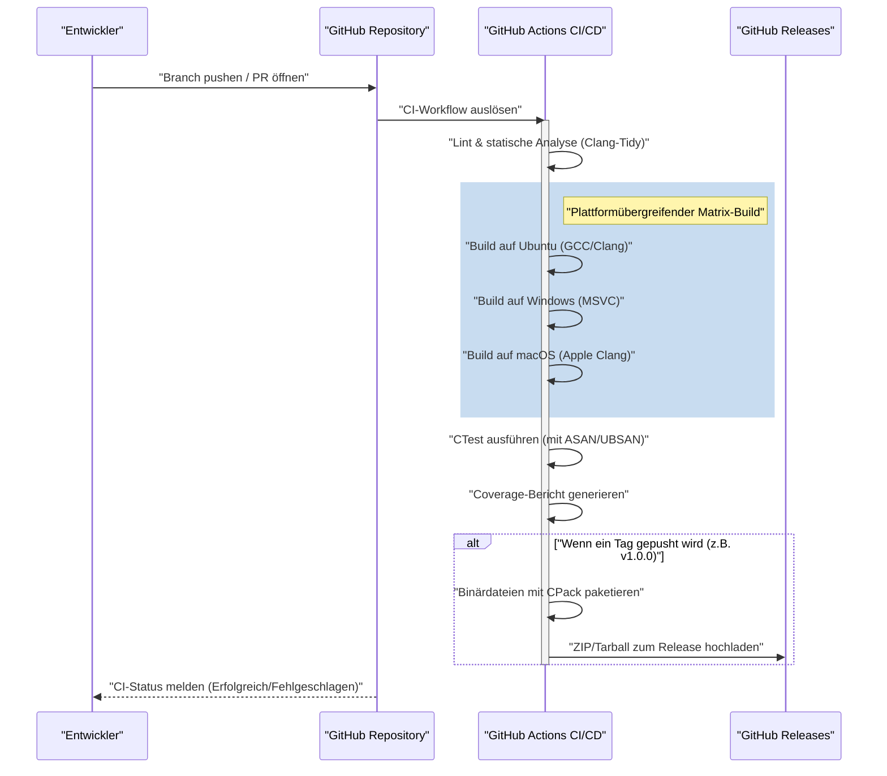
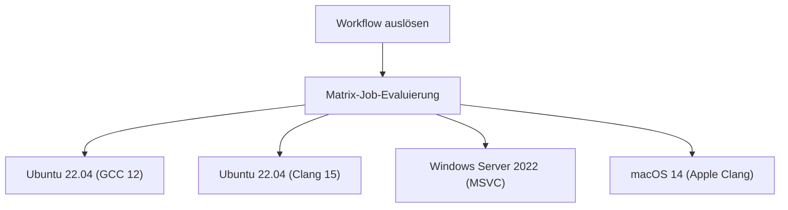

# Aufbau einer CI/CD-Pipeline für C++-Projekte mit GitHub Actions: Ein vollständiger Leitfaden

Im modernen Softwareentwicklungs-Paradigma sind Continuous Integration (CI) und Continuous Delivery/Deployment (CD) unverzichtbare Elemente für agile Entwicklungsprozesse und die Aufrechterhaltung hochwertiger Software. Unter den zahlreichen Programmiersprachen bringt der Aufbau einer CI/CD-Pipeline für C++ im Vergleich zu anderen Sprachen (wie Python, JavaScript oder Go) einzigartige Schwierigkeiten und Komplexitäten mit sich.

In diesem Artikel wird äußerst detailliert erklärt, wie Sie mit GitHub Actions eine robuste und praktische CI/CD-Pipeline für C++-Projekte von Grund auf neu aufbauen. Wir behandeln alle praktischen Techniken, einschließlich Matrix-Builds auf verschiedenen Plattformen (Windows, Linux, macOS), der Integration des Build-Systems mit CMake, automatisierter Tests mit CTest, der Automatisierung statischer und dynamischer Analysen, der Messung der Testabdeckung und der automatischen Auslieferung kompilierter Binärdateien über GitHub Releases.

## 1. Die Bedeutung von CI/CD in C++-Projekten und spezifische Herausforderungen

Bei der Entwicklung von Webanwendungen oder mit Skriptsprachen reicht es oft aus, Tests und Builds in einem einzelnen Docker-Container durchzuführen. C++ ist jedoch eine nativ kompilierte Sprache und hängt stark von der Hardwarearchitektur und dem Betriebssystem der Ausführungsumgebung ab.

Bei der Einführung von CI/CD in einem C++-Projekt treten hauptsächlich folgende Herausforderungen auf:

1. **Plattformvielfalt**: Verschiedene Betriebssysteme wie Windows, Linux und macOS haben unterschiedliche APIs (Windows API, POSIX usw.). Es ist an der Tagesordnung, dass Code, der in der lokalen Umgebung eines Entwicklers (z. B. macOS) funktioniert, unter Linux oder Windows zu Kompilierungsfehlern führt.
2. **Unterschiede bei den Compilern**: Wichtige Compiler wie Microsoft Visual C++ (MSVC), die GNU Compiler Collection (GCC) und Clang unterscheiden sich in ihrem Implementierungsgrad der C++-Standards (C++17, C++20, C++23), deren Interpretation und der Strenge der Warnungen.
3. **Build-Zeiten**: Bei großen C++-Projekten ist es nicht ungewöhnlich, dass Builds von einigen zehn Minuten bis zu mehreren Stunden dauern. CI-Umgebungen erfordern Caching-Strategien und Parallelisierung, um effizient mit begrenzten Rechenressourcen zu bauen.
4. **Verwaltung von Abhängigkeiten**: In C++ gibt es keinen absoluten Standard-Paketmanager wie npm oder pip. Es ist notwendig, Bibliotheken in der CI-Umgebung jedes Mal korrekt aufzulösen, z. B. durch die Verwendung von vcpkg, Conan oder CMakes `FetchContent`.
5. **Speicherverwaltung und undefiniertes Verhalten**: Da Zeigeroperationen und manuelle Speicherverwaltung involviert sind, muss nicht nur die reine Logik getestet, sondern auch die Erkennung von Speicherlecks und undefiniertem Verhalten (Undefined Behavior) automatisiert werden.

Um diese Herausforderungen zu meistern, GitHub Actions ist die optimale Lösung, da es verschiedene OS-VMs on-demand bereitstellen und komplexe Workflows als Code (Configuration as Code) definieren kann.

## 2. Architekturübersicht der CI/CD-Pipeline

Lassen Sie uns das Gesamtbild der CI/CD-Pipeline, die wir erstellen werden, visualisieren. Das folgende Mermaid-Sequenzdiagramm zeigt den Workflow vom Push des Codes bis zum Release.



In dieser Architektur wird in der Pull-Request-Phase schnelles Feedback (statische Analyse, Build und Test) geliefert, und die Paketierung sowie Verteilung der Artefakte erfolgt zu dem Zeitpunkt, an dem ein Versions-Tag hinzugefügt wird.

## 3. Projekteinrichtung mit modernem CMake

Die Grundlage einer hervorragenden CI-Pipeline ist ein robustes Build-System. Wir verwenden CMake, den De-facto-Standard in C++. Hierbei verfolgen wir den zielorientierten Ansatz, der als "modernes CMake" bezeichnet wird.

Wir gehen von folgender Verzeichnisstruktur des Projekts aus:

```text
my_cpp_project/
├── CMakeLists.txt
├── src/
│   ├── main.cpp
│   ├── calculator.cpp
│   └── calculator.h
└── tests/
    ├── CMakeLists.txt
    └── test_calculator.cpp
```

Ein Beispiel für die Konfiguration der `CMakeLists.txt` im Stammverzeichnis:

```cmake
cmake_minimum_required(VERSION 3.20)
project(MyCppProject VERSION 1.0.0 LANGUAGES CXX)

# Einstellung des C++-Standards
set(CMAKE_CXX_STANDARD 20)
set(CMAKE_CXX_STANDARD_REQUIRED ON)
set(CMAKE_CXX_EXTENSIONS OFF) # Deaktiviert compilerspezifische Erweiterungen für bessere Portabilität

# Striktes Warnungs-Handling
function(set_project_warnings target_name)
    if(MSVC)
        target_compile_options(${target_name} PRIVATE /W4 /WX)
    else()
        target_compile_options(${target_name} PRIVATE -Wall -Wextra -Wpedantic -Werror)
    endif()
endfunction()

# Erstellen des Bibliotheks-Targets
add_library(CalculatorLib src/calculator.cpp)
target_include_directories(CalculatorLib PUBLIC ${CMAKE_CURRENT_SOURCE_DIR}/src)
set_project_warnings(CalculatorLib)

# Erstellen des ausführbaren Targets
add_executable(MyApplication src/main.cpp)
target_link_libraries(MyApplication PRIVATE CalculatorLib)
set_project_warnings(MyApplication)

# Aktivieren der Tests
enable_testing()
add_subdirectory(tests)

# Definieren der Installationsregeln (für CPack)
include(GNUInstallDirs)
install(TARGETS MyApplication CalculatorLib
    RUNTIME DESTINATION ${CMAKE_INSTALL_BINDIR}
    LIBRARY DESTINATION ${CMAKE_INSTALL_LIBDIR}
    ARCHIVE DESTINATION ${CMAKE_INSTALL_LIBDIR}
)

# Paketierungskonfiguration mit CPack
set(CPACK_PROJECT_NAME ${PROJECT_NAME})
set(CPACK_PROJECT_VERSION ${PROJECT_VERSION})
set(CPACK_GENERATOR "ZIP;TGZ")
if(WIN32)
    set(CPACK_GENERATOR "ZIP")
endif()
include(CPack)
```

**Wichtige Punkte:**
- `CMAKE_CXX_EXTENSIONS OFF`: Verhindert die Abhängigkeit von nicht-standardkonformen Funktionen wie GNU-Erweiterungen und gewährleistet plattformübergreifende Kompatibilität.
- **Striktes Warnungs-Handling (`-Werror` / `/WX`)**: Indem Compiler-Warnungen in der CI-Umgebung als Fehler behandelt werden, wird eine hohe Codequalität erzwungen.
- **GNUInstallDirs**: Löst automatisch betriebssystemspezifische Standard-Installationspfade (wie `/usr/local/bin` oder `C:\Program Files`) auf.

## 4. Grundlagen von GitHub Actions und die Matrix-Strategie

GitHub Actions wird durch YAML-Dateien im Verzeichnis `.github/workflows/` konfiguriert.
Die leistungsstärkste Funktion für C++-Projekte ist die "Matrix-Strategie" (Matrix Strategy). Dadurch können Kombinationen aus Betriebssystemen und Compilern dynamisch generiert und parallel ausgeführt werden.



Im Folgenden ist die grundlegende Job-Definition in YAML für einen Matrix-Build dargestellt:

```yaml
jobs:
  build:
    name: "Build & Test [${{ matrix.os }} - ${{ matrix.compiler }}]"
    runs-on: ${{ matrix.os }}
    strategy:
      fail-fast: false # Setzt die Builds für andere Betriebssysteme fort, auch wenn ein Job fehlschlägt
      matrix:
        include:
          - os: ubuntu-latest
            compiler: gcc
            c_compiler: gcc
            cpp_compiler: g++
          - os: ubuntu-latest
            compiler: clang
            c_compiler: clang
            cpp_compiler: clang++
          - os: windows-latest
            compiler: msvc
            c_compiler: cl
            cpp_compiler: cl
          - os: macos-latest
            compiler: apple-clang
            c_compiler: clang
            cpp_compiler: clang++
```

`fail-fast: false` ist sehr wichtig. Wenn man beispielsweise versehentlich eine Linux-spezifische API verwendet, schlägt der Ubuntu-Build fehl, aber man möchte gleichzeitig wissen, ob der Windows-Build erfolgreich gewesen wäre.

## 5. Build-Kosten und Optimierung der Parallelverarbeitung mit dem Amdahlschen Gesetz

CI/CD in Cloud-Umgebungen ist ein Kampf gegen die Zeit, und Build-Zeiten wirken sich direkt auf Wartezeiten der Entwickler sowie auf laufende Kosten aus.
Lassen Sie uns hier die Optimierung der Build-Zeiten mathematisch anhand des "Amdahlschen Gesetzes" (Amdahl's Law) aus der Informatik betrachten.

Das Amdahlsche Gesetz definiert die theoretische maximale Geschwindigkeitssteigerung $S(N)$ bei Verwendung von $N$ Prozessoren, wenn $P$ der Anteil des Programms ist, der parallelisiert werden kann, wie folgt:

$$ S(N) = \frac{1}{(1 - P) + \frac{P}{N}} $$

Im C++-Buildprozess ist die Kompilierung jeder Übersetzungseinheit (Translation Unit: `.cpp`-Datei) völlig unabhängig und kann parallelisiert werden. Andererseits sind die CMake-Konfiguration und die finale Link-Phase der Binärdatei im Wesentlichen sequenzielle Prozesse (nicht parallelisierbar).

Angenommen, 80 % der gesamten Build-Zeit des Projekts entfallen auf die Kompilierungsphase ($P = 0.8$) und 20 % auf die sequenzielle Phase ($1 - P = 0.2$).
Der Standard-Runner (Linux) von GitHub Actions bietet 2 Kerne (Threads). Daher gilt für $N = 2$:

$$ S(2) = \frac{1}{0.2 + \frac{0.8}{2}} = \frac{1}{0.2 + 0.4} = \frac{1}{0.6} \approx 1.67 $$

Allein durch die Nutzung von 2 Kernen erhält man eine Geschwindigkeitssteigerung von etwa 1,67-fach. Um dies zu erreichen, ist es unerlässlich, die Option `--parallel` im CMake-Build-Befehl anzugeben.

```yaml
    - name: "Projekt bauen"
      run: cmake --build build --config Release --parallel 2
```

Darüber hinaus berücksichtigen wir die Kostenberechnung. Die Gesamtkosten $C_{total}$ für die Nutzung von GitHub Actions sind die Summe der Produkte aus der Ausführungszeit $T_i$ des Jobs und dem Stückpreis $R_i$ des Runners.

$$ C_{total} = \sum_{i=1}^{M} \left( T_i \times R_i \right) $$

Die Reduzierung der Build-Zeit beschleunigt nicht nur die Feedback-Schleife, sondern führt auch direkt zu einer Senkung der Betriebskosten des Projekts (insbesondere bei privaten Repositories). Wenn noch mehr Geschwindigkeit gefordert ist, ist die Einführung von `ccache` zum Cachen der Kompilierungsergebnisse eine effektive Methode.

## 6. Automatisierte Tests und Integration von Sanitizers

Um Fehler in C++ präventiv zu vermeiden, wird dringend empfohlen, neben Unit-Tests sogenannte "Sanitizer" einzuführen, die Speicherlecks und undefiniertes Verhalten zur Laufzeit erkennen. Wir verwenden den von Google entwickelten AddressSanitizer (ASAN) und den UndefinedBehaviorSanitizer (UBSAN).

Fügen Sie eine Option in CMake hinzu, um die Sanitizer zu aktivieren.

```cmake
option(ENABLE_SANITIZERS "Enable ASAN and UBSAN" OFF)
if(ENABLE_SANITIZERS AND CMAKE_CXX_COMPILER_ID MATCHES "GNU|Clang")
    add_compile_options(-fsanitize=address,undefined -fno-omit-frame-pointer)
    add_link_options(-fsanitize=address,undefined)
endif()
```

Aktivieren Sie diese Option für den Ubuntu-Job in der CI-Pipeline und führen Sie die Tests aus.

```yaml
    - name: "CMake konfigurieren"
      env:
        CC: ${{ matrix.c_compiler }}
        CXX: ${{ matrix.cpp_compiler }}
      run: >
        cmake -B build
        -DCMAKE_BUILD_TYPE=Release
        -DENABLE_SANITIZERS=${{ matrix.os == 'ubuntu-latest' && 'ON' || 'OFF' }}

    - name: "CTest ausführen"
      working-directory: build
      env:
        ASAN_OPTIONS: "detect_leaks=1:symbolize=1"
        UBSAN_OPTIONS: "print_stacktrace=1"
      run: ctest --build-config Release --output-on-failure --parallel 2
```

Zur Testausführung wird der Befehl `ctest` verwendet. Durch die Angabe von `--output-on-failure` werden nur die detaillierten Protokolle der fehlgeschlagenen Tests in der CI-Ausgabe angezeigt, was verhindert, dass das Protokoll zu groß wird.

## 7. Messung der Testabdeckung (Code Coverage)

Die Visualisierung, wie viel Code durch Tests abgedeckt ist, ist für die Qualitätssicherung wichtig. Unter Verwendung der Linux-Umgebung (GCC) messen wir die Abdeckung mit `gcov` und `lcov`.

Zuerst legen wir die Kompilierungsflags für die Coverage-Messung in CMake fest.

```cmake
option(ENABLE_COVERAGE "Enable coverage reporting" OFF)
if(ENABLE_COVERAGE AND CMAKE_CXX_COMPILER_ID STREQUAL "GNU")
    add_compile_options(--coverage -O0 -g)
    add_link_options(--coverage)
endif()
```

Wir definieren einen separaten Job in GitHub Actions für die Coverage-Messung.

```yaml
  coverage:
    name: "Test Coverage Analysis"
    runs-on: ubuntu-latest
    steps:
    - uses: actions/checkout@v4
    
    - name: "Install lcov"
      run: sudo apt-get update && sudo apt-get install -y lcov
      
    - name: "Configure CMake for Coverage"
      run: cmake -B build -DCMAKE_BUILD_TYPE=Debug -DENABLE_COVERAGE=ON
      
    - name: "Build & Test"
      run: |
        cmake --build build --parallel 2
        cd build && ctest --output-on-failure
      
    - name: "Generate lcov Report"
      working-directory: build
      run: |
        lcov --capture --directory . --output-file coverage.info
        lcov --remove coverage.info '/usr/*' '*_deps/*' '*tests/*' --output-file coverage.info
        
    - name: "Upload Coverage to Codecov"
      uses: codecov/codecov-action@v3
      with:
        files: build/coverage.info
```
Durch die Verwendung des Befehls `lcov --remove` werden Systemheader, Bibliotheken von Drittanbietern und der Testcode selbst von der Coverage-Messung ausgeschlossen. Dadurch erhalten wir eine reine Abdeckung des projektspezifischen Quellcodes.

## 8. Automatische Auslieferung von Binärdateien über GitHub Releases (CD)

Wir bauen nun den "CD"-Teil von CI/CD auf. Wenn ein Entwickler einen Versions-Tag in Git (z. B. `v1.2.0`) zuweist und pusht, werden die ausführbaren Binärdateien für jedes Betriebssystem automatisch kompiliert, in ZIP- oder Tarball-Archiven paketiert und in GitHub Releases hochgeladen.

In diesem Schritt verwenden wir `CPack`, ein mit CMake mitgeliefertes Paketierungstool.

```yaml
    - name: "Package Application (CPack)"
      if: startsWith(github.ref, 'refs/tags/v')
      working-directory: build
      run: cpack -C Release -V

    - name: "Upload Release Assets"
      if: startsWith(github.ref, 'refs/tags/v')
      uses: softprops/action-gh-release@v1
      with:
        files: |
          build/*.tar.gz
          build/*.zip
          build/*.sh
          build/*.exe
      env:
        GITHUB_TOKEN: ${{ secrets.GITHUB_TOKEN }}
```

Mit dieser Konfiguration genügt die Ausführung von `git tag v1.0.0` und `git push origin v1.0.0`, damit für Windows-Benutzer eine ZIP-Datei und für Linux/macOS-Benutzer ein Tarball ohne manuelles Eingreifen automatisch auf der Release-Seite veröffentlicht wird. Dies ist eine äußerst leistungsstarke Funktion, um den Benutzern die Software bereitzustellen.

## 9. Die vollständige Workflow-YAML-Datei

Im Folgenden finden Sie den vollständigen Code einer robusten und praktischen `.github/workflows/main.yml`, die alle bisher besprochenen Elemente integriert.

```yaml
name: "C++ CI/CD Pipeline"

on:
  push:
    branches: [ "main", "develop" ]
    tags: [ "v*.*.*" ]
  pull_request:
    branches: [ "main" ]

env:
  BUILD_TYPE: Release

jobs:
  build-and-test:
    name: "Build [${{ matrix.os }} | ${{ matrix.compiler }}]"
    runs-on: ${{ matrix.os }}
    strategy:
      fail-fast: false
      matrix:
        include:
          - os: ubuntu-latest
            compiler: gcc
            c_compiler: gcc
            cpp_compiler: g++
          - os: ubuntu-latest
            compiler: clang
            c_compiler: clang
            cpp_compiler: clang++
          - os: windows-latest
            compiler: msvc
            c_compiler: cl
            cpp_compiler: cl
          - os: macos-latest
            compiler: apple-clang
            c_compiler: clang
            cpp_compiler: clang++

    steps:
    - name: "Checkout Repository"
      uses: actions/checkout@v4

    - name: "Configure CMake"
      env:
        CC: ${{ matrix.c_compiler }}
        CXX: ${{ matrix.cpp_compiler }}
      run: >
        cmake -B build
        -DCMAKE_BUILD_TYPE=${{ env.BUILD_TYPE }}
        -DENABLE_SANITIZERS=${{ matrix.os == 'ubuntu-latest' && 'ON' || 'OFF' }}

    - name: "Build Project"
      run: cmake --build build --config ${{ env.BUILD_TYPE }} --parallel 2

    - name: "Run Unit Tests (CTest)"
      working-directory: build
      env:
        ASAN_OPTIONS: "detect_leaks=1:symbolize=1"
        UBSAN_OPTIONS: "print_stacktrace=1"
      run: ctest --build-config ${{ env.BUILD_TYPE }} --output-on-failure --parallel 2

    - name: "Package with CPack"
      if: startsWith(github.ref, 'refs/tags/v')
      working-directory: build
      run: cpack -C ${{ env.BUILD_TYPE }}

    - name: "Create GitHub Release and Upload Assets"
      if: startsWith(github.ref, 'refs/tags/v')
      uses: softprops/action-gh-release@v1
      with:
        files: |
          build/*.tar.gz
          build/*.zip
      env:
        GITHUB_TOKEN: ${{ secrets.GITHUB_TOKEN }}

  coverage:
    name: "Code Coverage Analysis"
    runs-on: ubuntu-latest
    if: github.event_name == 'pull_request' || github.ref == 'refs/heads/main'
    steps:
    - name: "Checkout Repository"
      uses: actions/checkout@v4
      
    - name: "Install lcov"
      run: sudo apt-get update && sudo apt-get install -y lcov
      
    - name: "Configure CMake for Coverage"
      run: cmake -B build -DCMAKE_BUILD_TYPE=Debug -DENABLE_COVERAGE=ON
      
    - name: "Build Project"
      run: cmake --build build --parallel 2
      
    - name: "Run Tests"
      working-directory: build
      run: ctest --output-on-failure
      
    - name: "Generate lcov Report"
      working-directory: build
      run: |
        lcov --capture --directory . --output-file coverage.info
        lcov --remove coverage.info '/usr/*' '*_deps/*' '*tests/*' --output-file coverage.info
        
    - name: "Upload Coverage to Codecov"
      uses: codecov/codecov-action@v3
      with:
        files: build/coverage.info
        fail_ci_if_error: false
```

## 10. Auf dem Weg zu fortgeschrittenerem CI/CD (Statische Analyse und Formatierung)

Obwohl wir hier auf eine detaillierte Erklärung verzichten, wird in der Praxis dringend empfohlen, weitere Qualitätssicherungs-Tools in die Pipeline zu integrieren.

1. **Erzwingung von Clang-Format**: Um den Aufwand für Code-Reviews zu verringern, integrieren Sie die Überprüfung des Code-Stils mit `clang-format` in die CI und lassen Sie die Pipeline fehlschlagen, wenn Formatierungsregeln verletzt werden.
2. **Statische Analyse (Clang-Tidy)**: Um potenzielle Fehler, die durch Compiler-Warnungen allein nicht verhindert werden können, oder ineffizienten Code (z. B. unnötige Kopien) zu erkennen, integrieren Sie `clang-tidy` in CMake und führen Sie es in der CI aus.
3. **Nutzung von vcpkg / Conan-Caches**: Wenn Sie viele Drittanbieter-Bibliotheken verwenden, kostet das Erstellen der Abhängigkeiten viel Zeit. Durch die Verwendung von `actions/cache` in GitHub Actions zur Speicherung des vcpkg-Installationsverzeichnisses oder des Conan-Caches können Sie die Build-Zeit drastisch reduzieren.

## Fazit

Der Aufbau einer CI/CD-Pipeline in C++-Projekten mag aufgrund der Plattformabhängigkeiten und der Komplexität der Build-Tools auf den ersten Blick als hohe Hürde erscheinen. Durch die richtige Kombination des Ökosystems von GitHub Actions, modernem CMake und CTest/CPack können Sie jedoch einen äußerst leistungsstarken und automatisierten Entwicklungs-Workflow erhalten.

Die in diesem Artikel erläuterte plattformübergreifende Validierung mithilfe der Matrix-Strategie, die Erkennung von Laufzeitfehlern mithilfe von Sanitizers, die Coverage-Messung und das automatische Deployment in GitHub Releases sind Best Practices, die auch in kommerziellen Open-Source-Projekten weit verbreitet sind.

Eine automatisierte CI/CD-Pipeline minimiert die Zeit, die Entwickler mit der "Fehlersuche" und "manuellen Build- und Release-Aufgaben" verbringen, und wird zur stärksten Waffe, um sich auf die eigentliche kreative Programmierarbeit zu konzentrieren. Bitte führen Sie sie auch in Ihrem C++-Projekt ein, um ein agiles und sicheres Entwicklerleben zu realisieren.
