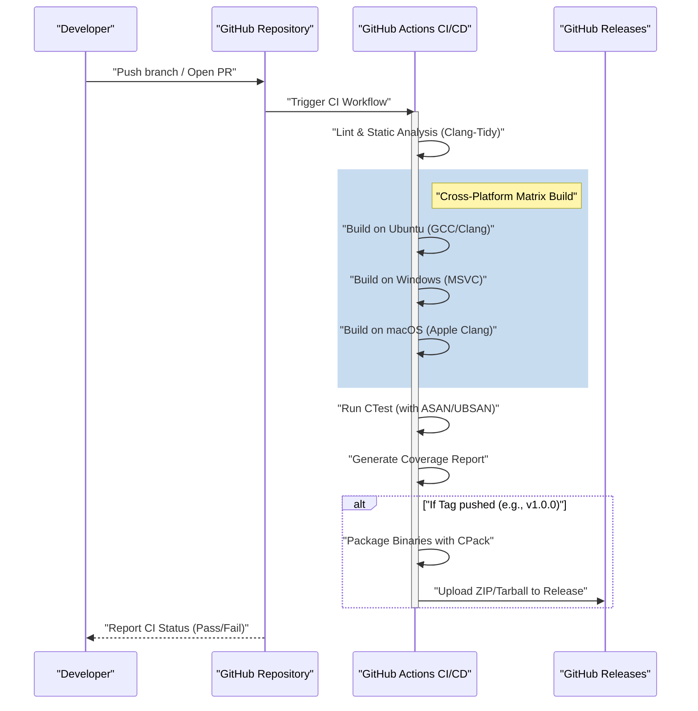
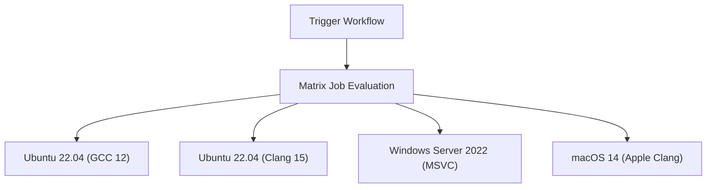

# Building a CI/CD Pipeline for C++ Projects Using GitHub Actions: A Complete Guide

In the modern software development paradigm, Continuous Integration (CI) and Continuous Delivery/Deployment (CD) are essential elements for maintaining agile development processes and high-quality software. While there are numerous programming languages, building a CI/CD pipeline in C++ involves unique difficulties and complexities compared to other languages (such as Python, JavaScript, Go, etc.).

In this article, we will explain in extreme detail how to build a robust and practical CI/CD pipeline from scratch for C++ projects using GitHub Actions. We will cover a full range of practical techniques, from matrix builds across multiple platforms (Windows, Linux, macOS), build system integration using CMake, automated testing with CTest, automation of static and dynamic analysis, coverage measurement, to automated delivery of compiled binaries through GitHub Releases.

## 1. The Significance of CI/CD in C++ Projects and Its Specific Challenges

For development involving web applications and scripting languages, testing and building on a single Docker container is often sufficient. However, C++ is a natively compiled language and heavily depends on the hardware architecture and operating system of the execution environment.

When introducing CI/CD into a C++ project, the main challenges faced are as follows:

1. **Platform Diversity**: Different operating systems like Windows, Linux, and macOS have different APIs (Windows API, POSIX, etc.). It is common for code that works in a developer's local environment (e.g., macOS) to encounter compilation errors on Linux or Windows.
2. **Compiler Differences**: Major compilers like Microsoft Visual C++ (MSVC), GNU Compiler Collection (GCC), and Clang differ in their implementation levels and interpretations of C++ standards (C++17, C++20, C++23), as well as the strictness of their warnings.
3. **Build Time**: For large-scale C++ projects, it is not uncommon for builds to take anywhere from tens of minutes to several hours. In a CI environment with limited computing resources, caching strategies and parallelization are required to build efficiently.
4. **Dependency Management**: C++ lacks an absolute standard package manager like npm or pip. You need to correctly resolve libraries in the CI environment every time using tools like vcpkg, Conan, or CMake's `FetchContent`.
5. **Memory Management and Undefined Behavior**: Since pointer operations and manual memory management are involved, it is necessary to automate the detection of memory leaks and undefined behaviors, not just test the logic.

To solve these challenges, GitHub Actions is the optimal solution, as it allows you to provision various OS virtual machines on-demand and define complex workflows as code (Configuration as Code).

## 2. CI/CD Pipeline Architecture Overview

Let's visualize the overall picture of the CI/CD pipeline we are about to build. The following Mermaid sequence diagram shows the workflow from code push to release.



In this architecture, fast feedback (static analysis, build, and tests) is provided at the Pull Request stage, and artifacts are packaged and distributed when a version tag is pushed.

## 3. Project Configuration with Modern CMake

The foundation of an excellent CI pipeline is a robust build system. We will use CMake, the de facto standard for C++. Here, we adopt a target-oriented approach known as "Modern CMake".

Assume the project directory structure is as follows:

```text
my_cpp_project/
├── CMakeLists.txt
├── src/
│   ├── main.cpp
│   ├── calculator.cpp
│   └── calculator.h
└── tests/
    ├── CMakeLists.txt
    └── test_calculator.cpp
```

Here is an example configuration for the root `CMakeLists.txt`.

```cmake
cmake_minimum_required(VERSION 3.20)
project(MyCppProject VERSION 1.0.0 LANGUAGES CXX)

# Set C++ standard
set(CMAKE_CXX_STANDARD 20)
set(CMAKE_CXX_STANDARD_REQUIRED ON)
set(CMAKE_CXX_EXTENSIONS OFF) # Disable compiler-specific extensions for better portability

# Stricter compiler warnings
function(set_project_warnings target_name)
    if(MSVC)
        target_compile_options(${target_name} PRIVATE /W4 /WX)
    else()
        target_compile_options(${target_name} PRIVATE -Wall -Wextra -Wpedantic -Werror)
    endif()
endfunction()

# Create library target
add_library(CalculatorLib src/calculator.cpp)
target_include_directories(CalculatorLib PUBLIC ${CMAKE_CURRENT_SOURCE_DIR}/src)
set_project_warnings(CalculatorLib)

# Create executable target
add_executable(MyApplication src/main.cpp)
target_link_libraries(MyApplication PRIVATE CalculatorLib)
set_project_warnings(MyApplication)

# Enable testing
enable_testing()
add_subdirectory(tests)

# Define installation rules (for CPack)
include(GNUInstallDirs)
install(TARGETS MyApplication CalculatorLib
    RUNTIME DESTINATION ${CMAKE_INSTALL_BINDIR}
    LIBRARY DESTINATION ${CMAKE_INSTALL_LIBDIR}
    ARCHIVE DESTINATION ${CMAKE_INSTALL_LIBDIR}
)

# Packaging settings with CPack
set(CPACK_PROJECT_NAME ${PROJECT_NAME})
set(CPACK_PROJECT_VERSION ${PROJECT_VERSION})
set(CPACK_GENERATOR "ZIP;TGZ")
if(WIN32)
    set(CPACK_GENERATOR "ZIP")
endif()
include(CPack)
```

**Key Points:**
- `CMAKE_CXX_EXTENSIONS OFF`: Prevents dependence on non-standard features like GNU extensions, ensuring cross-platform compatibility.
- **Stricter warnings (`-Werror` / `/WX`)**: Treating compiler warnings as errors in the CI environment forces a high level of code quality.
- **GNUInstallDirs**: Automatically resolves standard installation paths for each OS (such as `/usr/local/bin` and `C:\Program Files`).

## 4. GitHub Actions Basics and Matrix Strategy

GitHub Actions are configured using YAML files in the `.github/workflows/` directory.
The most powerful feature for C++ projects is the "Matrix Strategy". This allows you to dynamically generate combinations of operating systems and compilers and run them in parallel.



Below is a YAML job definition that forms the basis of a matrix build.

```yaml
jobs:
  build:
    name: "Build & Test [${{ matrix.os }} - ${{ matrix.compiler }}]"
    runs-on: ${{ matrix.os }}
    strategy:
      fail-fast: false # Continue building on other OSes even if one job fails
      matrix:
        include:
          - os: ubuntu-latest
            compiler: gcc
            c_compiler: gcc
            cpp_compiler: g++
          - os: ubuntu-latest
            compiler: clang
            c_compiler: clang
            cpp_compiler: clang++
          - os: windows-latest
            compiler: msvc
            c_compiler: cl
            cpp_compiler: cl
          - os: macos-latest
            compiler: apple-clang
            c_compiler: clang
            cpp_compiler: clang++
```

`fail-fast: false` is extremely important. For example, if you mistakenly use a Linux-specific API, the Ubuntu build will fail, but you also want to see simultaneously whether the Windows build succeeds.

## 5. Build Costs and Parallel Processing Optimization Using Amdahl's Law

CI/CD in a cloud environment is a race against time, and build times directly translate to developer wait times and running costs.
Here, let's take a mathematical approach to build time optimization using "Amdahl's Law" from computer science.

Amdahl's law defines the theoretical maximum speedup $S(N)$ when using $N$ processors, given the proportion of a program that can be parallelized as $P$, as follows:

$$ S(N) = \frac{1}{(1 - P) + \frac{P}{N}} $$

In the C++ build process, compiling each translation unit (`.cpp` file) of the source code is completely independent and can be parallelized. On the other hand, CMake configuration and the final binary linking phase are fundamentally executed serially (cannot be parallelized).

Suppose that out of the total build time of a project, 80% is the compilation phase ($P = 0.8$) and 20% is the serial phase ($1 - P = 0.2$).
The standard GitHub Actions runner (Linux) provides 2 cores (threads). Therefore, when $N = 2$:

$$ S(2) = \frac{1}{0.2 + \frac{0.8}{2}} = \frac{1}{0.2 + 0.4} = \frac{1}{0.6} \approx 1.67 $$

Using just 2 cores yields a speedup of about 1.67 times. To achieve this, it is essential to specify the `--parallel` option in the CMake build command.

```yaml
    - name: "Build Project"
      run: cmake --build build --config Release --parallel 2
```

Furthermore, let's consider cost calculations. The total usage cost $C_{total}$ of GitHub Actions is the sum of the products of each job's execution time $T_i$ and the runner's unit price $R_i$.

$$ C_{total} = \sum_{i=1}^{M} \left( T_i \times R_i \right) $$

Reducing build times not only speeds up the feedback loop but also directly leads to reduced operating costs for the project (especially for private repositories). For further speedups, introducing `ccache` to cache compilation results is an effective technique.

## 6. Integrating Automated Testing and Sanitizers

To prevent bugs in C++ proactively, it is strongly recommended to introduce "sanitizers" that detect memory leaks and undefined behaviors at runtime, in addition to unit tests. We will use AddressSanitizer (ASAN) and UndefinedBehaviorSanitizer (UBSAN) developed by Google.

Add an option to enable sanitizers in CMake.

```cmake
option(ENABLE_SANITIZERS "Enable ASAN and UBSAN" OFF)
if(ENABLE_SANITIZERS AND CMAKE_CXX_COMPILER_ID MATCHES "GNU|Clang")
    add_compile_options(-fsanitize=address,undefined -fno-omit-frame-pointer)
    add_link_options(-fsanitize=address,undefined)
endif()
```

Enable this option in the Ubuntu job of the CI pipeline and run the tests.

```yaml
    - name: "Configure CMake"
      env:
        CC: ${{ matrix.c_compiler }}
        CXX: ${{ matrix.cpp_compiler }}
      run: >
        cmake -B build
        -DCMAKE_BUILD_TYPE=Release
        -DENABLE_SANITIZERS=${{ matrix.os == 'ubuntu-latest' && 'ON' || 'OFF' }}

    - name: "Run CTest"
      working-directory: build
      env:
        ASAN_OPTIONS: "detect_leaks=1:symbolize=1"
        UBSAN_OPTIONS: "print_stacktrace=1"
      run: ctest --build-config Release --output-on-failure --parallel 2
```

Use the `ctest` command to run the tests. By specifying `--output-on-failure`, only the detailed logs of failed tests will be displayed in the CI output, preventing log bloat.

## 7. Measuring Code Coverage

Visualizing how much code is covered by tests is important for quality assurance. Using a Linux environment (GCC), we measure coverage with `gcov` and `lcov`.

First, set the compilation flags for measuring coverage in CMake.

```cmake
option(ENABLE_COVERAGE "Enable coverage reporting" OFF)
if(ENABLE_COVERAGE AND CMAKE_CXX_COMPILER_ID STREQUAL "GNU")
    add_compile_options(--coverage -O0 -g)
    add_link_options(--coverage)
endif()
```

Define an independent job for coverage measurement in GitHub Actions.

```yaml
  coverage:
    name: "Test Coverage Analysis"
    runs-on: ubuntu-latest
    steps:
    - uses: actions/checkout@v4
    
    - name: "Install lcov"
      run: sudo apt-get update && sudo apt-get install -y lcov
      
    - name: "Configure CMake for Coverage"
      run: cmake -B build -DCMAKE_BUILD_TYPE=Debug -DENABLE_COVERAGE=ON
      
    - name: "Build & Test"
      run: |
        cmake --build build --parallel 2
        cd build && ctest --output-on-failure
      
    - name: "Generate lcov Report"
      working-directory: build
      run: |
        lcov --capture --directory . --output-file coverage.info
        lcov --remove coverage.info '/usr/*' '*_deps/*' '*tests/*' --output-file coverage.info
        
    - name: "Upload Coverage to Codecov"
      uses: codecov/codecov-action@v3
      with:
        files: build/coverage.info
```

The `lcov --remove` command is used to exclude system headers, third-party libraries, and the test code itself from the coverage measurement. This allows us to obtain the pure coverage of the project-specific source code.

## 8. Automated Binary Delivery (CD) via GitHub Releases

We will now build the "CD" part of CI/CD. When a developer adds and pushes a version tag in Git (e.g., `v1.2.0`), it will automatically compile the executable binaries for each OS, package them into ZIPs or Tarballs, and upload them to GitHub Releases.

In this step, we will use `CPack`, a packaging tool bundled with CMake.

```yaml
    - name: "Package Application (CPack)"
      if: startsWith(github.ref, 'refs/tags/v')
      working-directory: build
      run: cpack -C Release -V

    - name: "Upload Release Assets"
      if: startsWith(github.ref, 'refs/tags/v')
      uses: softprops/action-gh-release@v1
      with:
        files: |
          build/*.tar.gz
          build/*.zip
          build/*.sh
          build/*.exe
      env:
        GITHUB_TOKEN: ${{ secrets.GITHUB_TOKEN }}
```

With this configuration, simply running `git tag v1.0.0` and `git push origin v1.0.0` will automatically publish ZIP files for Windows users and Tarballs for Linux/macOS users to the release page without manual intervention. This is an extremely powerful feature for delivering software to users.

## 9. Complete Workflow YAML File

Below is the complete code for a robust and practical `.github/workflows/main.yml`, integrating all the elements discussed so far.

```yaml
name: "C++ CI/CD Pipeline"

on:
  push:
    branches: [ "main", "develop" ]
    tags: [ "v*.*.*" ]
  pull_request:
    branches: [ "main" ]

env:
  BUILD_TYPE: Release

jobs:
  build-and-test:
    name: "Build [${{ matrix.os }} | ${{ matrix.compiler }}]"
    runs-on: ${{ matrix.os }}
    strategy:
      fail-fast: false
      matrix:
        include:
          - os: ubuntu-latest
            compiler: gcc
            c_compiler: gcc
            cpp_compiler: g++
          - os: ubuntu-latest
            compiler: clang
            c_compiler: clang
            cpp_compiler: clang++
          - os: windows-latest
            compiler: msvc
            c_compiler: cl
            cpp_compiler: cl
          - os: macos-latest
            compiler: apple-clang
            c_compiler: clang
            cpp_compiler: clang++

    steps:
    - name: "Checkout Repository"
      uses: actions/checkout@v4

    - name: "Configure CMake"
      env:
        CC: ${{ matrix.c_compiler }}
        CXX: ${{ matrix.cpp_compiler }}
      run: >
        cmake -B build
        -DCMAKE_BUILD_TYPE=${{ env.BUILD_TYPE }}
        -DENABLE_SANITIZERS=${{ matrix.os == 'ubuntu-latest' && 'ON' || 'OFF' }}

    - name: "Build Project"
      run: cmake --build build --config ${{ env.BUILD_TYPE }} --parallel 2

    - name: "Run Unit Tests (CTest)"
      working-directory: build
      env:
        ASAN_OPTIONS: "detect_leaks=1:symbolize=1"
        UBSAN_OPTIONS: "print_stacktrace=1"
      run: ctest --build-config ${{ env.BUILD_TYPE }} --output-on-failure --parallel 2

    - name: "Package with CPack"
      if: startsWith(github.ref, 'refs/tags/v')
      working-directory: build
      run: cpack -C ${{ env.BUILD_TYPE }}

    - name: "Create GitHub Release and Upload Assets"
      if: startsWith(github.ref, 'refs/tags/v')
      uses: softprops/action-gh-release@v1
      with:
        files: |
          build/*.tar.gz
          build/*.zip
      env:
        GITHUB_TOKEN: ${{ secrets.GITHUB_TOKEN }}

  coverage:
    name: "Code Coverage Analysis"
    runs-on: ubuntu-latest
    if: github.event_name == 'pull_request' || github.ref == 'refs/heads/main'
    steps:
    - name: "Checkout Repository"
      uses: actions/checkout@v4
      
    - name: "Install lcov"
      run: sudo apt-get update && sudo apt-get install -y lcov
      
    - name: "Configure CMake for Coverage"
      run: cmake -B build -DCMAKE_BUILD_TYPE=Debug -DENABLE_COVERAGE=ON
      
    - name: "Build Project"
      run: cmake --build build --parallel 2
      
    - name: "Run Tests"
      working-directory: build
      run: ctest --output-on-failure
      
    - name: "Generate lcov Report"
      working-directory: build
      run: |
        lcov --capture --directory . --output-file coverage.info
        lcov --remove coverage.info '/usr/*' '*_deps/*' '*tests/*' --output-file coverage.info
        
    - name: "Upload Coverage to Codecov"
      uses: codecov/codecov-action@v3
      with:
        files: build/coverage.info
        fail_ci_if_error: false
```

## 10. Towards More Advanced CI/CD (Static Analysis and Formatting)

Although detailed explanations are omitted here, in practical operations, it is recommended to incorporate further quality assurance tools into the pipeline.

1. **Enforcing Clang-Format**: To reduce the burden of code review, integrate code style checks using `clang-format` into CI, failing the pipeline if formatting rules are violated.
2. **Static Analysis (Clang-Tidy)**: To detect potential bugs and inefficient code (such as unnecessary copies) that compiler warnings alone cannot prevent, integrate `clang-tidy` into CMake and run it on CI.
3. **Leveraging vcpkg / Conan Caches**: If you use many third-party libraries, building dependencies takes a significant amount of time. By utilizing GitHub Actions' `actions/cache` to retain vcpkg installed directories or Conan caches, you can drastically reduce build times.

## Conclusion

Building a CI/CD pipeline for a C++ project might seem like a high hurdle at first glance due to platform dependencies and the complexity of build tools. However, by correctly combining the ecosystems of GitHub Actions, Modern CMake, and CTest/CPack, you can achieve an extremely powerful and automated development flow.

The cross-platform verification using a matrix strategy, runtime bug detection with sanitizers, coverage measurement, and automated deployment to GitHub Releases explained in this article are best practices widely adopted even in commercial-grade open-source projects.

An automated CI/CD pipeline minimizes the time developers spend on "bug hunting" or "manual build/release tasks," becoming the ultimate weapon to help them focus on their core, creative coding activities. By all means, introduce it to your C++ projects and realize an agile and secure development life.
