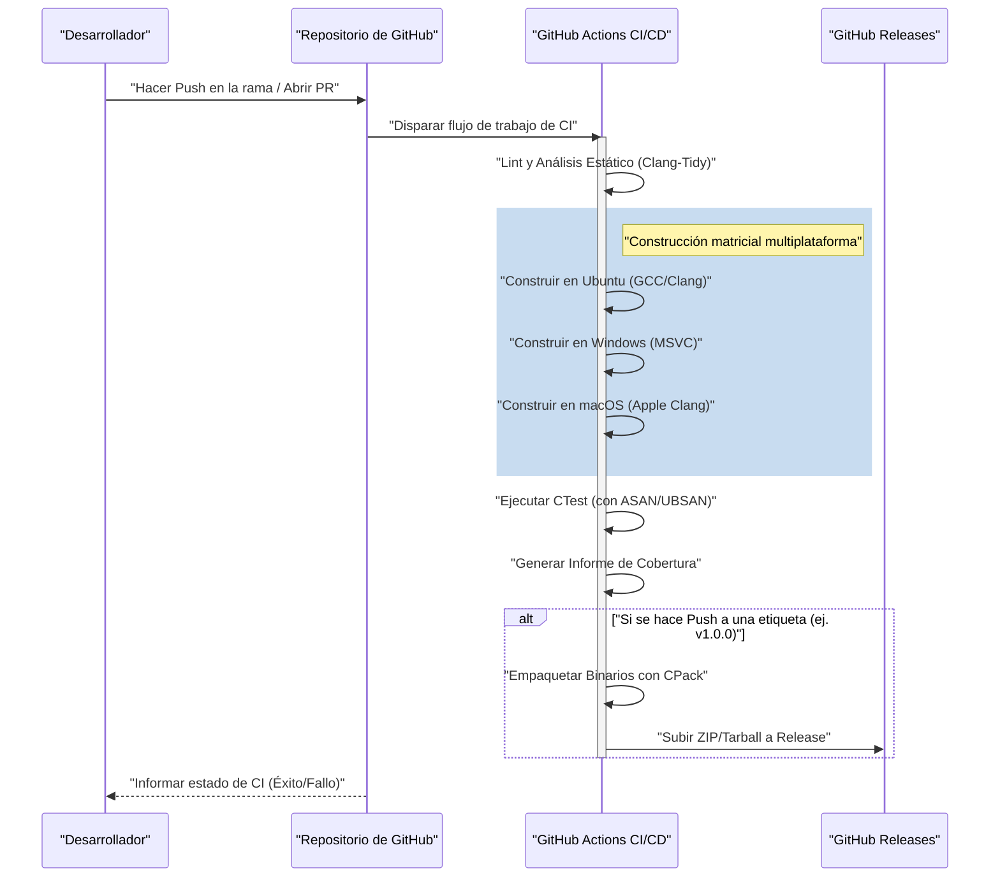
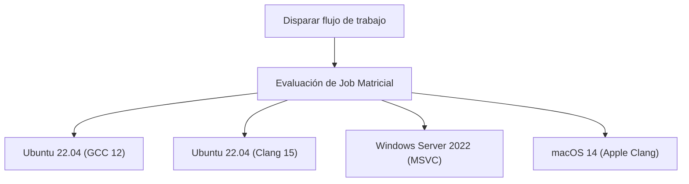

# Construcción de un pipeline CI/CD para proyectos C++ con GitHub Actions: Guía completa

En el paradigma moderno de desarrollo de software, la Integración Continua (Continuous Integration: CI) y la Entrega/Despliegue Continuo (Continuous Delivery/Deployment: CD) son elementos esenciales para los procesos de desarrollo ágil y el mantenimiento de software de alta calidad. Entre los numerosos lenguajes de programación, la construcción de un pipeline CI/CD en C++ conlleva dificultades y complejidades únicas en comparación con otros lenguajes (como Python, JavaScript, Go, etc.).

En este artículo, explicaremos en gran detalle cómo construir desde cero un pipeline CI/CD robusto y práctico para proyectos C++ utilizando GitHub Actions. Cubriremos una amplia gama de técnicas prácticas, desde construcciones matriciales multiplataforma (Windows, Linux, macOS), integración de sistemas de construcción usando CMake, pruebas automatizadas con CTest, automatización de análisis estático y dinámico, medición de cobertura, hasta la entrega automatizada de binarios compilados a través de GitHub Releases.

## 1. La importancia del CI/CD en proyectos C++ y sus desafíos únicos

En el desarrollo de aplicaciones web o lenguajes de script, a menudo basta con realizar pruebas y construcciones en un único contenedor Docker. Sin embargo, C++ es un lenguaje que se compila de forma nativa y depende fuertemente de la arquitectura de hardware y del sistema operativo del entorno de ejecución.

Al introducir CI/CD en un proyecto C++, los principales desafíos a los que nos enfrentamos son los siguientes:

1. **Diversidad de plataformas**: Las APIs (Windows API, POSIX, etc.) difieren entre sistemas operativos como Windows, Linux y macOS. Es muy común que el código funcione en el entorno local de un desarrollador (por ejemplo, macOS) pero produzca errores de compilación en Linux o Windows.
2. **Diferencias entre compiladores**: Los principales compiladores como Microsoft Visual C++ (MSVC), GNU Compiler Collection (GCC) y Clang difieren en su grado de implementación de los estándares de C++ (C++17, C++20, C++23), interpretación y severidad de las advertencias.
3. **Tiempo de construcción**: En proyectos grandes de C++, no es raro que la construcción tarde desde decenas de minutos hasta varias horas. En entornos de CI, se requieren estrategias de caché y paralelización para construir de manera eficiente con recursos informáticos limitados.
4. **Gestión de dependencias**: C++ no tiene un gestor de paquetes estándar absoluto como npm o pip. Es necesario resolver las bibliotecas correctamente cada vez en el entorno de CI utilizando herramientas como vcpkg, Conan, o `FetchContent` de CMake.
5. **Gestión de memoria y comportamiento indefinido**: Debido a que implica el uso de punteros y la gestión manual de la memoria, no solo es necesario automatizar las pruebas lógicas, sino también la detección de fugas de memoria y comportamientos indefinidos (Undefined Behavior).

Para resolver estos desafíos, GitHub Actions es la solución ideal, ya que permite aprovisionar diversas máquinas virtuales de sistemas operativos bajo demanda y definir flujos de trabajo complejos a través de código (Configuration as Code).

## 2. Descripción general de la arquitectura del pipeline CI/CD

Visualicemos la estructura general del pipeline CI/CD que vamos a construir. El siguiente diagrama de secuencia Mermaid muestra el flujo de trabajo desde que se hace un Push del código hasta su lanzamiento.



En esta arquitectura, se proporciona retroalimentación rápida (análisis estático, construcción y pruebas) en la etapa de Pull Request, y se realiza el empaquetado y distribución de los artefactos cuando se asigna una etiqueta de versión.

## 3. Configuración del proyecto con CMake moderno

La base de un pipeline de CI excelente es un sistema de construcción robusto. Usaremos CMake, que es el estándar de facto para C++. Aquí adoptaremos el enfoque orientado a objetivos conocido como "CMake moderno".

Asumimos que la estructura del directorio del proyecto es la siguiente:

```text
my_cpp_project/
├── CMakeLists.txt
├── src/
│   ├── main.cpp
│   ├── calculator.cpp
│   └── calculator.h
└── tests/
    ├── CMakeLists.txt
    └── test_calculator.cpp
```

Ejemplo de configuración de `CMakeLists.txt` en la raíz:

```cmake
cmake_minimum_required(VERSION 3.20)
project(MyCppProject VERSION 1.0.0 LANGUAGES CXX)

# Configuración del estándar C++
set(CMAKE_CXX_STANDARD 20)
set(CMAKE_CXX_STANDARD_REQUIRED ON)
set(CMAKE_CXX_EXTENSIONS OFF) # Desactiva las extensiones del compilador para mejorar la portabilidad

# Mayor rigor en las advertencias del compilador
function(set_project_warnings target_name)
    if(MSVC)
        target_compile_options(${target_name} PRIVATE /W4 /WX)
    else()
        target_compile_options(${target_name} PRIVATE -Wall -Wextra -Wpedantic -Werror)
    endif()
endfunction()

# Creación del objetivo (target) de la biblioteca
add_library(CalculatorLib src/calculator.cpp)
target_include_directories(CalculatorLib PUBLIC ${CMAKE_CURRENT_SOURCE_DIR}/src)
set_project_warnings(CalculatorLib)

# Creación del objetivo (target) del archivo ejecutable
add_executable(MyApplication src/main.cpp)
target_link_libraries(MyApplication PRIVATE CalculatorLib)
set_project_warnings(MyApplication)

# Habilitación de pruebas
enable_testing()
add_subdirectory(tests)

# Definición de reglas de instalación (para CPack)
include(GNUInstallDirs)
install(TARGETS MyApplication CalculatorLib
    RUNTIME DESTINATION ${CMAKE_INSTALL_BINDIR}
    LIBRARY DESTINATION ${CMAKE_INSTALL_LIBDIR}
    ARCHIVE DESTINATION ${CMAKE_INSTALL_LIBDIR}
)

# Configuración de empaquetado mediante CPack
set(CPACK_PROJECT_NAME ${PROJECT_NAME})
set(CPACK_PROJECT_VERSION ${PROJECT_VERSION})
set(CPACK_GENERATOR "ZIP;TGZ")
if(WIN32)
    set(CPACK_GENERATOR "ZIP")
endif()
include(CPack)
```

**Puntos importantes:**
- `CMAKE_CXX_EXTENSIONS OFF`: Previene la dependencia de características no estándar como las extensiones GNU y garantiza la portabilidad multiplataforma.
- **Rigor en las advertencias (`-Werror` / `/WX`)**: Al tratar las advertencias del compilador como errores en el entorno de CI, se mantiene obligatoriamente alta la calidad del código.
- **GNUInstallDirs**: Resuelve automáticamente las rutas de instalación estándar para cada sistema operativo (como `/usr/local/bin` o `C:\Program Files`).

## 4. Fundamentos de GitHub Actions y estrategia matricial

GitHub Actions se configura mediante archivos YAML en el directorio `.github/workflows/`.
La característica más poderosa para proyectos C++ es la "Estrategia Matricial" (Matrix Strategy). Esto permite generar dinámicamente y ejecutar en paralelo combinaciones de sistemas operativos y compiladores.



A continuación se muestra la definición básica del trabajo (job) en YAML para la construcción matricial.

```yaml
jobs:
  build:
    name: "Build & Test [${{ matrix.os }} - ${{ matrix.compiler }}]"
    runs-on: ${{ matrix.os }}
    strategy:
      fail-fast: false # Continúa con la construcción en otros sistemas operativos incluso si falla un job
      matrix:
        include:
          - os: ubuntu-latest
            compiler: gcc
            c_compiler: gcc
            cpp_compiler: g++
          - os: ubuntu-latest
            compiler: clang
            c_compiler: clang
            cpp_compiler: clang++
          - os: windows-latest
            compiler: msvc
            c_compiler: cl
            cpp_compiler: cl
          - os: macos-latest
            compiler: apple-clang
            c_compiler: clang
            cpp_compiler: clang++
```

`fail-fast: false` es muy importante. Por ejemplo, si utilizas por error una API específica de Linux, la construcción en Ubuntu fallará, pero también querrás verificar al mismo tiempo si la construcción en Windows tiene éxito o no.

## 5. Costos de construcción y optimización del procesamiento paralelo utilizando la Ley de Amdahl

El CI/CD en la nube es una carrera contra el tiempo, y los tiempos de construcción se traducen directamente en el tiempo de espera del desarrollador y en costos operativos.
Abordemos matemáticamente la optimización del tiempo de construcción utilizando la "Ley de Amdahl" de las ciencias de la computación.

La Ley de Amdahl define el aumento de velocidad máximo teórico $S(N)$ al utilizar $N$ procesadores, donde $P$ es la proporción de la parte paralelizable del programa:

$$ S(N) = \frac{1}{(1 - P) + \frac{P}{N}} $$

En el proceso de construcción de C++, la compilación de cada unidad de traducción (archivos `.cpp`) es completamente independiente y se puede paralelizar. Por otro lado, la configuración de CMake y la fase final de enlace de los binarios son básicamente de ejecución secuencial (no paralelizables).

Supongamos que del tiempo total de construcción del proyecto, el 80% corresponde a la fase de compilación ($P = 0.8$) y el 20% a la fase secuencial ($1 - P = 0.2$).
Los corredores (runners) estándar de GitHub Actions (Linux) ofrecen 2 núcleos (hilos). Por lo tanto, si $N = 2$:

$$ S(2) = \frac{1}{0.2 + \frac{0.8}{2}} = \frac{1}{0.2 + 0.4} = \frac{1}{0.6} \approx 1.67 $$

Con solo usar 2 núcleos, se obtiene un aumento de velocidad de aproximadamente 1,67 veces. Para lograr esto, es esencial especificar la opción `--parallel` en el comando de construcción de CMake.

```yaml
    - name: "Build Project"
      run: cmake --build build --config Release --parallel 2
```

Además, consideremos el cálculo de costos. El costo total de usar GitHub Actions, $C_{total}$, es la suma del producto del tiempo de ejecución del job $T_i$ y el costo unitario del runner $R_i$.

$$ C_{total} = \sum_{i=1}^{M} \left( T_i \times R_i \right) $$

Reducir el tiempo de construcción no solo acelera el ciclo de retroalimentación, sino que también reduce directamente el costo operativo del proyecto (especialmente en el caso de repositorios privados). Si buscas una aceleración aún mayor, introducir `ccache` para almacenar en caché los resultados de la compilación es un enfoque eficaz.

## 6. Pruebas automatizadas e integración de Sanitizers

Para prevenir errores (bugs) en C++ de forma proactiva, además de las pruebas unitarias (unit tests), se recomienda encarecidamente introducir "Sanitizers" que detecten fugas de memoria y comportamientos indefinidos en tiempo de ejecución. Utilizaremos AddressSanitizer (ASAN) y UndefinedBehaviorSanitizer (UBSAN) desarrollados por Google.

Agregaremos una opción en CMake para habilitar los Sanitizers.

```cmake
option(ENABLE_SANITIZERS "Habilitar ASAN y UBSAN" OFF)
if(ENABLE_SANITIZERS AND CMAKE_CXX_COMPILER_ID MATCHES "GNU|Clang")
    add_compile_options(-fsanitize=address,undefined -fno-omit-frame-pointer)
    add_link_options(-fsanitize=address,undefined)
endif()
```

Habilitaremos esta opción en el job de Ubuntu de nuestro pipeline CI para ejecutar las pruebas.

```yaml
    - name: "Configure CMake"
      env:
        CC: ${{ matrix.c_compiler }}
        CXX: ${{ matrix.cpp_compiler }}
      run: >
        cmake -B build
        -DCMAKE_BUILD_TYPE=Release
        -DENABLE_SANITIZERS=${{ matrix.os == 'ubuntu-latest' && 'ON' || 'OFF' }}

    - name: "Run CTest"
      working-directory: build
      env:
        ASAN_OPTIONS: "detect_leaks=1:symbolize=1"
        UBSAN_OPTIONS: "print_stacktrace=1"
      run: ctest --build-config Release --output-on-failure --parallel 2
```

Usamos el comando `ctest` para ejecutar las pruebas. Al especificar `--output-on-failure`, solo se mostrarán en la salida del CI los registros detallados de las pruebas que hayan fallado, evitando así que los registros (logs) crezcan innecesariamente.

## 7. Medición de Cobertura (Coverage)

Visualizar qué cantidad de código está cubierta por las pruebas es fundamental para el control de calidad. Utilizando el entorno Linux (GCC), mediremos la cobertura mediante `gcov` y `lcov`.

Primero, configuraremos las banderas (flags) de compilación en CMake para la medición de la cobertura.

```cmake
option(ENABLE_COVERAGE "Habilitar informes de cobertura" OFF)
if(ENABLE_COVERAGE AND CMAKE_CXX_COMPILER_ID STREQUAL "GNU")
    add_compile_options(--coverage -O0 -g)
    add_link_options(--coverage)
endif()
```

Definiremos un job independiente en GitHub Actions para la medición de cobertura.

```yaml
  coverage:
    name: "Test Coverage Analysis"
    runs-on: ubuntu-latest
    steps:
    - uses: actions/checkout@v4
    
    - name: "Install lcov"
      run: sudo apt-get update && sudo apt-get install -y lcov
      
    - name: "Configure CMake for Coverage"
      run: cmake -B build -DCMAKE_BUILD_TYPE=Debug -DENABLE_COVERAGE=ON
      
    - name: "Build & Test"
      run: |
        cmake --build build --parallel 2
        cd build && ctest --output-on-failure
      
    - name: "Generate lcov Report"
      working-directory: build
      run: |
        lcov --capture --directory . --output-file coverage.info
        lcov --remove coverage.info '/usr/*' '*_deps/*' '*tests/*' --output-file coverage.info
        
    - name: "Upload Coverage to Codecov"
      uses: codecov/codecov-action@v3
      with:
        files: build/coverage.info
```
Utilizando el comando `lcov --remove`, excluimos las cabeceras del sistema, las bibliotecas de terceros y el propio código de prueba de la medición de cobertura. Esto nos permite obtener una cobertura pura del código fuente específico del proyecto.

## 8. Entrega automatizada de binarios a través de GitHub Releases (CD)

Vamos a construir la parte "CD" (Entrega Continua) del CI/CD. Cuando un desarrollador asigna y envía una etiqueta de versión en Git (ej.: `v1.2.0`), el sistema compilará automáticamente binarios ejecutables para cada sistema operativo, los empaquetará en archivos ZIP o Tarball y los subirá a GitHub Releases.

En este paso, usaremos la herramienta de empaquetado `CPack` que viene incluida con CMake.

```yaml
    - name: "Package Application (CPack)"
      if: startsWith(github.ref, 'refs/tags/v')
      working-directory: build
      run: cpack -C Release -V

    - name: "Upload Release Assets"
      if: startsWith(github.ref, 'refs/tags/v')
      uses: softprops/action-gh-release@v1
      with:
        files: |
          build/*.tar.gz
          build/*.zip
          build/*.sh
          build/*.exe
      env:
        GITHUB_TOKEN: ${{ secrets.GITHUB_TOKEN }}
```

Con esta configuración, simplemente ejecutando `git tag v1.0.0` y `git push origin v1.0.0`, el sistema publicará automáticamente un archivo ZIP para usuarios de Windows y un Tarball para usuarios de Linux/macOS en la página de versiones sin ninguna intervención manual. Esta es una característica extremadamente poderosa para entregar el software a los usuarios.

## 9. Archivo YAML completo del flujo de trabajo

A continuación, se muestra el código completo, robusto y práctico para `.github/workflows/main.yml`, que integra todos los elementos explicados hasta ahora.

```yaml
name: "C++ CI/CD Pipeline"

on:
  push:
    branches: [ "main", "develop" ]
    tags: [ "v*.*.*" ]
  pull_request:
    branches: [ "main" ]

env:
  BUILD_TYPE: Release

jobs:
  build-and-test:
    name: "Build [${{ matrix.os }} | ${{ matrix.compiler }}]"
    runs-on: ${{ matrix.os }}
    strategy:
      fail-fast: false
      matrix:
        include:
          - os: ubuntu-latest
            compiler: gcc
            c_compiler: gcc
            cpp_compiler: g++
          - os: ubuntu-latest
            compiler: clang
            c_compiler: clang
            cpp_compiler: clang++
          - os: windows-latest
            compiler: msvc
            c_compiler: cl
            cpp_compiler: cl
          - os: macos-latest
            compiler: apple-clang
            c_compiler: clang
            cpp_compiler: clang++

    steps:
    - name: "Checkout Repository"
      uses: actions/checkout@v4

    - name: "Configure CMake"
      env:
        CC: ${{ matrix.c_compiler }}
        CXX: ${{ matrix.cpp_compiler }}
      run: >
        cmake -B build
        -DCMAKE_BUILD_TYPE=${{ env.BUILD_TYPE }}
        -DENABLE_SANITIZERS=${{ matrix.os == 'ubuntu-latest' && 'ON' || 'OFF' }}

    - name: "Build Project"
      run: cmake --build build --config ${{ env.BUILD_TYPE }} --parallel 2

    - name: "Run Unit Tests (CTest)"
      working-directory: build
      env:
        ASAN_OPTIONS: "detect_leaks=1:symbolize=1"
        UBSAN_OPTIONS: "print_stacktrace=1"
      run: ctest --build-config ${{ env.BUILD_TYPE }} --output-on-failure --parallel 2

    - name: "Package with CPack"
      if: startsWith(github.ref, 'refs/tags/v')
      working-directory: build
      run: cpack -C ${{ env.BUILD_TYPE }}

    - name: "Create GitHub Release and Upload Assets"
      if: startsWith(github.ref, 'refs/tags/v')
      uses: softprops/action-gh-release@v1
      with:
        files: |
          build/*.tar.gz
          build/*.zip
      env:
        GITHUB_TOKEN: ${{ secrets.GITHUB_TOKEN }}

  coverage:
    name: "Code Coverage Analysis"
    runs-on: ubuntu-latest
    if: github.event_name == 'pull_request' || github.ref == 'refs/heads/main'
    steps:
    - name: "Checkout Repository"
      uses: actions/checkout@v4
      
    - name: "Install lcov"
      run: sudo apt-get update && sudo apt-get install -y lcov
      
    - name: "Configure CMake for Coverage"
      run: cmake -B build -DCMAKE_BUILD_TYPE=Debug -DENABLE_COVERAGE=ON
      
    - name: "Build Project"
      run: cmake --build build --parallel 2
      
    - name: "Run Tests"
      working-directory: build
      run: ctest --output-on-failure
      
    - name: "Generate lcov Report"
      working-directory: build
      run: |
        lcov --capture --directory . --output-file coverage.info
        lcov --remove coverage.info '/usr/*' '*_deps/*' '*tests/*' --output-file coverage.info
        
    - name: "Upload Coverage to Codecov"
      uses: codecov/codecov-action@v3
      with:
        files: build/coverage.info
        fail_ci_if_error: false
```

## 10. Hacia un CI/CD aún más avanzado (Análisis estático y formato)

Aunque omitiremos los detalles aquí, en entornos de producción se recomienda integrar herramientas de control de calidad adicionales en el pipeline.

1. **Cumplimiento de Clang-Format**: Para reducir la carga de las revisiones de código (code reviews), integra verificaciones de estilo con `clang-format` en el CI, haciendo que el pipeline falle si se violan las reglas de formato.
2. **Análisis Estático (Clang-Tidy)**: Para detectar errores (bugs) latentes que las advertencias del compilador no pueden prevenir, y para identificar código ineficiente (como copias innecesarias), integra `clang-tidy` en CMake y ejecútalo en el CI.
3. **Aprovechamiento de la memoria caché de vcpkg / Conan**: Si utilizas muchas bibliotecas de terceros, compilar las dependencias puede llevar mucho tiempo. Utilizando `actions/cache` de GitHub Actions para conservar los directorios de instalación de vcpkg o la caché de Conan, se puede reducir drásticamente el tiempo de construcción.

## Conclusión

La construcción de un pipeline CI/CD en proyectos C++ puede parecer inicialmente desalentadora debido a las dependencias de plataforma y la complejidad de las herramientas de construcción. Sin embargo, combinando correctamente GitHub Actions, CMake moderno y el ecosistema de CTest/CPack, es posible obtener un flujo de desarrollo altamente automatizado y potente.

La verificación multiplataforma mediante la estrategia matricial, la detección de errores en tiempo de ejecución con Sanitizers, la medición de cobertura y el despliegue automático a GitHub Releases que se explicaron en este artículo, son las mejores prácticas adoptadas ampliamente, incluso en proyectos de código abierto de nivel comercial.

Un pipeline CI/CD automatizado minimiza el tiempo que los desarrolladores dedican a la "búsqueda de errores" y a las "tareas manuales de construcción y lanzamiento", convirtiéndose en el arma definitiva para concentrarse en la actividad verdaderamente creativa que es la programación. No dudes en implementarlo en tus proyectos C++ y disfruta de una vida de desarrollo ágil y confiable.
