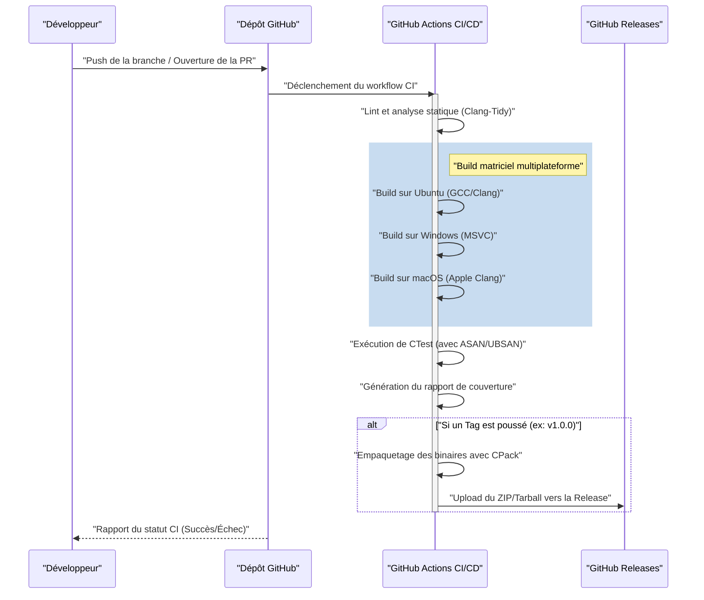
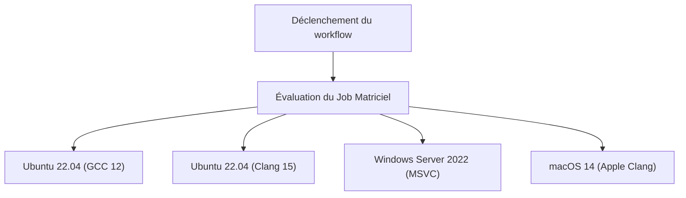

# Guide complet pour construire un pipeline CI/CD pour un projet C++ avec GitHub Actions

Dans le paradigme moderne de développement logiciel, l'intégration continue (CI) et la livraison/déploiement continu (CD) sont des éléments essentiels pour maintenir un processus de développement agile et des logiciels de haute qualité. Parmi les nombreux langages de programmation existants, la construction d'un pipeline CI/CD pour C++ implique des difficultés et des complexités uniques par rapport à d'autres langages (comme Python, JavaScript, Go, etc.).

Cet article explique en détail comment utiliser GitHub Actions pour construire de zéro un pipeline CI/CD robuste et pratique pour vos projets C++. Il couvre toutes les techniques pratiques : les builds matriciels multiplateformes (Windows, Linux, macOS), l'intégration du système de build avec CMake, les tests automatisés avec CTest, l'automatisation de l'analyse statique et dynamique, la mesure de couverture de code, et enfin la livraison automatique de binaires compilés via GitHub Releases.

## 1. L'importance du CI/CD dans les projets C++ et ses défis spécifiques

Pour les applications Web et le développement avec des langages de script, les tests et les builds sur un seul conteneur Docker sont souvent suffisants. Cependant, C++ est un langage compilé nativement, fortement dépendant de l'architecture matérielle et du système d'exploitation de l'environnement d'exécution.

Lors de l'introduction du CI/CD dans un projet C++, les principaux défis rencontrés sont les suivants :

1. **Diversité des plateformes** : Les API (Windows API, POSIX, etc.) diffèrent selon les systèmes d'exploitation comme Windows, Linux et macOS. Il est fréquent qu'un code qui fonctionne sur l'environnement local du développeur (par exemple, macOS) produise des erreurs de compilation sur Linux ou Windows.
2. **Différences entre les compilateurs** : Les principaux compilateurs tels que Microsoft Visual C++ (MSVC), GNU Compiler Collection (GCC) et Clang ont des degrés d'implémentation différents des standards C++ (C++17, C++20, C++23), ainsi que des interprétations et des niveaux de sévérité des avertissements différents.
3. **Temps de compilation** : Pour les grands projets C++, il n'est pas rare que le build prenne de quelques dizaines de minutes à plusieurs heures. Les environnements CI nécessitent des stratégies de mise en cache et de parallélisation pour construire efficacement avec des ressources informatiques limitées.
4. **Gestion des dépendances** : C++ n'a pas de gestionnaire de paquets standard absolu comme npm ou pip. Il est nécessaire de résoudre correctement les bibliothèques à chaque fois dans l'environnement CI, en utilisant des outils comme vcpkg, Conan ou le `FetchContent` de CMake.
5. **Gestion de la mémoire et comportements indéfinis** : Étant donné que la manipulation des pointeurs et la gestion manuelle de la mémoire sont impliquées, il est nécessaire d'automatiser non seulement les tests de logique, mais aussi la détection des fuites de mémoire et des comportements indéfinis (Undefined Behavior).

Pour résoudre ces problèmes, GitHub Actions est la solution idéale, car il permet de provisionner à la demande des machines virtuelles avec divers systèmes d'exploitation et de définir des workflows complexes sous forme de code (Configuration as Code).

## 2. Aperçu de l'architecture du pipeline CI/CD

Visualisons l'ensemble du pipeline CI/CD que nous allons construire. Le diagramme de séquence Mermaid suivant illustre le workflow depuis le Push du code jusqu'à la publication (Release).



Dans cette architecture, des retours rapides (analyse statique, build et tests) sont fournis lors de la phase de Pull Request, tandis que l'empaquetage et la distribution des artefacts sont effectués au moment où une balise de version (tag) est appliquée.

## 3. Configuration du projet avec le CMake moderne

La base d'un excellent pipeline CI repose sur un système de build robuste. Nous utiliserons CMake, le standard de facto pour C++. Ici, nous adopterons une approche orientée cibles appelée "Modern CMake".

Supposons la structure de répertoire de projet suivante :

```text
my_cpp_project/
├── CMakeLists.txt
├── src/
│   ├── main.cpp
│   ├── calculator.cpp
│   └── calculator.h
└── tests/
    ├── CMakeLists.txt
    └── test_calculator.cpp
```

Voici un exemple de configuration pour le `CMakeLists.txt` à la racine.

```cmake
cmake_minimum_required(VERSION 3.20)
project(MyCppProject VERSION 1.0.0 LANGUAGES CXX)

# Configuration du standard C++
set(CMAKE_CXX_STANDARD 20)
set(CMAKE_CXX_STANDARD_REQUIRED ON)
set(CMAKE_CXX_EXTENSIONS OFF) # Désactiver les extensions spécifiques au compilateur pour améliorer la portabilité

# Stricte application des avertissements du compilateur
function(set_project_warnings target_name)
    if(MSVC)
        target_compile_options(${target_name} PRIVATE /W4 /WX)
    else()
        target_compile_options(${target_name} PRIVATE -Wall -Wextra -Wpedantic -Werror)
    endif()
endfunction()

# Création de la cible de la bibliothèque
add_library(CalculatorLib src/calculator.cpp)
target_include_directories(CalculatorLib PUBLIC ${CMAKE_CURRENT_SOURCE_DIR}/src)
set_project_warnings(CalculatorLib)

# Création de la cible de l'exécutable
add_executable(MyApplication src/main.cpp)
target_link_libraries(MyApplication PRIVATE CalculatorLib)
set_project_warnings(MyApplication)

# Activation des tests
enable_testing()
add_subdirectory(tests)

# Définition des règles d'installation (pour CPack)
include(GNUInstallDirs)
install(TARGETS MyApplication CalculatorLib
    RUNTIME DESTINATION ${CMAKE_INSTALL_BINDIR}
    LIBRARY DESTINATION ${CMAKE_INSTALL_LIBDIR}
    ARCHIVE DESTINATION ${CMAKE_INSTALL_LIBDIR}
)

# Configuration de l'empaquetage avec CPack
set(CPACK_PROJECT_NAME ${PROJECT_NAME})
set(CPACK_PROJECT_VERSION ${PROJECT_VERSION})
set(CPACK_GENERATOR "ZIP;TGZ")
if(WIN32)
    set(CPACK_GENERATOR "ZIP")
endif()
include(CPack)
```

**Points importants :**
- `CMAKE_CXX_EXTENSIONS OFF` : Empêche la dépendance aux fonctionnalités non standard telles que les extensions GNU et garantit la compatibilité multiplateforme.
- **Application stricte des avertissements (`-Werror` / `/WX`)** : Traiter les avertissements du compilateur comme des erreurs dans l'environnement CI permet de maintenir obligatoirement un code de haute qualité.
- **GNUInstallDirs** : Résout automatiquement les chemins d'installation standards spécifiques au système d'exploitation (comme `/usr/local/bin` ou `C:\Program Files`).

## 4. Bases des GitHub Actions et stratégie de matrice

GitHub Actions est configuré via des fichiers YAML dans le répertoire `.github/workflows/`.
Dans les projets C++, la fonctionnalité la plus puissante est la "Stratégie de matrice (Matrix Strategy)". Elle permet de générer dynamiquement des combinaisons de systèmes d'exploitation et de compilateurs, puis de les exécuter en parallèle.



Voici la définition de job YAML de base pour un build matriciel :

```yaml
jobs:
  build:
    name: "Build & Test [${{ matrix.os }} - ${{ matrix.compiler }}]"
    runs-on: ${{ matrix.os }}
    strategy:
      fail-fast: false # Continuer les builds des autres OS même si un job échoue
      matrix:
        include:
          - os: ubuntu-latest
            compiler: gcc
            c_compiler: gcc
            cpp_compiler: g++
          - os: ubuntu-latest
            compiler: clang
            c_compiler: clang
            cpp_compiler: clang++
          - os: windows-latest
            compiler: msvc
            c_compiler: cl
            cpp_compiler: cl
          - os: macos-latest
            compiler: apple-clang
            c_compiler: clang
            cpp_compiler: clang++
```

`fail-fast: false` est très important. Par exemple, si vous utilisez par erreur une API spécifique à Linux, le build sur Ubuntu échouera, mais vous voudrez savoir en même temps si le build sur Windows réussit.

## 5. Coûts de compilation et optimisation du traitement parallèle selon la loi d'Amdahl

Le CI/CD dans les environnements cloud est une course contre la montre, et le temps de compilation se traduit directement par du temps d'attente pour les développeurs et des coûts d'exécution.
Abordons mathématiquement l'optimisation des temps de compilation en utilisant la "Loi d'Amdahl" (Amdahl's Law) de l'informatique.

La loi d'Amdahl définit le taux d'amélioration théorique maximal de la vitesse $S(N)$ lors de l'utilisation de $N$ processeurs, où $P$ est la proportion de la partie parallélisable du programme, comme suit :

$$ S(N) = \frac{1}{(1 - P) + \frac{P}{N}} $$

Dans le processus de build C++, la compilation de chaque unité de traduction (fichiers `.cpp`) du code source est complètement indépendante et peut être parallélisée. En revanche, la phase de configuration de CMake et la phase finale d'édition de liens du binaire sont fondamentalement exécutées en série (non parallélisables).

Supposons que sur le temps total de build du projet, 80 % correspondent à la phase de compilation ($P = 0.8$) et 20 % à la phase en série ($1 - P = 0.2$).
Le runner standard de GitHub Actions (Linux) fournit 2 cœurs (threads). Donc pour $N = 2$ :

$$ S(2) = \frac{1}{0.2 + \frac{0.8}{2}} = \frac{1}{0.2 + 0.4} = \frac{1}{0.6} \approx 1.67 $$

En utilisant seulement 2 cœurs, on obtient une accélération d'environ 1,67 fois. Pour y parvenir, il est indispensable de spécifier l'option `--parallel` dans la commande de build CMake.

```yaml
    - name: "Build Project"
      run: cmake --build build --config Release --parallel 2
```

De plus, considérons le calcul du coût. Le coût d'utilisation global de GitHub Actions $C_{total}$ est la somme des produits du temps d'exécution du job $T_i$ et du prix unitaire du runner $R_i$.

$$ C_{total} = \sum_{i=1}^{M} \left( T_i \times R_i \right) $$

La réduction du temps de build ne permet pas seulement d'accélérer la boucle de rétroaction, elle réduit aussi directement les coûts d'exploitation du projet (surtout pour les dépôts privés). Pour obtenir des accélérations supplémentaires, l'introduction de `ccache` pour mettre en cache les résultats de la compilation est une approche efficace.

## 6. Intégration des tests automatisés et des Sanitizers (Assainisseurs)

Pour prévenir les bugs en C++, en plus des tests unitaires, il est fortement recommandé d'introduire des "Sanitizers" pour détecter à l'exécution les fuites de mémoire et les comportements indéfinis. Nous utiliserons AddressSanitizer (ASAN) et UndefinedBehaviorSanitizer (UBSAN) développés par Google.

Nous allons ajouter une option à CMake pour activer les sanitizers.

```cmake
option(ENABLE_SANITIZERS "Enable ASAN and UBSAN" OFF)
if(ENABLE_SANITIZERS AND CMAKE_CXX_COMPILER_ID MATCHES "GNU|Clang")
    add_compile_options(-fsanitize=address,undefined -fno-omit-frame-pointer)
    add_link_options(-fsanitize=address,undefined)
endif()
```

Nous allons activer cette option et exécuter les tests dans le job Ubuntu du pipeline CI.

```yaml
    - name: "Configure CMake"
      env:
        CC: ${{ matrix.c_compiler }}
        CXX: ${{ matrix.cpp_compiler }}
      run: >
        cmake -B build
        -DCMAKE_BUILD_TYPE=Release
        -DENABLE_SANITIZERS=${{ matrix.os == 'ubuntu-latest' && 'ON' || 'OFF' }}

    - name: "Run CTest"
      working-directory: build
      env:
        ASAN_OPTIONS: "detect_leaks=1:symbolize=1"
        UBSAN_OPTIONS: "print_stacktrace=1"
      run: ctest --build-config Release --output-on-failure --parallel 2
```

La commande `ctest` est utilisée pour exécuter les tests. En spécifiant `--output-on-failure`, seuls les journaux détaillés des tests échoués s'afficheront dans la sortie CI, empêchant ainsi le gonflement des logs.

## 7. Mesure de la couverture de code

Il est important en assurance qualité de visualiser quelle quantité de code est couverte par les tests. En utilisant l'environnement Linux (GCC), nous allons mesurer la couverture avec `gcov` et `lcov`.

Tout d'abord, nous configurons les drapeaux de compilation (flags) dans CMake pour la mesure de la couverture.

```cmake
option(ENABLE_COVERAGE "Enable coverage reporting" OFF)
if(ENABLE_COVERAGE AND CMAKE_CXX_COMPILER_ID STREQUAL "GNU")
    add_compile_options(--coverage -O0 -g)
    add_link_options(--coverage)
endif()
```

Nous définissons un job distinct pour la mesure de la couverture dans GitHub Actions.

```yaml
  coverage:
    name: "Test Coverage Analysis"
    runs-on: ubuntu-latest
    steps:
    - uses: actions/checkout@v4
    
    - name: "Install lcov"
      run: sudo apt-get update && sudo apt-get install -y lcov
      
    - name: "Configure CMake for Coverage"
      run: cmake -B build -DCMAKE_BUILD_TYPE=Debug -DENABLE_COVERAGE=ON
      
    - name: "Build & Test"
      run: |
        cmake --build build --parallel 2
        cd build && ctest --output-on-failure
      
    - name: "Generate lcov Report"
      working-directory: build
      run: |
        lcov --capture --directory . --output-file coverage.info
        lcov --remove coverage.info '/usr/*' '*_deps/*' '*tests/*' --output-file coverage.info
        
    - name: "Upload Coverage to Codecov"
      uses: codecov/codecov-action@v3
      with:
        files: build/coverage.info
```

Nous utilisons la commande `lcov --remove` pour exclure les en-têtes système, les bibliothèques tierces et le code de test de la mesure de couverture. Cela permet d'obtenir la couverture pure du code source spécifique au projet.

## 8. Livraison automatique de binaires via GitHub Releases (CD)

Nous allons construire la partie "CD" du CI/CD. Lorsqu'un développeur ajoute et pousse une balise de version (tag) avec Git (ex: `v1.2.0`), l'exécutable binaire pour chaque OS sera automatiquement compilé, empaqueté en format ZIP ou Tarball, puis téléchargé vers GitHub Releases.

À cette étape, nous utiliserons `CPack`, l'outil d'empaquetage inclus avec CMake.

```yaml
    - name: "Package Application (CPack)"
      if: startsWith(github.ref, 'refs/tags/v')
      working-directory: build
      run: cpack -C Release -V

    - name: "Upload Release Assets"
      if: startsWith(github.ref, 'refs/tags/v')
      uses: softprops/action-gh-release@v1
      with:
        files: |
          build/*.tar.gz
          build/*.zip
          build/*.sh
          build/*.exe
      env:
        GITHUB_TOKEN: ${{ secrets.GITHUB_TOKEN }}
```

Grâce à cette configuration, la simple exécution de `git tag v1.0.0` et `git push origin v1.0.0` publiera automatiquement les fichiers ZIP pour les utilisateurs Windows et les Tarballs pour les utilisateurs Linux/macOS sur la page de version (Release), sans intervention manuelle. C'est une fonctionnalité extrêmement puissante pour livrer un logiciel aux utilisateurs.

## 9. Fichier YAML de Workflow complet

Voici le code complet, robuste et pratique du fichier `.github/workflows/main.yml`, qui intègre tous les éléments expliqués jusqu'à présent.

```yaml
name: "C++ CI/CD Pipeline"

on:
  push:
    branches: [ "main", "develop" ]
    tags: [ "v*.*.*" ]
  pull_request:
    branches: [ "main" ]

env:
  BUILD_TYPE: Release

jobs:
  build-and-test:
    name: "Build [${{ matrix.os }} | ${{ matrix.compiler }}]"
    runs-on: ${{ matrix.os }}
    strategy:
      fail-fast: false
      matrix:
        include:
          - os: ubuntu-latest
            compiler: gcc
            c_compiler: gcc
            cpp_compiler: g++
          - os: ubuntu-latest
            compiler: clang
            c_compiler: clang
            cpp_compiler: clang++
          - os: windows-latest
            compiler: msvc
            c_compiler: cl
            cpp_compiler: cl
          - os: macos-latest
            compiler: apple-clang
            c_compiler: clang
            cpp_compiler: clang++

    steps:
    - name: "Checkout Repository"
      uses: actions/checkout@v4

    - name: "Configure CMake"
      env:
        CC: ${{ matrix.c_compiler }}
        CXX: ${{ matrix.cpp_compiler }}
      run: >
        cmake -B build
        -DCMAKE_BUILD_TYPE=${{ env.BUILD_TYPE }}
        -DENABLE_SANITIZERS=${{ matrix.os == 'ubuntu-latest' && 'ON' || 'OFF' }}

    - name: "Build Project"
      run: cmake --build build --config ${{ env.BUILD_TYPE }} --parallel 2

    - name: "Run Unit Tests (CTest)"
      working-directory: build
      env:
        ASAN_OPTIONS: "detect_leaks=1:symbolize=1"
        UBSAN_OPTIONS: "print_stacktrace=1"
      run: ctest --build-config ${{ env.BUILD_TYPE }} --output-on-failure --parallel 2

    - name: "Package with CPack"
      if: startsWith(github.ref, 'refs/tags/v')
      working-directory: build
      run: cpack -C ${{ env.BUILD_TYPE }}

    - name: "Create GitHub Release and Upload Assets"
      if: startsWith(github.ref, 'refs/tags/v')
      uses: softprops/action-gh-release@v1
      with:
        files: |
          build/*.tar.gz
          build/*.zip
      env:
        GITHUB_TOKEN: ${{ secrets.GITHUB_TOKEN }}

  coverage:
    name: "Code Coverage Analysis"
    runs-on: ubuntu-latest
    if: github.event_name == 'pull_request' || github.ref == 'refs/heads/main'
    steps:
    - name: "Checkout Repository"
      uses: actions/checkout@v4
      
    - name: "Install lcov"
      run: sudo apt-get update && sudo apt-get install -y lcov
      
    - name: "Configure CMake for Coverage"
      run: cmake -B build -DCMAKE_BUILD_TYPE=Debug -DENABLE_COVERAGE=ON
      
    - name: "Build Project"
      run: cmake --build build --parallel 2
      
    - name: "Run Tests"
      working-directory: build
      run: ctest --output-on-failure
      
    - name: "Generate lcov Report"
      working-directory: build
      run: |
        lcov --capture --directory . --output-file coverage.info
        lcov --remove coverage.info '/usr/*' '*_deps/*' '*tests/*' --output-file coverage.info
        
    - name: "Upload Coverage to Codecov"
      uses: codecov/codecov-action@v3
      with:
        files: build/coverage.info
        fail_ci_if_error: false
```

## 10. Vers un CI/CD plus avancé (Analyse statique et Formatage)

Bien que nous omissions les explications détaillées ici, il est recommandé d'intégrer des outils d'assurance qualité supplémentaires au pipeline dans un environnement de production réel.

1. **Imposition de Clang-Format** : Pour réduire le fardeau des revues de code, intégrez la vérification du style de code par `clang-format` dans la CI et faites échouer le pipeline si les règles de formatage sont violées.
2. **Analyse statique (Clang-Tidy)** : Pour détecter les bugs potentiels et le code inefficace (comme des copies inutiles) qui ne peuvent pas être prévenus par de simples avertissements du compilateur, intégrez `clang-tidy` dans CMake et exécutez-le dans la CI.
3. **Utilisation des caches vcpkg / Conan** : Si vous utilisez de nombreuses bibliothèques tierces, la compilation de ces dépendances peut prendre un temps considérable. L'utilisation de `actions/cache` de GitHub Actions pour conserver les répertoires d'installation vcpkg ou le cache Conan peut réduire drastiquement le temps de build.

## Conclusion

La création d'un pipeline CI/CD pour un projet C++ peut sembler décourageante au premier abord en raison des dépendances de la plateforme et de la complexité des outils de build. Cependant, en combinant correctement l'écosystème GitHub Actions, Modern CMake et CTest/CPack, vous pouvez obtenir un workflow de développement hautement automatisé et extrêmement puissant.

Les meilleures pratiques couvertes dans cet article, telles que la vérification multiplateforme à l'aide de la stratégie de matrice, la détection des bugs d'exécution avec les sanitizers, la mesure de la couverture et le déploiement automatique sur GitHub Releases, sont largement adoptées, même dans les projets open-source de niveau commercial.

Un pipeline CI/CD automatisé minimise le temps que les développeurs passent à "chercher des bugs" et à "effectuer des processus manuels de build/release", devenant l'arme ultime pour se concentrer sur l'activité créative initiale de codage. N'hésitez pas à l'intégrer dans vos propres projets C++ pour profiter d'une vie de développement agile et sereine.
