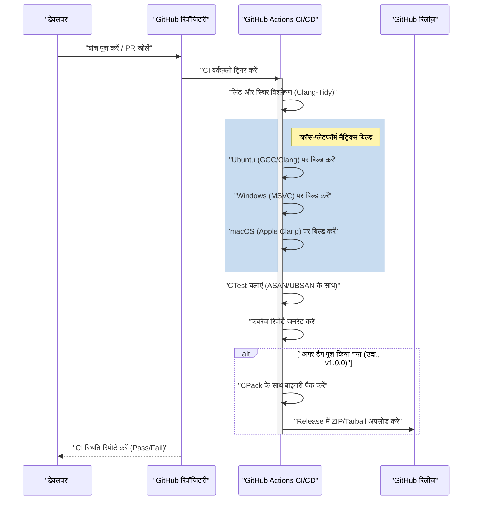
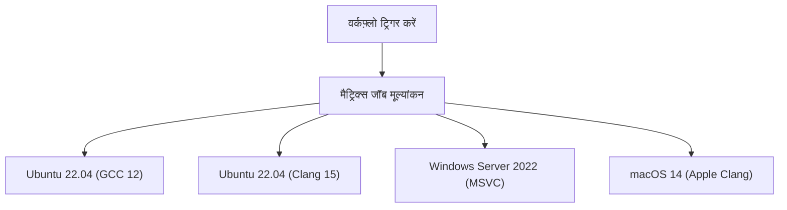

# GitHub Actions का उपयोग करके C++ प्रोजेक्ट के लिए CI/CD पाइपलाइन बनाना: पूरी गाइड

आधुनिक सॉफ्टवेयर विकास प्रतिमान में, निरंतर एकीकरण (Continuous Integration: CI) और निरंतर वितरण/परिनियोजन (Continuous Delivery/Deployment: CD) एक चुस्त (agile) विकास प्रक्रिया और उच्च गुणवत्ता वाले सॉफ्टवेयर को बनाए रखने के लिए आवश्यक तत्व हैं। कई प्रोग्रामिंग भाषाओं के अस्तित्व के बीच, C++ में CI/CD पाइपलाइन का निर्माण अन्य भाषाओं (जैसे Python, JavaScript, Go, आदि) की तुलना में अपनी अनूठी कठिनाइयों और जटिलताओं के साथ आता है।

इस लेख में, हम बहुत विस्तार से बताएंगे कि GitHub Actions का उपयोग करके C++ प्रोजेक्ट्स के लिए स्क्रैच से एक मजबूत और व्यावहारिक CI/CD पाइपलाइन कैसे बनाई जाए। इसमें क्रॉस-प्लेटफॉर्म (Windows, Linux, macOS) पर मैट्रिक्स बिल्ड, CMake का उपयोग करके बिल्ड सिस्टम एकीकरण, CTest के साथ स्वचालित परीक्षण, स्थिर और गतिशील विश्लेषण (static and dynamic analysis) का स्वचालन, कवरेज मापन, और GitHub Releases के माध्यम से संकलित बाइनरी के स्वचालित वितरण जैसी सभी व्यावहारिक तकनीकें शामिल होंगी।

## 1. C++ प्रोजेक्ट्स में CI/CD का महत्व और विशिष्ट चुनौतियाँ

वेब एप्लिकेशन और स्क्रिप्टिंग भाषाओं के विकास में, एक सिंगल Docker कंटेनर पर परीक्षण और निर्माण (build) ज्यादातर मामलों में पर्याप्त होता है। हालांकि, C++ एक मूल रूप से संकलित (natively compiled) भाषा है, जो निष्पादन वातावरण (execution environment) के हार्डवेयर आर्किटेक्चर और ऑपरेटिंग सिस्टम पर अत्यधिक निर्भर करती है।

C++ प्रोजेक्ट में CI/CD को लागू करते समय सामने आने वाली मुख्य चुनौतियाँ निम्नलिखित हैं:

1. **प्लेटफॉर्म की विविधता**: Windows, Linux, और macOS जैसे विभिन्न ऑपरेटिंग सिस्टम में अलग-अलग API (Windows API, POSIX, आदि) होते हैं। यह आम बात है कि जो कोड डेवलपर के स्थानीय वातावरण (जैसे macOS) में काम करता है, वह Linux या Windows पर कंपाइल त्रुटि (compile error) दे दे।
2. **कंपाइलर में अंतर**: Microsoft Visual C++ (MSVC), GNU Compiler Collection (GCC), और Clang जैसे प्रमुख कंपाइलर C++ मानकों (C++17, C++20, C++23) के कार्यान्वयन, व्याख्या और चेतावनी की कठोरता में भिन्न होते हैं।
3. **बिल्ड का समय**: बड़े C++ प्रोजेक्ट्स में बिल्ड होने में दसियों मिनट से लेकर घंटों तक का समय लगना आम बात है। CI वातावरण में सीमित कंप्यूटिंग संसाधनों के साथ कुशलतापूर्वक बिल्ड करने के लिए कैशिंग रणनीतियों और समानांतरकरण (parallelization) की आवश्यकता होती है।
4. **निर्भरता प्रबंधन (Dependency Management)**: C++ में npm या pip जैसा कोई पूर्ण मानक पैकेज मैनेजर नहीं है। CI वातावरण में हर बार लाइब्रेरी को सही ढंग से हल करने के लिए vcpkg, Conan, या CMake के `FetchContent` आदि का उपयोग करना आवश्यक है।
5. **मेमोरी प्रबंधन और अपरिभाषित व्यवहार (Undefined Behavior)**: चूँकि इसमें पॉइंटर हेरफेर और मैनुअल मेमोरी प्रबंधन शामिल होता है, इसलिए केवल तर्क का परीक्षण करना ही पर्याप्त नहीं है, बल्कि मेमोरी लीक और अपरिभाषित व्यवहार का पता लगाने को भी स्वचालित करना आवश्यक है।

इन चुनौतियों को हल करने के लिए, GitHub Actions सबसे अच्छा समाधान है, जो मांग (on-demand) पर विभिन्न OS वर्चुअल मशीनों को प्रोविजन कर सकता है, और जटिल वर्कफ़्लो को कोड के रूप में परिभाषित (Configuration as Code) कर सकता है।

## 2. CI/CD पाइपलाइन आर्किटेक्चर का अवलोकन

आइए हम जिस CI/CD पाइपलाइन का निर्माण करने जा रहे हैं, उसकी समग्र तस्वीर की कल्पना करें। नीचे दिया गया Mermaid अनुक्रम आरेख (sequence diagram) कोड के Push से लेकर रिलीज़ तक के वर्कफ़्लो को दर्शाता है।



इस आर्किटेक्चर में, हम पुल रिक्वेस्ट (Pull Request) के चरण में तेज़ फीडबैक (स्थिर विश्लेषण और बिल्ड/टेस्ट) प्रदान करते हैं, और जब वर्जन टैग दिया जाता है, तब आउटपुट को पैक और वितरित किया जाता है।

## 3. आधुनिक CMake के साथ प्रोजेक्ट सेटअप

एक उत्कृष्ट CI पाइपलाइन की नींव एक मजबूत बिल्ड सिस्टम है। हम CMake का उपयोग करेंगे, जो C++ के लिए वास्तविक मानक (de facto standard) है। यहाँ, हम "आधुनिक CMake" नामक लक्ष्य-उन्मुख (target-oriented) दृष्टिकोण अपनाएंगे।

मान लें कि प्रोजेक्ट की निर्देशिका संरचना (directory structure) इस प्रकार है:

```text
my_cpp_project/
├── CMakeLists.txt
├── src/
│   ├── main.cpp
│   ├── calculator.cpp
│   └── calculator.h
└── tests/
    ├── CMakeLists.txt
    └── test_calculator.cpp
```

रूट `CMakeLists.txt` के लिए एक कॉन्फ़िगरेशन उदाहरण:

```cmake
cmake_minimum_required(VERSION 3.20)
project(MyCppProject VERSION 1.0.0 LANGUAGES CXX)

# C++ मानक सेटिंग
set(CMAKE_CXX_STANDARD 20)
set(CMAKE_CXX_STANDARD_REQUIRED ON)
set(CMAKE_CXX_EXTENSIONS OFF) # पोर्टेबिलिटी बढ़ाने के लिए कंपाइलर-विशिष्ट एक्सटेंशन अक्षम करें

# कंपाइलर चेतावनी को सख्त करना
function(set_project_warnings target_name)
    if(MSVC)
        target_compile_options(${target_name} PRIVATE /W4 /WX)
    else()
        target_compile_options(${target_name} PRIVATE -Wall -Wextra -Wpedantic -Werror)
    endif()
endfunction()

# लाइब्रेरी लक्ष्य (target) बनाना
add_library(CalculatorLib src/calculator.cpp)
target_include_directories(CalculatorLib PUBLIC ${CMAKE_CURRENT_SOURCE_DIR}/src)
set_project_warnings(CalculatorLib)

# एक्ज़ीक्यूटेबल लक्ष्य (target) बनाना
add_executable(MyApplication src/main.cpp)
target_link_libraries(MyApplication PRIVATE CalculatorLib)
set_project_warnings(MyApplication)

# परीक्षण सक्षम करना
enable_testing()
add_subdirectory(tests)

# इंस्टॉल नियम परिभाषित करना (CPack के लिए)
include(GNUInstallDirs)
install(TARGETS MyApplication CalculatorLib
    RUNTIME DESTINATION ${CMAKE_INSTALL_BINDIR}
    LIBRARY DESTINATION ${CMAKE_INSTALL_LIBDIR}
    ARCHIVE DESTINATION ${CMAKE_INSTALL_LIBDIR}
)

# CPack द्वारा पैकेजिंग सेटिंग
set(CPACK_PROJECT_NAME ${PROJECT_NAME})
set(CPACK_PROJECT_VERSION ${PROJECT_VERSION})
set(CPACK_GENERATOR "ZIP;TGZ")
if(WIN32)
    set(CPACK_GENERATOR "ZIP")
endif()
include(CPack)
```

**महत्वपूर्ण बिंदु:**
- `CMAKE_CXX_EXTENSIONS OFF`: GNU एक्सटेंशन जैसी गैर-मानक विशेषताओं पर निर्भरता को रोकता है, जिससे क्रॉस-प्लेटफॉर्म संगतता (cross-platform compatibility) सुनिश्चित होती है।
- **चेतावनी को सख्त करना (`-Werror` / `/WX`)**: CI वातावरण में कंपाइलर चेतावनियों को त्रुटियों के रूप में मानकर, उच्च कोड गुणवत्ता को सख्ती से बनाए रखा जाता है।
- **GNUInstallDirs**: OS के अनुसार मानक इंस्टॉलेशन पथ (जैसे `/usr/local/bin` या `C:\Program Files`) को स्वचालित रूप से हल करता है।

## 4. GitHub Actions की मूल बातें और मैट्रिक्स रणनीति

GitHub Actions को `.github/workflows/` निर्देशिका में YAML फ़ाइलों द्वारा कॉन्फ़िगर किया जाता है।
C++ प्रोजेक्ट्स में सबसे शक्तिशाली विशेषता "मैट्रिक्स रणनीति (Matrix Strategy)" है। यह आपको OS और कंपाइलर संयोजनों को गतिशील रूप से उत्पन्न करने और उन्हें समानांतर में निष्पादित करने की अनुमति देता है।



नीचे YAML जॉब परिभाषा दी गई है जो मैट्रिक्स बिल्ड के लिए आधार के रूप में कार्य करती है।

```yaml
jobs:
  build:
    name: "Build & Test [${{ matrix.os }} - ${{ matrix.compiler }}]"
    runs-on: ${{ matrix.os }}
    strategy:
      fail-fast: false # अगर एक जॉब विफल हो जाता है, तो भी अन्य OS पर बिल्ड जारी रखें
      matrix:
        include:
          - os: ubuntu-latest
            compiler: gcc
            c_compiler: gcc
            cpp_compiler: g++
          - os: ubuntu-latest
            compiler: clang
            c_compiler: clang
            cpp_compiler: clang++
          - os: windows-latest
            compiler: msvc
            c_compiler: cl
            cpp_compiler: cl
          - os: macos-latest
            compiler: apple-clang
            c_compiler: clang
            cpp_compiler: clang++
```

`fail-fast: false` बहुत महत्वपूर्ण है। उदाहरण के लिए, यदि आप गलती से Linux-विशिष्ट API का उपयोग करते हैं, तो Ubuntu बिल्ड विफल हो जाएगा, लेकिन आप यह भी जाँचना चाहेंगे कि क्या Windows बिल्ड उसी समय सफल होता है या नहीं।

## 5. बिल्ड लागत और अमदाल के नियम (Amdahl's Law) का उपयोग करके समानांतर प्रसंस्करण का अनुकूलन

क्लाउड वातावरण में CI/CD समय के खिलाफ एक दौड़ है, और बिल्ड का समय सीधे डेवलपर्स के प्रतीक्षा समय और रनिंग कॉस्ट से जुड़ा है।
यहाँ, आइए कंप्यूटर विज्ञान में "अमदाल के नियम (Amdahl's Law)" का उपयोग करके बिल्ड समय के अनुकूलन के लिए एक गणितीय दृष्टिकोण अपनाएं।

अमदाल का नियम एक प्रोग्राम में समानांतर किए जा सकने वाले हिस्से के अनुपात को $P$ के रूप में परिभाषित करता है, और $N$ प्रोसेसर का उपयोग करते समय सैद्धांतिक अधिकतम गति वृद्धि $S(N)$ को निम्नानुसार परिभाषित करता है:

$$ S(N) = \frac{1}{(1 - P) + \frac{P}{N}} $$

C++ बिल्ड प्रक्रिया में, स्रोत कोड के प्रत्येक अनुवाद इकाई (Translation Unit: `.cpp` फ़ाइल) का संकलन (compilation) पूरी तरह से स्वतंत्र है और इसे समानांतर किया जा सकता है। दूसरी ओर, CMake कॉन्फ़िगरेशन और अंतिम बाइनरी का लिंक चरण मूल रूप से क्रमिक (समानांतर करने योग्य नहीं) होते हैं।

मान लीजिए कि कुल प्रोजेक्ट बिल्ड समय का 80% संकलन चरण ($P = 0.8$) है और 20% क्रमिक चरण ($1 - P = 0.2$) है।
GitHub Actions मानक धावक (standard runner) (Linux) 2 कोर (थ्रेड्स) प्रदान करता है। इसलिए जब $N = 2$:

$$ S(2) = \frac{1}{0.2 + \frac{0.8}{2}} = \frac{1}{0.2 + 0.4} = \frac{1}{0.6} \approx 1.67 $$

केवल 2 कोर का उपयोग करके, आपको गति में लगभग 1.67 गुना सुधार मिलता है। इसे प्राप्त करने के लिए, CMake बिल्ड कमांड में `--parallel` विकल्प निर्दिष्ट करना आवश्यक है।

```yaml
    - name: "प्रोजेक्ट बिल्ड करें"
      run: cmake --build build --config Release --parallel 2
```

इसके अलावा, हम लागत गणना पर भी विचार करते हैं। GitHub Actions के उपयोग की कुल लागत $C_{total}$, जॉब निष्पादन समय $T_i$ और रनर की इकाई लागत (unit price) $R_i$ के गुणनफल का योग है।

$$ C_{total} = \sum_{i=1}^{M} \left( T_i \times R_i \right) $$

बिल्ड समय कम करने से न केवल फीडबैक लूप तेज़ होता है, बल्कि प्रोजेक्ट की परिचालन लागत (विशेष रूप से निजी रिपॉजिटरी के लिए) भी सीधे कम होती है। यदि आप इसे और तेज़ करना चाहते हैं, तो संकलन परिणामों को कैश करने के लिए `ccache` का उपयोग करना एक प्रभावी तरीका है।

## 6. स्वचालित परीक्षण और सैनिटाइज़र (Sanitizers) का एकीकरण

C++ में बग्स को रोकने के लिए, यूनिट परीक्षणों के अलावा, रनटाइम पर मेमोरी लीक और अपरिभाषित व्यवहार का पता लगाने वाले "सैनिटाइज़र" को शामिल करने की दृढ़ता से अनुशंसा की जाती है। हम Google द्वारा विकसित AddressSanitizer (ASAN) और UndefinedBehaviorSanitizer (UBSAN) का उपयोग करेंगे।

CMake में सैनिटाइज़र को सक्षम करने के लिए एक विकल्प जोड़ें।

```cmake
option(ENABLE_SANITIZERS "ASAN और UBSAN सक्षम करें" OFF)
if(ENABLE_SANITIZERS AND CMAKE_CXX_COMPILER_ID MATCHES "GNU|Clang")
    add_compile_options(-fsanitize=address,undefined -fno-omit-frame-pointer)
    add_link_options(-fsanitize=address,undefined)
endif()
```

CI पाइपलाइन के Ubuntu जॉब में इस विकल्प को सक्षम करके परीक्षण चलाएं।

```yaml
    - name: "CMake कॉन्फ़िगर करें"
      env:
        CC: ${{ matrix.c_compiler }}
        CXX: ${{ matrix.cpp_compiler }}
      run: >
        cmake -B build
        -DCMAKE_BUILD_TYPE=Release
        -DENABLE_SANITIZERS=${{ matrix.os == 'ubuntu-latest' && 'ON' || 'OFF' }}

    - name: "CTest चलाएं"
      working-directory: build
      env:
        ASAN_OPTIONS: "detect_leaks=1:symbolize=1"
        UBSAN_OPTIONS: "print_stacktrace=1"
      run: ctest --build-config Release --output-on-failure --parallel 2
```

परीक्षण निष्पादित करने के लिए `ctest` कमांड का उपयोग किया जाता है। `--output-on-failure` निर्दिष्ट करके, केवल विफल परीक्षणों के विस्तृत लॉग CI आउटपुट में प्रदर्शित किए जाएंगे, जिससे लॉग को बहुत बड़ा होने से रोका जा सकेगा।

## 7. कवरेज (कोड कवरेज रेट) मापना

गुणवत्ता आश्वासन के लिए यह कल्पना करना महत्वपूर्ण है कि परीक्षण कितने कोड को कवर करते हैं। हम Linux वातावरण (GCC) का उपयोग करके `gcov` और `lcov` के साथ कवरेज को मापेंगे।

सबसे पहले, CMake में कवरेज मापन के लिए संकलन झंडे (compile flags) सेट करें।

```cmake
option(ENABLE_COVERAGE "कवरेज रिपोर्टिंग सक्षम करें" OFF)
if(ENABLE_COVERAGE AND CMAKE_CXX_COMPILER_ID STREQUAL "GNU")
    add_compile_options(--coverage -O0 -g)
    add_link_options(--coverage)
endif()
```

GitHub Actions में कवरेज मापने के लिए एक स्वतंत्र जॉब परिभाषित करें।

```yaml
  coverage:
    name: "Test Coverage Analysis"
    runs-on: ubuntu-latest
    steps:
    - uses: actions/checkout@v4
    
    - name: "lcov इंस्टॉल करें"
      run: sudo apt-get update && sudo apt-get install -y lcov
      
    - name: "कवरेज के लिए CMake कॉन्फ़िगर करें"
      run: cmake -B build -DCMAKE_BUILD_TYPE=Debug -DENABLE_COVERAGE=ON
      
    - name: "बिल्ड और टेस्ट"
      run: |
        cmake --build build --parallel 2
        cd build && ctest --output-on-failure
      
    - name: "lcov रिपोर्ट जनरेट करें"
      working-directory: build
      run: |
        lcov --capture --directory . --output-file coverage.info
        lcov --remove coverage.info '/usr/*' '*_deps/*' '*tests/*' --output-file coverage.info
        
    - name: "Codecov पर कवरेज अपलोड करें"
      uses: codecov/codecov-action@v3
      with:
        files: build/coverage.info
```
`lcov --remove` कमांड का उपयोग करके, सिस्टम हेडर, थर्ड-पार्टी लाइब्रेरी और टेस्ट कोड को ही कवरेज मापन से बाहर रखा गया है। इससे आप प्रोजेक्ट के विशिष्ट स्रोत कोड का शुद्ध कवरेज प्राप्त कर सकते हैं।

## 8. GitHub Releases के माध्यम से बाइनरी की स्वचालित डिलीवरी (CD)

आइए CI/CD के "CD" भाग का निर्माण करें। जब कोई डेवलपर गिट में संस्करण टैग (उदाहरण: `v1.2.0`) जोड़ता है और उसे पुश करता है, तो यह स्वचालित रूप से प्रत्येक OS के लिए निष्पादन योग्य (executable) बाइनरी संकलित करेगा, उन्हें ZIP या Tarball में पैक करेगा, और उन्हें GitHub Releases पर अपलोड करेगा।

इस चरण में, हम CMake के साथ शामिल पैकेजिंग टूल `CPack` का उपयोग करेंगे।

```yaml
    - name: "एप्लिकेशन पैकेज करें (CPack)"
      if: startsWith(github.ref, 'refs/tags/v')
      working-directory: build
      run: cpack -C Release -V

    - name: "रिलीज़ एसेट्स अपलोड करें"
      if: startsWith(github.ref, 'refs/tags/v')
      uses: softprops/action-gh-release@v1
      with:
        files: |
          build/*.tar.gz
          build/*.zip
          build/*.sh
          build/*.exe
      env:
        GITHUB_TOKEN: ${{ secrets.GITHUB_TOKEN }}
```

इस सेटिंग के साथ, केवल `git tag v1.0.0` और `git push origin v1.0.0` को निष्पादित करने से, बिना किसी मानवीय हस्तक्षेप के, Windows उपयोगकर्ताओं के लिए ZIP फ़ाइलें और Linux/macOS उपयोगकर्ताओं के लिए Tarball स्वचालित रूप से रिलीज़ पेज पर प्रकाशित हो जाएँगी। उपयोगकर्ताओं तक सॉफ़्टवेयर पहुँचाने के लिए यह एक अत्यंत शक्तिशाली विशेषता है।

## 9. पूर्ण Workflow YAML फ़ाइल

अब तक बताए गए सभी तत्वों को एकीकृत करते हुए एक मजबूत और व्यावहारिक `.github/workflows/main.yml` का पूर्ण कोड नीचे दिया गया है।

```yaml
name: "C++ CI/CD Pipeline"

on:
  push:
    branches: [ "main", "develop" ]
    tags: [ "v*.*.*" ]
  pull_request:
    branches: [ "main" ]

env:
  BUILD_TYPE: Release

jobs:
  build-and-test:
    name: "Build [${{ matrix.os }} | ${{ matrix.compiler }}]"
    runs-on: ${{ matrix.os }}
    strategy:
      fail-fast: false
      matrix:
        include:
          - os: ubuntu-latest
            compiler: gcc
            c_compiler: gcc
            cpp_compiler: g++
          - os: ubuntu-latest
            compiler: clang
            c_compiler: clang
            cpp_compiler: clang++
          - os: windows-latest
            compiler: msvc
            c_compiler: cl
            cpp_compiler: cl
          - os: macos-latest
            compiler: apple-clang
            c_compiler: clang
            cpp_compiler: clang++

    steps:
    - name: "रिपॉजिटरी चेकआउट करें"
      uses: actions/checkout@v4

    - name: "CMake कॉन्फ़िगर करें"
      env:
        CC: ${{ matrix.c_compiler }}
        CXX: ${{ matrix.cpp_compiler }}
      run: >
        cmake -B build
        -DCMAKE_BUILD_TYPE=${{ env.BUILD_TYPE }}
        -DENABLE_SANITIZERS=${{ matrix.os == 'ubuntu-latest' && 'ON' || 'OFF' }}

    - name: "प्रोजेक्ट बिल्ड करें"
      run: cmake --build build --config ${{ env.BUILD_TYPE }} --parallel 2

    - name: "यूनिट टेस्ट चलाएं (CTest)"
      working-directory: build
      env:
        ASAN_OPTIONS: "detect_leaks=1:symbolize=1"
        UBSAN_OPTIONS: "print_stacktrace=1"
      run: ctest --build-config ${{ env.BUILD_TYPE }} --output-on-failure --parallel 2

    - name: "CPack के साथ पैकेज करें"
      if: startsWith(github.ref, 'refs/tags/v')
      working-directory: build
      run: cpack -C ${{ env.BUILD_TYPE }}

    - name: "GitHub रिलीज़ बनाएं और एसेट्स अपलोड करें"
      if: startsWith(github.ref, 'refs/tags/v')
      uses: softprops/action-gh-release@v1
      with:
        files: |
          build/*.tar.gz
          build/*.zip
      env:
        GITHUB_TOKEN: ${{ secrets.GITHUB_TOKEN }}

  coverage:
    name: "Code Coverage Analysis"
    runs-on: ubuntu-latest
    if: github.event_name == 'pull_request' || github.ref == 'refs/heads/main'
    steps:
    - name: "रिपॉजिटरी चेकआउट करें"
      uses: actions/checkout@v4
      
    - name: "lcov इंस्टॉल करें"
      run: sudo apt-get update && sudo apt-get install -y lcov
      
    - name: "कवरेज के लिए CMake कॉन्फ़िगर करें"
      run: cmake -B build -DCMAKE_BUILD_TYPE=Debug -DENABLE_COVERAGE=ON
      
    - name: "प्रोजेक्ट बिल्ड करें"
      run: cmake --build build --parallel 2
      
    - name: "टेस्ट चलाएं"
      working-directory: build
      run: ctest --output-on-failure
      
    - name: "lcov रिपोर्ट जनरेट करें"
      working-directory: build
      run: |
        lcov --capture --directory . --output-file coverage.info
        lcov --remove coverage.info '/usr/*' '*_deps/*' '*tests/*' --output-file coverage.info
        
    - name: "Codecov पर कवरेज अपलोड करें"
      uses: codecov/codecov-action@v3
      with:
        files: build/coverage.info
        fail_ci_if_error: false
```

## 10. अधिक उन्नत CI/CD की ओर (स्थिर विश्लेषण और स्वरूपण)

यद्यपि हम यहाँ विस्तृत व्याख्या छोड़ रहे हैं, वास्तविक उत्पादन में पाइपलाइन में अतिरिक्त गुणवत्ता आश्वासन उपकरणों को शामिल करने की अनुशंसा की जाती है।

1. **Clang-Format को बाध्य करना**: कोड समीक्षा के बोझ को कम करने के लिए, `clang-format` का उपयोग करके कोड शैली जाँच को CI में एकीकृत करें, और यदि स्वरूपण (formatting) नियमों का उल्लंघन होता है तो पाइपलाइन को विफल करें।
2. **स्थिर विश्लेषण (Clang-Tidy)**: `clang-tidy` को CMake में एकीकृत करें और इसे CI पर चलाएं ताकि संभावित बग्स और अकुशल कोड (जैसे अनावश्यक प्रतियां) का पता लगाया जा सके जिन्हें अकेले कंपाइलर चेतावनियों द्वारा नहीं रोका जा सकता है।
3. **vcpkg / Conan कैश का उपयोग**: यदि आप कई थर्ड-पार्टी लाइब्रेरी का उपयोग करते हैं, तो निर्भरताएँ बनाने (build dependencies) में लंबा समय लगता है। GitHub Actions के `actions/cache` का उपयोग करके, vcpkg की इंस्टॉल की गई निर्देशिका या Conan के कैश को बनाए रखकर बिल्ड समय को काफी कम किया जा सकता है।

## निष्कर्ष

C++ प्रोजेक्ट्स में CI/CD पाइपलाइन बनाना प्लेटफ़ॉर्म निर्भरताओं और बिल्ड टूल्स की जटिलता के कारण पहली नज़र में एक बड़ी बाधा लग सकता है। हालाँकि, GitHub Actions, आधुनिक CMake, और CTest/CPack इकोसिस्टम को सही ढंग से संयोजित करके, आप एक अत्यधिक शक्तिशाली और स्वचालित विकास प्रवाह (development flow) प्राप्त कर सकते हैं।

इस लेख में चर्चा की गई मैट्रिक्स रणनीति के साथ क्रॉस-प्लेटफॉर्म सत्यापन, सैनिटाइज़र के साथ रनटाइम बग्स का पता लगाना, कवरेज मापन, और GitHub Releases पर स्वचालित परिनियोजन (deployment) ऐसी सर्वोत्तम प्रथाएं (best practices) हैं जो वाणिज्यिक स्तर के ओपन-सोर्स प्रोजेक्ट्स में व्यापक रूप से अपनाई जाती हैं।

एक स्वचालित CI/CD पाइपलाइन एक शक्तिशाली हथियार है जो डेवलपर्स द्वारा "बग खोजने" और "मैनुअल बिल्ड और रिलीज़ कार्यों" में बिताए गए समय को कम करता है, जिससे उन्हें अपनी मुख्य रचनात्मक कोडिंग गतिविधियों पर ध्यान केंद्रित करने की अनुमति मिलती है। कृपया इसे अपने C++ प्रोजेक्ट में लागू करें और एक चुस्त और सुरक्षित विकास जीवन प्राप्त करें।
