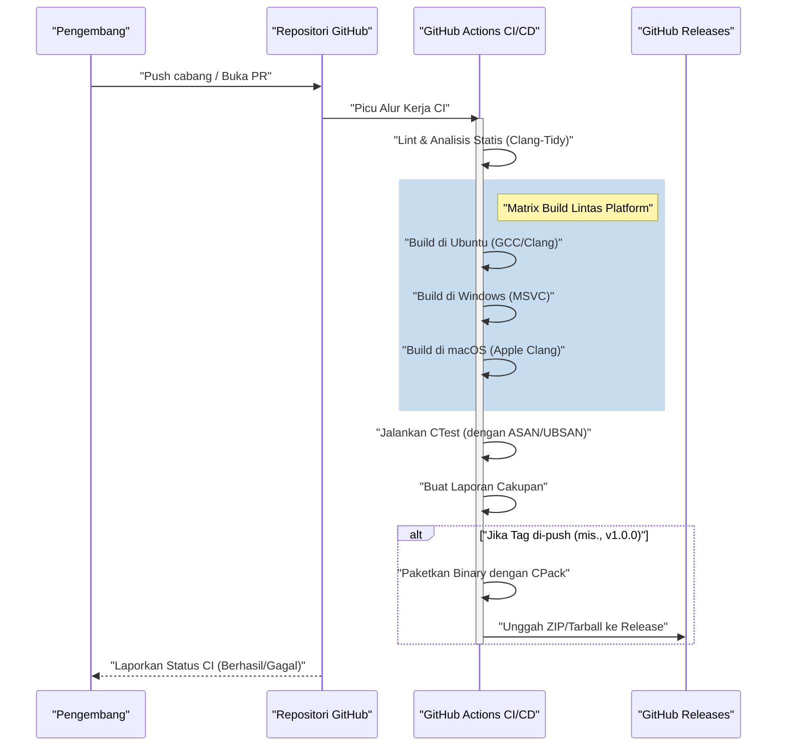
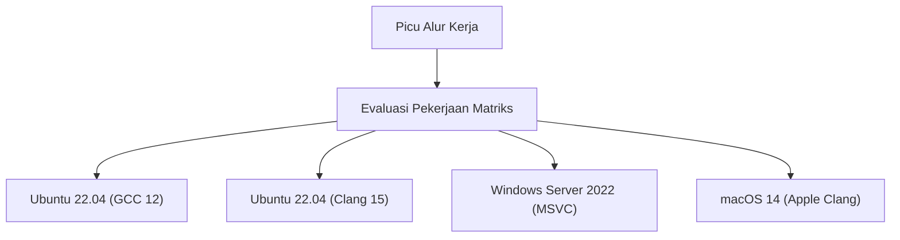

# Panduan Lengkap: Membangun Pipeline CI/CD untuk Proyek C++ menggunakan GitHub Actions

Dalam paradigma pengembangan perangkat lunak modern, Integrasi Berkelanjutan (Continuous Integration: CI) dan Pengiriman/Penerapan Berkelanjutan (Continuous Delivery/Deployment: CD) adalah elemen penting untuk mempertahankan proses pengembangan yang gesit (agile) dan perangkat lunak yang berkualitas tinggi. Di antara sekian banyak bahasa pemrograman yang ada, membangun pipeline CI/CD di C++ melibatkan kesulitan dan kompleksitas tersendiri dibandingkan dengan bahasa lain (seperti Python, JavaScript, Go, dll.).

Pada artikel ini, kita akan membahas secara sangat detail tentang cara memanfaatkan GitHub Actions untuk membangun pipeline CI/CD yang kuat dan praktis untuk proyek C++ dari awal. Kita akan mencakup setiap teknik praktis, mulai dari matrix build pada lintas platform (Windows, Linux, macOS), integrasi sistem build menggunakan CMake, pengujian otomatis menggunakan CTest, otomatisasi analisis statis dan dinamis, pengukuran cakupan (coverage), hingga pengiriman otomatis (delivery) binary terkompilasi melalui GitHub Releases.

## 1. Signifikansi dan Tantangan Khusus CI/CD pada Proyek C++

Dalam pengembangan aplikasi Web atau yang menggunakan bahasa skrip, sering kali menguji atau membangun di atas sebuah kontainer Docker tunggal sudah cukup. Namun, C++ adalah bahasa yang dikompilasi secara native dan sangat bergantung pada arsitektur perangkat keras dan sistem operasi dari lingkungan eksekusinya.

Berikut adalah tantangan utama yang dihadapi ketika menerapkan CI/CD ke dalam proyek C++:

1. **Keberagaman Platform**: API (Windows API, POSIX, dll.) berbeda-beda di setiap OS seperti Windows, Linux, dan macOS. Sudah menjadi hal yang biasa jika kode berfungsi di lingkungan lokal pengembang (misalnya macOS) tetapi gagal dikompilasi di Linux atau Windows.
2. **Perbedaan Kompiler**: Kompiler utama seperti Microsoft Visual C++ (MSVC), GNU Compiler Collection (GCC), dan Clang memiliki tingkat implementasi standar C++ (C++17, C++20, C++23), interpretasi, dan ketegasan peringatan yang berbeda.
3. **Waktu Build**: Pada proyek C++ berskala besar, bukan hal yang aneh jika build memakan waktu puluhan menit hingga berjam-jam. Di lingkungan CI, diperlukan strategi caching dan paralelisasi untuk melakukan build secara efisien dengan sumber daya komputasi yang terbatas.
4. **Manajemen Dependensi**: C++ tidak memiliki manajer paket standar mutlak seperti npm atau pip. Anda harus selalu menyelesaikan library dengan benar di lingkungan CI menggunakan alat seperti vcpkg, Conan, atau `FetchContent` dari CMake.
5. **Manajemen Memori dan Perilaku Tak Terdefinisi (Undefined Behavior)**: Karena melibatkan operasi pointer dan manajemen memori manual, Anda perlu mengotomatiskan tidak hanya pengujian logika, tetapi juga deteksi kebocoran memori (memory leak) dan perilaku tak terdefinisi (Undefined Behavior).

Untuk mengatasi tantangan ini, GitHub Actions, yang dapat memprovisikan berbagai mesin virtual OS sesuai permintaan (on-demand) dan mendefinisikan alur kerja yang kompleks dengan kode (Configuration as Code), adalah solusi yang optimal.

## 2. Gambaran Arsitektur Pipeline CI/CD

Mari kita visualisasikan gambaran keseluruhan dari pipeline CI/CD yang akan kita bangun. Diagram urutan (sequence diagram) Mermaid berikut menunjukkan alur kerja dari push kode hingga rilis.



Dalam arsitektur ini, tahap Pull Request memberikan umpan balik yang cepat (analisis statis, build, dan pengujian), dan saat tag versi ditambahkan, pemaketan dan distribusi artefak akan dilakukan.

## 3. Pengaturan Proyek dengan CMake Modern

Fondasi dari pipeline CI yang sangat baik adalah sistem build yang kuat. Kita akan menggunakan CMake, standar de-facto untuk C++. Di sini kita mengadopsi pendekatan berorientasi target yang dikenal sebagai "CMake Modern".

Asumsikan struktur direktori proyek adalah sebagai berikut:

```text
my_cpp_project/
├── CMakeLists.txt
├── src/
│   ├── main.cpp
│   ├── calculator.cpp
│   └── calculator.h
└── tests/
    ├── CMakeLists.txt
    └── test_calculator.cpp
```

Berikut adalah contoh konfigurasi file `CMakeLists.txt` di tingkat root:

```cmake
cmake_minimum_required(VERSION 3.20)
project(MyCppProject VERSION 1.0.0 LANGUAGES CXX)

# Pengaturan Standar C++
set(CMAKE_CXX_STANDARD 20)
set(CMAKE_CXX_STANDARD_REQUIRED ON)
set(CMAKE_CXX_EXTENSIONS OFF) # Menonaktifkan ekstensi khusus kompiler untuk meningkatkan portabilitas

# Memperketat Peringatan Kompiler
function(set_project_warnings target_name)
    if(MSVC)
        target_compile_options(${target_name} PRIVATE /W4 /WX)
    else()
        target_compile_options(${target_name} PRIVATE -Wall -Wextra -Wpedantic -Werror)
    endif()
endfunction()

# Pembuatan Target Library
add_library(CalculatorLib src/calculator.cpp)
target_include_directories(CalculatorLib PUBLIC ${CMAKE_CURRENT_SOURCE_DIR}/src)
set_project_warnings(CalculatorLib)

# Pembuatan Target Executable
add_executable(MyApplication src/main.cpp)
target_link_libraries(MyApplication PRIVATE CalculatorLib)
set_project_warnings(MyApplication)

# Mengaktifkan Pengujian
enable_testing()
add_subdirectory(tests)

# Definisi Aturan Instalasi (untuk CPack)
include(GNUInstallDirs)
install(TARGETS MyApplication CalculatorLib
    RUNTIME DESTINATION ${CMAKE_INSTALL_BINDIR}
    LIBRARY DESTINATION ${CMAKE_INSTALL_LIBDIR}
    ARCHIVE DESTINATION ${CMAKE_INSTALL_LIBDIR}
)

# Pengaturan Pemaketan dengan CPack
set(CPACK_PROJECT_NAME ${PROJECT_NAME})
set(CPACK_PROJECT_VERSION ${PROJECT_VERSION})
set(CPACK_GENERATOR "ZIP;TGZ")
if(WIN32)
    set(CPACK_GENERATOR "ZIP")
endif()
include(CPack)
```

**Poin Penting:**
- `CMAKE_CXX_EXTENSIONS OFF`: Mencegah ketergantungan pada fitur non-standar seperti ekstensi GNU dan memastikan kemampuan lintas platform (cross-platform).
- **Memperketat Peringatan (`-Werror` / `/WX`)**: Secara paksa menjaga kualitas kode agar tetap tinggi dengan memperlakukan peringatan kompiler sebagai kesalahan (error) di lingkungan CI.
- **GNUInstallDirs**: Secara otomatis menyelesaikan jalur instalasi standar untuk setiap OS (misalnya, `/usr/local/bin` atau `C:\Program Files`).

## 4. Dasar-dasar GitHub Actions dan Strategi Matriks

GitHub Actions dikonfigurasikan menggunakan file YAML di dalam direktori `.github/workflows/`.
Fitur paling kuat untuk proyek C++ adalah "Strategi Matriks (Matrix Strategy)". Fitur ini memungkinkan Anda menghasilkan kombinasi OS dan kompiler secara dinamis dan menjalankannya secara paralel.



Di bawah ini adalah contoh definisi tugas (job) YAML dasar untuk matrix build.

```yaml
jobs:
  build:
    name: "Build & Test [${{ matrix.os }} - ${{ matrix.compiler }}]"
    runs-on: ${{ matrix.os }}
    strategy:
      fail-fast: false # Lanjutkan build di OS lain meskipun ada satu pekerjaan (job) yang gagal
      matrix:
        include:
          - os: ubuntu-latest
            compiler: gcc
            c_compiler: gcc
            cpp_compiler: g++
          - os: ubuntu-latest
            compiler: clang
            c_compiler: clang
            cpp_compiler: clang++
          - os: windows-latest
            compiler: msvc
            c_compiler: cl
            cpp_compiler: cl
          - os: macos-latest
            compiler: apple-clang
            c_compiler: clang
            cpp_compiler: clang++
```

`fail-fast: false` sangatlah penting. Sebagai contoh, jika Anda tidak sengaja menggunakan API khusus Linux, build di Ubuntu akan gagal, tetapi Anda ingin memeriksa pada saat yang sama apakah build di Windows berhasil atau tidak.

## 5. Mengoptimalkan Proses Paralel Menggunakan Hukum Amdahl dan Biaya Build

CI/CD di lingkungan komputasi awan (cloud) adalah pertarungan melawan waktu, dan waktu build berhubungan langsung dengan waktu tunggu pengembang dan biaya operasional (running cost).
Mari kita lakukan pendekatan matematis untuk mengoptimalkan waktu build menggunakan "Hukum Amdahl (Amdahl's Law)" dalam ilmu komputer.

Hukum Amdahl mendefinisikan peningkatan kecepatan maksimum teoritis $S(N)$ saat menggunakan $N$ prosesor, dengan persentase bagian dari program yang dapat diparalelkan diasumsikan sebagai $P$, seperti berikut:

$$ S(N) = \frac{1}{(1 - P) + \frac{P}{N}} $$

Dalam proses build C++, kompilasi dari setiap unit terjemahan (Translation Unit: file `.cpp`) dari kode sumber sepenuhnya independen dan dapat diparalelkan. Di sisi lain, konfigurasi CMake dan fase penautan (link) binary akhir pada dasarnya dieksekusi secara serial (tidak dapat diparalelkan).

Misalkan, dari total waktu build proyek, 80% adalah fase kompilasi ($P = 0.8$) dan 20% adalah fase serial ($1 - P = 0.2$).
Runner standar GitHub Actions (Linux) menyediakan 2 core (utas/thread). Oleh karena itu, untuk $N = 2$:

$$ S(2) = \frac{1}{0.2 + \frac{0.8}{2}} = \frac{1}{0.2 + 0.4} = \frac{1}{0.6} \approx 1.67 $$

Hanya dengan menggunakan 2 core, kita bisa mendapatkan peningkatan kecepatan sekitar 1,67 kali lipat. Untuk mewujudkan hal ini, menentukan opsi `--parallel` pada perintah build CMake adalah suatu keharusan.

```yaml
    - name: "Build Project"
      run: cmake --build build --config Release --parallel 2
```

Selain itu, kita juga harus mempertimbangkan perhitungan biaya. Total biaya GitHub Actions $C_{total}$ adalah jumlah dari produk waktu eksekusi pekerjaan $T_i$ dan harga satuan runner $R_i$.

$$ C_{total} = \sum_{i=1}^{M} \left( T_i \times R_i \right) $$

Mengurangi waktu build tidak hanya mempercepat putaran umpan balik (feedback loop) tetapi juga secara langsung mengurangi biaya operasional proyek (terutama untuk repositori privat). Jika Anda menginginkan lebih banyak peningkatan kecepatan, memperkenalkan `ccache` untuk men-cache (cache) hasil kompilasi adalah pendekatan yang efektif.

## 6. Integrasi Pengujian Otomatis dan Pembersih (Sanitizers)

Untuk mencegah bug pada C++ sebelum terjadi, sangat disarankan untuk menggunakan "Sanitizers" (Pembersih) yang dapat mendeteksi kebocoran memori dan perilaku tak terdefinisi pada saat eksekusi (runtime), selain pengujian unit (unit test). Kita akan menggunakan AddressSanitizer (ASAN) dan UndefinedBehaviorSanitizer (UBSAN) yang dikembangkan oleh Google.

Tambahkan opsi untuk mengaktifkan sanitizers di CMake.

```cmake
option(ENABLE_SANITIZERS "Enable ASAN and UBSAN" OFF)
if(ENABLE_SANITIZERS AND CMAKE_CXX_COMPILER_ID MATCHES "GNU|Clang")
    add_compile_options(-fsanitize=address,undefined -fno-omit-frame-pointer)
    add_link_options(-fsanitize=address,undefined)
endif()
```

Aktifkan opsi ini dan jalankan pengujian dalam tugas (job) Ubuntu dari pipeline CI.

```yaml
    - name: "Configure CMake"
      env:
        CC: ${{ matrix.c_compiler }}
        CXX: ${{ matrix.cpp_compiler }}
      run: >
        cmake -B build
        -DCMAKE_BUILD_TYPE=Release
        -DENABLE_SANITIZERS=${{ matrix.os == 'ubuntu-latest' && 'ON' || 'OFF' }}

    - name: "Run CTest"
      working-directory: build
      env:
        ASAN_OPTIONS: "detect_leaks=1:symbolize=1"
        UBSAN_OPTIONS: "print_stacktrace=1"
      run: ctest --build-config Release --output-on-failure --parallel 2
```

Gunakan perintah `ctest` untuk menjalankan pengujian. Dengan menentukan `--output-on-failure`, hanya detail log dari pengujian yang gagal yang akan ditampilkan pada output CI, mencegah log menjadi terlalu membengkak.

## 7. Pengukuran Cakupan (Code Coverage)

Memvisualisasikan seberapa banyak kode yang tercakup (diuji) oleh tes (pengujian) sangat penting untuk jaminan kualitas. Menggunakan lingkungan Linux (GCC), kita mengukur cakupan dengan `gcov` dan `lcov`.

Pertama, tetapkan tanda (flag) kompilasi untuk pengukuran cakupan di CMake.

```cmake
option(ENABLE_COVERAGE "Enable coverage reporting" OFF)
if(ENABLE_COVERAGE AND CMAKE_CXX_COMPILER_ID STREQUAL "GNU")
    add_compile_options(--coverage -O0 -g)
    add_link_options(--coverage)
endif()
```

Tentukan tugas (job) terpisah untuk pengukuran cakupan di GitHub Actions.

```yaml
  coverage:
    name: "Test Coverage Analysis"
    runs-on: ubuntu-latest
    steps:
    - uses: actions/checkout@v4
    
    - name: "Install lcov"
      run: sudo apt-get update && sudo apt-get install -y lcov
      
    - name: "Configure CMake for Coverage"
      run: cmake -B build -DCMAKE_BUILD_TYPE=Debug -DENABLE_COVERAGE=ON
      
    - name: "Build & Test"
      run: |
        cmake --build build --parallel 2
        cd build && ctest --output-on-failure
      
    - name: "Generate lcov Report"
      working-directory: build
      run: |
        lcov --capture --directory . --output-file coverage.info
        lcov --remove coverage.info '/usr/*' '*_deps/*' '*tests/*' --output-file coverage.info
        
    - name: "Upload Coverage to Codecov"
      uses: codecov/codecov-action@v3
      with:
        files: build/coverage.info
```
Menggunakan perintah `lcov --remove`, sistem header, library pihak ketiga, dan kode pengujian itu sendiri dikecualikan dari pengukuran cakupan. Dengan cara ini, Anda bisa mendapatkan cakupan murni hanya untuk kode sumber spesifik milik proyek.

## 8. Pengiriman Otomatis (CD) Binary melalui GitHub Releases

Mari kita bangun bagian "CD" (Continuous Delivery) dari pipeline CI/CD. Ketika pengembang menambahkan tag versi (misalnya `v1.2.0`) di Git dan melakukan push, binary yang dapat dieksekusi (executable) untuk setiap OS akan dikompilasi secara otomatis, dikemas menjadi file ZIP atau Tarball, dan diunggah ke GitHub Releases.

Pada langkah ini, kita menggunakan alat pemaketan (packaging tool) `CPack` yang disertakan di dalam CMake.

```yaml
    - name: "Package Application (CPack)"
      if: startsWith(github.ref, 'refs/tags/v')
      working-directory: build
      run: cpack -C Release -V

    - name: "Upload Release Assets"
      if: startsWith(github.ref, 'refs/tags/v')
      uses: softprops/action-gh-release@v1
      with:
        files: |
          build/*.tar.gz
          build/*.zip
          build/*.sh
          build/*.exe
      env:
        GITHUB_TOKEN: ${{ secrets.GITHUB_TOKEN }}
```

Dengan konfigurasi ini, cukup dengan mengeksekusi `git tag v1.0.0` dan `git push origin v1.0.0`, pengguna Windows akan mendapatkan file ZIP, dan pengguna Linux/macOS akan mendapatkan file Tarball, yang secara otomatis dipublikasikan ke halaman rilis tanpa campur tangan manual. Ini adalah fitur yang sangat hebat untuk mendistribusikan perangkat lunak kepada pengguna.

## 9. File YAML Workflow Lengkap

Di bawah ini adalah kode lengkap untuk `.github/workflows/main.yml` yang kuat dan praktis, yang mengintegrasikan semua elemen yang telah dibahas sebelumnya.

```yaml
name: "C++ CI/CD Pipeline"

on:
  push:
    branches: [ "main", "develop" ]
    tags: [ "v*.*.*" ]
  pull_request:
    branches: [ "main" ]

env:
  BUILD_TYPE: Release

jobs:
  build-and-test:
    name: "Build [${{ matrix.os }} | ${{ matrix.compiler }}]"
    runs-on: ${{ matrix.os }}
    strategy:
      fail-fast: false
      matrix:
        include:
          - os: ubuntu-latest
            compiler: gcc
            c_compiler: gcc
            cpp_compiler: g++
          - os: ubuntu-latest
            compiler: clang
            c_compiler: clang
            cpp_compiler: clang++
          - os: windows-latest
            compiler: msvc
            c_compiler: cl
            cpp_compiler: cl
          - os: macos-latest
            compiler: apple-clang
            c_compiler: clang
            cpp_compiler: clang++

    steps:
    - name: "Checkout Repository"
      uses: actions/checkout@v4

    - name: "Configure CMake"
      env:
        CC: ${{ matrix.c_compiler }}
        CXX: ${{ matrix.cpp_compiler }}
      run: >
        cmake -B build
        -DCMAKE_BUILD_TYPE=${{ env.BUILD_TYPE }}
        -DENABLE_SANITIZERS=${{ matrix.os == 'ubuntu-latest' && 'ON' || 'OFF' }}

    - name: "Build Project"
      run: cmake --build build --config ${{ env.BUILD_TYPE }} --parallel 2

    - name: "Run Unit Tests (CTest)"
      working-directory: build
      env:
        ASAN_OPTIONS: "detect_leaks=1:symbolize=1"
        UBSAN_OPTIONS: "print_stacktrace=1"
      run: ctest --build-config ${{ env.BUILD_TYPE }} --output-on-failure --parallel 2

    - name: "Package with CPack"
      if: startsWith(github.ref, 'refs/tags/v')
      working-directory: build
      run: cpack -C ${{ env.BUILD_TYPE }}

    - name: "Create GitHub Release and Upload Assets"
      if: startsWith(github.ref, 'refs/tags/v')
      uses: softprops/action-gh-release@v1
      with:
        files: |
          build/*.tar.gz
          build/*.zip
      env:
        GITHUB_TOKEN: ${{ secrets.GITHUB_TOKEN }}

  coverage:
    name: "Code Coverage Analysis"
    runs-on: ubuntu-latest
    if: github.event_name == 'pull_request' || github.ref == 'refs/heads/main'
    steps:
    - name: "Checkout Repository"
      uses: actions/checkout@v4
      
    - name: "Install lcov"
      run: sudo apt-get update && sudo apt-get install -y lcov
      
    - name: "Configure CMake for Coverage"
      run: cmake -B build -DCMAKE_BUILD_TYPE=Debug -DENABLE_COVERAGE=ON
      
    - name: "Build Project"
      run: cmake --build build --parallel 2
      
    - name: "Run Tests"
      working-directory: build
      run: ctest --output-on-failure
      
    - name: "Generate lcov Report"
      working-directory: build
      run: |
        lcov --capture --directory . --output-file coverage.info
        lcov --remove coverage.info '/usr/*' '*_deps/*' '*tests/*' --output-file coverage.info
        
    - name: "Upload Coverage to Codecov"
      uses: codecov/codecov-action@v3
      with:
        files: build/coverage.info
        fail_ci_if_error: false
```

## 10. Menuju CI/CD yang Lebih Lanjut (Analisis Statis dan Pemformatan)

Meskipun kita melewatkan penjelasan rinci di sini, sangat disarankan untuk memasukkan lebih banyak alat jaminan kualitas ke dalam pipeline pada penggunaan praktis (production).

1. **Memaksakan Clang-Format**: Untuk mengurangi beban ulasan (review) kode, integrasikan pengecekan gaya penulisan kode menggunakan `clang-format` ke dalam CI, dan buat pipeline gagal jika melanggar aturan format.
2. **Analisis Statis (Clang-Tidy)**: Untuk mendeteksi bug tersembunyi yang tidak dapat dicegah oleh peringatan kompiler saja, atau kode yang tidak efisien (seperti penyalinan yang tidak perlu), integrasikan `clang-tidy` ke dalam CMake dan jalankan di atas CI.
3. **Memanfaatkan Cache vcpkg / Conan**: Saat menggunakan banyak library pihak ketiga, membangun dependensi memakan banyak waktu. Memanfaatkan `actions/cache` dari GitHub Actions untuk menyimpan direktori instalasi vcpkg atau cache Conan dapat secara drastis mengurangi waktu build.

## Kesimpulan

Membangun pipeline CI/CD untuk proyek C++ sekilas mungkin tampak sangat sulit karena ketergantungan pada platform dan kompleksitas alat build-nya. Namun, dengan menggabungkan ekosistem GitHub Actions, CMake Modern, dan CTest/CPack dengan benar, Anda bisa mendapatkan alur pengembangan (workflow) yang sangat kuat dan otomatis.

Validasi lintas platform (cross-platform) menggunakan strategi matriks, deteksi bug pada saat runtime (waktu eksekusi) menggunakan pembersih (sanitizers), pengukuran cakupan (code coverage), dan penerapan otomatis (auto deployment) ke GitHub Releases yang dibahas dalam artikel ini adalah praktik terbaik yang banyak diadopsi bahkan dalam proyek open-source komersial.

Pipeline CI/CD otomatis meminimalkan waktu yang dihabiskan pengembang untuk "mencari bug" atau "tugas build dan rilis manual", menjadikannya senjata yang luar biasa untuk membantu mereka fokus pada kegiatan pembuatan kode yang sebenarnya (coding kreatif). Jangan ragu untuk menerapkannya pada proyek C++ Anda sendiri demi mencapai kehidupan pengembangan yang lebih lincah dan bebas dari rasa khawatir.
