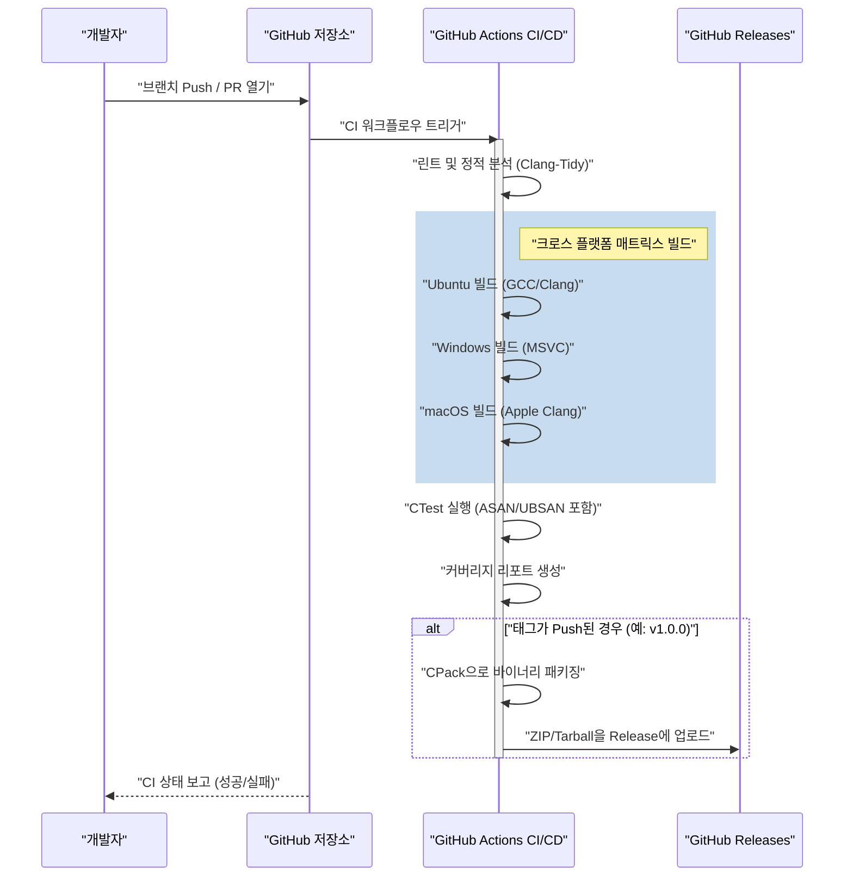
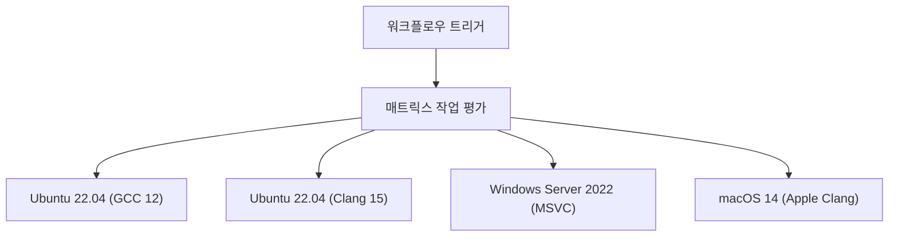

# GitHub Actions를 사용한 C++ 프로젝트의 CI/CD 파이프라인 구축: 완전 가이드

현대 소프트웨어 개발 패러다임에서 지속적 통합(Continuous Integration: CI)과 지속적 제공/배포(Continuous Delivery/Deployment: CD)는 애자일한 개발 프로세스와 고품질 소프트웨어를 유지하는 데 필수적인 요소입니다. 수많은 프로그래밍 언어가 존재하지만, C++에서의 CI/CD 파이프라인 구축은 다른 언어(예: Python, JavaScript, Go 등)에 비해 독특한 어려움과 복잡성을 수반합니다.

본 문서에서는 GitHub Actions를 활용하여 C++ 프로젝트를 위한 견고하고 실용적인 CI/CD 파이프라인을 처음부터 구축하는 방법을 매우 상세하게 설명합니다. 크로스 플랫폼(Windows, Linux, macOS)에서의 매트릭스 빌드, CMake를 이용한 빌드 시스템 통합, CTest를 사용한 자동 테스트, 정적·동적 분석 자동화, 커버리지 측정, 그리고 GitHub Releases를 통한 컴파일된 바이너리의 자동 전달까지 모든 실전 기술을 망라합니다.

## 1. C++ 프로젝트에서 CI/CD의 의미와 특유의 과제

웹 애플리케이션이나 스크립트 언어를 사용한 개발에서는 단일 Docker 컨테이너에서의 테스트 및 빌드로 충분한 경우가 대부분입니다. 그러나 C++는 네이티브로 컴파일되는 언어이며, 실행 환경의 하드웨어 아키텍처나 운영 체제에 강하게 의존합니다.

C++ 프로젝트에 CI/CD를 도입할 때 직면하는 주요 과제는 다음과 같습니다.

1. **플랫폼의 다양성**: Windows, Linux, macOS와 같이 다른 OS마다 API(Windows API, POSIX 등)가 다릅니다. 개발자의 로컬 환경(예: macOS)에서 동작하더라도 Linux나 Windows에서 컴파일 오류가 발생하는 일은 일상다반사입니다.
2. **컴파일러의 차이**: Microsoft Visual C++ (MSVC), GNU Compiler Collection (GCC), Clang과 같은 주요 컴파일러는 C++ 표준(C++17, C++20, C++23)의 구현 정도나 해석, 경고의 엄격함이 다릅니다.
3. **빌드 시간**: 대규모 C++ 프로젝트에서는 빌드에 수십 분에서 수 시간이 걸리는 일도 드물지 않습니다. CI 환경에서는 제한된 컴퓨팅 리소스로 효율적으로 빌드하기 위한 캐시 전략과 병렬화가 필요합니다.
4. **의존성 관리**: C++에는 npm이나 pip 같은 절대적인 표준 패키지 관리자가 존재하지 않습니다. vcpkg, Conan 또는 CMake의 `FetchContent` 등을 사용하여 CI 환경에서 매번 올바르게 라이브러리를 해결해야 합니다.
5. **메모리 관리와 미정의 동작**: 포인터 조작이나 수동 메모리 관리가 수반되므로, 단순한 로직 테스트뿐만 아니라 메모리 누수나 미정의 동작(Undefined Behavior)의 감지도 자동화해야 합니다.

이러한 과제를 해결하기 위해서는 다양한 OS 가상 머신을 온디맨드로 프로비저닝할 수 있고, 복잡한 워크플로우를 코드로 정의(Configuration as Code)할 수 있는 GitHub Actions가 최적의 솔루션이 됩니다.

## 2. CI/CD 파이프라인의 아키텍처 개요

이제 구축할 CI/CD 파이프라인의 전체적인 모습을 시각화해 보겠습니다. 아래의 Mermaid 시퀀스 다이어그램은 코드 Push부터 배포까지의 워크플로우를 보여줍니다.



이 아키텍처에서는 Pull Request 단계에서는 빠른 피드백(정적 분석 및 빌드·테스트)을 제공하고, 버전 태그가 부여된 시점에서 결과물의 패키징 및 배포를 수행합니다.

## 3. 모던 CMake를 사용한 프로젝트 설정

훌륭한 CI 파이프라인의 기반이 되는 것은 견고한 빌드 시스템입니다. C++의 사실상 표준인 CMake를 사용합니다. 여기에서는 "모던 CMake"라고 불리는 타겟 지향적인 접근 방식을 채택합니다.

프로젝트의 디렉토리 구조를 다음과 같이 가정합니다.

```text
my_cpp_project/
├── CMakeLists.txt
├── src/
│   ├── main.cpp
│   ├── calculator.cpp
│   └── calculator.h
└── tests/
    ├── CMakeLists.txt
    └── test_calculator.cpp
```

루트의 `CMakeLists.txt` 설정 예시입니다.

```cmake
cmake_minimum_required(VERSION 3.20)
project(MyCppProject VERSION 1.0.0 LANGUAGES CXX)

# C++ 표준 설정
set(CMAKE_CXX_STANDARD 20)
set(CMAKE_CXX_STANDARD_REQUIRED ON)
set(CMAKE_CXX_EXTENSIONS OFF) # 컴파일러 고유의 확장을 비활성화하여 이식성을 높임

# 컴파일러 경고 엄격화
function(set_project_warnings target_name)
    if(MSVC)
        target_compile_options(${target_name} PRIVATE /W4 /WX)
    else()
        target_compile_options(${target_name} PRIVATE -Wall -Wextra -Wpedantic -Werror)
    endif()
endfunction()

# 라이브러리 타겟 생성
add_library(CalculatorLib src/calculator.cpp)
target_include_directories(CalculatorLib PUBLIC ${CMAKE_CURRENT_SOURCE_DIR}/src)
set_project_warnings(CalculatorLib)

# 실행 파일 타겟 생성
add_executable(MyApplication src/main.cpp)
target_link_libraries(MyApplication PRIVATE CalculatorLib)
set_project_warnings(MyApplication)

# 테스트 활성화
enable_testing()
add_subdirectory(tests)

# 설치 규칙 정의 (CPack용)
include(GNUInstallDirs)
install(TARGETS MyApplication CalculatorLib
    RUNTIME DESTINATION ${CMAKE_INSTALL_BINDIR}
    LIBRARY DESTINATION ${CMAKE_INSTALL_LIBDIR}
    ARCHIVE DESTINATION ${CMAKE_INSTALL_LIBDIR}
)

# CPack을 통한 패키징 설정
set(CPACK_PROJECT_NAME ${PROJECT_NAME})
set(CPACK_PROJECT_VERSION ${PROJECT_VERSION})
set(CPACK_GENERATOR "ZIP;TGZ")
if(WIN32)
    set(CPACK_GENERATOR "ZIP")
endif()
include(CPack)
```

**중요한 포인트:**
- `CMAKE_CXX_EXTENSIONS OFF`: GNU 확장 등 비표준 기능에 대한 의존성을 방지하고 크로스 플랫폼성을 보장합니다.
- **경고 엄격화 (`-Werror` / `/WX`)**: CI 환경에서 컴파일러 경고를 에러로 취급하여 코드 품질을 강제로 높게 유지합니다.
- **GNUInstallDirs**: OS별 표준 설치 경로(`/usr/local/bin`이나 `C:\Program Files` 등)를 자동으로 해결합니다.

## 4. GitHub Actions의 기초와 매트릭스 전략

GitHub Actions는 `.github/workflows/` 디렉토리 내의 YAML 파일로 구성됩니다.
C++ 프로젝트에서 가장 강력한 기능이 "매트릭스 전략(Matrix Strategy)"입니다. 이를 통해 OS와 컴파일러의 조합을 동적으로 생성하고 병렬로 실행할 수 있습니다.



아래에 매트릭스 빌드의 기본이 되는 YAML의 작업 정의를 보여줍니다.

```yaml
jobs:
  build:
    name: "Build & Test [${{ matrix.os }} - ${{ matrix.compiler }}]"
    runs-on: ${{ matrix.os }}
    strategy:
      fail-fast: false # 하나의 작업이 실패해도 다른 OS의 빌드를 계속함
      matrix:
        include:
          - os: ubuntu-latest
            compiler: gcc
            c_compiler: gcc
            cpp_compiler: g++
          - os: ubuntu-latest
            compiler: clang
            c_compiler: clang
            cpp_compiler: clang++
          - os: windows-latest
            compiler: msvc
            c_compiler: cl
            cpp_compiler: cl
          - os: macos-latest
            compiler: apple-clang
            c_compiler: clang
            cpp_compiler: clang++
```

`fail-fast: false`는 매우 중요합니다. 예를 들어 Linux 특유의 API를 잘못 사용한 경우, Ubuntu의 빌드는 실패하지만 Windows의 빌드는 성공하는지 여부도 동시에 확인하고 싶기 때문입니다.

## 5. 빌드 비용과 암달의 법칙을 이용한 병렬 처리 최적화

클라우드 환경에서의 CI/CD는 시간과의 싸움이며, 빌드 시간은 그대로 개발자의 대기 시간 및 운영 비용과 직결됩니다.
여기서 빌드 시간 최적화에 대해 컴퓨터 과학의 "암달의 법칙(Amdahl's Law)"을 사용하여 수학적으로 접근해 보겠습니다.

암달의 법칙은 프로그램 중 병렬화 가능한 부분의 비율을 $P$라고 할 때, $N$개의 프로세서를 사용했을 때의 이론상 최대 속도 향상률 $S(N)$을 다음과 같이 정의합니다.

$$ S(N) = \frac{1}{(1 - P) + \frac{P}{N}} $$

C++ 빌드 프로세스에서 소스 코드의 각 번역 단위(Translation Unit: `.cpp` 파일) 컴파일은 완전히 독립적이며 병렬화가 가능합니다. 반면, CMake 구성이나 최종 바이너리 링크 단계는 기본적으로 직렬 실행(병렬화 불가)이 됩니다.

만약 프로젝트의 전체 빌드 시간 중 80%가 컴파일 단계($P = 0.8$), 20%가 직렬 단계($1 - P = 0.2$)라고 가정합시다.
GitHub Actions의 표준 러너(Linux)는 2코어(스레드)를 제공합니다. 따라서 $N = 2$인 경우:

$$ S(2) = \frac{1}{0.2 + \frac{0.8}{2}} = \frac{1}{0.2 + 0.4} = \frac{1}{0.6} \approx 1.67 $$

2코어를 사용하는 것만으로 약 1.67배의 속도 향상을 얻을 수 있습니다. 이를 실현하기 위해서는 CMake 빌드 명령어에 `--parallel` 옵션을 지정하는 것이 필수적입니다.

```yaml
    - name: "Build Project"
      run: cmake --build build --config Release --parallel 2
```

더 나아가 비용 계산도 고려합니다. GitHub Actions의 이용 비용 $C_{total}$은 작업의 실행 시간 $T_i$와 러너의 단가 $R_i$의 곱의 총합입니다.

$$ C_{total} = \sum_{i=1}^{M} \left( T_i \times R_i \right) $$

빌드 시간을 단축하는 것은 피드백 루프를 가속화할 뿐만 아니라, 프로젝트의 운영 비용(특히 비공개 저장소의 경우)을 직접적으로 절감하는 결과로 이어집니다. 더 빠른 속도를 원한다면 `ccache`를 도입하여 컴파일 결과를 캐시하는 방법이 효과적입니다.

## 6. 자동 테스트와 새니타이저(Sanitizers)의 통합

C++에서 버그를 미연에 방지하기 위해서는 단위 테스트 외에 메모리 누수나 미정의 동작을 실행 시에 감지하는 "새니타이저"의 도입을 강력히 권장합니다. Google이 개발한 AddressSanitizer (ASAN) 및 UndefinedBehaviorSanitizer (UBSAN)를 사용합니다.

CMake에서 새니타이저를 활성화하는 옵션을 추가합니다.

```cmake
option(ENABLE_SANITIZERS "Enable ASAN and UBSAN" OFF)
if(ENABLE_SANITIZERS AND CMAKE_CXX_COMPILER_ID MATCHES "GNU|Clang")
    add_compile_options(-fsanitize=address,undefined -fno-omit-frame-pointer)
    add_link_options(-fsanitize=address,undefined)
endif()
```

CI 파이프라인의 Ubuntu 작업에서 이 옵션을 활성화하여 테스트를 실행합니다.

```yaml
    - name: "Configure CMake"
      env:
        CC: ${{ matrix.c_compiler }}
        CXX: ${{ matrix.cpp_compiler }}
      run: >
        cmake -B build
        -DCMAKE_BUILD_TYPE=Release
        -DENABLE_SANITIZERS=${{ matrix.os == 'ubuntu-latest' && 'ON' || 'OFF' }}

    - name: "Run CTest"
      working-directory: build
      env:
        ASAN_OPTIONS: "detect_leaks=1:symbolize=1"
        UBSAN_OPTIONS: "print_stacktrace=1"
      run: ctest --build-config Release --output-on-failure --parallel 2
```

테스트 실행에는 `ctest` 명령어를 사용합니다. `--output-on-failure`를 지정하여 실패한 테스트의 자세한 로그만 CI 출력에 표시하여 로그가 비대해지는 것을 방지합니다.

## 7. 커버리지(코드 커버리지) 측정

테스트가 얼마나 많은 코드를 커버하고 있는지 시각화하는 것은 품질 보증에 있어 중요합니다. Linux 환경(GCC)을 이용하여 `gcov` 및 `lcov`로 커버리지를 측정합니다.

먼저 CMake에서 커버리지 측정용 컴파일 플래그를 설정합니다.

```cmake
option(ENABLE_COVERAGE "Enable coverage reporting" OFF)
if(ENABLE_COVERAGE AND CMAKE_CXX_COMPILER_ID STREQUAL "GNU")
    add_compile_options(--coverage -O0 -g)
    add_link_options(--coverage)
endif()
```

커버리지 측정용 독립적인 작업을 GitHub Actions에 정의합니다.

```yaml
  coverage:
    name: "Test Coverage Analysis"
    runs-on: ubuntu-latest
    steps:
    - uses: actions/checkout@v4
    
    - name: "Install lcov"
      run: sudo apt-get update && sudo apt-get install -y lcov
      
    - name: "Configure CMake for Coverage"
      run: cmake -B build -DCMAKE_BUILD_TYPE=Debug -DENABLE_COVERAGE=ON
      
    - name: "Build & Test"
      run: |
        cmake --build build --parallel 2
        cd build && ctest --output-on-failure
      
    - name: "Generate lcov Report"
      working-directory: build
      run: |
        lcov --capture --directory . --output-file coverage.info
        lcov --remove coverage.info '/usr/*' '*_deps/*' '*tests/*' --output-file coverage.info
        
    - name: "Upload Coverage to Codecov"
      uses: codecov/codecov-action@v3
      with:
        files: build/coverage.info
```

`lcov --remove` 명령어를 사용하여 시스템 헤더나 서드파티 라이브러리, 테스트 코드 자체를 커버리지 측정 대상에서 제외합니다. 이를 통해 프로젝트 고유의 소스 코드의 순수한 커버리지를 얻을 수 있습니다.

## 8. GitHub Releases를 통한 바이너리 자동 배포 (CD)

CI/CD의 "CD" 부분을 구축합니다. 개발자가 Git에서 버전 태그(예: `v1.2.0`)를 부여하여 푸시했을 때, 자동으로 각 OS용 실행 가능한 바이너리를 컴파일하고 ZIP이나 Tarball로 패키징하여 GitHub Releases에 업로드합니다.

이 단계에서는 CMake에 포함된 패키징 도구 `CPack`을 이용합니다.

```yaml
    - name: "Package Application (CPack)"
      if: startsWith(github.ref, 'refs/tags/v')
      working-directory: build
      run: cpack -C Release -V

    - name: "Upload Release Assets"
      if: startsWith(github.ref, 'refs/tags/v')
      uses: softprops/action-gh-release@v1
      with:
        files: |
          build/*.tar.gz
          build/*.zip
          build/*.sh
          build/*.exe
      env:
        GITHUB_TOKEN: ${{ secrets.GITHUB_TOKEN }}
```

이 설정을 통해 `git tag v1.0.0`과 `git push origin v1.0.0`을 실행하는 것만으로, Windows 사용자용으로는 ZIP 파일이, Linux/macOS 사용자용으로는 Tarball이 수동 개입 없이 자동으로 릴리스 페이지에 공개됩니다. 이것은 사용자에게 소프트웨어를 제공하는 데 있어 매우 강력한 기능입니다.

## 9. 완전한 Workflow YAML 파일

지금까지 설명한 모든 요소를 통합한, 견고하고 실용적인 `.github/workflows/main.yml`의 완전한 코드를 아래에 보여줍니다.

```yaml
name: "C++ CI/CD Pipeline"

on:
  push:
    branches: [ "main", "develop" ]
    tags: [ "v*.*.*" ]
  pull_request:
    branches: [ "main" ]

env:
  BUILD_TYPE: Release

jobs:
  build-and-test:
    name: "Build [${{ matrix.os }} | ${{ matrix.compiler }}]"
    runs-on: ${{ matrix.os }}
    strategy:
      fail-fast: false
      matrix:
        include:
          - os: ubuntu-latest
            compiler: gcc
            c_compiler: gcc
            cpp_compiler: g++
          - os: ubuntu-latest
            compiler: clang
            c_compiler: clang
            cpp_compiler: clang++
          - os: windows-latest
            compiler: msvc
            c_compiler: cl
            cpp_compiler: cl
          - os: macos-latest
            compiler: apple-clang
            c_compiler: clang
            cpp_compiler: clang++

    steps:
    - name: "Checkout Repository"
      uses: actions/checkout@v4

    - name: "Configure CMake"
      env:
        CC: ${{ matrix.c_compiler }}
        CXX: ${{ matrix.cpp_compiler }}
      run: >
        cmake -B build
        -DCMAKE_BUILD_TYPE=${{ env.BUILD_TYPE }}
        -DENABLE_SANITIZERS=${{ matrix.os == 'ubuntu-latest' && 'ON' || 'OFF' }}

    - name: "Build Project"
      run: cmake --build build --config ${{ env.BUILD_TYPE }} --parallel 2

    - name: "Run Unit Tests (CTest)"
      working-directory: build
      env:
        ASAN_OPTIONS: "detect_leaks=1:symbolize=1"
        UBSAN_OPTIONS: "print_stacktrace=1"
      run: ctest --build-config ${{ env.BUILD_TYPE }} --output-on-failure --parallel 2

    - name: "Package with CPack"
      if: startsWith(github.ref, 'refs/tags/v')
      working-directory: build
      run: cpack -C ${{ env.BUILD_TYPE }}

    - name: "Create GitHub Release and Upload Assets"
      if: startsWith(github.ref, 'refs/tags/v')
      uses: softprops/action-gh-release@v1
      with:
        files: |
          build/*.tar.gz
          build/*.zip
      env:
        GITHUB_TOKEN: ${{ secrets.GITHUB_TOKEN }}

  coverage:
    name: "Code Coverage Analysis"
    runs-on: ubuntu-latest
    if: github.event_name == 'pull_request' || github.ref == 'refs/heads/main'
    steps:
    - name: "Checkout Repository"
      uses: actions/checkout@v4
      
    - name: "Install lcov"
      run: sudo apt-get update && sudo apt-get install -y lcov
      
    - name: "Configure CMake for Coverage"
      run: cmake -B build -DCMAKE_BUILD_TYPE=Debug -DENABLE_COVERAGE=ON
      
    - name: "Build Project"
      run: cmake --build build --parallel 2
      
    - name: "Run Tests"
      working-directory: build
      run: ctest --output-on-failure
      
    - name: "Generate lcov Report"
      working-directory: build
      run: |
        lcov --capture --directory . --output-file coverage.info
        lcov --remove coverage.info '/usr/*' '*_deps/*' '*tests/*' --output-file coverage.info
        
    - name: "Upload Coverage to Codecov"
      uses: codecov/codecov-action@v3
      with:
        files: build/coverage.info
        fail_ci_if_error: false
```

## 10. 더 높은 수준의 CI/CD를 향하여 (정적 분석과 포맷팅)

여기서는 자세한 설명은 생략하지만, 실제 운용에 있어서는 추가적인 품질 보증 도구를 파이프라인에 통합하는 것을 권장합니다.

1. **Clang-Format 강제**: 코드 리뷰의 부담을 줄이기 위해 `clang-format`을 통한 코드 스타일 검사를 CI에 통합하고, 포맷 규칙을 위반하는 경우 파이프라인을 실패시킵니다.
2. **정적 분석 (Clang-Tidy)**: 컴파일러 경고만으로는 막을 수 없는 잠재적 버그나 비효율적인 코드(불필요한 복사 등)를 감지하기 위해, `clang-tidy`를 CMake에 통합하고 CI상에서 실행합니다.
3. **vcpkg / Conan 캐시 활용**: 서드파티 라이브러리를 다수 사용하는 경우, 의존성 빌드에 엄청난 시간이 소요됩니다. GitHub Actions의 `actions/cache`를 이용하여 vcpkg의 설치된 디렉토리나 Conan의 캐시를 유지함으로써 빌드 시간을 획기적으로 줄일 수 있습니다.

## 결론

C++ 프로젝트에서 CI/CD 파이프라인 구축은 플랫폼 의존성이나 빌드 도구의 복잡성 때문에 언뜻 보기에 진입 장벽이 높게 느껴집니다. 하지만 GitHub Actions, 모던 CMake, 그리고 CTest/CPack 생태계를 올바르게 조합함으로써, 매우 강력하고 자동화된 개발 흐름을 얻을 수 있습니다.

본 문서에서 설명한 매트릭스 전략을 이용한 크로스 플랫폼 검증, 새니타이저를 이용한 런타임 버그 감지, 커버리지 측정, 그리고 GitHub Releases로의 자동 배포는 상용 수준의 오픈 소스 프로젝트에서도 널리 채택하고 있는 모범 사례입니다.

자동화된 CI/CD 파이프라인은 개발자가 "버그 찾기"이나 "수동 빌드 및 릴리스 작업"에 쏟는 시간을 최소화하고, 본연의 창조적인 코딩 활동에 집중하기 위한 최강의 무기가 됩니다. 여러분의 C++ 프로젝트에도 적극 도입하여, 애자일하고 안심할 수 있는 개발 라이프를 실현하시기 바랍니다.
