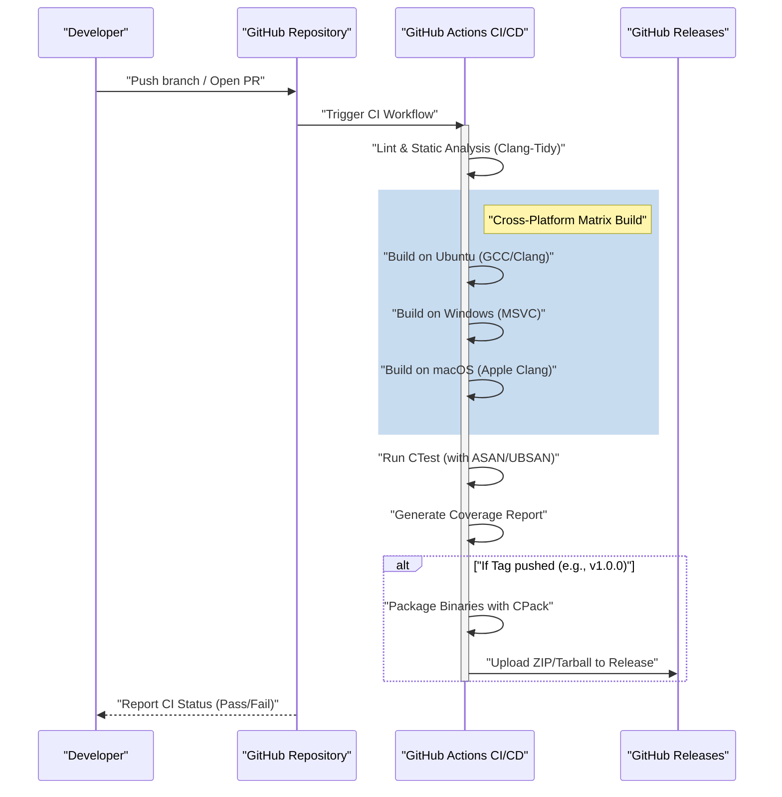
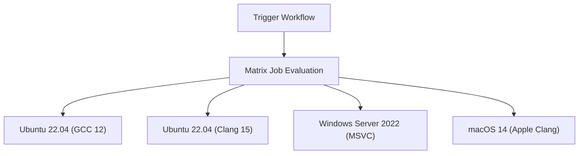

# GitHub Actionsを使ったC++プロジェクトのCI/CDパイプライン構築：完全ガイド

現代のソフトウェア開発パラダイムにおいて、継続的インテグレーション（Continuous Integration: CI）と継続的デリバリー/デプロイメント（Continuous Delivery/Deployment: CD）は、アジャイルな開発プロセスと高品質なソフトウェアの維持に不可欠な要素です。数多くのプログラミング言語が存在する中で、C++におけるCI/CDパイプラインの構築は、他の言語（例えばPython、JavaScript、Goなど）と比較して独特の難しさと複雑さを伴います。

本記事では、GitHub Actionsを活用して、C++プロジェクトのための堅牢で実用的なCI/CDパイプラインをゼロから構築する方法を、極めて詳細に解説します。クロスプラットフォーム（Windows、Linux、macOS）でのマトリックスビルド、CMakeを利用したビルドシステムの統合、CTestを用いた自動テスト、静的・動的解析の自動化、カバレッジの計測、そしてGitHub Releasesを通じたコンパイル済みバイナリの自動デリバリーまで、あらゆる実践的テクニックを網羅します。

## 1. C++プロジェクトにおけるCI/CDの意義と特有の課題

Webアプリケーションやスクリプト言語を用いた開発では、単一のDockerコンテナ上でのテストやビルドで十分なケースが大半です。しかし、C++はネイティブにコンパイルされる言語であり、実行環境のハードウェアアーキテクチャやオペレーティングシステムに強く依存します。

C++プロジェクトにCI/CDを導入する際、直面する主な課題は以下の通りです。

1. **プラットフォームの多様性**: Windows、Linux、macOSといった異なるOSごとにAPI（Windows API、POSIXなど）が異なります。開発者のローカル環境（例えばmacOS）で動作しても、LinuxやWindows上でコンパイルエラーになることは日常茶飯事です。
2. **コンパイラの差異**: Microsoft Visual C++ (MSVC)、GNU Compiler Collection (GCC)、Clangといった主要なコンパイラは、C++標準（C++17、C++20、C++23）の実装度合いや解釈、警告の厳しさが異なります。
3. **ビルド時間**: 大規模なC++プロジェクトでは、ビルドに数十分から数時間かかることも珍しくありません。CI環境では限られたコンピューティングリソースで効率よくビルドを行うためのキャッシュ戦略や並列化が求められます。
4. **依存関係管理**: C++には npm や pip のような絶対的な標準パッケージマネージャーが存在しません。vcpkg、Conan、あるいはCMakeの `FetchContent` などを用いて、CI環境上で毎回正しくライブラリを解決する必要があります。
5. **メモリ管理と未定義動作**: ポインタ操作や手動のメモリ管理が伴うため、単なるロジックのテストだけでなく、メモリリークや未定義動作（Undefined Behavior）の検知も自動化する必要があります。

これらの課題を解決するためには、様々なOS仮想マシンをオンデマンドでプロビジョニングでき、複雑なワークフローをコードで定義（Configuration as Code）できるGitHub Actionsが最適なソリューションとなります。

## 2. CI/CDパイプラインのアーキテクチャ概要

これから構築するCI/CDパイプラインの全体像を視覚化してみましょう。以下のMermaidシーケンス図は、コードのPushからリリースまでのワークフローを示しています。



このアーキテクチャでは、Pull Requestの段階では高速なフィードバック（静的解析とビルド・テスト）を提供し、バージョンタグが付与されたタイミングで成果物のパッケージングと配布を行います。

## 3. モダンCMakeによるプロジェクト設定

優れたCIパイプラインの基盤となるのは、堅牢なビルドシステムです。C++のデファクトスタンダードであるCMakeを使用します。ここでは、「モダンCMake」と呼ばれるターゲット指向のアプローチを採用します。

プロジェクトのディレクトリ構造を以下のように想定します。

```text
my_cpp_project/
├── CMakeLists.txt
├── src/
│   ├── main.cpp
│   ├── calculator.cpp
│   └── calculator.h
└── tests/
    ├── CMakeLists.txt
    └── test_calculator.cpp
```

ルートの `CMakeLists.txt` の設定例です。

```cmake
cmake_minimum_required(VERSION 3.20)
project(MyCppProject VERSION 1.0.0 LANGUAGES CXX)

# C++標準の設定
set(CMAKE_CXX_STANDARD 20)
set(CMAKE_CXX_STANDARD_REQUIRED ON)
set(CMAKE_CXX_EXTENSIONS OFF) # コンパイラ固有の拡張を無効化し移植性を高める

# コンパイラ警告の厳格化
function(set_project_warnings target_name)
    if(MSVC)
        target_compile_options(${target_name} PRIVATE /W4 /WX)
    else()
        target_compile_options(${target_name} PRIVATE -Wall -Wextra -Wpedantic -Werror)
    endif()
endfunction()

# ライブラリターゲットの作成
add_library(CalculatorLib src/calculator.cpp)
target_include_directories(CalculatorLib PUBLIC ${CMAKE_CURRENT_SOURCE_DIR}/src)
set_project_warnings(CalculatorLib)

# 実行ファイルターゲットの作成
add_executable(MyApplication src/main.cpp)
target_link_libraries(MyApplication PRIVATE CalculatorLib)
set_project_warnings(MyApplication)

# テストの有効化
enable_testing()
add_subdirectory(tests)

# インストールルールの定義 (CPack用)
include(GNUInstallDirs)
install(TARGETS MyApplication CalculatorLib
    RUNTIME DESTINATION ${CMAKE_INSTALL_BINDIR}
    LIBRARY DESTINATION ${CMAKE_INSTALL_LIBDIR}
    ARCHIVE DESTINATION ${CMAKE_INSTALL_LIBDIR}
)

# CPackによるパッケージング設定
set(CPACK_PROJECT_NAME ${PROJECT_NAME})
set(CPACK_PROJECT_VERSION ${PROJECT_VERSION})
set(CPACK_GENERATOR "ZIP;TGZ")
if(WIN32)
    set(CPACK_GENERATOR "ZIP")
endif()
include(CPack)
```

**重要なポイント:**
- `CMAKE_CXX_EXTENSIONS OFF`: GNU拡張などの非標準機能への依存を防ぎ、クロスプラットフォーム性を担保します。
- **警告の厳格化 (`-Werror` / `/WX`)**: CI環境でコンパイラ警告をエラーとして扱うことで、コード品質を強制的に高く保ちます。
- **GNUInstallDirs**: OSごとの標準的なインストールパス（`/usr/local/bin` や `C:\Program Files`）を自動的に解決します。

## 4. GitHub Actionsの基礎とマトリックス戦略

GitHub Actionsは `.github/workflows/` ディレクトリ内のYAMLファイルによって構成されます。
C++プロジェクトにおいて最も強力な機能が「マトリックス戦略（Matrix Strategy）」です。これにより、OSとコンパイラの組み合わせを動的に生成し、並列実行することができます。



以下にマトリックスビルドの基本となるYAMLのジョブ定義を示します。

```yaml
jobs:
  build:
    name: "Build & Test [${{ matrix.os }} - ${{ matrix.compiler }}]"
    runs-on: ${{ matrix.os }}
    strategy:
      fail-fast: false # 1つのジョブが失敗しても他のOSのビルドを継続する
      matrix:
        include:
          - os: ubuntu-latest
            compiler: gcc
            c_compiler: gcc
            cpp_compiler: g++
          - os: ubuntu-latest
            compiler: clang
            c_compiler: clang
            cpp_compiler: clang++
          - os: windows-latest
            compiler: msvc
            c_compiler: cl
            cpp_compiler: cl
          - os: macos-latest
            compiler: apple-clang
            c_compiler: clang
            cpp_compiler: clang++
```

`fail-fast: false` は非常に重要です。例えばLinux特有のAPIを誤って使用してしまった場合、Ubuntuのビルドは失敗しますが、Windowsのビルドは成功するのかどうかも同時に確認したいからです。

## 5. ビルドコストとAmdahlの法則を用いた並列処理の最適化

クラウド環境でのCI/CDは時間との戦いであり、ビルド時間はそのまま開発者の待ち時間およびランニングコストに直結します。
ここで、ビルド時間の最適化について、コンピュータサイエンスにおける「Amdahlの法則（Amdahl's Law）」を用いて数学的にアプローチしてみましょう。

Amdahlの法則は、プログラムの中で並列化可能な部分の割合を $P$ としたとき、$N$ 個のプロセッサを使用した際の理論上の最大速度向上率 $S(N)$ を以下のように定義します。

$$ S(N) = \frac{1}{(1 - P) + \frac{P}{N}} $$

C++のビルドプロセスにおいて、ソースコードの各翻訳単位（Translation Unit: `.cpp` ファイル）のコンパイルは完全に独立しており、並列化が可能です。一方、CMakeのコンフィギュレーションや、最終的なバイナリのリンクフェーズは基本的に直列実行（並列化不可）となります。

仮に、プロジェクトの全体ビルド時間のうち、80%がコンパイルフェーズ（$P = 0.8$）、20%が直列フェーズ（$1 - P = 0.2$）であるとします。
GitHub Actionsの標準ランナー（Linux）は2コア（スレッド）を提供しています。したがって $N = 2$ の場合：

$$ S(2) = \frac{1}{0.2 + \frac{0.8}{2}} = \frac{1}{0.2 + 0.4} = \frac{1}{0.6} \approx 1.67 $$

2コアを使用するだけで、約1.67倍の速度向上が得られます。これを実現するためには、CMakeのビルドコマンドで `--parallel` オプションを指定することが不可欠です。

```yaml
    - name: "Build Project"
      run: cmake --build build --config Release --parallel 2
```

さらに、コスト計算も考慮します。GitHub Actionsの利用コスト $C_{total}$ は、ジョブの実行時間 $T_i$ とランナーの単価 $R_i$ の積の総和です。

$$ C_{total} = \sum_{i=1}^{M} \left( T_i \times R_i \right) $$

ビルド時間を短縮することは、フィードバックループを高速化するだけでなく、プロジェクトの運用コスト（特にプライベートリポジトリの場合）を直接的に削減することにもつながります。さらに高速化を求める場合は、`ccache` を導入してコンパイル結果をキャッシュする手法が有効です。

## 6. 自動テストとサニタイザー（Sanitizers）の統合

C++においてバグを未然に防ぐためには、単体テストに加えて、メモリリークや未定義動作を実行時に検出する「サニタイザー」の導入が強く推奨されます。Googleが開発した AddressSanitizer (ASAN) や UndefinedBehaviorSanitizer (UBSAN) を使用します。

CMakeでサニタイザーを有効にするオプションを追加します。

```cmake
option(ENABLE_SANITIZERS "Enable ASAN and UBSAN" OFF)
if(ENABLE_SANITIZERS AND CMAKE_CXX_COMPILER_ID MATCHES "GNU|Clang")
    add_compile_options(-fsanitize=address,undefined -fno-omit-frame-pointer)
    add_link_options(-fsanitize=address,undefined)
endif()
```

CIパイプラインのUbuntuのジョブでこのオプションを有効にしてテストを実行します。

```yaml
    - name: "Configure CMake"
      env:
        CC: ${{ matrix.c_compiler }}
        CXX: ${{ matrix.cpp_compiler }}
      run: >
        cmake -B build
        -DCMAKE_BUILD_TYPE=Release
        -DENABLE_SANITIZERS=${{ matrix.os == 'ubuntu-latest' && 'ON' || 'OFF' }}

    - name: "Run CTest"
      working-directory: build
      env:
        ASAN_OPTIONS: "detect_leaks=1:symbolize=1"
        UBSAN_OPTIONS: "print_stacktrace=1"
      run: ctest --build-config Release --output-on-failure --parallel 2
```

テストの実行には `ctest` コマンドを使用します。`--output-on-failure` を指定することで、失敗したテストの詳細なログのみをCI出力に表示し、ログが肥大化するのを防ぎます。

## 7. カバレッジ（コード網羅率）の計測

テストがどれだけのコードをカバーしているかを可視化することは、品質保証において重要です。Linux環境 (GCC) を利用して、`gcov` および `lcov` でカバレッジを計測します。

まず、CMakeでカバレッジ計測用のコンパイルフラグを設定します。

```cmake
option(ENABLE_COVERAGE "Enable coverage reporting" OFF)
if(ENABLE_COVERAGE AND CMAKE_CXX_COMPILER_ID STREQUAL "GNU")
    add_compile_options(--coverage -O0 -g)
    add_link_options(--coverage)
endif()
```

カバレッジ計測用の独立したジョブをGitHub Actionsに定義します。

```yaml
  coverage:
    name: "Test Coverage Analysis"
    runs-on: ubuntu-latest
    steps:
    - uses: actions/checkout@v4
    
    - name: "Install lcov"
      run: sudo apt-get update && sudo apt-get install -y lcov
      
    - name: "Configure CMake for Coverage"
      run: cmake -B build -DCMAKE_BUILD_TYPE=Debug -DENABLE_COVERAGE=ON
      
    - name: "Build & Test"
      run: |
        cmake --build build --parallel 2
        cd build && ctest --output-on-failure
      
    - name: "Generate lcov Report"
      working-directory: build
      run: |
        lcov --capture --directory . --output-file coverage.info
        lcov --remove coverage.info '/usr/*' '*_deps/*' '*tests/*' --output-file coverage.info
        
    - name: "Upload Coverage to Codecov"
      uses: codecov/codecov-action@v3
      with:
        files: build/coverage.info
```
`lcov --remove` コマンドを使用して、システムヘッダやサードパーティライブラリ、テストコード自体をカバレッジの計測対象から除外しています。これにより、プロジェクト固有のソースコードの純粋なカバレッジを得ることができます。

## 8. GitHub Releasesを通じたバイナリの自動デリバリー (CD)

CI/CDの "CD" の部分を構築します。開発者がGitでバージョンタグ（例: `v1.2.0`）を付与してプッシュした際に、自動的に各OS向けの実行可能バイナリをコンパイルし、ZIPやTarballにパッケージングして、GitHub Releasesにアップロードします。

このステップでは、CMakeに同梱されているパッケージングツール `CPack` を利用します。

```yaml
    - name: "Package Application (CPack)"
      if: startsWith(github.ref, 'refs/tags/v')
      working-directory: build
      run: cpack -C Release -V

    - name: "Upload Release Assets"
      if: startsWith(github.ref, 'refs/tags/v')
      uses: softprops/action-gh-release@v1
      with:
        files: |
          build/*.tar.gz
          build/*.zip
          build/*.sh
          build/*.exe
      env:
        GITHUB_TOKEN: ${{ secrets.GITHUB_TOKEN }}
```

この設定により、`git tag v1.0.0` と `git push origin v1.0.0` を実行するだけで、Windowsユーザー向けにはZIPファイルが、Linux/macOSユーザー向けにはTarballが、手動での介入なしに自動的にリリースベージに公開されるようになります。これはユーザーにソフトウェアを届ける上で極めて強力な機能です。

## 9. 完全な Workflow YAML ファイル

これまでに解説したすべての要素を統合した、堅牢で実践的な `.github/workflows/main.yml` の完全なコードを以下に示します。

```yaml
name: "C++ CI/CD Pipeline"

on:
  push:
    branches: [ "main", "develop" ]
    tags: [ "v*.*.*" ]
  pull_request:
    branches: [ "main" ]

env:
  BUILD_TYPE: Release

jobs:
  build-and-test:
    name: "Build [${{ matrix.os }} | ${{ matrix.compiler }}]"
    runs-on: ${{ matrix.os }}
    strategy:
      fail-fast: false
      matrix:
        include:
          - os: ubuntu-latest
            compiler: gcc
            c_compiler: gcc
            cpp_compiler: g++
          - os: ubuntu-latest
            compiler: clang
            c_compiler: clang
            cpp_compiler: clang++
          - os: windows-latest
            compiler: msvc
            c_compiler: cl
            cpp_compiler: cl
          - os: macos-latest
            compiler: apple-clang
            c_compiler: clang
            cpp_compiler: clang++

    steps:
    - name: "Checkout Repository"
      uses: actions/checkout@v4

    - name: "Configure CMake"
      env:
        CC: ${{ matrix.c_compiler }}
        CXX: ${{ matrix.cpp_compiler }}
      run: >
        cmake -B build
        -DCMAKE_BUILD_TYPE=${{ env.BUILD_TYPE }}
        -DENABLE_SANITIZERS=${{ matrix.os == 'ubuntu-latest' && 'ON' || 'OFF' }}

    - name: "Build Project"
      run: cmake --build build --config ${{ env.BUILD_TYPE }} --parallel 2

    - name: "Run Unit Tests (CTest)"
      working-directory: build
      env:
        ASAN_OPTIONS: "detect_leaks=1:symbolize=1"
        UBSAN_OPTIONS: "print_stacktrace=1"
      run: ctest --build-config ${{ env.BUILD_TYPE }} --output-on-failure --parallel 2

    - name: "Package with CPack"
      if: startsWith(github.ref, 'refs/tags/v')
      working-directory: build
      run: cpack -C ${{ env.BUILD_TYPE }}

    - name: "Create GitHub Release and Upload Assets"
      if: startsWith(github.ref, 'refs/tags/v')
      uses: softprops/action-gh-release@v1
      with:
        files: |
          build/*.tar.gz
          build/*.zip
      env:
        GITHUB_TOKEN: ${{ secrets.GITHUB_TOKEN }}

  coverage:
    name: "Code Coverage Analysis"
    runs-on: ubuntu-latest
    if: github.event_name == 'pull_request' || github.ref == 'refs/heads/main'
    steps:
    - name: "Checkout Repository"
      uses: actions/checkout@v4
      
    - name: "Install lcov"
      run: sudo apt-get update && sudo apt-get install -y lcov
      
    - name: "Configure CMake for Coverage"
      run: cmake -B build -DCMAKE_BUILD_TYPE=Debug -DENABLE_COVERAGE=ON
      
    - name: "Build Project"
      run: cmake --build build --parallel 2
      
    - name: "Run Tests"
      working-directory: build
      run: ctest --output-on-failure
      
    - name: "Generate lcov Report"
      working-directory: build
      run: |
        lcov --capture --directory . --output-file coverage.info
        lcov --remove coverage.info '/usr/*' '*_deps/*' '*tests/*' --output-file coverage.info
        
    - name: "Upload Coverage to Codecov"
      uses: codecov/codecov-action@v3
      with:
        files: build/coverage.info
        fail_ci_if_error: false
```

## 10. さらに高度なCI/CDに向けて（静的解析とフォーマット）

ここでは詳細な解説を割愛しますが、実運用においてはさらなる品質保証ツールをパイプラインに組み込むことが推奨されます。

1. **Clang-Formatの強制**: コードレビューの負担を減らすため、`clang-format` によるコードスタイルのチェックをCIに組み込み、フォーマット規則に違反している場合はパイプラインを失敗させます。
2. **静的解析 (Clang-Tidy)**: コンパイラ警告だけでは防ぎきれない潜在的なバグや、非効率なコード（不必要なコピーなど）を検出するために、`clang-tidy` をCMakeに統合し、CI上で実行します。
3. **vcpkg / Conan キャッシュの活用**: サードパーティライブラリを多数使用している場合、依存関係のビルドに多大な時間がかかります。GitHub Actionsの `actions/cache` を利用して、vcpkgのインストール済みディレクトリやConanのキャッシュを保持することで、ビルド時間を劇的に削減できます。

## 結論

C++プロジェクトにおけるCI/CDパイプラインの構築は、プラットフォーム依存性やビルドツールの複雑さから一見するとハードルが高く感じられます。しかし、GitHub Actions、モダンCMake、そしてCTest/CPackのエコシステムを正しく組み合わせることで、極めて強力で自動化された開発フローを手に入れることができます。

本記事で解説したマトリックス戦略を用いたクロスプラットフォーム検証、サニタイザーを用いた実行時バグの検出、カバレッジ計測、そしてGitHub Releasesへの自動デプロイメントは、商用レベルのオープンソースプロジェクトでも広く採用されているベストプラクティスです。

自動化されたCI/CDパイプラインは、開発者が「バグ探し」や「手動ビルド・リリース作業」に費やす時間を最小化し、本来のクリエイティブなコーディング活動に集中するための最強の武器となります。ぜひあなたのC++プロジェクトにも導入し、アジャイルで安心感のある開発ライフを実現してください。
