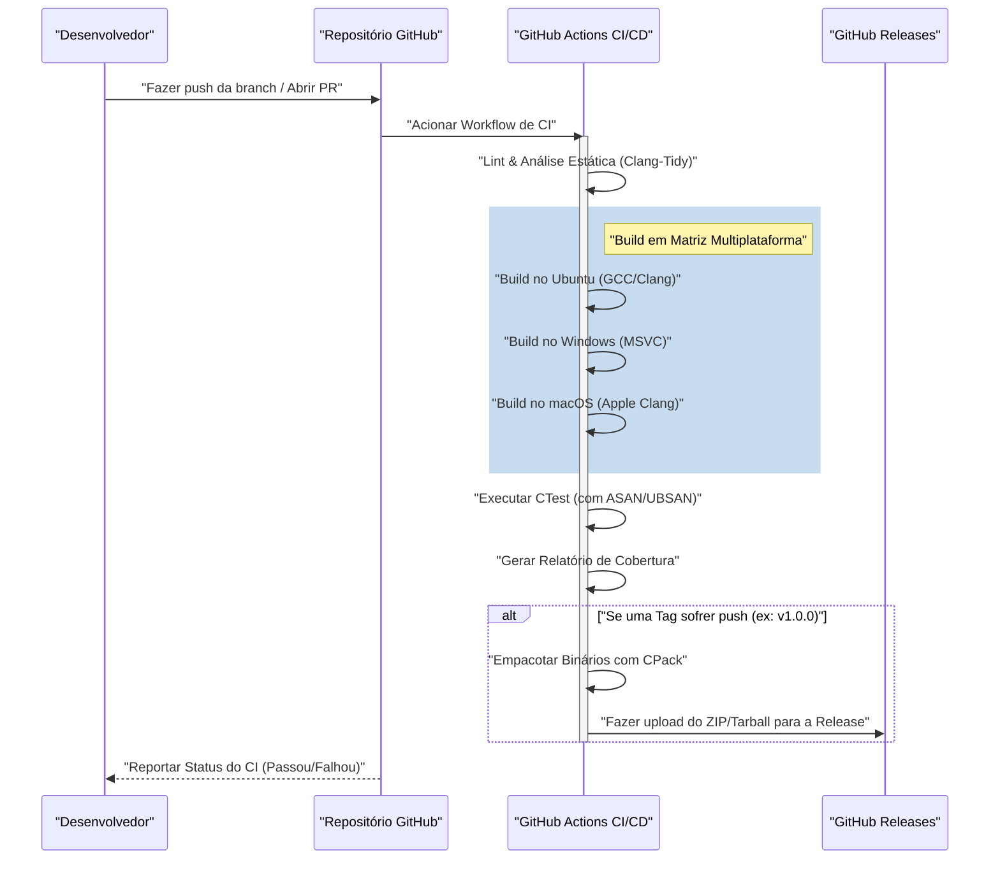
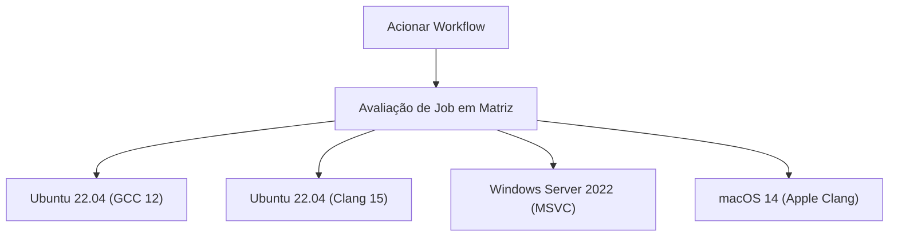

# Construindo um Pipeline CI/CD para Projetos C++ usando GitHub Actions: O Guia Completo

No paradigma moderno de desenvolvimento de software, a Integração Contínua (Continuous Integration: CI) e a Entrega/Implantação Contínua (Continuous Delivery/Deployment: CD) são elementos indispensáveis para processos de desenvolvimento ágeis e para a manutenção de software de alta qualidade. Com inúmeras linguagens de programação disponíveis, a construção de um pipeline CI/CD em C++ envolve dificuldades e complexidades únicas em comparação com outras linguagens (como Python, JavaScript, Go, etc.).

Neste artigo, explicaremos de forma extremamente detalhada como construir um pipeline CI/CD robusto e prático do zero para um projeto C++ utilizando o GitHub Actions. Cobriremos todas as técnicas práticas, incluindo builds em matriz multiplataforma (Windows, Linux, macOS), integração do sistema de build com CMake, testes automatizados usando CTest, automação de análises estáticas e dinâmicas, medição de cobertura (coverage) e entrega automática de binários compilados através do GitHub Releases.

## 1. O Significado e os Desafios Únicos do CI/CD em Projetos C++

No desenvolvimento de aplicações web ou uso de linguagens de script, testar e compilar em um único contêiner Docker costuma ser suficiente na maioria dos casos. No entanto, o C++ é uma linguagem compilada nativamente e depende fortemente da arquitetura de hardware e do sistema operacional do ambiente de execução.

Ao introduzir CI/CD em um projeto C++, os principais desafios enfrentados são:

1. **Diversidade de Plataformas**: Diferentes SOs como Windows, Linux e macOS têm APIs distintas (Windows API, POSIX, etc.). É muito comum que um código funcione no ambiente local do desenvolvedor (por exemplo, macOS) mas falhe na compilação no Linux ou Windows.
2. **Diferenças entre Compiladores**: Compiladores principais como Microsoft Visual C++ (MSVC), GNU Compiler Collection (GCC) e Clang variam no grau de implementação do padrão C++ (C++17, C++20, C++23), em suas interpretações e na severidade dos avisos (warnings).
3. **Tempo de Compilação (Build)**: Em projetos C++ de grande escala, não é incomum que a compilação demore de dezenas de minutos a várias horas. No ambiente de CI, com recursos computacionais limitados, estratégias de cache e paralelização são necessárias para compilar de forma eficiente.
4. **Gerenciamento de Dependências**: Diferente de npm ou pip, o C++ não possui um gerenciador de pacotes padrão absoluto. É necessário resolver bibliotecas corretamente em cada execução no ambiente CI usando ferramentas como vcpkg, Conan ou o `FetchContent` do CMake.
5. **Gerenciamento de Memória e Comportamento Indefinido (Undefined Behavior)**: Como envolve manipulação de ponteiros e gerenciamento manual de memória, além de testar a lógica, também é necessário automatizar a detecção de vazamentos de memória (memory leaks) e comportamentos indefinidos.

Para resolver esses desafios, o GitHub Actions se torna a solução ideal, pois permite provisionar várias máquinas virtuais de SO sob demanda e definir fluxos de trabalho complexos via código (Configuration as Code).

## 2. Visão Geral da Arquitetura do Pipeline CI/CD

Vamos visualizar todo o pipeline CI/CD que construiremos. O diagrama de sequência Mermaid a seguir mostra o fluxo de trabalho desde o push do código até a release.



Nessa arquitetura, fornecemos feedback rápido (análise estática, build e testes) na fase de Pull Request, e realizamos o empacotamento e a distribuição dos artefatos no momento em que uma tag de versão é adicionada.

## 3. Configuração do Projeto com CMake Moderno

A base de um excelente pipeline de CI é um sistema de build robusto. Usaremos o CMake, que é o padrão de fato para C++. Aqui, adotaremos a abordagem orientada a alvos (target-oriented) conhecida como "CMake Moderno".

Assumimos a seguinte estrutura de diretórios para o projeto:

```text
my_cpp_project/
├── CMakeLists.txt
├── src/
│   ├── main.cpp
│   ├── calculator.cpp
│   └── calculator.h
└── tests/
    ├── CMakeLists.txt
    └── test_calculator.cpp
```

Exemplo de configuração do `CMakeLists.txt` na raiz:

```cmake
cmake_minimum_required(VERSION 3.20)
project(MyCppProject VERSION 1.0.0 LANGUAGES CXX)

# Configuração do padrão C++
set(CMAKE_CXX_STANDARD 20)
set(CMAKE_CXX_STANDARD_REQUIRED ON)
set(CMAKE_CXX_EXTENSIONS OFF) # Desativa extensões específicas do compilador para aumentar a portabilidade

# Rigor nos avisos do compilador
function(set_project_warnings target_name)
    if(MSVC)
        target_compile_options(${target_name} PRIVATE /W4 /WX)
    else()
        target_compile_options(${target_name} PRIVATE -Wall -Wextra -Wpedantic -Werror)
    endif()
endfunction()

# Criação do alvo da biblioteca
add_library(CalculatorLib src/calculator.cpp)
target_include_directories(CalculatorLib PUBLIC ${CMAKE_CURRENT_SOURCE_DIR}/src)
set_project_warnings(CalculatorLib)

# Criação do alvo do executável
add_executable(MyApplication src/main.cpp)
target_link_libraries(MyApplication PRIVATE CalculatorLib)
set_project_warnings(MyApplication)

# Habilitação de testes
enable_testing()
add_subdirectory(tests)

# Definição das regras de instalação (para CPack)
include(GNUInstallDirs)
install(TARGETS MyApplication CalculatorLib
    RUNTIME DESTINATION ${CMAKE_INSTALL_BINDIR}
    LIBRARY DESTINATION ${CMAKE_INSTALL_LIBDIR}
    ARCHIVE DESTINATION ${CMAKE_INSTALL_LIBDIR}
)

# Configurações de empacotamento com CPack
set(CPACK_PROJECT_NAME ${PROJECT_NAME})
set(CPACK_PROJECT_VERSION ${PROJECT_VERSION})
set(CPACK_GENERATOR "ZIP;TGZ")
if(WIN32)
    set(CPACK_GENERATOR "ZIP")
endif()
include(CPack)
```

**Pontos importantes:**
- `CMAKE_CXX_EXTENSIONS OFF`: Previne a dependência de recursos não padronizados, como extensões GNU, garantindo a natureza multiplataforma.
- **Rigor nos avisos (`-Werror` / `/WX`)**: Ao tratar os avisos do compilador como erros no ambiente de CI, mantemos a qualidade do código forçadamente alta.
- **GNUInstallDirs**: Resolve automaticamente os caminhos de instalação padrão específicos do SO (como `/usr/local/bin` ou `C:\Program Files`).

## 4. O Básico do GitHub Actions e a Estratégia de Matriz

O GitHub Actions é configurado através de arquivos YAML dentro do diretório `.github/workflows/`.
O recurso mais poderoso para projetos C++ é a "Estratégia de Matriz" (Matrix Strategy). Isso permite gerar dinamicamente combinações de SOs e compiladores e executá-las em paralelo.



Abaixo mostramos a definição de job em YAML, que é a base para o build em matriz.

```yaml
jobs:
  build:
    name: "Build & Test [${{ matrix.os }} - ${{ matrix.compiler }}]"
    runs-on: ${{ matrix.os }}
    strategy:
      fail-fast: false # Continua o build de outros SOs mesmo se um job falhar
      matrix:
        include:
          - os: ubuntu-latest
            compiler: gcc
            c_compiler: gcc
            cpp_compiler: g++
          - os: ubuntu-latest
            compiler: clang
            c_compiler: clang
            cpp_compiler: clang++
          - os: windows-latest
            compiler: msvc
            c_compiler: cl
            cpp_compiler: cl
          - os: macos-latest
            compiler: apple-clang
            c_compiler: clang
            cpp_compiler: clang++
```

`fail-fast: false` é muito importante. Por exemplo, se usarmos por engano uma API exclusiva do Linux, o build no Ubuntu falhará, mas ainda queremos ver ao mesmo tempo se o build no Windows é bem-sucedido.

## 5. Otimização do Tempo de Build e da Limitação de Custo com a Lei de Amdahl

CI/CD em ambiente de nuvem é uma batalha contra o tempo, e o tempo de build se traduz diretamente no tempo de espera do desenvolvedor e nos custos de execução.
Aqui, abordaremos matematicamente a otimização do tempo de compilação usando a "Lei de Amdahl" (Amdahl's Law) da ciência da computação.

A Lei de Amdahl define que, quando a proporção da parte paralelizada de um programa é $P$, o ganho máximo teórico de velocidade $S(N)$ ao usar $N$ processadores é:

$$ S(N) = \frac{1}{(1 - P) + \frac{P}{N}} $$

No processo de build do C++, a compilação de cada unidade de tradução (Translation Unit: arquivos `.cpp`) do código-fonte é totalmente independente e pode ser paralelizada. Por outro lado, a configuração do CMake e a fase de vinculação (linkagem) do binário final geralmente são executadas em série (não podem ser paralelizadas).

Suponha que, de todo o tempo de build do projeto, 80% seja a fase de compilação ($P = 0.8$) e 20% seja a fase serial ($1 - P = 0.2$).
Os runners padrão do GitHub Actions (Linux) fornecem 2 núcleos (threads). Portanto, para $N = 2$:

$$ S(2) = \frac{1}{0.2 + \frac{0.8}{2}} = \frac{1}{0.2 + 0.4} = \frac{1}{0.6} \approx 1.67 $$

Usando apenas 2 núcleos, obtemos uma melhoria de velocidade de cerca de 1,67 vezes. Para alcançar isso, é essencial especificar a opção `--parallel` no comando de build do CMake.

```yaml
    - name: "Build Project"
      run: cmake --build build --config Release --parallel 2
```

Além disso, também consideramos os custos. O custo de utilização do GitHub Actions $C_{total}$ é a soma dos produtos do tempo de execução do job $T_i$ e do preço unitário do runner $R_i$.

$$ C_{total} = \sum_{i=1}^{M} \left( T_i \times R_i \right) $$

Reduzir o tempo de build não apenas acelera o ciclo de feedback, mas também leva diretamente à redução dos custos operacionais do projeto (especialmente para repositórios privados). Se precisar de mais velocidade, é válido adotar o `ccache` para fazer cache dos resultados de compilação.

## 6. Testes Automatizados e Integração de Sanitizers

Para evitar bugs precocemente em C++, é altamente recomendado introduzir "sanitizers", além de testes de unidade, para detectar vazamentos de memória e comportamentos indefinidos durante a execução. Usaremos o AddressSanitizer (ASAN) e o UndefinedBehaviorSanitizer (UBSAN) desenvolvidos pelo Google.

Adicionamos uma opção no CMake para habilitar os sanitizers.

```cmake
option(ENABLE_SANITIZERS "Enable ASAN and UBSAN" OFF)
if(ENABLE_SANITIZERS AND CMAKE_CXX_COMPILER_ID MATCHES "GNU|Clang")
    add_compile_options(-fsanitize=address,undefined -fno-omit-frame-pointer)
    add_link_options(-fsanitize=address,undefined)
endif()
```

Habilitamos essa opção no job do Ubuntu do pipeline de CI e executamos os testes.

```yaml
    - name: "Configure CMake"
      env:
        CC: ${{ matrix.c_compiler }}
        CXX: ${{ matrix.cpp_compiler }}
      run: >
        cmake -B build
        -DCMAKE_BUILD_TYPE=Release
        -DENABLE_SANITIZERS=${{ matrix.os == 'ubuntu-latest' && 'ON' || 'OFF' }}

    - name: "Run CTest"
      working-directory: build
      env:
        ASAN_OPTIONS: "detect_leaks=1:symbolize=1"
        UBSAN_OPTIONS: "print_stacktrace=1"
      run: ctest --build-config Release --output-on-failure --parallel 2
```

O comando `ctest` é usado para executar os testes. Especificando `--output-on-failure`, apenas os logs detalhados de testes reprovados serão exibidos na saída do CI, evitando que o log se torne enorme.

## 7. Medição da Cobertura de Código (Coverage)

Visualizar quanto de código os testes estão cobrindo é importante para a garantia de qualidade. Usando o ambiente Linux (GCC), medimos a cobertura usando `gcov` e `lcov`.

Primeiro, configuramos as flags de compilação no CMake para medir a cobertura.

```cmake
option(ENABLE_COVERAGE "Enable coverage reporting" OFF)
if(ENABLE_COVERAGE AND CMAKE_CXX_COMPILER_ID STREQUAL "GNU")
    add_compile_options(--coverage -O0 -g)
    add_link_options(--coverage)
endif()
```

Definimos um job separado no GitHub Actions para medir a cobertura.

```yaml
  coverage:
    name: "Test Coverage Analysis"
    runs-on: ubuntu-latest
    steps:
    - uses: actions/checkout@v4
    
    - name: "Install lcov"
      run: sudo apt-get update && sudo apt-get install -y lcov
      
    - name: "Configure CMake for Coverage"
      run: cmake -B build -DCMAKE_BUILD_TYPE=Debug -DENABLE_COVERAGE=ON
      
    - name: "Build & Test"
      run: |
        cmake --build build --parallel 2
        cd build && ctest --output-on-failure
      
    - name: "Generate lcov Report"
      working-directory: build
      run: |
        lcov --capture --directory . --output-file coverage.info
        lcov --remove coverage.info '/usr/*' '*_deps/*' '*tests/*' --output-file coverage.info
        
    - name: "Upload Coverage to Codecov"
      uses: codecov/codecov-action@v3
      with:
        files: build/coverage.info
```

O comando `lcov --remove` é usado para excluir headers de sistema, bibliotecas de terceiros e o próprio código de teste da medição de cobertura. Isso garante que a cobertura seja unicamente do código-fonte específico do projeto.

## 8. Entrega Automática de Binários através do GitHub Releases (CD)

Construímos a parte "CD" do CI/CD. Quando os desenvolvedores adicionam e fazem push de uma tag de versão com Git (ex: `v1.2.0`), os binários executáveis ​​para cada SO são compilados, empacotados em arquivos ZIP ou Tarball e enviados para o GitHub Releases.

Nesta etapa, usaremos o `CPack`, a ferramenta de empacotamento incluída no CMake.

```yaml
    - name: "Package Application (CPack)"
      if: startsWith(github.ref, 'refs/tags/v')
      working-directory: build
      run: cpack -C Release -V

    - name: "Upload Release Assets"
      if: startsWith(github.ref, 'refs/tags/v')
      uses: softprops/action-gh-release@v1
      with:
        files: |
          build/*.tar.gz
          build/*.zip
          build/*.sh
          build/*.exe
      env:
        GITHUB_TOKEN: ${{ secrets.GITHUB_TOKEN }}
```

Com essa configuração, ao executar `git tag v1.0.0` e `git push origin v1.0.0`, um arquivo ZIP para usuários do Windows e um Tarball para usuários Linux/macOS serão automaticamente disponibilizados na página de lançamento, sem intervenção manual. Esse recurso é extremamente poderoso na entrega de software aos usuários.

## 9. Arquivo Workflow YAML Completo

Abaixo apresentamos o código completo de um arquivo `.github/workflows/main.yml` robusto e prático, integrando todos os elementos discutidos até agora.

```yaml
name: "C++ CI/CD Pipeline"

on:
  push:
    branches: [ "main", "develop" ]
    tags: [ "v*.*.*" ]
  pull_request:
    branches: [ "main" ]

env:
  BUILD_TYPE: Release

jobs:
  build-and-test:
    name: "Build [${{ matrix.os }} | ${{ matrix.compiler }}]"
    runs-on: ${{ matrix.os }}
    strategy:
      fail-fast: false
      matrix:
        include:
          - os: ubuntu-latest
            compiler: gcc
            c_compiler: gcc
            cpp_compiler: g++
          - os: ubuntu-latest
            compiler: clang
            c_compiler: clang
            cpp_compiler: clang++
          - os: windows-latest
            compiler: msvc
            c_compiler: cl
            cpp_compiler: cl
          - os: macos-latest
            compiler: apple-clang
            c_compiler: clang
            cpp_compiler: clang++

    steps:
    - name: "Checkout Repository"
      uses: actions/checkout@v4

    - name: "Configure CMake"
      env:
        CC: ${{ matrix.c_compiler }}
        CXX: ${{ matrix.cpp_compiler }}
      run: >
        cmake -B build
        -DCMAKE_BUILD_TYPE=${{ env.BUILD_TYPE }}
        -DENABLE_SANITIZERS=${{ matrix.os == 'ubuntu-latest' && 'ON' || 'OFF' }}

    - name: "Build Project"
      run: cmake --build build --config ${{ env.BUILD_TYPE }} --parallel 2

    - name: "Run Unit Tests (CTest)"
      working-directory: build
      env:
        ASAN_OPTIONS: "detect_leaks=1:symbolize=1"
        UBSAN_OPTIONS: "print_stacktrace=1"
      run: ctest --build-config ${{ env.BUILD_TYPE }} --output-on-failure --parallel 2

    - name: "Package with CPack"
      if: startsWith(github.ref, 'refs/tags/v')
      working-directory: build
      run: cpack -C ${{ env.BUILD_TYPE }}

    - name: "Create GitHub Release and Upload Assets"
      if: startsWith(github.ref, 'refs/tags/v')
      uses: softprops/action-gh-release@v1
      with:
        files: |
          build/*.tar.gz
          build/*.zip
      env:
        GITHUB_TOKEN: ${{ secrets.GITHUB_TOKEN }}

  coverage:
    name: "Code Coverage Analysis"
    runs-on: ubuntu-latest
    if: github.event_name == 'pull_request' || github.ref == 'refs/heads/main'
    steps:
    - name: "Checkout Repository"
      uses: actions/checkout@v4
      
    - name: "Install lcov"
      run: sudo apt-get update && sudo apt-get install -y lcov
      
    - name: "Configure CMake for Coverage"
      run: cmake -B build -DCMAKE_BUILD_TYPE=Debug -DENABLE_COVERAGE=ON
      
    - name: "Build Project"
      run: cmake --build build --parallel 2
      
    - name: "Run Tests"
      working-directory: build
      run: ctest --output-on-failure
      
    - name: "Generate lcov Report"
      working-directory: build
      run: |
        lcov --capture --directory . --output-file coverage.info
        lcov --remove coverage.info '/usr/*' '*_deps/*' '*tests/*' --output-file coverage.info
        
    - name: "Upload Coverage to Codecov"
      uses: codecov/codecov-action@v3
      with:
        files: build/coverage.info
        fail_ci_if_error: false
```

## 10. Para um CI/CD ainda mais Avançado (Análise Estática e Formatação)

Embora omitiremos os detalhes aqui, na prática é recomendado incorporar mais ferramentas de garantia de qualidade ao pipeline.

1. **Obrigatoriedade do Clang-Format**: Para reduzir a carga de trabalho na revisão de código, integre verificações de estilo de código com `clang-format` no CI, falhando o pipeline em caso de violação das regras de formatação.
2. **Análise Estática (Clang-Tidy)**: Para detectar bugs em potencial que avisos de compilador não capturam, além de códigos ineficientes (como cópias desnecessárias), integre o `clang-tidy` ao CMake e execute-o no CI.
3. **Uso de Cache do vcpkg / Conan**: Se o projeto usa várias bibliotecas de terceiros, compilar as dependências exigirá um tempo considerável. Aproveitando `actions/cache` do GitHub Actions, podemos manter os diretórios instalados do vcpkg ou o cache do Conan, o que reduz drasticamente o tempo de compilação.

## Conclusão

Construir um pipeline CI/CD em um projeto C++ pode, à primeira vista, parecer uma barreira difícil devido às dependências de plataforma e à complexidade das ferramentas de build. No entanto, combinando adequadamente o ecossistema do GitHub Actions, CMake moderno e CTest/CPack, você pode obter um fluxo de desenvolvimento incrivelmente poderoso e automatizado.

A verificação multiplataforma por meio da estratégia de matriz, a detecção de erros de execução com sanitizers, a medição de cobertura (coverage) e a implantação automática via GitHub Releases explicados neste artigo são as melhores práticas amplamente adotadas mesmo em projetos open-source de nível comercial.

Os pipelines de CI/CD automatizados minimizam o tempo que os desenvolvedores gastam para "procurar bugs" ou executar trabalhos de "build e releases manuais", tornando-se a arma definitiva para concentrar o foco no que realmente importa: na criação e na programação. Por favor, traga esses conceitos e os implemente no seu projeto C++, de forma a garantir uma vida de desenvolvimento mais ágil e despreocupada!
