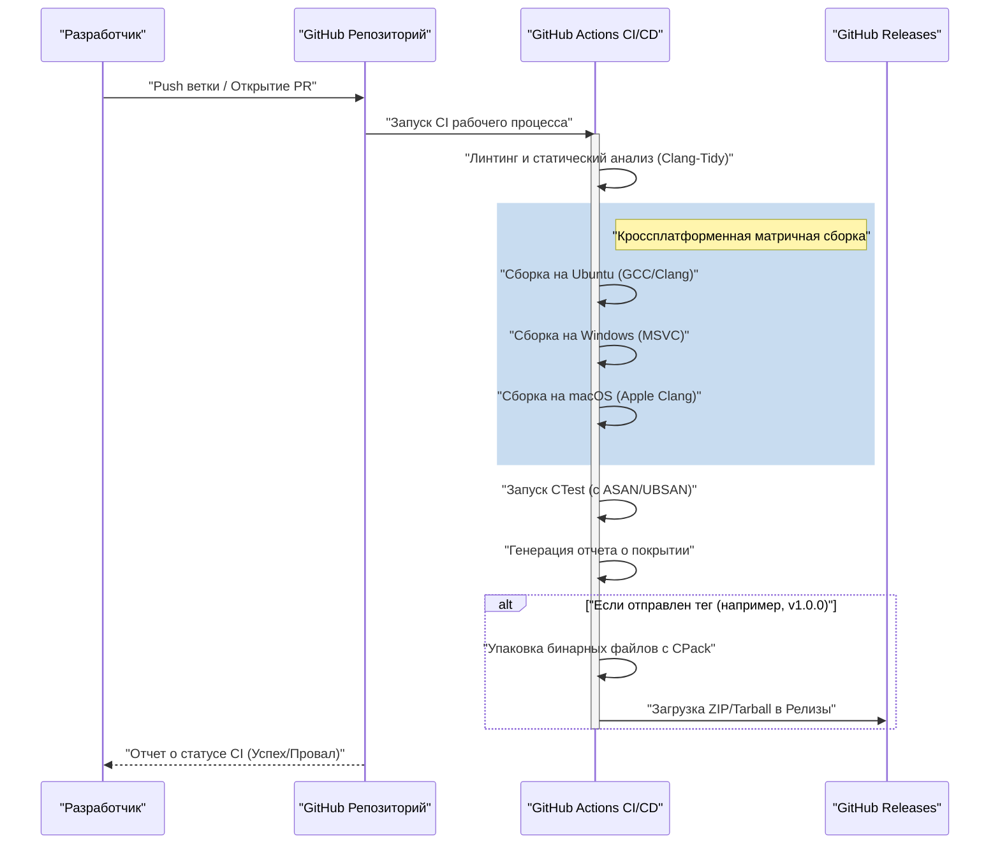
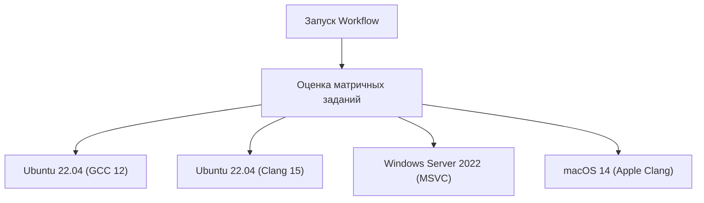

# Создание CI/CD пайплайна для C++ проектов с использованием GitHub Actions: Полное руководство

В современной парадигме разработки программного обеспечения непрерывная интеграция (Continuous Integration: CI) и непрерывная доставка/развертывание (Continuous Delivery/Deployment: CD) являются неотъемлемыми элементами гибкого (agile) процесса разработки и поддержания высокого качества ПО. Среди множества существующих языков программирования, создание CI/CD пайплайна для C++ сопровождается уникальными трудностями и сложностями по сравнению с другими языками (например, Python, JavaScript, Go и т.д.).

В этой статье мы максимально подробно рассмотрим, как с нуля создать надежный и практичный CI/CD пайплайн для C++ проекта с использованием GitHub Actions. Мы охватим все практические методы: от матричных сборок на различных кроссплатформенных системах (Windows, Linux, macOS), интеграции системы сборки с помощью CMake, автоматического тестирования с CTest, автоматизации статического и динамического анализа, измерения покрытия кода и до автоматической доставки скомпилированных бинарных файлов через GitHub Releases.

## 1. Значение CI/CD в C++ проектах и специфические проблемы

При разработке веб-приложений или использовании скриптовых языков в большинстве случаев достаточно тестирования и сборки в одном Docker-контейнере. Однако C++ — это компилируемый в машинный код язык, который сильно зависит от аппаратной архитектуры среды выполнения и операционной системы.

При внедрении CI/CD в C++ проекты мы сталкиваемся со следующими основными проблемами:

1. **Разнообразие платформ**: API (Windows API, POSIX и т.д.) различаются в зависимости от операционной системы, такой как Windows, Linux или macOS. То, что работает в локальной среде разработчика (например, на macOS), часто выдает ошибки компиляции на Linux или Windows, и это обычное явление.
2. **Различия в компиляторах**: Основные компиляторы, такие как Microsoft Visual C++ (MSVC), GNU Compiler Collection (GCC) и Clang, имеют разные уровни реализации стандартов C++ (C++17, C++20, C++23), интерпретации и строгости предупреждений.
3. **Время сборки**: В крупных C++ проектах нередко сборка занимает от нескольких десятков минут до нескольких часов. В CI-среде с ограниченными вычислительными ресурсами требуются стратегии кэширования и распараллеливания для эффективной сборки.
4. **Управление зависимостями**: В C++ нет единого стандартного менеджера пакетов вроде npm или pip. Необходимо каждый раз правильно разрешать библиотеки в CI-среде, используя vcpkg, Conan или `FetchContent` в CMake.
5. **Управление памятью и неопределенное поведение**: Поскольку C++ включает работу с указателями и ручное управление памятью, необходимо автоматизировать не только тестирование логики, но и обнаружение утечек памяти, а также неопределенного поведения (Undefined Behavior).

Для решения этих проблем оптимальным решением является GitHub Actions, который позволяет по требованию предоставлять различные виртуальные машины с разными ОС и определять сложные рабочие процессы в виде кода (Configuration as Code).

## 2. Обзор архитектуры CI/CD пайплайна

Давайте визуализируем общую картину CI/CD пайплайна, который мы собираемся создать. Следующая диаграмма последовательности Mermaid показывает рабочий процесс от отправки кода до релиза.



В этой архитектуре на этапе Pull Request предоставляется быстрая обратная связь (статический анализ, сборка и тестирование), а упаковка и распространение артефактов происходят при присвоении тега версии.

## 3. Настройка проекта с помощью современного CMake

Основой отличного CI пайплайна является надежная система сборки. Мы будем использовать CMake — стандарт де-факто для C++. Здесь мы применим целеориентированный подход, известный как "современный CMake".

Предполагается следующая структура директорий проекта:

```text
my_cpp_project/
├── CMakeLists.txt
├── src/
│   ├── main.cpp
│   ├── calculator.cpp
│   └── calculator.h
└── tests/
    ├── CMakeLists.txt
    └── test_calculator.cpp
```

Пример настройки корневого `CMakeLists.txt`:

```cmake
cmake_minimum_required(VERSION 3.20)
project(MyCppProject VERSION 1.0.0 LANGUAGES CXX)

# Настройка стандарта C++
set(CMAKE_CXX_STANDARD 20)
set(CMAKE_CXX_STANDARD_REQUIRED ON)
set(CMAKE_CXX_EXTENSIONS OFF) # Отключение расширений компилятора для повышения переносимости

# Усиление предупреждений компилятора
function(set_project_warnings target_name)
    if(MSVC)
        target_compile_options(${target_name} PRIVATE /W4 /WX)
    else()
        target_compile_options(${target_name} PRIVATE -Wall -Wextra -Wpedantic -Werror)
    endif()
endfunction()

# Создание цели-библиотеки
add_library(CalculatorLib src/calculator.cpp)
target_include_directories(CalculatorLib PUBLIC ${CMAKE_CURRENT_SOURCE_DIR}/src)
set_project_warnings(CalculatorLib)

# Создание цели-исполняемого файла
add_executable(MyApplication src/main.cpp)
target_link_libraries(MyApplication PRIVATE CalculatorLib)
set_project_warnings(MyApplication)

# Включение тестирования
enable_testing()
add_subdirectory(tests)

# Определение правил установки (для CPack)
include(GNUInstallDirs)
install(TARGETS MyApplication CalculatorLib
    RUNTIME DESTINATION ${CMAKE_INSTALL_BINDIR}
    LIBRARY DESTINATION ${CMAKE_INSTALL_LIBDIR}
    ARCHIVE DESTINATION ${CMAKE_INSTALL_LIBDIR}
)

# Настройки упаковки с помощью CPack
set(CPACK_PROJECT_NAME ${PROJECT_NAME})
set(CPACK_PROJECT_VERSION ${PROJECT_VERSION})
set(CPACK_GENERATOR "ZIP;TGZ")
if(WIN32)
    set(CPACK_GENERATOR "ZIP")
endif()
include(CPack)
```

**Ключевые моменты:**
- `CMAKE_CXX_EXTENSIONS OFF`: Предотвращает зависимость от нестандартных функций (например, расширений GNU) и обеспечивает кроссплатформенность.
- **Усиление предупреждений (`-Werror` / `/WX`)**: Преобразование предупреждений компилятора в ошибки в среде CI позволяет принудительно поддерживать высокое качество кода.
- **GNUInstallDirs**: Автоматически разрешает стандартные пути установки для каждой ОС (например, `/usr/local/bin` или `C:\Program Files`).

## 4. Основы GitHub Actions и матричная стратегия

GitHub Actions настраивается с помощью YAML-файлов в директории `.github/workflows/`.
Самой мощной функцией для C++ проектов является "матричная стратегия" (Matrix Strategy). Она позволяет динамически генерировать и параллельно выполнять комбинации операционных систем и компиляторов.



Ниже приведено базовое определение задания YAML для матричной сборки:

```yaml
jobs:
  build:
    name: "Build & Test [${{ matrix.os }} - ${{ matrix.compiler }}]"
    runs-on: ${{ matrix.os }}
    strategy:
      fail-fast: false # Продолжать сборку на других ОС, даже если одно задание завершилось с ошибкой
      matrix:
        include:
          - os: ubuntu-latest
            compiler: gcc
            c_compiler: gcc
            cpp_compiler: g++
          - os: ubuntu-latest
            compiler: clang
            c_compiler: clang
            cpp_compiler: clang++
          - os: windows-latest
            compiler: msvc
            c_compiler: cl
            cpp_compiler: cl
          - os: macos-latest
            compiler: apple-clang
            c_compiler: clang
            cpp_compiler: clang++
```

`fail-fast: false` имеет очень важное значение. Например, если вы случайно используете API, специфичный для Linux, сборка на Ubuntu завершится неудачно, но мы хотим одновременно увидеть, завершится ли сборка успешно на Windows или нет.

## 5. Затраты на сборку и оптимизация параллельной обработки с использованием закона Амдала

CI/CD в облачной среде — это битва со временем, и время сборки напрямую влияет на время ожидания разработчиков и эксплуатационные расходы.
Давайте подойдем к оптимизации времени сборки математически, используя "закон Амдала" (Amdahl's Law) из информатики.

Закон Амдала определяет теоретическое максимальное ускорение $S(N)$ при использовании $N$ процессоров, где доля программы, которую можно распараллелить, равна $P$:

$$ S(N) = \frac{1}{(1 - P) + \frac{P}{N}} $$

В процессе сборки C++ компиляция каждой единицы трансляции (Translation Unit: файл `.cpp`) из исходного кода полностью независима и может быть распараллелена. С другой стороны, конфигурация CMake и этап компоновки финального бинарного файла (линковка) в основном выполняются последовательно (не могут быть распараллелены).

Предположим, что 80% от общего времени сборки проекта занимает этап компиляции ($P = 0.8$), а 20% — последовательный этап ($1 - P = 0.2$).
Стандартный раннер GitHub Actions (Linux) предоставляет 2 ядра (потока). Следовательно, для $N = 2$:

$$ S(2) = \frac{1}{0.2 + \frac{0.8}{2}} = \frac{1}{0.2 + 0.4} = \frac{1}{0.6} \approx 1.67 $$

Использование всего 2 ядер дает ускорение примерно в 1.67 раза. Для достижения этого необходимо указать флаг `--parallel` в команде сборки CMake.

```yaml
    - name: "Build Project"
      run: cmake --build build --config Release --parallel 2
```

Кроме того, учитываем расчет стоимости. Общая стоимость использования GitHub Actions $C_{total}$ представляет собой сумму произведений времени выполнения задания $T_i$ на цену раннера $R_i$:

$$ C_{total} = \sum_{i=1}^{M} \left( T_i \times R_i \right) $$

Сокращение времени сборки не только ускоряет цикл обратной связи, но и напрямую снижает эксплуатационные расходы проекта (особенно в случае приватных репозиториев). Если требуется дальнейшее ускорение, эффективным методом является внедрение `ccache` для кэширования результатов компиляции.

## 6. Интеграция автоматического тестирования и санитайзеров (Sanitizers)

Чтобы предотвратить ошибки в C++ на раннем этапе, помимо модульного тестирования настоятельно рекомендуется использовать "санитайзеры", которые обнаруживают утечки памяти и неопределенное поведение во время выполнения. Мы будем использовать AddressSanitizer (ASAN) и UndefinedBehaviorSanitizer (UBSAN), разработанные Google.

Добавим опцию в CMake для включения санитайзеров.

```cmake
option(ENABLE_SANITIZERS "Enable ASAN and UBSAN" OFF)
if(ENABLE_SANITIZERS AND CMAKE_CXX_COMPILER_ID MATCHES "GNU|Clang")
    add_compile_options(-fsanitize=address,undefined -fno-omit-frame-pointer)
    add_link_options(-fsanitize=address,undefined)
endif()
```

Включим эту опцию и запустим тесты в задании для Ubuntu в нашем CI пайплайне.

```yaml
    - name: "Configure CMake"
      env:
        CC: ${{ matrix.c_compiler }}
        CXX: ${{ matrix.cpp_compiler }}
      run: >
        cmake -B build
        -DCMAKE_BUILD_TYPE=Release
        -DENABLE_SANITIZERS=${{ matrix.os == 'ubuntu-latest' && 'ON' || 'OFF' }}

    - name: "Run CTest"
      working-directory: build
      env:
        ASAN_OPTIONS: "detect_leaks=1:symbolize=1"
        UBSAN_OPTIONS: "print_stacktrace=1"
      run: ctest --build-config Release --output-on-failure --parallel 2
```

Для выполнения тестов используется команда `ctest`. Указание `--output-on-failure` позволяет выводить в логи CI только подробную информацию о неупавших тестах, предотвращая разрастание логов.

## 7. Измерение покрытия кода (Coverage)

Визуализация того, какая часть кода покрыта тестами, имеет важное значение для обеспечения качества. Используя среду Linux (GCC), мы измерим покрытие с помощью `gcov` и `lcov`.

Сначала настроим флаги компиляции для измерения покрытия в CMake.

```cmake
option(ENABLE_COVERAGE "Enable coverage reporting" OFF)
if(ENABLE_COVERAGE AND CMAKE_CXX_COMPILER_ID STREQUAL "GNU")
    add_compile_options(--coverage -O0 -g)
    add_link_options(--coverage)
endif()
```

Определим отдельное задание для измерения покрытия в GitHub Actions.

```yaml
  coverage:
    name: "Test Coverage Analysis"
    runs-on: ubuntu-latest
    steps:
    - uses: actions/checkout@v4
    
    - name: "Install lcov"
      run: sudo apt-get update && sudo apt-get install -y lcov
      
    - name: "Configure CMake for Coverage"
      run: cmake -B build -DCMAKE_BUILD_TYPE=Debug -DENABLE_COVERAGE=ON
      
    - name: "Build & Test"
      run: |
        cmake --build build --parallel 2
        cd build && ctest --output-on-failure
      
    - name: "Generate lcov Report"
      working-directory: build
      run: |
        lcov --capture --directory . --output-file coverage.info
        lcov --remove coverage.info '/usr/*' '*_deps/*' '*tests/*' --output-file coverage.info
        
    - name: "Upload Coverage to Codecov"
      uses: codecov/codecov-action@v3
      with:
        files: build/coverage.info
```
Команда `lcov --remove` используется для исключения системных заголовков, сторонних библиотек и самого тестового кода из измерения покрытия. Это позволяет получить чистое покрытие для собственного исходного кода проекта.

## 8. Автоматическая доставка бинарных файлов через GitHub Releases (CD)

Теперь мы создадим часть "CD" в CI/CD. Когда разработчик присваивает Git тег версии (например, `v1.2.0`) и отправляет его (push), автоматически компилируются исполняемые бинарные файлы для каждой ОС, упаковываются в ZIP или Tarball и загружаются в GitHub Releases.

На этом этапе мы будем использовать `CPack` — инструмент для упаковки, который поставляется вместе с CMake.

```yaml
    - name: "Package Application (CPack)"
      if: startsWith(github.ref, 'refs/tags/v')
      working-directory: build
      run: cpack -C Release -V

    - name: "Upload Release Assets"
      if: startsWith(github.ref, 'refs/tags/v')
      uses: softprops/action-gh-release@v1
      with:
        files: |
          build/*.tar.gz
          build/*.zip
          build/*.sh
          build/*.exe
      env:
        GITHUB_TOKEN: ${{ secrets.GITHUB_TOKEN }}
```

Благодаря этой настройке достаточно выполнить `git tag v1.0.0` и `git push origin v1.0.0`, чтобы для пользователей Windows ZIP-файл, а для пользователей Linux/macOS — Tarball автоматически публиковались на странице релизов без какого-либо ручного вмешательства. Это чрезвычайно мощная функция для доставки программного обеспечения вашим пользователям.

## 9. Полный YAML-файл Workflow

Ниже представлен полный код надежного и практичного файла `.github/workflows/main.yml`, который объединяет все рассмотренные до сих пор элементы.

```yaml
name: "C++ CI/CD Pipeline"

on:
  push:
    branches: [ "main", "develop" ]
    tags: [ "v*.*.*" ]
  pull_request:
    branches: [ "main" ]

env:
  BUILD_TYPE: Release

jobs:
  build-and-test:
    name: "Build [${{ matrix.os }} | ${{ matrix.compiler }}]"
    runs-on: ${{ matrix.os }}
    strategy:
      fail-fast: false
      matrix:
        include:
          - os: ubuntu-latest
            compiler: gcc
            c_compiler: gcc
            cpp_compiler: g++
          - os: ubuntu-latest
            compiler: clang
            c_compiler: clang
            cpp_compiler: clang++
          - os: windows-latest
            compiler: msvc
            c_compiler: cl
            cpp_compiler: cl
          - os: macos-latest
            compiler: apple-clang
            c_compiler: clang
            cpp_compiler: clang++

    steps:
    - name: "Checkout Repository"
      uses: actions/checkout@v4

    - name: "Configure CMake"
      env:
        CC: ${{ matrix.c_compiler }}
        CXX: ${{ matrix.cpp_compiler }}
      run: >
        cmake -B build
        -DCMAKE_BUILD_TYPE=${{ env.BUILD_TYPE }}
        -DENABLE_SANITIZERS=${{ matrix.os == 'ubuntu-latest' && 'ON' || 'OFF' }}

    - name: "Build Project"
      run: cmake --build build --config ${{ env.BUILD_TYPE }} --parallel 2

    - name: "Run Unit Tests (CTest)"
      working-directory: build
      env:
        ASAN_OPTIONS: "detect_leaks=1:symbolize=1"
        UBSAN_OPTIONS: "print_stacktrace=1"
      run: ctest --build-config ${{ env.BUILD_TYPE }} --output-on-failure --parallel 2

    - name: "Package with CPack"
      if: startsWith(github.ref, 'refs/tags/v')
      working-directory: build
      run: cpack -C ${{ env.BUILD_TYPE }}

    - name: "Create GitHub Release and Upload Assets"
      if: startsWith(github.ref, 'refs/tags/v')
      uses: softprops/action-gh-release@v1
      with:
        files: |
          build/*.tar.gz
          build/*.zip
      env:
        GITHUB_TOKEN: ${{ secrets.GITHUB_TOKEN }}

  coverage:
    name: "Code Coverage Analysis"
    runs-on: ubuntu-latest
    if: github.event_name == 'pull_request' || github.ref == 'refs/heads/main'
    steps:
    - name: "Checkout Repository"
      uses: actions/checkout@v4
      
    - name: "Install lcov"
      run: sudo apt-get update && sudo apt-get install -y lcov
      
    - name: "Configure CMake for Coverage"
      run: cmake -B build -DCMAKE_BUILD_TYPE=Debug -DENABLE_COVERAGE=ON
      
    - name: "Build Project"
      run: cmake --build build --parallel 2
      
    - name: "Run Tests"
      working-directory: build
      run: ctest --output-on-failure
      
    - name: "Generate lcov Report"
      working-directory: build
      run: |
        lcov --capture --directory . --output-file coverage.info
        lcov --remove coverage.info '/usr/*' '*_deps/*' '*tests/*' --output-file coverage.info
        
    - name: "Upload Coverage to Codecov"
      uses: codecov/codecov-action@v3
      with:
        files: build/coverage.info
        fail_ci_if_error: false
```

## 10. На пути к более продвинутому CI/CD (Статический анализ и форматирование)

Хотя подробное рассмотрение здесь опущено, на практике настоятельно рекомендуется интегрировать в пайплайн дополнительные инструменты обеспечения качества.

1. **Принудительное использование Clang-Format**: Чтобы снизить нагрузку при код-ревью, встройте проверку стиля кода с помощью `clang-format` в CI, заставляя пайплайн завершаться с ошибкой при нарушении правил форматирования.
2. **Статический анализ (Clang-Tidy)**: Чтобы обнаружить скрытые баги и неэффективный код (например, ненужные копирования), которые не предотвращаются предупреждениями компилятора, интегрируйте `clang-tidy` в CMake и запускайте его в CI.
3. **Использование кэша vcpkg / Conan**: При использовании большого количества сторонних библиотек сборка зависимостей занимает значительное время. Используя `actions/cache` в GitHub Actions для сохранения директории установленных пакетов vcpkg или кэша Conan, вы можете радикально сократить время сборки.

## Заключение

Создание CI/CD пайплайна для C++ проектов на первый взгляд может показаться сложным из-за платформенной зависимости и сложности инструментов сборки. Однако, правильно комбинируя GitHub Actions, современный CMake и экосистему CTest/CPack, вы можете получить в свое распоряжение чрезвычайно мощный и автоматизированный процесс разработки.

Описанные в этой статье кроссплатформенная проверка с использованием матричной стратегии, обнаружение багов времени выполнения с помощью санитайзеров, измерение покрытия кода и автоматическое развертывание через GitHub Releases являются лучшими практиками, широко используемыми даже в коммерческих проектах с открытым исходным кодом.

Автоматизированный CI/CD пайплайн минимизирует время, которое разработчики тратят на "поиск багов" и "ручную сборку и релиз", становясь мощнейшим оружием, позволяющим сосредоточиться на подлинной, творческой деятельности по написанию кода. Обязательно внедрите это в свой C++ проект, чтобы достичь гибкой разработки с чувством уверенности и спокойствия.
