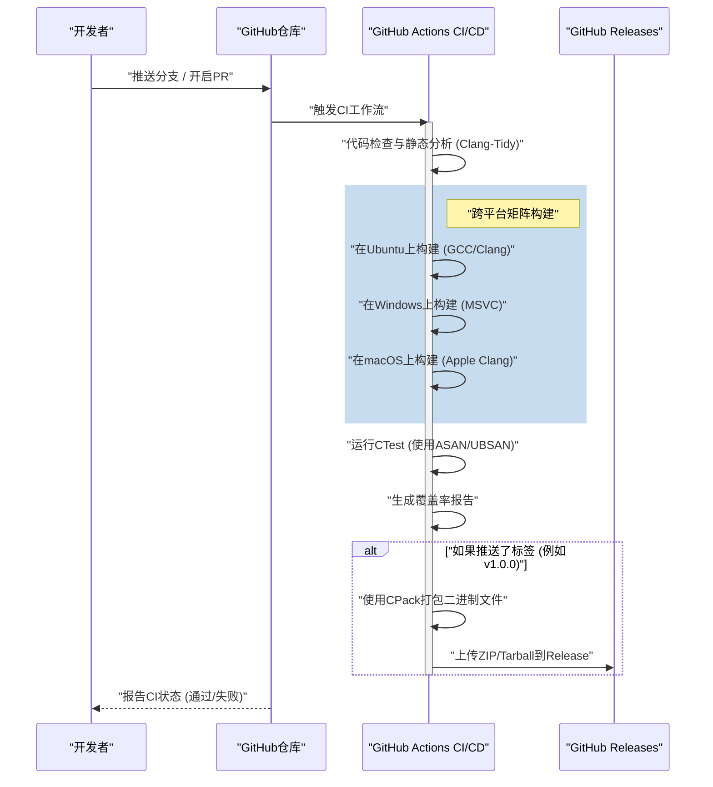
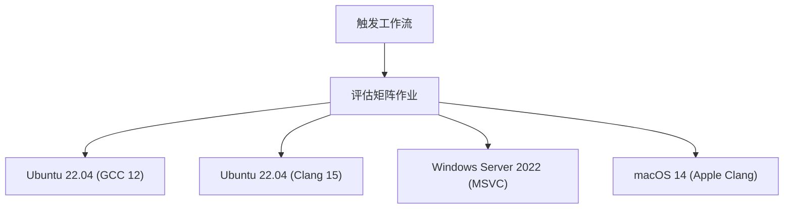

# 使用GitHub Actions构建C++项目的CI/CD流水线：完全指南

在现代软件开发范式中，持续集成（Continuous Integration: CI）和持续交付/部署（Continuous Delivery/Deployment: CD）是敏捷开发过程和维持高质量软件不可或缺的要素。在众多编程语言中，相比于其他语言（例如Python、JavaScript、Go等），构建C++的CI/CD流水线伴随着独特的难度与复杂性。

本文将极其详细地讲解如何利用GitHub Actions，从零开始为C++项目构建坚固且实用的CI/CD流水线。内容涵盖跨平台（Windows、Linux、macOS）的矩阵构建（Matrix Build）、整合CMake构建系统、使用CTest进行自动化测试、自动化静态与动态分析、覆盖率测量，以及通过GitHub Releases自动交付已编译二进制文件等所有实践技巧。

## 1. C++项目中CI/CD的意义与特有问题

在Web应用程序或使用脚本语言的开发中，通常在单个Docker容器上进行测试和构建就足够了。然而，C++作为一种本地编译语言，强烈依赖于运行环境的硬件架构和操作系统。

在为C++项目引入CI/CD时，面临的主要挑战如下：

1. **平台的多样性**：不同操作系统（如Windows、Linux、macOS）的API（Windows API、POSIX等）各不相同。即使在开发者的本地环境（例如macOS）中能正常运行，在Linux或Windows上出现编译错误也是家常便饭。
2. **编译器的差异**：Microsoft Visual C++ (MSVC)、GNU Compiler Collection (GCC)、Clang等主流编译器，在对C++标准（C++17、C++20、C++23）的实现程度、解释以及警告的严格程度上都存在差异。
3. **构建时间**：在大型C++项目中，构建花费数十分钟甚至数小时的情况并不罕见。在CI环境中，需要在有限的计算资源下，寻求缓存策略和并行化处理以高效地进行构建。
4. **依赖管理**：C++不存在像npm或pip那样绝对标准的包管理器。需要使用vcpkg、Conan或CMake的 `FetchContent` 等工具，在CI环境上每次都能正确解析依赖库。
5. **内存管理与未定义行为**：由于伴随着指针操作和手动内存管理，除了单纯的逻辑测试外，还需要自动化检测内存泄漏和未定义行为（Undefined Behavior）。

为了解决这些问题，能够按需配置各种操作系统虚拟机，并通过代码定义复杂工作流（Configuration as Code）的GitHub Actions就成为了最佳解决方案。

## 2. CI/CD流水线架构概述

让我们来可视化即将构建的CI/CD流水线全貌。以下的Mermaid时序图展示了从代码Push到发布（Release）的工作流。



在此架构中，Pull Request阶段将提供快速的反馈（静态分析、构建和测试），而在打上版本标签的时机，则会进行产物的打包和分发。

## 3. 现代CMake的项目配置

优秀的CI流水线的基础是坚固的构建系统。我们将使用C++的事实标准：CMake。在这里，我们采用被称为“现代CMake（Modern CMake）”的面向目标（Target-oriented）方法。

假设项目的目录结构如下：

```text
my_cpp_project/
├── CMakeLists.txt
├── src/
│   ├── main.cpp
│   ├── calculator.cpp
│   └── calculator.h
└── tests/
    ├── CMakeLists.txt
    └── test_calculator.cpp
```

根目录 `CMakeLists.txt` 的配置示例：

```cmake
cmake_minimum_required(VERSION 3.20)
project(MyCppProject VERSION 1.0.0 LANGUAGES CXX)

# C++標準の設定
set(CMAKE_CXX_STANDARD 20)
set(CMAKE_CXX_STANDARD_REQUIRED ON)
set(CMAKE_CXX_EXTENSIONS OFF) # コンパイラ固有の拡張を無効化し移植性を高める

# コンパイラ警告の厳格化
function(set_project_warnings target_name)
    if(MSVC)
        target_compile_options(${target_name} PRIVATE /W4 /WX)
    else()
        target_compile_options(${target_name} PRIVATE -Wall -Wextra -Wpedantic -Werror)
    endif()
endfunction()

# ライブラリターゲットの作成
add_library(CalculatorLib src/calculator.cpp)
target_include_directories(CalculatorLib PUBLIC ${CMAKE_CURRENT_SOURCE_DIR}/src)
set_project_warnings(CalculatorLib)

# 実行ファイルターゲットの作成
add_executable(MyApplication src/main.cpp)
target_link_libraries(MyApplication PRIVATE CalculatorLib)
set_project_warnings(MyApplication)

# テストの有効化
enable_testing()
add_subdirectory(tests)

# インストールルールの定義 (CPack用)
include(GNUInstallDirs)
install(TARGETS MyApplication CalculatorLib
    RUNTIME DESTINATION ${CMAKE_INSTALL_BINDIR}
    LIBRARY DESTINATION ${CMAKE_INSTALL_LIBDIR}
    ARCHIVE DESTINATION ${CMAKE_INSTALL_LIBDIR}
)

# CPackによるパッケージング設定
set(CPACK_PROJECT_NAME ${PROJECT_NAME})
set(CPACK_PROJECT_VERSION ${PROJECT_VERSION})
set(CPACK_GENERATOR "ZIP;TGZ")
if(WIN32)
    set(CPACK_GENERATOR "ZIP")
endif()
include(CPack)
```

**要点：**
- `CMAKE_CXX_EXTENSIONS OFF`：防止依赖如GNU扩展等非标准功能，保证跨平台性。
- **严格警告 (`-Werror` / `/WX`)**：在CI环境中将编译器警告视为错误，强制保持高质量的代码。
- **GNUInstallDirs**：自动解析各个操作系统的标准安装路径（如 `/usr/local/bin` 或 `C:\Program Files`）。

## 4. GitHub Actions基础与矩阵策略

GitHub Actions由 `.github/workflows/` 目录下的YAML文件配置。
在C++项目中，最强大的功能就是“矩阵策略（Matrix Strategy）”。借此可以动态生成操作系统和编译器的组合，并并行执行。



下面展示了作为矩阵构建基础的YAML作业（Job）定义：

```yaml
jobs:
  build:
    name: "Build & Test [${{ matrix.os }} - ${{ matrix.compiler }}]"
    runs-on: ${{ matrix.os }}
    strategy:
      fail-fast: false # 1つのジョブが失敗しても他のOSのビルドを継続する
      matrix:
        include:
          - os: ubuntu-latest
            compiler: gcc
            c_compiler: gcc
            cpp_compiler: g++
          - os: ubuntu-latest
            compiler: clang
            c_compiler: clang
            cpp_compiler: clang++
          - os: windows-latest
            compiler: msvc
            c_compiler: cl
            cpp_compiler: cl
          - os: macos-latest
            compiler: apple-clang
            c_compiler: clang
            cpp_compiler: clang++
```

`fail-fast: false` 非常重要。例如，如果不小心错误地使用了Linux特有的API，Ubuntu的构建将会失败，但此时我们也希望同时确认Windows的构建是否能够成功。

## 5. 构建成本与利用阿姆达尔定律优化并行处理

在云环境中，CI/CD是在与时间赛跑，构建时间直接关系到开发者的等待时间以及运行成本。
在这里，对于构建时间的优化，我们试着用计算机科学中的“阿姆达尔定律（Amdahl's Law）”来进行数学分析。

阿姆达尔定律定义了，如果程序中可并行化的部分占比为 $P$，那么在使用 $N$ 个处理器时的理论最大加速比 $S(N)$ 如下：

$$ S(N) = \frac{1}{(1 - P) + \frac{P}{N}} $$

在C++的构建过程中，源代码中各个翻译单元（Translation Unit，即 `.cpp` 文件）的编译是完全独立的，因此可以并行化。另一方面，CMake的配置（Configuration）以及最终的二进制链接阶段，基本上是串行执行的（不可并行化）。

假设项目的整体构建时间中，80%为编译阶段（$P = 0.8$），20%为串行阶段（$1 - P = 0.2$）。
GitHub Actions的标准运行器（Linux）提供2个核心（线程）。因此当 $N = 2$ 时：

$$ S(2) = \frac{1}{0.2 + \frac{0.8}{2}} = \frac{1}{0.2 + 0.4} = \frac{1}{0.6} \approx 1.67 $$

仅仅使用2个核心，就能获得约1.67倍的速度提升。为了实现这一点，必须在CMake的构建命令中指定 `--parallel` 选项。

```yaml
    - name: "Build Project"
      run: cmake --build build --config Release --parallel 2
```

此外，我们还要考虑成本计算。GitHub Actions的使用成本 $C_{total}$ 是各项作业执行时间 $T_i$ 与运行器单价 $R_i$ 乘积的总和。

$$ C_{total} = \sum_{i=1}^{M} \left( T_i \times R_i \right) $$

缩短构建时间不仅可以加快反馈循环，还能直接降低项目的运营成本（特别是在私有仓库的情况下）。如果需要进一步提速，引入 `ccache` 来缓存编译结果是一种有效的方法。

## 6. 自动化测试与Sanitizers集成

在C++中，为了防患于未然，强烈建议在单元测试之外，引入能在运行时检测内存泄漏和未定义行为的“Sanitizer”。我们可以使用Google开发的AddressSanitizer (ASAN) 和 UndefinedBehaviorSanitizer (UBSAN)。

在CMake中添加启用Sanitizer的选项：

```cmake
option(ENABLE_SANITIZERS "Enable ASAN and UBSAN" OFF)
if(ENABLE_SANITIZERS AND CMAKE_CXX_COMPILER_ID MATCHES "GNU|Clang")
    add_compile_options(-fsanitize=address,undefined -fno-omit-frame-pointer)
    add_link_options(-fsanitize=address,undefined)
endif()
```

在CI流水线的Ubuntu作业中启用该选项并执行测试：

```yaml
    - name: "Configure CMake"
      env:
        CC: ${{ matrix.c_compiler }}
        CXX: ${{ matrix.cpp_compiler }}
      run: >
        cmake -B build
        -DCMAKE_BUILD_TYPE=Release
        -DENABLE_SANITIZERS=${{ matrix.os == 'ubuntu-latest' && 'ON' || 'OFF' }}

    - name: "Run CTest"
      working-directory: build
      env:
        ASAN_OPTIONS: "detect_leaks=1:symbolize=1"
        UBSAN_OPTIONS: "print_stacktrace=1"
      run: ctest --build-config Release --output-on-failure --parallel 2
```

测试执行使用 `ctest` 命令。通过指定 `--output-on-failure`，仅在测试失败时将详细日志输出到CI中，从而防止日志过于庞大。

## 7. 覆盖率测量

可视化测试覆盖了多少代码在质量保证中至关重要。利用Linux环境（GCC），我们使用 `gcov` 和 `lcov` 来测量覆盖率。

首先，在CMake中设置用于覆盖率测量的编译标志：

```cmake
option(ENABLE_COVERAGE "Enable coverage reporting" OFF)
if(ENABLE_COVERAGE AND CMAKE_CXX_COMPILER_ID STREQUAL "GNU")
    add_compile_options(--coverage -O0 -g)
    add_link_options(--coverage)
endif()
```

在GitHub Actions中定义一个独立作业来进行覆盖率测量：

```yaml
  coverage:
    name: "Test Coverage Analysis"
    runs-on: ubuntu-latest
    steps:
    - uses: actions/checkout@v4
    
    - name: "Install lcov"
      run: sudo apt-get update && sudo apt-get install -y lcov
      
    - name: "Configure CMake for Coverage"
      run: cmake -B build -DCMAKE_BUILD_TYPE=Debug -DENABLE_COVERAGE=ON
      
    - name: "Build & Test"
      run: |
        cmake --build build --parallel 2
        cd build && ctest --output-on-failure
      
    - name: "Generate lcov Report"
      working-directory: build
      run: |
        lcov --capture --directory . --output-file coverage.info
        lcov --remove coverage.info '/usr/*' '*_deps/*' '*tests/*' --output-file coverage.info
        
    - name: "Upload Coverage to Codecov"
      uses: codecov/codecov-action@v3
      with:
        files: build/coverage.info
```
使用 `lcov --remove` 命令，将系统头文件、第三方库以及测试代码自身从覆盖率测量对象中排除。这样就能获得项目自身源代码的纯粹覆盖率。

## 8. 通过GitHub Releases自动交付二进制文件 (CD)

构建CI/CD中的“CD”部分。当开发者在Git中打上版本标签（例如：`v1.2.0`）并推送时，它会自动编译各个操作系统的可执行二进制文件，打包成ZIP或Tarball，并上传到GitHub Releases。

这一步我们将利用CMake自带的打包工具 `CPack`。

```yaml
    - name: "Package Application (CPack)"
      if: startsWith(github.ref, 'refs/tags/v')
      working-directory: build
      run: cpack -C Release -V

    - name: "Upload Release Assets"
      if: startsWith(github.ref, 'refs/tags/v')
      uses: softprops/action-gh-release@v1
      with:
        files: |
          build/*.tar.gz
          build/*.zip
          build/*.sh
          build/*.exe
      env:
        GITHUB_TOKEN: ${{ secrets.GITHUB_TOKEN }}
```

通过此配置，只需执行 `git tag v1.0.0` 和 `git push origin v1.0.0`，面向Windows用户的ZIP文件以及面向Linux/macOS用户的Tarball，就会在无需手动干预的情况下，自动发布到Release页面。这在向用户交付软件时是一项极为强大的功能。

## 9. 完整的 Workflow YAML 文件

下面展示了整合了前文讲解的所有要素、坚固且实用的 `.github/workflows/main.yml` 的完整代码：

```yaml
name: "C++ CI/CD Pipeline"

on:
  push:
    branches: [ "main", "develop" ]
    tags: [ "v*.*.*" ]
  pull_request:
    branches: [ "main" ]

env:
  BUILD_TYPE: Release

jobs:
  build-and-test:
    name: "Build [${{ matrix.os }} | ${{ matrix.compiler }}]"
    runs-on: ${{ matrix.os }}
    strategy:
      fail-fast: false
      matrix:
        include:
          - os: ubuntu-latest
            compiler: gcc
            c_compiler: gcc
            cpp_compiler: g++
          - os: ubuntu-latest
            compiler: clang
            c_compiler: clang
            cpp_compiler: clang++
          - os: windows-latest
            compiler: msvc
            c_compiler: cl
            cpp_compiler: cl
          - os: macos-latest
            compiler: apple-clang
            c_compiler: clang
            cpp_compiler: clang++

    steps:
    - name: "Checkout Repository"
      uses: actions/checkout@v4

    - name: "Configure CMake"
      env:
        CC: ${{ matrix.c_compiler }}
        CXX: ${{ matrix.cpp_compiler }}
      run: >
        cmake -B build
        -DCMAKE_BUILD_TYPE=${{ env.BUILD_TYPE }}
        -DENABLE_SANITIZERS=${{ matrix.os == 'ubuntu-latest' && 'ON' || 'OFF' }}

    - name: "Build Project"
      run: cmake --build build --config ${{ env.BUILD_TYPE }} --parallel 2

    - name: "Run Unit Tests (CTest)"
      working-directory: build
      env:
        ASAN_OPTIONS: "detect_leaks=1:symbolize=1"
        UBSAN_OPTIONS: "print_stacktrace=1"
      run: ctest --build-config ${{ env.BUILD_TYPE }} --output-on-failure --parallel 2

    - name: "Package with CPack"
      if: startsWith(github.ref, 'refs/tags/v')
      working-directory: build
      run: cpack -C ${{ env.BUILD_TYPE }}

    - name: "Create GitHub Release and Upload Assets"
      if: startsWith(github.ref, 'refs/tags/v')
      uses: softprops/action-gh-release@v1
      with:
        files: |
          build/*.tar.gz
          build/*.zip
      env:
        GITHUB_TOKEN: ${{ secrets.GITHUB_TOKEN }}

  coverage:
    name: "Code Coverage Analysis"
    runs-on: ubuntu-latest
    if: github.event_name == 'pull_request' || github.ref == 'refs/heads/main'
    steps:
    - name: "Checkout Repository"
      uses: actions/checkout@v4
      
    - name: "Install lcov"
      run: sudo apt-get update && sudo apt-get install -y lcov
      
    - name: "Configure CMake for Coverage"
      run: cmake -B build -DCMAKE_BUILD_TYPE=Debug -DENABLE_COVERAGE=ON
      
    - name: "Build Project"
      run: cmake --build build --parallel 2
      
    - name: "Run Tests"
      working-directory: build
      run: ctest --output-on-failure
      
    - name: "Generate lcov Report"
      working-directory: build
      run: |
        lcov --capture --directory . --output-file coverage.info
        lcov --remove coverage.info '/usr/*' '*_deps/*' '*tests/*' --output-file coverage.info
        
    - name: "Upload Coverage to Codecov"
      uses: codecov/codecov-action@v3
      with:
        files: build/coverage.info
        fail_ci_if_error: false
```

## 10. 迈向更高级的CI/CD（静态分析与格式化）

这里省略详细讲解，但在实际运维中，建议将更多的质量保证工具集成到流水线中：

1. **强制执行 Clang-Format**：为减轻代码审查的负担，将 `clang-format` 的代码风格检查集成到CI中，如果违反了格式化规则，则使流水线失败。
2. **静态分析 (Clang-Tidy)**：为了检测单靠编译器警告无法防备的潜在错误，或低效代码（如不必要的复制等），将 `clang-tidy` 集成到CMake中，并在CI上运行。
3. **利用 vcpkg / Conan 缓存**：如果使用了大量第三方库，构建依赖关系会花费大量时间。利用GitHub Actions的 `actions/cache`，通过保留vcpkg已安装目录或Conan缓存，可以大幅度缩短构建时间。

## 结论

由于平台依赖性和构建工具的复杂性，在C++项目中构建CI/CD流水线乍看之下门槛很高。然而，通过正确结合GitHub Actions、现代CMake以及CTest/CPack的生态系统，就能获得极具威力且自动化的开发工作流。

本文所讲解的基于矩阵策略的跨平台验证、基于Sanitizer的运行时Bug检测、覆盖率测量，以及自动部署到GitHub Releases，都是在商业级开源项目中被广泛采用的最佳实践。

自动化的CI/CD流水线是最小化开发者在“寻找Bug”和“手动构建/发布”上所耗费的时间，使其能够专注于本质的创造性编码活动的最强武器。请务必也引入到您的C++项目中，实现敏捷且充满安心感的开发生活。
