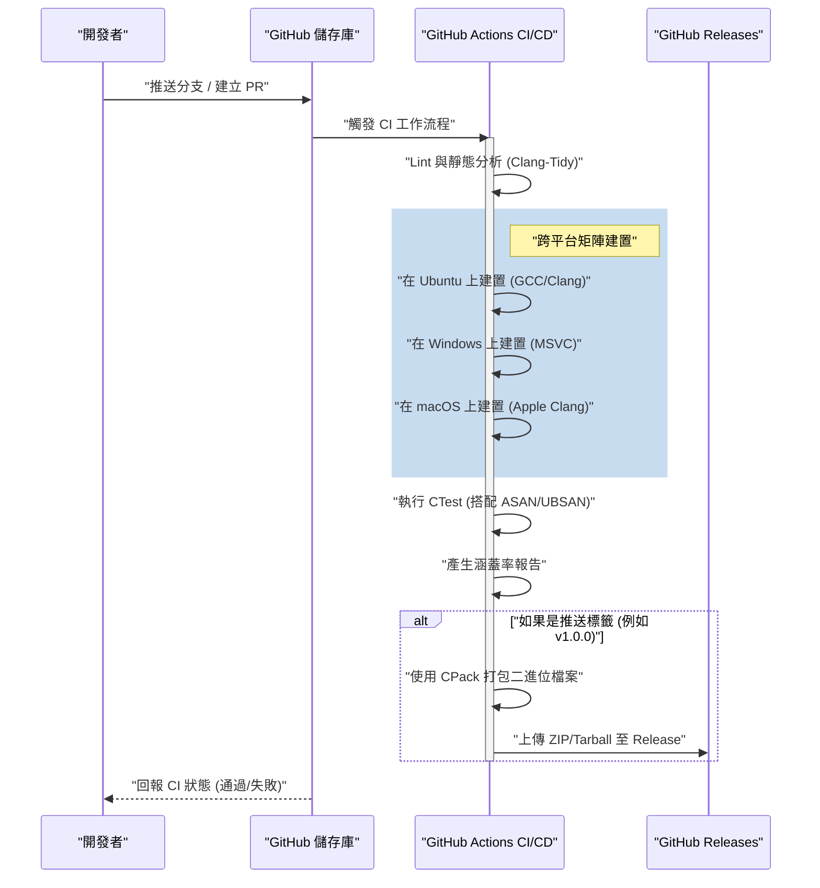
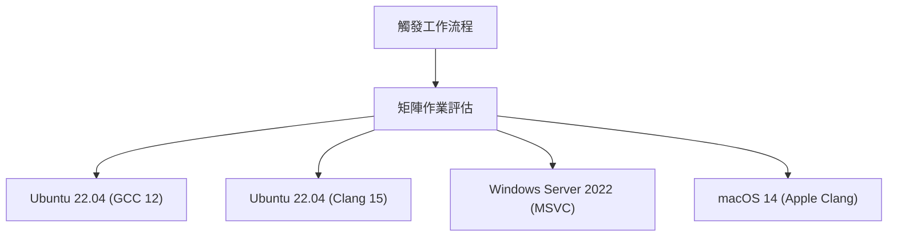

# 使用 GitHub Actions 建構 C++ 專案的 CI/CD 管線：完整指南

在現代軟體開發典範中，持續整合（Continuous Integration: CI）與持續交付/部署（Continuous Delivery/Deployment: CD）是維持敏捷開發流程與高品質軟體不可或缺的要素。在眾多的程式語言中，為 C++ 建構 CI/CD 管線與其他語言（例如 Python、JavaScript、Go 等）相比，伴隨著獨特的困難與複雜性。

本文將極其詳細地解說，如何活用 GitHub Actions，從零開始為 C++ 專案建構一個強健且實用的 CI/CD 管線。我們將涵蓋所有實踐技巧，包括跨平台（Windows、Linux、macOS）的矩陣建置（Matrix Build）、整合使用 CMake 的建置系統、利用 CTest 進行自動化測試、靜態與動態分析的自動化、涵蓋率（Coverage）測量，以及透過 GitHub Releases 自動交付已編譯好的二進位檔案。

## 1. C++ 專案中 CI/CD 的意義與特有挑戰

在開發 Web 應用程式或使用腳本語言時，大多只需在單一 Docker 容器上進行測試和建置就足夠了。然而，C++ 是原生編譯的語言，強烈依賴執行環境的硬體架構和作業系統。

在為 C++ 專案導入 CI/CD 時，主要會面臨以下挑戰：

1. **平台的多樣性**: Windows、Linux、macOS 等不同 OS 會有不同的 API（Windows API、POSIX 等）。在開發者的本地環境（例如 macOS）可以順利運作，但在 Linux 或 Windows 上發生編譯錯誤是家常便飯。
2. **編譯器的差異**: Microsoft Visual C++ (MSVC)、GNU Compiler Collection (GCC)、Clang 等主要編譯器，對於 C++ 標準（C++17、C++20、C++23）的實作程度、解釋以及警告的嚴格程度各不相同。
3. **建置時間**: 在大型 C++ 專案中，建置花費數十分鐘到數小時的情況並不罕見。在 CI 環境有限的運算資源下，需要有快取策略和並列處理來有效率地進行建置。
4. **相依性管理**: C++ 並不存在像 npm 或 pip 那樣絕對標準的套件管理器。需要使用 vcpkg、Conan 或 CMake 的 `FetchContent` 等，在 CI 環境上每次都正確地解析函式庫。
5. **記憶體管理與未定義行為**: 由於伴隨著指標操作和手動記憶體管理，不僅是單純的邏輯測試，還必須將記憶體流失和未定義行為（Undefined Behavior）的偵測自動化。

為了解決這些挑戰，能夠依需求配置各種 OS 虛擬機器，並將複雜的工作流程以程式碼定義（Configuration as Code）的 GitHub Actions 便成為了最佳解決方案。

## 2. CI/CD 管線的架構概觀

讓我們將接下來要建構的 CI/CD 管線全貌視覺化。以下的 Mermaid 循序圖展示了從程式碼 Push 到發布的工作流程。



在這個架構中，在 Pull Request 階段會提供快速的回饋（靜態分析與建置、測試），並在加上版本標籤的時間點進行產出物的打包與發布。

## 3. 現代化 CMake 的專案設定

優良的 CI 管線的基礎在於強健的建置系統。我們使用 C++ 的業界標準 CMake。在此，我們採用被稱為「現代化 CMake」的導向目標方法。

假設專案的目錄結構如下：

```text
my_cpp_project/
├── CMakeLists.txt
├── src/
│   ├── main.cpp
│   ├── calculator.cpp
│   └── calculator.h
└── tests/
    ├── CMakeLists.txt
    └── test_calculator.cpp
```

根目錄的 `CMakeLists.txt` 設定範例。

```cmake
cmake_minimum_required(VERSION 3.20)
project(MyCppProject VERSION 1.0.0 LANGUAGES CXX)

# C++ 標準設定
set(CMAKE_CXX_STANDARD 20)
set(CMAKE_CXX_STANDARD_REQUIRED ON)
set(CMAKE_CXX_EXTENSIONS OFF) # 停用編譯器專屬的擴充以提高可移植性

# 嚴格化編譯器警告
function(set_project_warnings target_name)
    if(MSVC)
        target_compile_options(${target_name} PRIVATE /W4 /WX)
    else()
        target_compile_options(${target_name} PRIVATE -Wall -Wextra -Wpedantic -Werror)
    endif()
endfunction()

# 建立函式庫目標
add_library(CalculatorLib src/calculator.cpp)
target_include_directories(CalculatorLib PUBLIC ${CMAKE_CURRENT_SOURCE_DIR}/src)
set_project_warnings(CalculatorLib)

# 建立執行檔目標
add_executable(MyApplication src/main.cpp)
target_link_libraries(MyApplication PRIVATE CalculatorLib)
set_project_warnings(MyApplication)

# 啟用測試
enable_testing()
add_subdirectory(tests)

# 定義安裝規則 (供 CPack 使用)
include(GNUInstallDirs)
install(TARGETS MyApplication CalculatorLib
    RUNTIME DESTINATION ${CMAKE_INSTALL_BINDIR}
    LIBRARY DESTINATION ${CMAKE_INSTALL_LIBDIR}
    ARCHIVE DESTINATION ${CMAKE_INSTALL_LIBDIR}
)

# 透過 CPack 的打包設定
set(CPACK_PROJECT_NAME ${PROJECT_NAME})
set(CPACK_PROJECT_VERSION ${PROJECT_VERSION})
set(CPACK_GENERATOR "ZIP;TGZ")
if(WIN32)
    set(CPACK_GENERATOR "ZIP")
endif()
include(CPack)
```

**重點：**
- `CMAKE_CXX_EXTENSIONS OFF`: 防止依賴 GNU 擴充等非標準功能，確保跨平台相容性。
- **嚴格化警告 (`-Werror` / `/WX`)**: 在 CI 環境中將編譯器警告視為錯誤，強制保持較高的程式碼品質。
- **GNUInstallDirs**: 自動解析各 OS 專屬的標準安裝路徑（如 `/usr/local/bin` 或 `C:\Program Files`）。

## 4. GitHub Actions 基礎與矩陣策略

GitHub Actions 是透過 `.github/workflows/` 目錄內的 YAML 檔案來配置。
在 C++ 專案中最強大的功能是「矩陣策略（Matrix Strategy）」。這使得我們能動態產生 OS 與編譯器的組合，並並列執行。



以下展示作為矩陣建置基礎的 YAML 作業定義。

```yaml
jobs:
  build:
    name: "Build & Test [${{ matrix.os }} - ${{ matrix.compiler }}]"
    runs-on: ${{ matrix.os }}
    strategy:
      fail-fast: false # 即便 1 個作業失敗，也繼續進行其他 OS 的建置
      matrix:
        include:
          - os: ubuntu-latest
            compiler: gcc
            c_compiler: gcc
            cpp_compiler: g++
          - os: ubuntu-latest
            compiler: clang
            c_compiler: clang
            cpp_compiler: clang++
          - os: windows-latest
            compiler: msvc
            c_compiler: cl
            cpp_compiler: cl
          - os: macos-latest
            compiler: apple-clang
            c_compiler: clang
            cpp_compiler: clang++
```

`fail-fast: false` 非常重要。舉例來說，如果誤用了 Linux 特有的 API，Ubuntu 的建置會失敗，但我們同時也會想確認 Windows 的建置是否成功。

## 5. 運用阿姆達爾定律 (Amdahl's Law) 最佳化建置成本與並列處理

雲端環境的 CI/CD 是一場與時間的賽跑，建置時間直接關乎開發者的等待時間與營運成本。
在這裡，關於建置時間的最佳化，我們試著使用電腦科學中的「阿姆達爾定律 (Amdahl's Law)」來進行數學上的探討。

阿姆達爾定律指出，若程式中可並列化部分的比例為 $P$，則在使用 $N$ 個處理器時，理論上的最大加速比 $S(N)$ 定義如下：

$$ S(N) = \frac{1}{(1 - P) + \frac{P}{N}} $$

在 C++ 的建置過程中，原始碼的各個翻譯單元（Translation Unit: `.cpp` 檔案）的編譯是完全獨立且可並列化的。另一方面，CMake 的組態設定以及最終二進位檔案的連結階段則基本上是序列執行（無法並列化）。

假設專案整體的建置時間中，有 80% 是編譯階段（$P = 0.8$），20% 是序列階段（$1 - P = 0.2$）。
GitHub Actions 的標準執行器（Linux）提供 2 個核心（執行緒）。因此當 $N = 2$ 時：

$$ S(2) = \frac{1}{0.2 + \frac{0.8}{2}} = \frac{1}{0.2 + 0.4} = \frac{1}{0.6} \approx 1.67 $$

僅使用 2 核心，就能獲得大約 1.67 倍的速度提升。為了實現這一點，在 CMake 的建置指令中指定 `--parallel` 參數是不可或缺的。

```yaml
    - name: "Build Project"
      run: cmake --build build --config Release --parallel 2
```

此外，也必須考慮成本計算。GitHub Actions 的使用成本 $C_{total}$ 是作業執行時間 $T_i$ 與執行器單價 $R_i$ 乘積的總和。

$$ C_{total} = \sum_{i=1}^{M} \left( T_i \times R_i \right) $$

縮短建置時間不僅能加速回饋迴圈，還能直接降低專案的營運成本（特別是在私人儲存庫的情況下）。若追求進一步的加速，導入 `ccache` 來快取編譯結果將是有效的手法。

## 6. 自動化測試與 Sanitizers 的整合

在 C++ 中為了防範 Bug 於未然，除了單元測試之外，強烈建議導入在執行期偵測記憶體流失與未定義行為的「Sanitizer」。我們將使用由 Google 開發的 AddressSanitizer (ASAN) 與 UndefinedBehaviorSanitizer (UBSAN)。

在 CMake 中新增啟用 Sanitizer 的選項。

```cmake
option(ENABLE_SANITIZERS "Enable ASAN and UBSAN" OFF)
if(ENABLE_SANITIZERS AND CMAKE_CXX_COMPILER_ID MATCHES "GNU|Clang")
    add_compile_options(-fsanitize=address,undefined -fno-omit-frame-pointer)
    add_link_options(-fsanitize=address,undefined)
endif()
```

在 CI 管線的 Ubuntu 作業中啟用這個選項來執行測試。

```yaml
    - name: "Configure CMake"
      env:
        CC: ${{ matrix.c_compiler }}
        CXX: ${{ matrix.cpp_compiler }}
      run: >
        cmake -B build
        -DCMAKE_BUILD_TYPE=Release
        -DENABLE_SANITIZERS=${{ matrix.os == 'ubuntu-latest' && 'ON' || 'OFF' }}

    - name: "Run CTest"
      working-directory: build
      env:
        ASAN_OPTIONS: "detect_leaks=1:symbolize=1"
        UBSAN_OPTIONS: "print_stacktrace=1"
      run: ctest --build-config Release --output-on-failure --parallel 2
```

測試的執行使用 `ctest` 指令。藉由指定 `--output-on-failure`，只會在 CI 輸出中顯示失敗測試的詳細日誌，以防止日誌過於龐大。

## 7. 測量涵蓋率（程式碼涵蓋率）

將測試涵蓋了多少程式碼視覺化，對於品質保證十分重要。我們將利用 Linux 環境 (GCC)，並使用 `gcov` 及 `lcov` 來測量涵蓋率。

首先，在 CMake 中設定涵蓋率測量用的編譯旗標。

```cmake
option(ENABLE_COVERAGE "Enable coverage reporting" OFF)
if(ENABLE_COVERAGE AND CMAKE_CXX_COMPILER_ID STREQUAL "GNU")
    add_compile_options(--coverage -O0 -g)
    add_link_options(--coverage)
endif()
```

在 GitHub Actions 中定義一個獨立的作業用於涵蓋率測量。

```yaml
  coverage:
    name: "Test Coverage Analysis"
    runs-on: ubuntu-latest
    steps:
    - uses: actions/checkout@v4
    
    - name: "Install lcov"
      run: sudo apt-get update && sudo apt-get install -y lcov
      
    - name: "Configure CMake for Coverage"
      run: cmake -B build -DCMAKE_BUILD_TYPE=Debug -DENABLE_COVERAGE=ON
      
    - name: "Build & Test"
      run: |
        cmake --build build --parallel 2
        cd build && ctest --output-on-failure
      
    - name: "Generate lcov Report"
      working-directory: build
      run: |
        lcov --capture --directory . --output-file coverage.info
        lcov --remove coverage.info '/usr/*' '*_deps/*' '*tests/*' --output-file coverage.info
        
    - name: "Upload Coverage to Codecov"
      uses: codecov/codecov-action@v3
      with:
        files: build/coverage.info
```
使用 `lcov --remove` 指令，將系統標頭檔、第三方函式庫以及測試程式碼本身從涵蓋率的測量對象中排除。這樣一來，就能獲得專案專屬原始碼的純粹涵蓋率。

## 8. 透過 GitHub Releases 自動交付二進位檔案 (CD)

接著建構 CI/CD 中 "CD" 的部分。當開發者在 Git 中加上版本標籤（例: `v1.2.0`）並推送時，會自動為各 OS 編譯可執行檔，並打包成 ZIP 或 Tarball，然後上傳至 GitHub Releases。

這個步驟將使用隨附於 CMake 的打包工具 `CPack`。

```yaml
    - name: "Package Application (CPack)"
      if: startsWith(github.ref, 'refs/tags/v')
      working-directory: build
      run: cpack -C Release -V

    - name: "Upload Release Assets"
      if: startsWith(github.ref, 'refs/tags/v')
      uses: softprops/action-gh-release@v1
      with:
        files: |
          build/*.tar.gz
          build/*.zip
          build/*.sh
          build/*.exe
      env:
        GITHUB_TOKEN: ${{ secrets.GITHUB_TOKEN }}
```

透過這個設定，只要執行 `git tag v1.0.0` 與 `git push origin v1.0.0`，就能在無須手動介入的情況下，自動將供 Windows 使用者的 ZIP 檔，以及供 Linux/macOS 使用者的 Tarball 公開到發布頁面。這對於向使用者傳遞軟體而言是極為強大的功能。

## 9. 完整的 Workflow YAML 檔案

以下展示整合了前面解說的所有要素，強健且實用的 `.github/workflows/main.yml` 完整程式碼。

```yaml
name: "C++ CI/CD Pipeline"

on:
  push:
    branches: [ "main", "develop" ]
    tags: [ "v*.*.*" ]
  pull_request:
    branches: [ "main" ]

env:
  BUILD_TYPE: Release

jobs:
  build-and-test:
    name: "Build [${{ matrix.os }} | ${{ matrix.compiler }}]"
    runs-on: ${{ matrix.os }}
    strategy:
      fail-fast: false
      matrix:
        include:
          - os: ubuntu-latest
            compiler: gcc
            c_compiler: gcc
            cpp_compiler: g++
          - os: ubuntu-latest
            compiler: clang
            c_compiler: clang
            cpp_compiler: clang++
          - os: windows-latest
            compiler: msvc
            c_compiler: cl
            cpp_compiler: cl
          - os: macos-latest
            compiler: apple-clang
            c_compiler: clang
            cpp_compiler: clang++

    steps:
    - name: "Checkout Repository"
      uses: actions/checkout@v4

    - name: "Configure CMake"
      env:
        CC: ${{ matrix.c_compiler }}
        CXX: ${{ matrix.cpp_compiler }}
      run: >
        cmake -B build
        -DCMAKE_BUILD_TYPE=${{ env.BUILD_TYPE }}
        -DENABLE_SANITIZERS=${{ matrix.os == 'ubuntu-latest' && 'ON' || 'OFF' }}

    - name: "Build Project"
      run: cmake --build build --config ${{ env.BUILD_TYPE }} --parallel 2

    - name: "Run Unit Tests (CTest)"
      working-directory: build
      env:
        ASAN_OPTIONS: "detect_leaks=1:symbolize=1"
        UBSAN_OPTIONS: "print_stacktrace=1"
      run: ctest --build-config ${{ env.BUILD_TYPE }} --output-on-failure --parallel 2

    - name: "Package with CPack"
      if: startsWith(github.ref, 'refs/tags/v')
      working-directory: build
      run: cpack -C ${{ env.BUILD_TYPE }}

    - name: "Create GitHub Release and Upload Assets"
      if: startsWith(github.ref, 'refs/tags/v')
      uses: softprops/action-gh-release@v1
      with:
        files: |
          build/*.tar.gz
          build/*.zip
      env:
        GITHUB_TOKEN: ${{ secrets.GITHUB_TOKEN }}

  coverage:
    name: "Code Coverage Analysis"
    runs-on: ubuntu-latest
    if: github.event_name == 'pull_request' || github.ref == 'refs/heads/main'
    steps:
    - name: "Checkout Repository"
      uses: actions/checkout@v4
      
    - name: "Install lcov"
      run: sudo apt-get update && sudo apt-get install -y lcov
      
    - name: "Configure CMake for Coverage"
      run: cmake -B build -DCMAKE_BUILD_TYPE=Debug -DENABLE_COVERAGE=ON
      
    - name: "Build Project"
      run: cmake --build build --parallel 2
      
    - name: "Run Tests"
      working-directory: build
      run: ctest --output-on-failure
      
    - name: "Generate lcov Report"
      working-directory: build
      run: |
        lcov --capture --directory . --output-file coverage.info
        lcov --remove coverage.info '/usr/*' '*_deps/*' '*tests/*' --output-file coverage.info
        
    - name: "Upload Coverage to Codecov"
      uses: codecov/codecov-action@v3
      with:
        files: build/coverage.info
        fail_ci_if_error: false
```

## 10. 邁向更進階的 CI/CD（靜態分析與格式化）

在此省略詳細解說，但在實際運用上，建議將進階的品質保證工具整合進管線中。

1. **強制 Clang-Format**: 為了減輕程式碼審查的負擔，將透過 `clang-format` 的程式碼風格檢查整合進 CI，當違反格式規則時便讓管線失敗。
2. **靜態分析 (Clang-Tidy)**: 為了偵測單靠編譯器警告無法防範的潛在 Bug，或是無效率的程式碼（如不必要的複製等），將 `clang-tidy` 整合至 CMake 並在 CI 上執行。
3. **活用 vcpkg / Conan 快取**: 若使用大量第三方函式庫，建置相依套件將會花費大量時間。利用 GitHub Actions 的 `actions/cache` 來保留 vcpkg 的安裝目錄或 Conan 的快取，能戲劇性地縮減建置時間。

## 結論

在 C++ 專案中建構 CI/CD 管線，由於平台相依性及建置工具的複雜度，乍看之下門檻似乎很高。然而，只要正確地結合 GitHub Actions、現代化 CMake 以及 CTest/CPack 生態系，就能獲得極其強大且自動化的開發流程。

本文所解說的：運用矩陣策略進行跨平台驗證、運用 Sanitizer 偵測執行期 Bug、測量涵蓋率，以及自動部署至 GitHub Releases 等，都是在商業級別的開源專案中被廣泛採用的最佳實踐。

自動化的 CI/CD 管線，能將開發者花在「找 Bug」與「手動建置・發布作業」的時間最小化，並成為讓開發者專注於本質上具創造力的程式設計活動的最強武器。請務必在您的 C++ 專案中也導入這套做法，實現敏捷且令人安心的開發生活。
