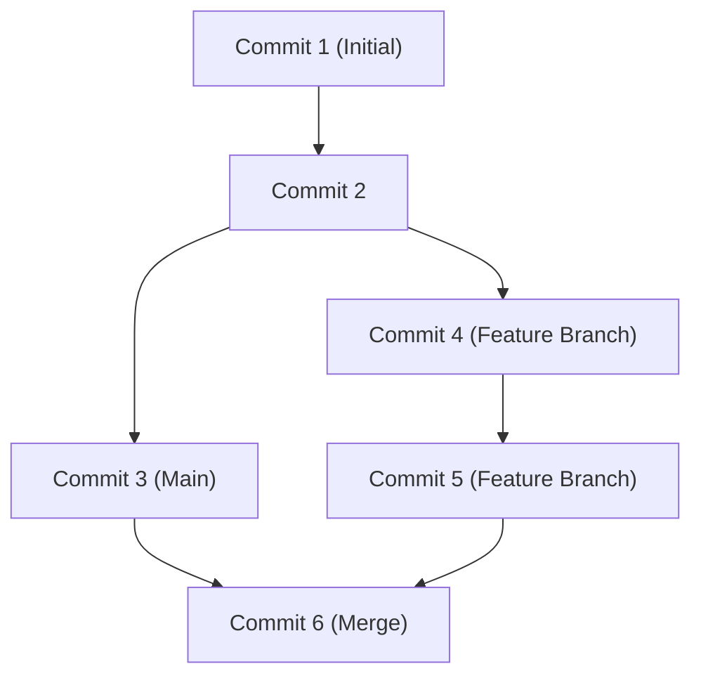

## 1. مقدمة: نقلة نوعية في التطوير بفضل GitHub

في مجال تطوير البرمجيات الحديث، من المستحيل التحدث دون ذكر GitHub و Git. في الماضي، اعتمد المطورون على أنظمة التحكم في الإصدارات المركزية مثل Subversion (SVN) و CVS. ومع ذلك، فإن Git، الذي طوره Linus Torvalds، مبتكر نواة Linux، قد بنى بيئة يمكن للمطورين في جميع أنحاء العالم من خلالها تغيير الكود في وقت واحد وبشكل آمن، وذلك بفضل نهجه اللامركزي الجديد كليًا.

في هذا المقال، سنتعمق في الشرح، بدءًا من فلسفة التصميم الأساسية لـ Git، ووصولاً إلى ثورة Pull Request التي جلبها GitHub للمصادر المفتوحة، وأحدث CI/CD (التكامل المستمر / النشر المستمر) باستخدام GitHub Actions.

## 2. فلسفة تصميم Git لـ Linus Torvalds: رسم بياني للالتزامات قائم على اللقطات

كانت أنظمة التحكم في الإصدارات التقليدية تسجل "الاختلافات (ديلتا)". بمعنى آخر، كانت تجمع فقط معلومات الاختلاف حول كيفية تغيير الملف. ومع ذلك، فإن نهج Git مختلف بشكل أساسي.

يتعامل Git مع البيانات كـ "سلسلة من اللقطات". في كل مرة تقوم فيها بعملية إيداع (Commit)، يسجل Git حالة جميع الملفات في تلك اللحظة كما لو كان يلتقط صورة (لقطة) ويحفظ مرجعًا لتلك اللقطة. بالنسبة للملفات التي لم تتغير، فإنه لا يقوم بحفظها مرة أخرى، بل يحتفظ فقط برابط إلى نفس الملف السابق.

بفضل هذا النهج القائم على اللقطات، يمكن إنشاء الفروع والتبديل بينها على الفور. داخليًا في Git، تُدار الإيداعات ببساطة كرسم بياني للكائنات (DAG: رسم بياني موجه غير دوري).



## 3. استراتيجيات الفروع: Git Flow و GitHub Flow

في التطوير الموزع، كيف يدير الفريق الفروع هو ما يحدد نجاح أو فشل المشروع. دعونا نلقي نظرة على استراتيجيتين ممثلتين.

### Git Flow
Git Flow هو نموذج فروع صارم اقترحه Vincent Driessen.
- `main` (أو `master`): كود بيئة الإنتاج الجاهز للإصدار دائمًا.
- `develop`: فرع التطوير للإصدار القادم.
- `feature/*`: لتطوير ميزات جديدة.
- `release/*`: للتحضير للإصدار.
- `hotfix/*`: لإصلاح الأخطاء الطارئة في بيئة الإنتاج.

هذا النموذج مثالي للمشاريع الكبيرة التي لها دورات إصدار منتظمة.

### GitHub Flow
من ناحية أخرى، GitHub Flow أبسط ويفترض النشر المستمر.
- فرع `main` قابل للنشر دائمًا.
- يتم تنفيذ جميع الأعمال في فروع الميزات المشتقة من `main`.
- قم بالالتزام محليًا وادفع بانتظام إلى الخادم.
- عندما تكون مستعدًا، قم بإنشاء Pull Request واطلب المراجعة.
- بمجرد الموافقة على المراجعة، قم بالدمج مع `main` وانشر على الفور.

إنه مناسب جدًا للفرق الرشيقة (agile) التي تقوم بالإصدارات عدة مرات في اليوم، مثل تطبيقات الويب و SaaS.

## 4. Fork و Pull Request: ثورة في تطوير المصادر المفتوحة

السبب الأكبر وراء أن يصبح GitHub أكبر منصة للمطورين في العالم يكمن في تحسينه لمفاهيم "Fork" و "Pull Request".

سابقًا، للمساهمة في مشروع مفتوح المصدر، كان عليك إرسال تصحيحات (patches) إلى القوائم البريدية. كان هذا حاجزًا عاليًا وكانت عملية المراجعة معقدة.

على GitHub، يمكنك استنساخ (Fork) مستودع شخص آخر إلى حسابك بنقرة زر واحدة. هناك، يمكنك تغيير الكود بحرية وإرسال طلب (Pull Request) إلى المستودع الأصلي قائلاً، "يرجى دمج تغييراتي". أتاح هذا لأي شخص المساهمة بسهولة في المشاريع، مما أدى إلى التطور الهائل للبرمجيات مفتوحة المصدر (OSS).

## 5. أتمتة CI/CD باستخدام GitHub Actions

في التطوير الحديث، تعتبر أتمتة عملية الاختبار والنشر مهمة بقدر أهمية كتابة الكود نفسه. GitHub Actions هي أداة أتمتة قوية مدمجة في منصة GitHub.

ببساطة عن طريق تعريف سير العمل (workflow) في ملف YAML، يمكنك أتمتة تشغيل الاختبارات، والبناء، والنشر على الخوادم بناءً على أي حدث في المستودع (مثل Push، إنشاء Pull Request، دفع टैگ، إلخ).

```yaml
name: CI/CD Pipeline

on:
  push:
    branches:
      - main
  pull_request:
    branches:
      - main

jobs:
  build-and-test:
    runs-on: ubuntu-latest
    steps:
      - name: Checkout Code
        uses: actions/checkout@v3
      - name: Setup Node.js
        uses: actions/setup-node@v3
        with:
          node-version: '18'
      - name: Install Dependencies
        run: npm ci
      - name: Run Tests
        run: npm test
```

من خلال هذه الأتمتة، تدور دورة "التكامل المستمر (دمج الكود واختباره تلقائيًا)" و "النشر المستمر (الإصدار التلقائي في بيئة الإنتاج)" بسرعة، مما يحسن جودة البرامج وسرعة التطوير بشكل كبير.

## 6. الخلاصة: مستقبل التعاون

GitHub ليس مجرد مستودع للكود. إنه شبكة اجتماعية وبنية تحتية للمطورين حول العالم لمشاركة المعرفة والتعاون في بناء البرمجيات. من خلال إتقان التحكم القوي في إصدارات Git، وميزات التعاون المحسنة لـ GitHub، والأتمتة بواسطة Actions، يمكننا تقديم برامج أفضل للعالم بشكل أسرع.
