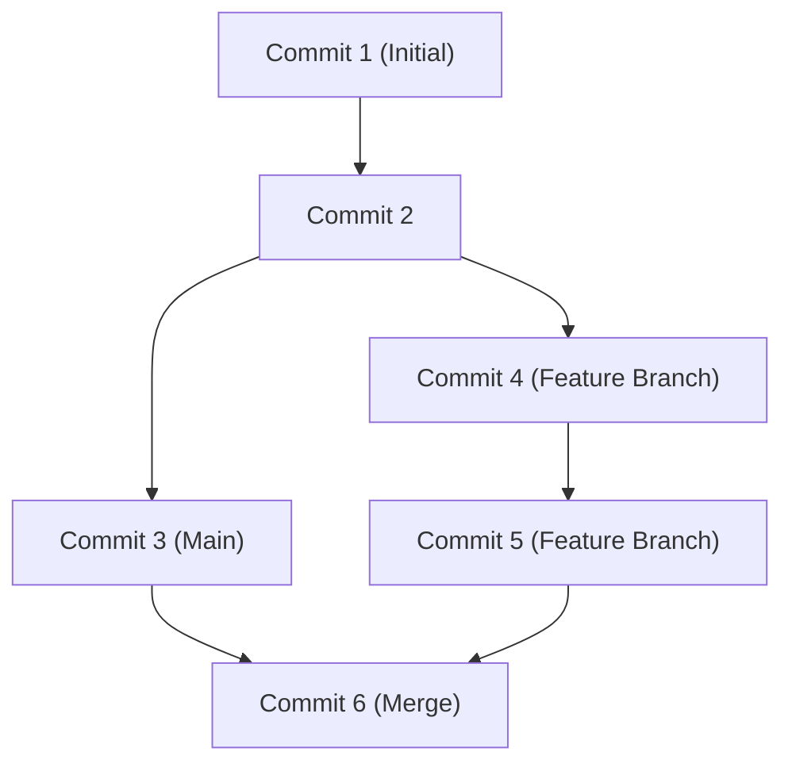

## 1. Einführung: Der Paradigmenwechsel in der Entwicklung durch GitHub

In der modernen Softwareentwicklung ist es unmöglich, über die Existenz von GitHub und Git hinwegzusehen. Einst verließen sich Entwickler auf zentralisierte Versionsverwaltungssysteme wie Subversion (SVN) und CVS. Git jedoch, das von Linus Torvalds, dem Schöpfer des Linux-Kernels, entwickelt wurde, etablierte durch seinen völlig neuen dezentralen Ansatz eine Umgebung, in der Entwickler auf der ganzen Welt gleichzeitig und sicher Codeänderungen vornehmen können.

In diesem Artikel werden wir von Gits grundlegender Designphilosophie über die Revolution der Pull Requests, die GitHub in Open Source brachte, bis hin zur neuesten CI/CD (Continuous Integration/Continuous Deployment) unter Verwendung von GitHub Actions tiefgreifend eintauchen und diese erläutern.

## 2. Gits Designphilosophie von Linus Torvalds: Snapshot-basierter Commit-Graph

Herkömmliche Versionsverwaltungssysteme zeichneten "Differenzen (Deltas)" auf. Das bedeutet, dass sie nur Differenzinformationen darüber sammelten, wie sich eine Datei verändert hat. Der Ansatz von Git ist jedoch grundlegend anders.

Git behandelt Daten als einen "Stream von Snapshots". Jedes Mal, wenn ein Commit durchgeführt wird, nimmt Git ein Bild vom Zustand aller Dateien zu diesem Zeitpunkt auf (Snapshot) und speichert eine Referenz auf diesen Snapshot. Bei unveränderten Dateien speichert es diese nicht erneut, sondern behält lediglich einen Link zur vorherigen identischen Datei.

Durch diesen Snapshot-basierten Ansatz ist das Erstellen und Wechseln von Branches (Zweigen) im Handumdrehen möglich. Innerhalb von Git werden Commits einfach als ein Graph von Objekten (DAG: Directed Acyclic Graph, gerichteter azyklischer Graph) verwaltet.



## 3. Branching-Strategien: Git Flow und GitHub Flow

In der dezentralen Entwicklung entscheidet die Art und Weise, wie ein Team Branches verwaltet, über Erfolg oder Misserfolg eines Projekts. Schauen wir uns zwei typische Strategien an.

### Git Flow
Git Flow ist ein von Vincent Driessen vorgeschlagenes striktes Branching-Modell.
- `main` (oder `master`): Immer veröffentlichbarer Produktionscode.
- `develop`: Entwicklungs-Branch für die nächste Veröffentlichung.
- `feature/*`: Für die Entwicklung neuer Funktionen.
- `release/*`: Zur Vorbereitung von Veröffentlichungen.
- `hotfix/*`: Für dringende Fehlerbehebungen in der Produktionsumgebung.

Dieses Modell eignet sich am besten für große Projekte mit regelmäßigen Veröffentlichungszyklen.

### GitHub Flow
GitHub Flow hingegen ist einfacher und geht von einem kontinuierlichen Deployment (Continuous Deployment) aus.
- Ein jederzeit deploybarer `main` Branch.
- Alle Arbeiten finden in Feature-Branches statt, die vom `main` Branch abgeleitet sind.
- Lokal committen und regelmäßig auf den Server pushen.
- Wenn bereit, einen Pull Request erstellen und Feedback einholen.
- Wenn der Review genehmigt ist, in den `main` Branch mergen und sofort deployen.

Es eignet sich hervorragend für agile Teams, die mehrmals täglich veröffentlichen, wie etwa bei Webanwendungen oder SaaS.

## 4. Fork und Pull Request: Die Revolution der Open-Source-Entwicklung

Der Hauptgrund, warum GitHub zur größten Entwicklerplattform der Welt wurde, liegt darin, dass es die Konzepte "Fork" und "Pull Request" verfeinert hat.

Um zu Open-Source-Projekten beizutragen, musste man früher Patches an Mailinglisten senden. Die Hürde dafür war hoch und der Review-Prozess war umständlich.

Auf GitHub können Sie mit einem einzigen Klick das Repository einer anderen Person auf Ihr eigenes Konto duplizieren (Fork). Dort können Sie den Code nach Belieben ändern und an das ursprüngliche Repository eine Aufforderung ("Pull Request") senden: "Bitte übernehmen Sie meine Änderungen". Dies ermöglichte es jedem, problemlos zu Projekten beizutragen, und löste eine explosive Entwicklung von OSS (Open Source Software) aus.

## 5. Automatisierung von CI/CD mit GitHub Actions

In der modernen Entwicklung ist die Automatisierung des Test- und Deployment-Prozesses genauso wichtig wie das Schreiben des Codes selbst. GitHub Actions ist ein leistungsstarkes Automatisierungstool, das in die GitHub-Plattform integriert ist.

Indem Sie einfach Workflows in YAML-Dateien definieren, können Sie die Ausführung von Tests, Builds und Deployments auf Server automatisieren, ausgelöst durch jegliche Ereignisse im Repository (Push, Erstellung von Pull Requests, Push von Tags usw.).

```yaml
name: CI/CD Pipeline

on:
  push:
    branches:
      - main
  pull_request:
    branches:
      - main

jobs:
  build-and-test:
    runs-on: ubuntu-latest
    steps:
      - name: Checkout Code
        uses: actions/checkout@v3
      - name: Setup Node.js
        uses: actions/setup-node@v3
        with:
          node-version: '18'
      - name: Install Dependencies
        run: npm ci
      - name: Run Tests
        run: npm test
```

Diese Automatisierung beschleunigt den Zyklus von "Continuous Integration (automatische Code-Integration und Tests)" und "Continuous Deployment (automatische Freigabe in die Produktionsumgebung)" erheblich, was die Softwarequalität und die Entwicklungsgeschwindigkeit drastisch verbessert.

## 6. Zusammenfassung: Die Zukunft der Zusammenarbeit

GitHub ist nicht nur ein Speicherort für Code. Es ist ein soziales Netzwerk und eine Infrastruktur für Entwickler auf der ganzen Welt, um Wissen zu teilen und zusammenzuarbeiten, um Software zu entwickeln. Durch die Beherrschung von Gits robuster Versionsverwaltung, GitHubs ausgefeilten Kollaborationsfunktionen und der Automatisierung durch Actions können wir bessere Software schneller an die Welt liefern.
