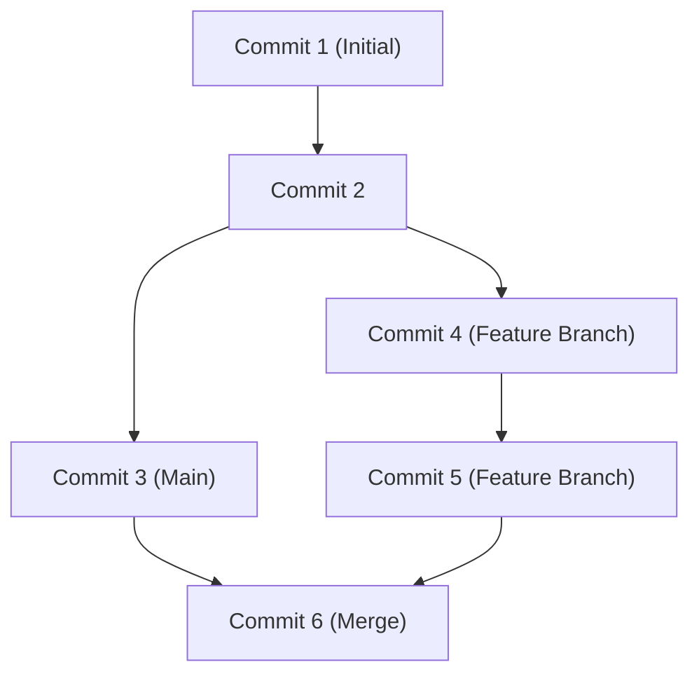

## 1. Introduction: The Paradigm Shift in Development Brought by GitHub

In modern software development, it is impossible to talk without mentioning the existence of GitHub and Git. In the past, developers relied on centralized version control systems like Subversion (SVN) and CVS. However, Git, developed by Linus Torvalds, the creator of the Linux kernel, established an environment where developers worldwide can change code simultaneously and safely through a completely new distributed approach.

This article delves deep, exploring everything from Git's fundamental design philosophy to the Pull Request revolution GitHub brought to open source, and the latest CI/CD (Continuous Integration/Continuous Deployment) utilizing GitHub Actions.

## 2. Linus Torvalds' Git Design Philosophy: Snapshot-Based Commit Graph

Traditional version control systems recorded "deltas" (differences). That is, they only accumulated difference information on how files were changed. However, Git's approach is fundamentally different.

Git treats data as a "stream of snapshots." Every time a commit is made, Git records (snapshots) the state of all files at that moment as if taking a picture, and saves a reference to that snapshot. For unchanged files, instead of re-saving them, it merely retains a link to the previous identical file.

This snapshot-based approach made instantaneous branch creation and switching possible. Internally in Git, commits are simply managed as an object graph (DAG: Directed Acyclic Graph).



## 3. Branching Strategies: Git Flow and GitHub Flow

In distributed development, how a team manages branches separates the success or failure of a project. Let's look at two representative strategies.

### Git Flow
Git Flow is a strict branching model advocated by Vincent Driessen.
- `main` (or `master`): Production code that is always releasable.
- `develop`: Development branch for the next release.
- `feature/*`: For developing new features.
- `release/*`: For release preparation.
- `hotfix/*`: For emergency bug fixes in the production environment.

This model is ideal for large-scale projects with a regular release cycle.

### GitHub Flow
On the other hand, GitHub Flow is simpler and assumes continuous deployment.
- A `main` branch that is always deployable.
- All work is done in feature branches derived from `main`.
- Commit locally and push to the server regularly.
- When ready, create a Pull Request and undergo a review.
- Once the review is approved, merge into `main` and deploy immediately.

It is highly suitable for agile teams that release multiple times a day, such as web applications and SaaS.

## 4. Fork and Pull Request: The Open Source Development Revolution

The biggest reason GitHub became the world's largest developer platform is because it refined the concepts of "Fork" and "Pull Request."

Traditionally, contributing to an open-source project required sending patches to a mailing list. This was a high hurdle, and the review process was cumbersome.

On GitHub, you can duplicate (Fork) someone else's repository to your account with a single button. You can freely change the code there and send a request (Pull Request) to the original repository saying, "Please incorporate my changes." This allowed anyone to easily contribute to projects, triggering an explosive evolution of OSS (Open Source Software).

## 5. CI/CD Automation with GitHub Actions

In modern development, automating the process of testing and deploying code is just as important as writing it. GitHub Actions is a powerful automation tool integrated into the GitHub platform.

Just by defining a workflow in a YAML file, you can automate test execution, building, and deploying to a server, triggered by any event on the repository (Push, Pull Request creation, tag push, etc.).

```yaml
name: CI/CD Pipeline

on:
  push:
    branches:
      - main
  pull_request:
    branches:
      - main

jobs:
  build-and-test:
    runs-on: ubuntu-latest
    steps:
      - name: Checkout Code
        uses: actions/checkout@v3
      - name: Setup Node.js
        uses: actions/setup-node@v3
        with:
          node-version: '18'
      - name: Install Dependencies
        run: npm ci
      - name: Run Tests
        run: npm test
```

This automation spins the cycle of "Continuous Integration (automatically integrating and testing code)" and "Continuous Deployment (automatically releasing to the production environment)" at high speed, dramatically improving software quality and development speed.

## 6. Conclusion: The Future of Collaboration

GitHub is not just a storage warehouse for code. It is a social network and infrastructure for developers worldwide to share knowledge and collaborate to build software. By mastering Git's robust version control, GitHub's refined collaboration features, and automation with Actions, we can deliver better software to the world faster.
