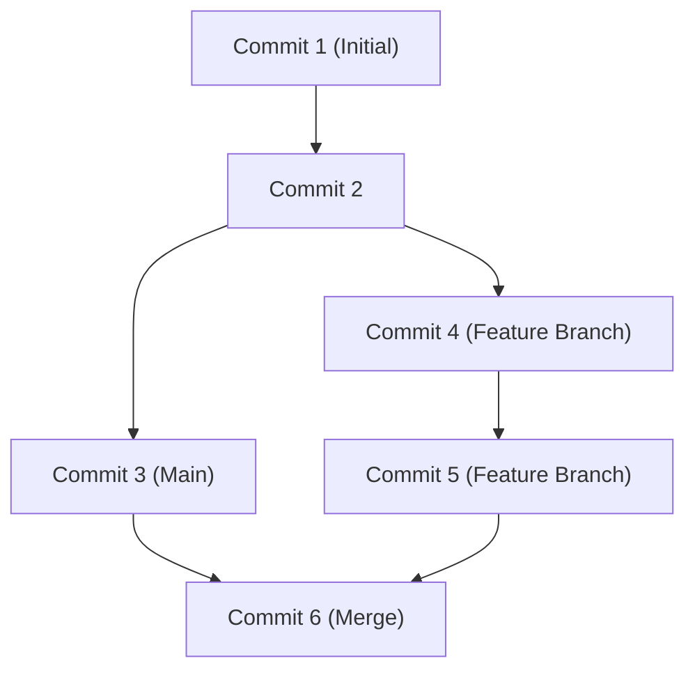

## 1. Introducción: El cambio de paradigma de desarrollo que trajo GitHub

En el desarrollo de software moderno, es imposible hablar sin mencionar la existencia de GitHub y Git. Antaño, los desarrolladores dependían de sistemas de control de versiones centralizados como Subversion (SVN) o CVS. Sin embargo, Git, desarrollado por Linus Torvalds, creador del kernel de Linux, construyó un entorno donde desarrolladores de todo el mundo pueden modificar el código simultáneamente y de forma segura, gracias a un enfoque completamente nuevo: el modelo distribuido.

En este artículo, profundizaremos desde la filosofía de diseño fundamental de Git, pasando por la revolución de los Pull Requests que GitHub trajo al código abierto, hasta el CI/CD (Integración Continua/Despliegue Continuo) más reciente utilizando GitHub Actions.

## 2. La filosofía de diseño de Git de Linus Torvalds: Grafo de commits basado en instantáneas

Los sistemas de control de versiones tradicionales registraban "diferencias (deltas)". Es decir, solo acumulaban información de las diferencias sobre cómo cambiaba un archivo. Sin embargo, el enfoque de Git es fundamentalmente distinto.

Git maneja los datos como un "flujo de instantáneas (snapshots)". Cada vez que se realiza un commit, Git registra el estado de todos los archivos en ese momento como si tomara una foto (instantánea) y guarda una referencia a esa instantánea. Para los archivos que no han cambiado, no los vuelve a guardar, sino que simplemente mantiene un enlace al mismo archivo anterior.

Gracias a este enfoque basado en instantáneas, la creación y el cambio de ramas (branches) se pueden realizar de forma instantánea. Internamente en Git, los commits se gestionan simplemente como un grafo de objetos (DAG: Grafo Acíclico Dirigido).



## 3. Estrategias de ramificación: Git Flow y GitHub Flow

En el desarrollo distribuido, la forma en que el equipo gestiona las ramas determina el éxito o el fracaso del proyecto. Veamos dos estrategias representativas.

### Git Flow
Git Flow es un estricto modelo de ramificación propuesto por Vincent Driessen.
- `main` (o `master`): Código del entorno de producción siempre listo para el lanzamiento.
- `develop`: Rama de desarrollo para el próximo lanzamiento.
- `feature/*`: Para el desarrollo de nuevas funcionalidades.
- `release/*`: Para la preparación del lanzamiento.
- `hotfix/*`: Para correcciones de errores urgentes en el entorno de producción.

Este modelo es ideal para proyectos a gran escala con ciclos de lanzamiento periódicos.

### GitHub Flow
Por otro lado, GitHub Flow es mucho más simple y asume el despliegue continuo.
- La rama `main` siempre se puede desplegar.
- Todo el trabajo se realiza en ramas de características derivadas de `main`.
- Se hacen commits localmente y se hacen push al servidor de forma regular.
- Cuando se está listo, se crea un Pull Request y se recibe una revisión.
- Una vez aprobada la revisión, se fusiona en `main` y se despliega inmediatamente.

Es muy adecuado para equipos ágiles que realizan múltiples lanzamientos al día, como las aplicaciones web y SaaS.

## 4. Fork y Pull Request: La revolución del desarrollo de código abierto

La razón principal por la que GitHub se ha convertido en la mayor plataforma de desarrolladores del mundo es que ha refinado los conceptos de "Fork" y "Pull Request".

Tradicionalmente, para contribuir a un proyecto de código abierto, era necesario enviar parches a una lista de correo. Esto presentaba una barrera de entrada alta y el proceso de revisión era engorroso.

En GitHub, puedes clonar (Fork) el repositorio de otra persona en tu propia cuenta con un solo botón. Allí puedes modificar el código libremente y enviar una solicitud (Pull Request) al repositorio original diciendo "por favor, incorpora mis cambios". Esto permitió que cualquiera pudiera contribuir fácilmente a los proyectos, provocando un desarrollo explosivo del OSS (Software de Código Abierto).

## 5. Automatización de CI/CD con GitHub Actions

En el desarrollo moderno, la automatización del proceso de prueba y despliegue del código es tan importante como escribirlo. GitHub Actions es una poderosa herramienta de automatización integrada en la plataforma de GitHub.

Con solo definir el flujo de trabajo en un archivo YAML, puedes automatizar la ejecución de pruebas, compilaciones y despliegues en servidores desencadenados por cualquier evento en el repositorio (como Push, creación de un Pull Request, empuje de una etiqueta, etc.).

```yaml
name: CI/CD Pipeline

on:
  push:
    branches:
      - main
  pull_request:
    branches:
      - main

jobs:
  build-and-test:
    runs-on: ubuntu-latest
    steps:
      - name: Checkout Code
        uses: actions/checkout@v3
      - name: Setup Node.js
        uses: actions/setup-node@v3
        with:
          node-version: '18'
      - name: Install Dependencies
        run: npm ci
      - name: Run Tests
        run: npm test
```

Con esta automatización, el ciclo de "Integración Continua (integración de código y pruebas automáticas)" y "Despliegue Continuo (lanzamiento automático al entorno de producción)" gira a alta velocidad, mejorando drásticamente la calidad del software y la velocidad de desarrollo.

## 6. Conclusión: El futuro de la colaboración

GitHub no es un simple almacén de código. Es una infraestructura y una red social para que los desarrolladores de todo el mundo compartan conocimientos y colaboren para crear software. Al dominar el robusto control de versiones de Git, las sofisticadas funciones de colaboración de GitHub y la automatización mediante Actions, podemos entregar mejor software al mundo mucho más rápido.
