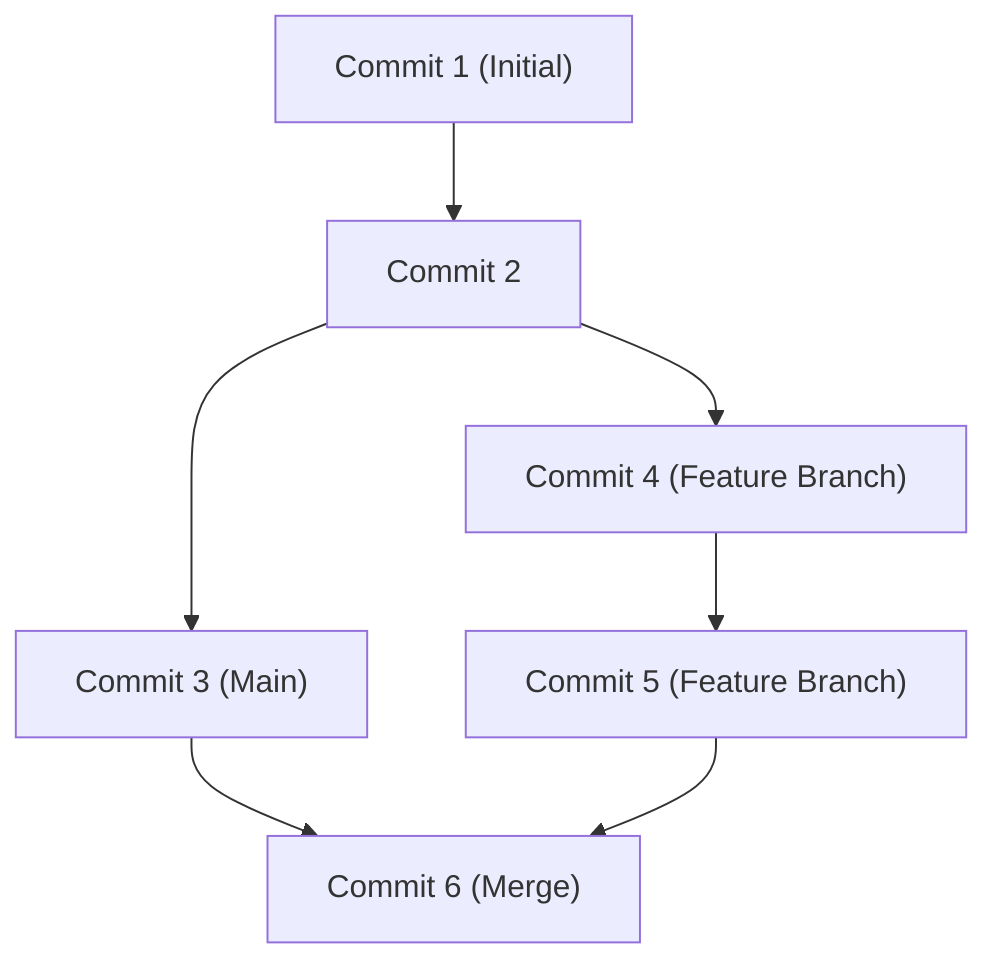

## 1. Introduction : Le changement de paradigme du développement apporté par GitHub

Dans le développement de logiciels modernes, il est impossible de parler sans évoquer GitHub et Git. Autrefois, les développeurs s'appuyaient sur des systèmes de contrôle de version centralisés tels que Subversion (SVN) et CVS. Cependant, Git, développé par Linus Torvalds, le créateur du noyau Linux, a introduit une approche distribuée entièrement nouvelle, créant un environnement où les développeurs du monde entier peuvent modifier le code simultanément et en toute sécurité.

Cet article explore en profondeur, depuis la philosophie de conception fondamentale de Git jusqu'à la révolution des Pull Requests apportée par GitHub à l'open source, en passant par le dernier CI/CD (Intégration Continue / Déploiement Continu) utilisant GitHub Actions.

## 2. Philosophie de conception de Git par Linus Torvalds : Graphe de commits basé sur des instantanés

Les systèmes de contrôle de version traditionnels enregistraient des « différences (deltas) ». En d'autres termes, ils n'accumulaient que les informations différentielles sur la façon dont un fichier avait été modifié. Cependant, l'approche de Git est fondamentalement différente.

Git traite les données comme un « flux d'instantanés (snapshots) ». À chaque commit, Git enregistre l'état de tous les fichiers à ce moment-là, comme s'il prenait une photo (un instantané), et stocke une référence à cet instantané. Pour les fichiers non modifiés, il ne les sauvegarde pas de nouveau, mais conserve simplement un lien vers le fichier identique précédent.

Cette approche basée sur des instantanés permet la création et le changement de branches quasi instantanés. En interne, Git gère les commits simplement comme un graphe d'objets (DAG : Graphe Orienté Acyclique).



## 3. Stratégies de branchement : Git Flow et GitHub Flow

Dans le développement distribué, la façon dont une équipe gère les branches détermine le succès ou l'échec d'un projet. Examinons deux stratégies représentatives.

### Git Flow
Git Flow est un modèle de branchement strict proposé par Vincent Driessen.
- `main` (ou `master`) : Code de production toujours prêt à être publié.
- `develop` : Branche de développement pour la prochaine version.
- `feature/*` : Pour le développement de nouvelles fonctionnalités.
- `release/*` : Pour la préparation d'une version.
- `hotfix/*` : Pour les corrections de bugs urgentes en production.

Ce modèle est idéal pour les projets de grande envergure avec un cycle de publication régulier.

### GitHub Flow
D'autre part, GitHub Flow est plus simple et suppose un déploiement continu.
- Une branche `main` toujours déployable.
- Tout le travail est effectué dans des branches de fonctionnalités (feature branches) dérivées de `main`.
- Commiter localement et pousser régulièrement vers le serveur.
- Lorsque vous êtes prêt, créez une Pull Request et soumettez-la à une révision.
- Une fois la révision approuvée, fusionnez dans `main` et déployez immédiatement.

C'est extrêmement adapté aux équipes agiles qui publient plusieurs fois par jour, comme pour les applications web et le SaaS.

## 4. Fork et Pull Request : La révolution du développement Open Source

La principale raison pour laquelle GitHub est devenu la plus grande plateforme de développeurs au monde est d'avoir raffiné les concepts de « Fork » et « Pull Request ».

Auparavant, pour contribuer à un projet open source, il fallait envoyer des patchs à une liste de diffusion. La barrière à l'entrée était élevée et le processus de révision était lourd.

Sur GitHub, vous pouvez dupliquer (Fork) le dépôt de quelqu'un d'autre sur votre propre compte d'un simple clic. Vous pouvez y modifier librement le code et envoyer une demande (Pull Request) au dépôt d'origine pour dire « Veuillez intégrer mes modifications ». Cela a permis à quiconque de contribuer facilement à des projets, déclenchant le développement explosif des logiciels open source (OSS).

## 5. Automatisation du CI/CD avec GitHub Actions

Dans le développement moderne, l'automatisation des processus de test et de déploiement est tout aussi importante que l'écriture du code lui-même. GitHub Actions est un puissant outil d'automatisation intégré à la plateforme GitHub.

En définissant simplement un flux de travail dans un fichier YAML, vous pouvez automatiser l'exécution de tests, les builds et les déploiements sur des serveurs, en utilisant n'importe quel événement sur le dépôt (Push, création de Pull Request, push de tags, etc.) comme déclencheur.

```yaml
name: CI/CD Pipeline

on:
  push:
    branches:
      - main
  pull_request:
    branches:
      - main

jobs:
  build-and-test:
    runs-on: ubuntu-latest
    steps:
      - name: Checkout Code
        uses: actions/checkout@v3
      - name: Setup Node.js
        uses: actions/setup-node@v3
        with:
          node-version: '18'
      - name: Install Dependencies
        run: npm ci
      - name: Run Tests
        run: npm test
```

Grâce à cette automatisation, les cycles d'« intégration continue » (intégration et tests automatiques du code) et de « déploiement continu » (publication automatique en production) s'enchaînent rapidement, améliorant considérablement la qualité des logiciels et la vitesse de développement.

## 6. Conclusion : L'avenir de la collaboration

GitHub n'est pas qu'un simple dépôt de code. C'est un réseau social et une infrastructure permettant aux développeurs du monde entier de partager des connaissances et de collaborer pour créer des logiciels. En maîtrisant le contrôle de version robuste de Git, les fonctionnalités de collaboration sophistiquées de GitHub et l'automatisation avec Actions, nous pouvons fournir de meilleurs logiciels au monde, plus rapidement.
