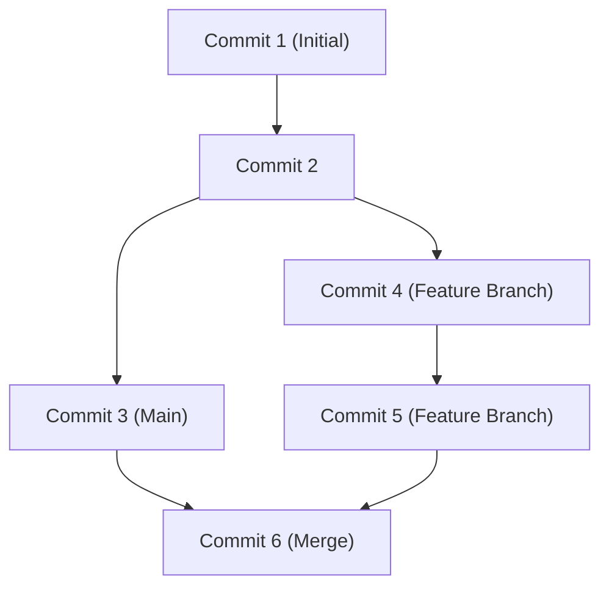

## 1. परिचय: GitHub द्वारा लाया गया विकास का प्रतिमान बदलाव

आधुनिक सॉफ्टवेयर विकास में, GitHub और Git के बिना बात करना असंभव है। एक समय था जब डेवलपर्स Subversion (SVN) और CVS जैसी केंद्रीकृत संस्करण नियंत्रण प्रणालियों पर निर्भर थे। हालाँकि, Linux कर्नेल के निर्माता Linus Torvalds द्वारा विकसित Git ने 'वितरित' नामक एक बिल्कुल नए दृष्टिकोण के माध्यम से एक ऐसा वातावरण बनाया जहाँ दुनिया भर के डेवलपर्स एक साथ और सुरक्षित रूप से कोड में बदलाव कर सकते हैं।

इस लेख में, हम Git के मूलभूत डिज़ाइन दर्शन से लेकर GitHub द्वारा ओपन सोर्स में लाई गई Pull Request क्रांति, और GitHub Actions का लाभ उठाने वाले नवीनतम CI/CD (निरंतर एकीकरण / निरंतर परिनियोजन) तक, गहराई से चर्चा करेंगे।

## 2. Linus Torvalds द्वारा Git का डिज़ाइन दर्शन: स्नैपशॉट-आधारित कमिट ग्राफ़

पारंपरिक संस्करण नियंत्रण प्रणालियाँ 'अंतर' (डेल्टा) रिकॉर्ड करती थीं। यानी, वे केवल इस बारे में जानकारी जमा करती थीं कि कोई फ़ाइल कैसे बदली गई है। लेकिन Git का दृष्टिकोण मौलिक रूप से अलग है।

Git डेटा को "स्नैपशॉट की एक स्ट्रीम" के रूप में मानता है। हर बार जब आप कमिट करते हैं, तो Git उस समय की सभी फ़ाइलों की स्थिति को एक तस्वीर की तरह रिकॉर्ड (स्नैपशॉट) करता है, और उस स्नैपशॉट का एक संदर्भ सहेजता है। जिन फ़ाइलों में बदलाव नहीं किया गया है, उन्हें फिर से सहेजने के बजाय, यह केवल पिछली समान फ़ाइल का लिंक रखता है।

इस स्नैपशॉट-आधारित दृष्टिकोण ने ब्रांच बनाना और उनके बीच स्विच करना तुरंत संभव बना दिया। Git के अंदर, कमिट को केवल ऑब्जेक्ट्स के ग्राफ़ (DAG: Directed Acyclic Graph) के रूप में प्रबंधित किया जाता है।



## 3. ब्रांच रणनीति: Git Flow और GitHub Flow

वितरित विकास में, कोई टीम अपनी ब्रांचों का प्रबंधन कैसे करती है, यह प्रोजेक्ट की सफलता या विफलता तय कर सकता है। आइए दो विशिष्ट रणनीतियों पर एक नज़र डालें।

### Git Flow
Git Flow, Vincent Driessen द्वारा प्रस्तावित एक सख्त ब्रांच मॉडल है।
- `main` (या `master`): हमेशा रिलीज के लिए तैयार प्रोडक्शन वातावरण का कोड।
- `develop`: अगली रिलीज के लिए डेवलपमेंट ब्रांच।
- `feature/*`: नई सुविधाओं के विकास के लिए।
- `release/*`: रिलीज की तैयारी के लिए।
- `hotfix/*`: प्रोडक्शन वातावरण में तत्काल बग फिक्स के लिए।

यह मॉडल नियमित रिलीज चक्र वाले बड़े पैमाने के प्रोजेक्ट्स के लिए आदर्श है।

### GitHub Flow
दूसरी ओर, GitHub Flow बहुत सरल है और निरंतर परिनियोजन को मानता है।
- एक हमेशा-परिनियोजित-करने-योग्य `main` ब्रांच।
- सारा काम `main` से निकली फीचर ब्रांचों में किया जाता है।
- स्थानीय रूप से कमिट करें और नियमित रूप से सर्वर पर पुश करें।
- तैयार होने पर, एक Pull Request बनाएँ और समीक्षा प्राप्त करें।
- समीक्षा स्वीकृत होने के बाद, `main` में मर्ज करें और तुरंत परिनियोजित करें।

वेब अनुप्रयोगों और SaaS जैसी फुर्तीली टीमों के लिए बहुत उपयुक्त है जो दिन में कई बार रिलीज़ करती हैं।

## 4. Fork और Pull Request: ओपन सोर्स विकास में क्रांति

GitHub के दुनिया का सबसे बड़ा डेवलपर प्लेटफॉर्म बनने का सबसे बड़ा कारण यह है कि इसने "Fork" और "Pull Request" की अवधारणाओं को परिष्कृत किया।

परंपरागत रूप से, किसी ओपन सोर्स प्रोजेक्ट में योगदान देने के लिए, आपको मेलिंग सूची में एक पैच भेजना पड़ता था। इसकी बाधाएँ बहुत अधिक थीं और समीक्षा प्रक्रिया बोझिल थी।

GitHub में, आप एक बटन के क्लिक के साथ किसी अन्य व्यक्ति के रिपॉजिटरी की अपने खाते में प्रतिलिपि (Fork) बना सकते हैं। वहाँ, आप स्वतंत्र रूप से कोड बदल सकते हैं और मूल रिपॉजिटरी में यह अनुरोध करते हुए एक (Pull Request) भेज सकते हैं कि "कृपया मेरे बदलावों को शामिल करें"। इससे किसी के लिए भी प्रोजेक्ट्स में योगदान देना आसान हो गया, जिससे OSS (ओपन सोर्स सॉफ्टवेयर) का विस्फोटक विकास हुआ।

## 5. GitHub Actions के साथ CI/CD का स्वचालन

आधुनिक विकास में, कोड का परीक्षण और परिनियोजित करने की प्रक्रिया को स्वचालित करना उतना ही महत्वपूर्ण है जितना कि कोड लिखना। GitHub Actions, GitHub के प्लेटफॉर्म में एकीकृत एक शक्तिशाली स्वचालन उपकरण है।

केवल एक YAML फ़ाइल में वर्कफ़्लो को परिभाषित करके, आप रिपॉजिटरी में होने वाले किसी भी इवेंट (जैसे Push, Pull Request का निर्माण, टैग का पुश होना आदि) को ट्रिगर के रूप में इस्तेमाल कर सकते हैं और परीक्षण निष्पादन, बिल्ड और सर्वर पर परिनियोजन को स्वचालित कर सकते हैं।

```yaml
name: CI/CD Pipeline

on:
  push:
    branches:
      - main
  pull_request:
    branches:
      - main

jobs:
  build-and-test:
    runs-on: ubuntu-latest
    steps:
      - name: Checkout Code
        uses: actions/checkout@v3
      - name: Setup Node.js
        uses: actions/setup-node@v3
        with:
          node-version: '18'
      - name: Install Dependencies
        run: npm ci
      - name: Run Tests
        run: npm test
```

यह स्वचालन "निरंतर एकीकरण" (कोड एकीकरण और परीक्षण को स्वचालित करना) और "निरंतर परिनियोजन" (उत्पादन वातावरण में रिलीज को स्वचालित करना) के चक्र को बहुत तेज कर देता है, जिससे सॉफ्टवेयर की गुणवत्ता और विकास की गति में नाटकीय रूप से सुधार होता है।

## 6. निष्कर्ष: सहयोग का भविष्य

GitHub केवल कोड के लिए एक भंडारण स्थान नहीं है। यह दुनिया भर के डेवलपर्स के लिए ज्ञान साझा करने और सॉफ्टवेयर बनाने में सहयोग करने के लिए एक सोशल नेटवर्क और इन्फ्रास्ट्रक्चर है। Git के मजबूत संस्करण नियंत्रण, GitHub की परिष्कृत सहयोग सुविधाओं और Actions के माध्यम से स्वचालन में महारत हासिल करके, हम दुनिया भर में बेहतर सॉफ्टवेयर और भी तेज़ी से पहुंचा सकते हैं।
