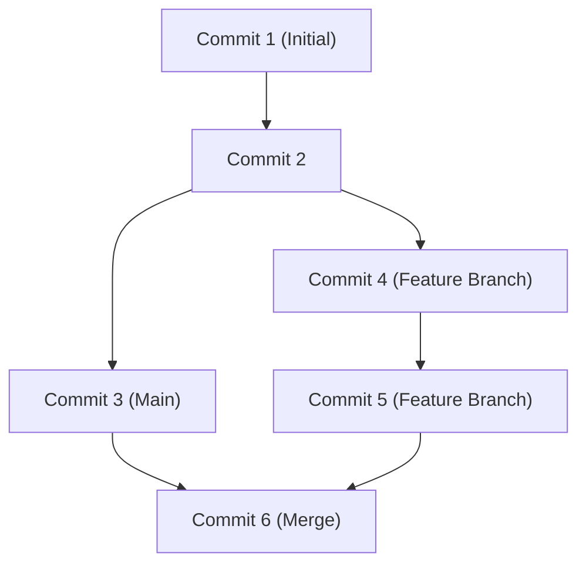

## 1. Pendahuluan: Pergeseran Paradigma Pengembangan yang Dibawa oleh GitHub

Dalam pengembangan perangkat lunak modern, mustahil berbicara tanpa menyebut keberadaan GitHub dan Git. Di masa lalu, para pengembang mengandalkan sistem kontrol versi terpusat seperti Subversion (SVN) dan CVS. Namun, Git, yang dikembangkan oleh Linus Torvalds, pencipta kernel Linux, telah membangun sebuah lingkungan di mana para pengembang dari seluruh dunia dapat mengubah kode secara bersamaan dan aman melalui pendekatan desentralisasi yang sama sekali baru.

Dalam artikel ini, kita akan membahas secara mendalam, mulai dari filosofi desain fundamental Git, revolusi Pull Request yang dibawa GitHub ke sumber terbuka (open source), hingga CI/CD terbaru (Integrasi Berkelanjutan/Penyebaran Berkelanjutan) menggunakan GitHub Actions.

## 2. Filosofi Desain Git oleh Linus Torvalds: Grafik Komit Berbasis Snapshot

Sistem kontrol versi tradisional mencatat "perbedaan (delta)". Artinya, mereka hanya mengakumulasi informasi perbedaan tentang bagaimana sebuah file diubah. Namun, pendekatan Git pada dasarnya berbeda.

Git memperlakukan data sebagai "aliran snapshot". Setiap kali Anda melakukan komit, Git merekam status semua file pada saat itu seperti mengambil foto (snapshot), dan menyimpan referensi ke snapshot tersebut. Untuk file yang belum berubah, ia tidak menyimpannya lagi, melainkan hanya menyimpan tautan ke file identik sebelumnya.

Pendekatan berbasis snapshot ini memungkinkan pembuatan dan perpindahan cabang (branch) terjadi secara instan. Secara internal di dalam Git, komit dikelola hanya sebagai grafik objek (DAG: Directed Acyclic Graph).



## 3. Strategi Percabangan: Git Flow dan GitHub Flow

Dalam pengembangan terdistribusi, bagaimana sebuah tim mengelola cabang akan menentukan keberhasilan atau kegagalan sebuah proyek. Mari kita lihat dua strategi yang representatif.

### Git Flow
Git Flow adalah model percabangan ketat yang diusulkan oleh Vincent Driessen.
- `main` (atau `master`): Kode lingkungan produksi yang selalu siap rilis.
- `develop`: Cabang pengembangan untuk rilis berikutnya.
- `feature/*`: Untuk pengembangan fitur baru.
- `release/*`: Untuk persiapan rilis.
- `hotfix/*`: Untuk perbaikan bug darurat di lingkungan produksi.

Model ini ideal untuk proyek skala besar yang memiliki siklus rilis reguler.

### GitHub Flow
Sebaliknya, GitHub Flow lebih sederhana dan didasarkan pada penerapan berkelanjutan (continuous deployment).
- Cabang `main` yang selalu dapat diterapkan (deployable).
- Semua pekerjaan dilakukan di cabang fitur yang diturunkan dari `main`.
- Komit secara lokal, dan dorong (push) ke server secara teratur.
- Setelah siap, buat Pull Request dan terima tinjauan (review).
- Jika ulasan disetujui, gabungkan (merge) ke `main` dan terapkan (deploy) segera.

Ini sangat cocok untuk tim tangkas (agile) yang merilis beberapa kali sehari, seperti aplikasi web dan SaaS.

## 4. Fork dan Pull Request: Revolusi dalam Pengembangan Open Source

Alasan terbesar GitHub menjadi platform pengembang terbesar di dunia adalah karena ia menyempurnakan konsep "Fork" dan "Pull Request".

Di masa lalu, berkontribusi pada proyek open source mengharuskan pengiriman tambalan (patch) ke milis. Ini memiliki hambatan masuk yang tinggi dan proses peninjauan yang rumit.

Di GitHub, Anda dapat menyalin (Fork) repositori orang lain ke akun Anda sendiri dengan satu klik tombol. Di sana, Anda dapat dengan bebas mengubah kode dan mengirim permintaan (Pull Request) ke repositori asli yang berbunyi, "Tolong sertakan perubahan saya." Hal ini memudahkan siapa saja untuk berkontribusi pada proyek dan memicu ledakan perkembangan OSS (Perangkat Lunak Sumber Terbuka).

## 5. Otomatisasi CI/CD dengan GitHub Actions

Dalam pengembangan modern, mengotomatiskan proses pengujian dan penerapan sama pentingnya dengan menulis kode itu sendiri. GitHub Actions adalah alat otomatisasi tangguh yang terintegrasi ke dalam platform GitHub.

Hanya dengan mendefinisikan alur kerja dalam file YAML, Anda dapat mengotomatiskan pelaksanaan pengujian, pembangunan (build), dan penerapan (deploy) ke server yang dipicu oleh peristiwa apa pun di repositori (Push, pembuatan Pull Request, dorongan tag, dll.).

```yaml
name: CI/CD Pipeline

on:
  push:
    branches:
      - main
  pull_request:
    branches:
      - main

jobs:
  build-and-test:
    runs-on: ubuntu-latest
    steps:
      - name: Checkout Code
        uses: actions/checkout@v3
      - name: Setup Node.js
        uses: actions/setup-node@v3
        with:
          node-version: '18'
      - name: Install Dependencies
        run: npm ci
      - name: Run Tests
        run: npm test
```

Otomatisasi ini secara dramatis meningkatkan kualitas perangkat lunak dan kecepatan pengembangan dengan mempercepat siklus "Integrasi Berkelanjutan" (mengotomatiskan integrasi kode dan pengujian) serta "Penyebaran Berkelanjutan" (mengotomatiskan rilis ke lingkungan produksi).

## 6. Kesimpulan: Masa Depan Kolaborasi

GitHub bukan sekadar tempat penyimpanan kode. Ini adalah jejaring sosial dan infrastruktur bagi para pengembang di seluruh dunia untuk berbagi pengetahuan dan berkolaborasi dalam membangun perangkat lunak. Dengan menguasai kontrol versi Git yang tangguh, fitur kolaborasi GitHub yang canggih, dan otomatisasi menggunakan Actions, kita dapat memberikan perangkat lunak yang lebih baik kepada dunia dengan lebih cepat.
