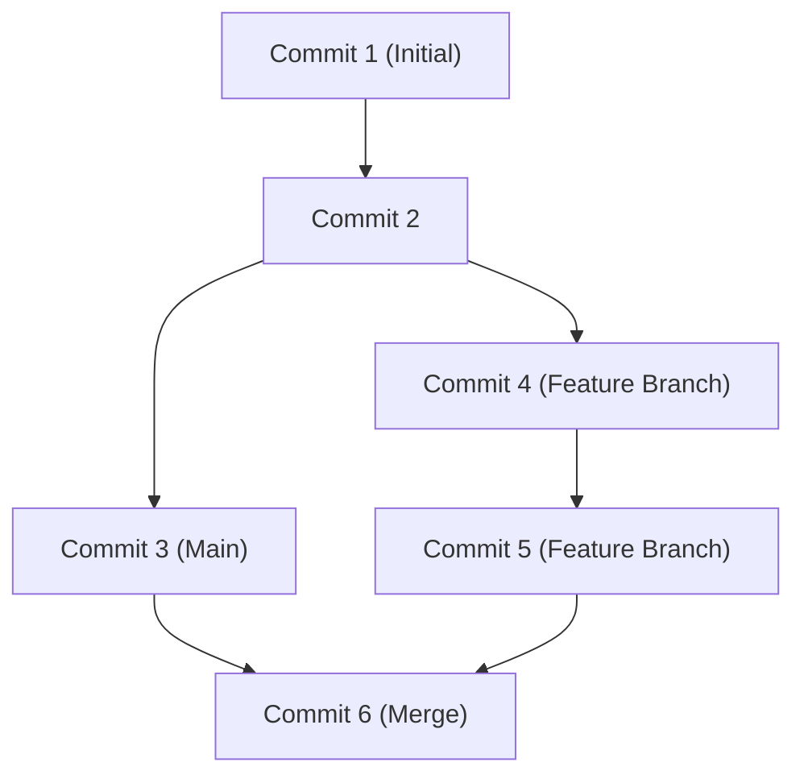

## 1. 서론: GitHub가 가져온 개발의 패러다임 시프트

현대 소프트웨어 개발에서 GitHub와 Git의 존재를 빼놓고 이야기하는 것은 불가능합니다. 예전에는 개발자들이 Subversion(SVN)이나 CVS 같은 중앙집중형 버전 관리 시스템에 의존했습니다. 하지만 리눅스 커널의 창시자인 Linus Torvalds가 개발한 Git은 분산형이라는 완전히 새로운 접근 방식을 통해 전 세계의 개발자가 동시에, 그리고 안전하게 코드를 변경할 수 있는 환경을 구축했습니다.

이 글에서는 Git의 근본적인 설계 사상부터 GitHub가 오픈 소스에 가져온 Pull Request의 혁명, 그리고 GitHub Actions를 활용한 최신 CI/CD(지속적 통합/지속적 배포)에 이르기까지 깊이 있게 파헤쳐 봅니다.

## 2. Linus Torvalds의 Git 설계 사상: 스냅샷 기반 커밋 그래프

기존 버전 관리 시스템은 '변경 사항(델타)'을 기록했습니다. 즉, 파일이 어떻게 변경되었는지에 대한 차이 정보만을 축적했습니다. 하지만 Git의 접근 방식은 근본적으로 다릅니다.

Git은 데이터를 '스냅샷의 스트림'으로 취급합니다. 커밋을 할 때마다 Git은 그 시점의 모든 파일 상태를 사진을 찍듯이 기록(스냅샷)하고, 그 스냅샷에 대한 참조를 저장합니다. 변경되지 않은 파일에 대해서는 다시 저장하는 대신, 이전의 동일한 파일에 대한 링크를 유지할 뿐입니다.

이 스냅샷 기반 접근 방식을 통해 브랜치의 생성과 전환을 순식간에 할 수 있게 되었습니다. Git 내부에서 커밋은 단순한 객체의 그래프(DAG: 방향 비순환 그래프)로 관리됩니다.



## 3. 브랜치 전략: Git Flow와 GitHub Flow

분산형 개발에서 팀이 브랜치를 어떻게 관리하는지는 프로젝트의 성패를 가릅니다. 대표적인 두 가지 전략을 살펴보겠습니다.

### Git Flow
Git Flow는 Vincent Driessen이 제안한 엄격한 브랜치 모델입니다.
- `main` (또는 `master`): 항상 릴리스 가능한 프로덕션 환경의 코드.
- `develop`: 다음 릴리스를 위한 개발 브랜치.
- `feature/*`: 새 기능 개발용.
- `release/*`: 릴리스 준비용.
- `hotfix/*`: 프로덕션 환경의 긴급 버그 수정용.

이 모델은 정기적인 릴리스 주기를 갖는 대규모 프로젝트에 최적입니다.

### GitHub Flow
반면 GitHub Flow는 더 단순하며, 지속적 배포를 전제로 합니다.
- 항상 배포 가능한 `main` 브랜치.
- 모든 작업은 `main`에서 파생된 기능 브랜치에서 수행.
- 로컬에서 커밋하고 정기적으로 서버에 푸시.
- 준비가 되면 Pull Request를 생성하고 리뷰를 받음.
- 리뷰가 승인되면 `main`에 병합하고 즉시 배포.

웹 애플리케이션이나 SaaS처럼 하루에도 여러 번 릴리스를 수행하는 애자일 팀에 매우 적합합니다.

## 4. Fork와 Pull Request: 오픈 소스 개발의 혁명

GitHub가 세계 최대의 개발자 플랫폼이 된 가장 큰 이유는 'Fork'와 'Pull Request'라는 개념을 세련되게 만들었기 때문입니다.

과거 오픈 소스 프로젝트에 기여하려면 메일링 리스트에 패치를 보내야 했습니다. 이는 진입 장벽이 높았고 리뷰 과정도 번거로웠습니다.

GitHub에서는 버튼 하나로 다른 사람의 리포지토리를 내 계정으로 복제(Fork)할 수 있습니다. 거기서 자유롭게 코드를 변경하고 원본 리포지토리에 "제 변경 사항을 반영해 주세요"라고 요청(Pull Request)을 보낼 수 있습니다. 이로 인해 누구나 쉽게 프로젝트에 기여할 수 있게 되었고, OSS(오픈 소스 소프트웨어)의 폭발적인 발전을 이끌어냈습니다.

## 5. GitHub Actions를 통한 CI/CD 자동화

현대 개발에서는 코드를 작성하는 것만큼이나 그것을 테스트하고 배포하는 과정의 자동화가 중요합니다. GitHub Actions는 GitHub 플랫폼에 통합된 강력한 자동화 도구입니다.

YAML 파일로 워크플로를 정의하기만 하면, 리포지토리에 대한 모든 이벤트(Push, Pull Request 생성, 태그 푸시 등)를 트리거로 삼아 테스트 실행, 빌드, 서버 배포를 자동화할 수 있습니다.

```yaml
name: CI/CD Pipeline

on:
  push:
    branches:
      - main
  pull_request:
    branches:
      - main

jobs:
  build-and-test:
    runs-on: ubuntu-latest
    steps:
      - name: Checkout Code
        uses: actions/checkout@v3
      - name: Setup Node.js
        uses: actions/setup-node@v3
        with:
          node-version: '18'
      - name: Install Dependencies
        run: npm ci
      - name: Run Tests
        run: npm test
```

이 자동화를 통해 "지속적 통합(코드의 통합과 테스트를 자동으로 수행)"과 "지속적 배포(프로덕션 환경으로의 릴리스를 자동으로 수행)"의 사이클이 빠르게 돌아가게 되며, 소프트웨어의 품질과 개발 속도가 극적으로 향상됩니다.

## 6. 결론: 협업의 미래

GitHub는 단순한 코드 저장소가 아닙니다. 전 세계의 개발자가 지식을 공유하고 협력하여 소프트웨어를 만들어가기 위한 소셜 네트워크이자 인프라입니다. Git의 견고한 버전 관리와 GitHub의 세련된 협업 기능, 그리고 Actions를 통한 자동화를 마스터함으로써 우리는 더 훌륭한 소프트웨어를 더 빠르게 세상에 선보일 수 있습니다.
