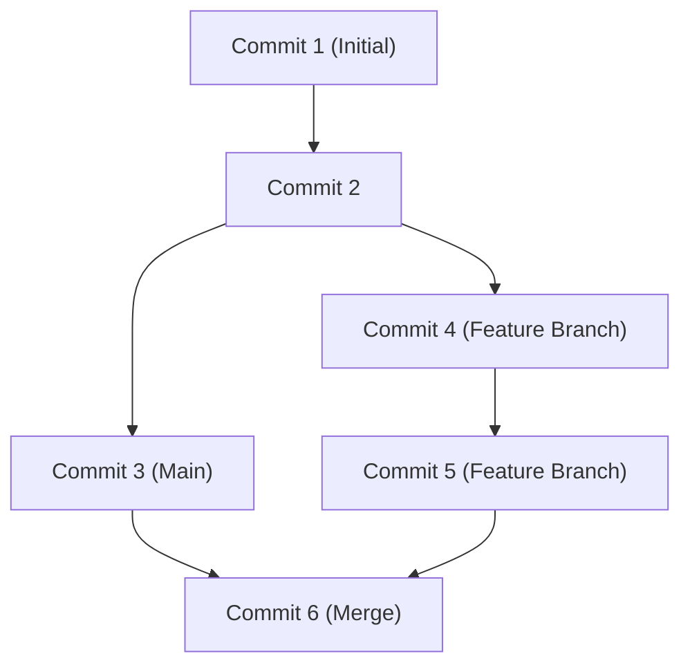

## 1. はじめに：GitHubがもたらした開発のパラダイムシフト

現代のソフトウェア開発において、GitHubとGitの存在を抜きにして語ることは不可能です。かつて、開発者たちはSubversion(SVN)やCVSといった集中型バージョン管理システムに頼っていました。しかし、Linuxカーネルの生みの親であるLinus Torvaldsによって開発されたGitは、分散型という全く新しいアプローチにより、世界中の開発者が同時に、そして安全にコードを変更できる環境を構築しました。

この記事では、Gitの根本的な設計思想から、GitHubがオープンソースにもたらしたPull Requestの革命、そしてGitHub Actionsを活用した最新のCI/CD（継続的インテグレーション/継続的デプロイ）に至るまで、深く掘り下げて解説します。

## 2. Linus TorvaldsによるGitの設計思想：スナップショットベースのコミットグラフ

従来のバージョン管理システムは「差分（デルタ）」を記録していました。つまり、ファイルがどのように変更されたかという差分情報だけを蓄積していたのです。しかし、Gitのアプローチは根本的に異なります。

Gitはデータを「スナップショットのストリーム」として扱います。コミットを行うたびに、Gitはその時点におけるすべてのファイルの状態を写真に撮るように記録（スナップショット）し、そのスナップショットへの参照を保存します。変更されていないファイルについては、再保存するのではなく、以前の同一ファイルへのリンクを保持するだけです。

このスナップショットベースのアプローチにより、ブランチの作成や切り替えが瞬時に行えるようになりました。Gitの内部では、コミットは単なるオブジェクトのグラフ（DAG: 有向非巡回グラフ）として管理されています。



## 3. ブランチ戦略：Git Flow と GitHub Flow

分散型開発において、チームがどのようにブランチを管理するかはプロジェクトの成否を分けます。代表的な2つの戦略を見てみましょう。

### Git Flow
Git Flowは、Vincent Driessenによって提唱された厳格なブランチモデルです。
- `main` (または `master`): 常にリリース可能な本番環境のコード。
- `develop`: 次期リリースのための開発ブランチ。
- `feature/*`: 新機能開発用。
- `release/*`: リリース準備用。
- `hotfix/*`: 本番環境の緊急バグ修正用。

このモデルは、定期的なリリースサイクルを持つ大規模なプロジェクトに最適です。

### GitHub Flow
一方、GitHub Flowはよりシンプルで、継続的デプロイメントを前提としています。
- 常にデプロイ可能な `main` ブランチ。
- 作業はすべて `main` から派生した機能ブランチで行う。
- ローカルでコミットし、定期的にサーバーにプッシュする。
- 準備ができたらPull Requestを作成し、レビューを受ける。
- レビューが承認されたら `main` にマージし、直ちにデプロイする。

WebアプリケーションやSaaSのように、日に何度もリリースを行うアジャイルなチームに非常に適しています。

## 4. ForkとPull Request：オープンソース開発の革命

GitHubが世界最大の開発者プラットフォームとなった最大の理由は、「Fork」と「Pull Request」という概念を洗練させたことにあります。

従来、オープンソースプロジェクトに貢献するには、メーリングリストにパッチを送る必要がありました。これは敷居が高く、レビュープロセスも煩雑でした。

GitHubでは、他人のリポジトリをボタン一つで自分のアカウントに複製（Fork）できます。そこで自由にコードを変更し、元のリポジトリに対して「私の変更を取り込んでください」と要求（Pull Request）を送ることができます。これにより、誰もが気軽にプロジェクトに貢献できるようになり、OSS（オープンソースソフトウェア）の爆発的な発展を引き起こしました。

## 5. GitHub ActionsによるCI/CDの自動化

現代の開発では、コードを書くことと同じくらい、それをテストし、デプロイするプロセスの自動化が重要です。GitHub Actionsは、GitHubのプラットフォームに統合された強力な自動化ツールです。

YAMLファイルでワークフローを定義するだけで、リポジトリに対するあらゆるイベント（Push、Pull Requestの作成、タグのプッシュなど）をトリガーにして、テストの実行、ビルド、サーバーへのデプロイを自動化できます。

```yaml
name: CI/CD Pipeline

on:
  push:
    branches:
      - main
  pull_request:
    branches:
      - main

jobs:
  build-and-test:
    runs-on: ubuntu-latest
    steps:
      - name: Checkout Code
        uses: actions/checkout@v3
      - name: Setup Node.js
        uses: actions/setup-node@v3
        with:
          node-version: '18'
      - name: Install Dependencies
        run: npm ci
      - name: Run Tests
        run: npm test
```

この自動化により、「継続的インテグレーション（コードの統合とテストを自動で行う）」と「継続的デプロイ（本番環境へのリリースを自動で行う）」のサイクルが高速に回り、ソフトウェアの品質と開発スピードが劇的に向上します。

## 6. まとめ：コラボレーションの未来

GitHubは単なるコードの保管庫ではありません。世界中の開発者が知識を共有し、協力してソフトウェアを作り上げるためのソーシャルネットワークであり、インフラストラクチャです。Gitの堅牢なバージョン管理と、GitHubの洗練されたコラボレーション機能、そしてActionsによる自動化をマスターすることで、私たちはより優れたソフトウェアを、より速く世界に届けることができるのです。
