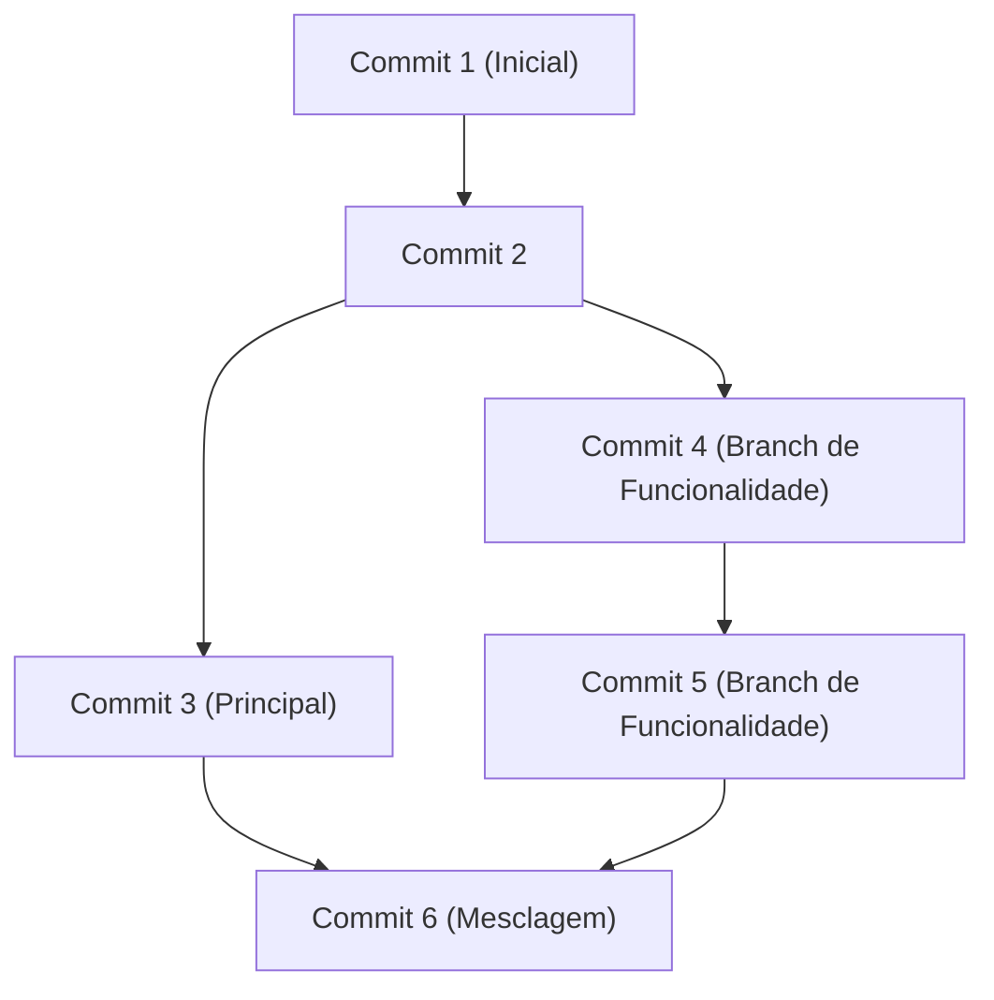

## 1. Introdução: A mudança de paradigma no desenvolvimento trazida pelo GitHub

No desenvolvimento de software moderno, é impossível falar sem mencionar a existência do GitHub e do Git. Antigamente, os desenvolvedores dependiam de sistemas de controle de versão centralizados, como Subversion (SVN) e CVS. No entanto, o Git, desenvolvido por Linus Torvalds, o criador do kernel do Linux, estabeleceu um ambiente onde desenvolvedores do mundo todo podem modificar o código simultaneamente e com segurança, usando uma abordagem distribuída totalmente nova.

Neste artigo, aprofundaremos desde a filosofia de design fundamental do Git, passando pela revolução dos Pull Requests que o GitHub trouxe para o código aberto, até a adoção moderna de CI/CD (Integração Contínua / Implantação Contínua) utilizando o GitHub Actions.

## 2. A filosofia de design do Git por Linus Torvalds: Um gráfico de commits baseado em instantâneos (snapshots)

Os sistemas de controle de versão tradicionais registravam "diferenças (deltas)". Ou seja, eles acumulavam apenas as informações das diferenças sobre como os arquivos haviam sido alterados. No entanto, a abordagem do Git é fundamentalmente diferente.

O Git trata os dados como um "fluxo de instantâneos (snapshots)". Cada vez que um commit é feito, o Git registra o estado de todos os arquivos naquele momento, como se tirasse uma foto (snapshot), e salva uma referência para esse snapshot. Para arquivos que não foram alterados, o Git não os salva novamente; ele apenas mantém um link para o mesmo arquivo anterior.

Graças a essa abordagem baseada em snapshots, a criação e a troca de branches podem ser feitas instantaneamente. Internamente, no Git, os commits são gerenciados simplesmente como um gráfico de objetos (DAG: Grafo Acíclico Direcionado).



## 3. Estratégia de Branch: Git Flow e GitHub Flow

No desenvolvimento distribuído, a forma como a equipe gerencia as branches pode definir o sucesso ou o fracasso de um projeto. Vamos dar uma olhada em duas estratégias representativas.

### Git Flow
O Git Flow é um modelo de branch estrito proposto por Vincent Driessen.
- `main` (ou `master`): O código do ambiente de produção, sempre pronto para ser lançado.
- `develop`: Branch de desenvolvimento para o próximo lançamento.
- `feature/*`: Para o desenvolvimento de novas funcionalidades.
- `release/*`: Para a preparação de lançamentos.
- `hotfix/*`: Para correções de bugs urgentes no ambiente de produção.

Este modelo é ideal para projetos de grande escala que possuem ciclos de lançamento regulares.

### GitHub Flow
Por outro lado, o GitHub Flow é mais simples e pressupõe a implantação contínua (continuous deployment).
- A branch `main` sempre pronta para ser implantada.
- Todo o trabalho é feito em branches de funcionalidade derivadas da `main`.
- Fazer commits localmente e realizar envios (pushes) para o servidor regularmente.
- Quando estiver pronto, criar um Pull Request e solicitar uma revisão.
- Se a revisão for aprovada, mesclar (merge) na `main` e implantar imediatamente.

É altamente adequado para equipes ágeis que realizam lançamentos várias vezes ao dia, como aplicações Web e SaaS.

## 4. Fork e Pull Request: A revolução no desenvolvimento de código aberto

A principal razão pela qual o GitHub se tornou a maior plataforma de desenvolvedores do mundo é que ele refinou os conceitos de "Fork" e "Pull Request".

Anteriormente, para contribuir com um projeto de código aberto, era necessário enviar patches para uma lista de discussão. Isso era difícil para iniciantes e o processo de revisão era complicado.

No GitHub, você pode duplicar (Fork) o repositório de outra pessoa para sua própria conta com o clique de um botão. Lá, você pode alterar o código livremente e enviar uma solicitação (Pull Request) ao repositório original dizendo "por favor, incorpore minhas alterações". Isso permitiu que qualquer pessoa contribuísse facilmente para projetos, provocando um desenvolvimento explosivo de OSS (Software de Código Aberto).

## 5. Automação de CI/CD com GitHub Actions

No desenvolvimento moderno, automatizar o processo de testar e implantar código é tão importante quanto escrevê-lo. O GitHub Actions é uma ferramenta de automação poderosa integrada à plataforma do GitHub.

Simplesmente definindo fluxos de trabalho (workflows) em um arquivo YAML, você pode acionar qualquer evento em um repositório (Push, criação de Pull Request, push de tags, etc.) para automatizar a execução de testes, compilações (builds) e implantações (deployments) em servidores.

```yaml
name: CI/CD Pipeline

on:
  push:
    branches:
      - main
  pull_request:
    branches:
      - main

jobs:
  build-and-test:
    runs-on: ubuntu-latest
    steps:
      - name: Checkout Code
        uses: actions/checkout@v3
      - name: Setup Node.js
        uses: actions/setup-node@v3
        with:
          node-version: '18'
      - name: Install Dependencies
        run: npm ci
      - name: Run Tests
        run: npm test
```

Com essa automação, o ciclo de "Integração Contínua" (integrar e testar código automaticamente) e "Implantação Contínua" (lançar automaticamente no ambiente de produção) gira muito rápido, melhorando drasticamente a qualidade do software e a velocidade de desenvolvimento.

## 6. Conclusão: O futuro da colaboração

O GitHub não é apenas um depósito de código. É uma rede social e uma infraestrutura para que desenvolvedores de todo o mundo compartilhem conhecimento e colaborem para criar software. Ao dominar o controle de versão robusto do Git, os recursos sofisticados de colaboração do GitHub e a automação por meio do Actions, podemos entregar software melhor e mais rápido para o mundo.
