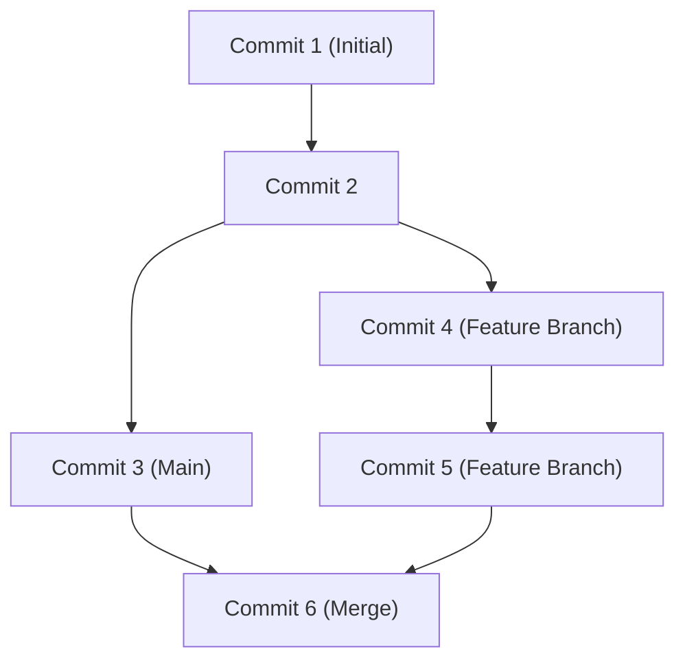

## 1. Введение: Сдвиг парадигмы в разработке благодаря GitHub

В современной разработке программного обеспечения невозможно говорить без упоминания GitHub и Git. Раньше разработчики полагались на централизованные системы контроля версий, такие как Subversion (SVN) и CVS. Однако Git, разработанный Линусом Торвальдсом, благодаря совершенно новому распределенному подходу создал среду, в которой разработчики со всего мира могут одновременно и безопасно изменять код.

В этой статье мы подробно рассмотрим все: от фундаментальной философии дизайна Git до революции Pull Request, которую GitHub принес в открытый исходный код, и до новейшего CI/CD (непрерывной интеграции / непрерывного развертывания) с использованием GitHub Actions.

## 2. Философия дизайна Git от Линуса Торвальдса: граф коммитов на основе снапшотов

Традиционные системы контроля версий записывали "различия (дельты)". То есть они накапливали только информацию о разнице в том, как был изменен файл. Однако подход Git принципиально отличается.

Git рассматривает данные как "поток снапшотов (снимков)". Каждый раз при коммите Git записывает (делает снимок) состояние всех файлов на тот момент, как будто делает фотографию, и сохраняет ссылку на этот снимок. Для файлов, которые не изменились, он не сохраняет их заново, а просто сохраняет ссылку на предыдущий идентичный файл.

Этот подход на основе снимков позволяет мгновенно создавать и переключать ветки. Внутри Git коммиты управляются просто как граф объектов (DAG: направленный ациклический граф).



## 3. Стратегии ветвления: Git Flow и GitHub Flow

В распределенной разработке то, как команда управляет ветками, определяет успех или неудачу проекта. Давайте рассмотрим две типичные стратегии.

### Git Flow
Git Flow — это строгая модель ветвления, предложенная Винсентом Дриссеном.
- `main` (или `master`): Код для продакшена, который всегда готов к релизу.
- `develop`: Ветка разработки для следующего релиза.
- `feature/*`: Для разработки новых функций.
- `release/*`: Для подготовки к релизу.
- `hotfix/*`: Для срочного исправления ошибок в продакшене.

Эта модель идеально подходит для крупных проектов с регулярным циклом релизов.

### GitHub Flow
С другой стороны, GitHub Flow проще и предполагает непрерывное развертывание.
- Ветка `main`, которая всегда готова к развертыванию.
- Вся работа выполняется в функциональных ветках, ответвленных от `main`.
- Локальные коммиты и регулярное отправление (push) на сервер.
- Когда всё готово, создается Pull Request и запрашивается ревью.
- После одобрения ревью изменения сливаются (merge) в `main` и сразу развертываются.

Эта модель очень подходит для гибких команд (agile), которые делают релизы несколько раз в день, как в случае веб-приложений или SaaS.

## 4. Fork и Pull Request: революция в разработке с открытым исходным кодом

Главная причина, по которой GitHub стал крупнейшей в мире платформой для разработчиков, заключается в том, что он усовершенствовал концепции "Fork" и "Pull Request".

Раньше для участия в проекте с открытым исходным кодом нужно было отправлять патчи в списки рассылки. Это имело высокий порог входа, а процесс проверки (review) был громоздким.

На GitHub вы можете скопировать чужой репозиторий в свой аккаунт одним нажатием кнопки (Fork). Там вы можете свободно изменять код и отправить запрос к оригинальному репозиторию: "Пожалуйста, примите мои изменения" (Pull Request). Это позволило любому желающему легко участвовать в проектах, что вызвало взрывное развитие OSS (программного обеспечения с открытым исходным кодом).

## 5. Автоматизация CI/CD с помощью GitHub Actions

В современной разработке автоматизация процесса тестирования и развертывания кода не менее важна, чем его написание. GitHub Actions — это мощный инструмент автоматизации, интегрированный в платформу GitHub.

Просто определив рабочий процесс (workflow) в YAML-файле, вы можете автоматизировать выполнение тестов, сборку и развертывание на сервере, используя любые события в репозитории (Push, создание Pull Request, push тегов и т.д.) в качестве триггеров.

```yaml
name: CI/CD Pipeline

on:
  push:
    branches:
      - main
  pull_request:
    branches:
      - main

jobs:
  build-and-test:
    runs-on: ubuntu-latest
    steps:
      - name: Checkout Code
        uses: actions/checkout@v3
      - name: Setup Node.js
        uses: actions/setup-node@v3
        with:
          node-version: '18'
      - name: Install Dependencies
        run: npm ci
      - name: Run Tests
        run: npm test
```

Благодаря этой автоматизации циклы "непрерывной интеграции" (автоматическая интеграция и тестирование кода) и "непрерывного развертывания" (автоматический релиз в продакшен) вращаются быстрее, что значительно улучшает качество программного обеспечения и скорость разработки.

## 6. Заключение: будущее совместной работы

GitHub — это не просто хранилище кода. Это социальная сеть и инфраструктура, позволяющая разработчикам со всего мира делиться знаниями и совместно создавать программное обеспечение. Освоив надежный контроль версий Git, изощренные функции совместной работы GitHub и автоматизацию с помощью Actions, мы сможем создавать лучшие программы и быстрее доставлять их миру.
