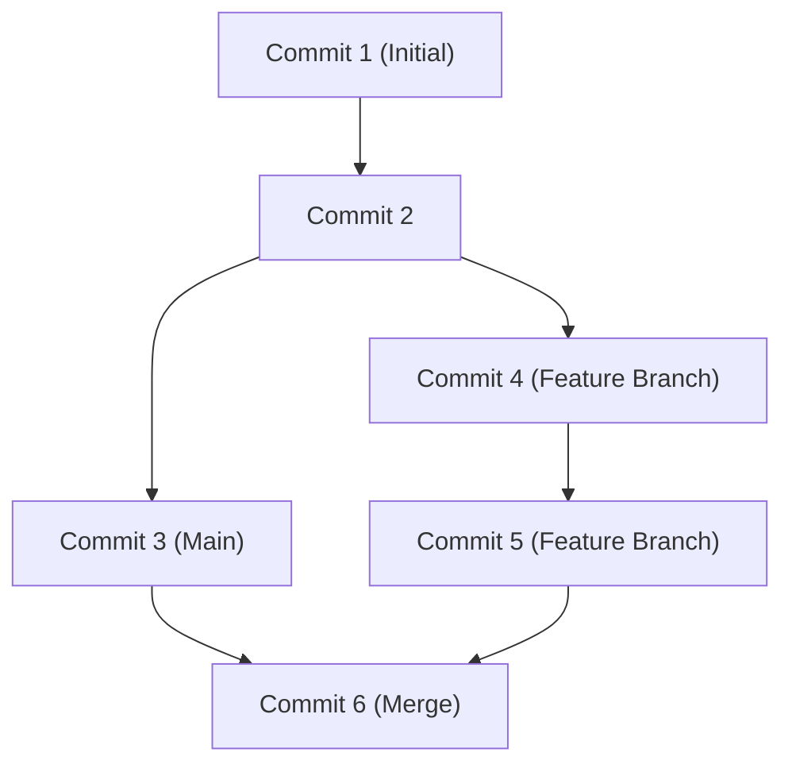

## 1. 引言：GitHub带来的开发范式转变

在现代软件开发中，谈论开发就不能不提GitHub和Git的存在。曾经，开发者们依赖于Subversion(SVN)和CVS等集中式版本控制系统。然而，由Linux内核的创始人Linus Torvalds开发的Git，通过一种全新的分布式方法，构建了一个让世界各地的开发者可以同时且安全地更改代码的环境。

本文将深入探讨从Git的根本设计理念，到GitHub为开源带来的Pull Request革命，再到利用GitHub Actions实现的最新CI/CD（持续集成/持续部署）。

## 2. Linus Torvalds的Git设计理念：基于快照的提交图

传统的版本控制系统记录的是“差异（delta）”。也就是说，它们仅仅积累了文件如何被更改的差异信息。然而，Git的方法有着根本的不同。

Git将数据视为“快照流”。每次进行提交时，Git都会像拍照一样记录下那一刻所有文件的状态（快照），并保存对该快照的引用。对于未更改的文件，它不会重新保存，而只是保留一个指向以前相同文件的链接。

通过这种基于快照的方法，创建和切换分支变得瞬间完成。在Git内部，提交只是作为一个对象图（DAG：有向无环图）来管理。



## 3. 分支策略：Git Flow 与 GitHub Flow

在分布式开发中，团队如何管理分支决定了项目的成败。让我们来看看两种代表性的策略。

### Git Flow
Git Flow是由Vincent Driessen提出的一种严格的分支模型。
- `main` (或 `master`): 始终处于可发布状态的生产环境代码。
- `develop`: 用于下一次发布的开发分支。
- `feature/*`: 用于新功能开发。
- `release/*`: 用于发布准备。
- `hotfix/*`: 用于生产环境的紧急错误修复。

这种模型非常适合具有定期发布周期的大型项目。

### GitHub Flow
另一方面，GitHub Flow更加简单，它以持续部署为前提。
- 始终可部署的 `main` 分支。
- 所有的工作都在从 `main` 派生出的功能分支中进行。
- 在本地提交，并定期推送到服务器。
- 准备就绪后创建Pull Request，并接受代码审查。
- 审查通过后合并到 `main`，并立即部署。

这非常适合像Web应用程序或SaaS这样每天需要进行多次发布的敏捷团队。

## 4. Fork与Pull Request：开源开发的革命

GitHub能够成为全球最大的开发者平台的首要原因，在于其提炼了“Fork”和“Pull Request”的概念。

过去，要为开源项目做出贡献，必须向邮件列表发送补丁。这门槛很高，而且审查过程也很繁琐。

在GitHub上，只需点击一个按钮，就可以将别人的仓库复制（Fork）到自己的账户中。在那里你可以自由地修改代码，并向原始仓库发送“请合并我的更改”的请求（Pull Request）。这让每个人都能轻松地为项目做出贡献，引发了OSS（开源软件）的爆炸式发展。

## 5. 使用GitHub Actions实现CI/CD自动化

在现代开发中，自动化测试和部署过程与编写代码同等重要。GitHub Actions是集成在GitHub平台上的强大自动化工具。

只需在YAML文件中定义工作流，就可以以对仓库的任何事件（如Push、创建Pull Request、推送标签等）为触发器，自动执行测试、构建和部署到服务器。

```yaml
name: CI/CD Pipeline

on:
  push:
    branches:
      - main
  pull_request:
    branches:
      - main

jobs:
  build-and-test:
    runs-on: ubuntu-latest
    steps:
      - name: Checkout Code
        uses: actions/checkout@v3
      - name: Setup Node.js
        uses: actions/setup-node@v3
        with:
          node-version: '18'
      - name: Install Dependencies
        run: npm ci
      - name: Run Tests
        run: npm test
```

通过这种自动化，“持续集成（自动集成代码并进行测试）”和“持续部署（自动发布到生产环境）”的循环能够高速运转，从而极大地提高软件质量和开发速度。

## 6. 总结：协作的未来

GitHub不仅仅是一个代码库。它是世界各地的开发者共享知识并协作构建软件的社交网络和基础设施。通过掌握Git强大的版本控制、GitHub精细的协作功能以及Actions的自动化，我们能够更快地将更优秀的软件交付给世界。
